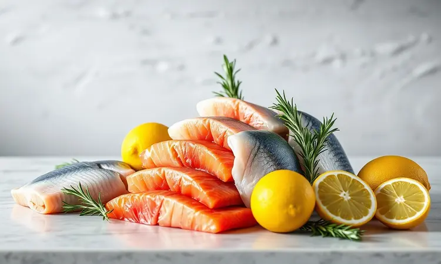
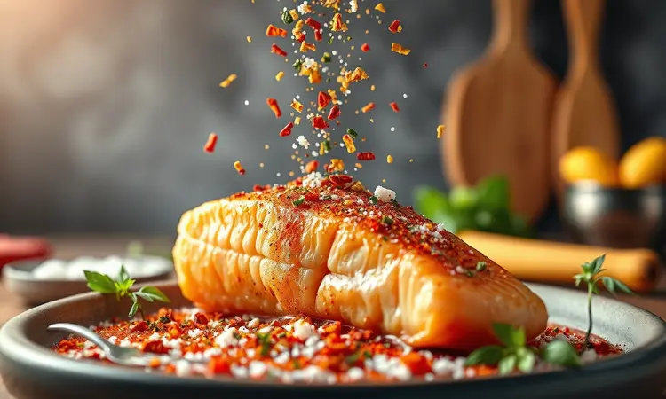
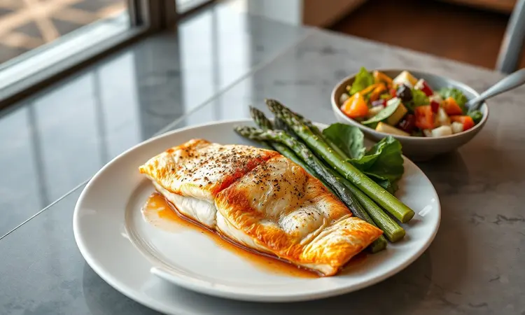

Imagine a frustração: você coloca o filé de peixe na airfryer com toda expectativa, mas quando abre o cesto, ele está grudado ou desmanchando, com aquela textura seca que não convida a comer.

Muita gente desiste dessa opção por não saber o ajuste correto ou o truque para manter a suculência da carne. A boa notícia é que preparar um filé digno de restaurante é muito mais simples do que parece e exige quase zero de óleo.

Neste guia, vou te mostrar o passo a passo definitivo, desde a escolha do filé até os macetes para garantir aquela casquinha crocante que todo mundo ama.

<SummaryList products={frontmatter.top_products} />

## Por que Fazer Filé de Peixe na Airfryer é a Melhor Escolha?

Se você já enfrentou a frustração de um peixe grudado ou ressecado, talvez pense que a airfryer não é para isso. Mas a verdade é que ela pode ser sua maior aliada.

O motivo principal é a liberdade: você usa até 80% menos óleo que numa fritura tradicional, o que significa que pode comer sem aquela sensação pesada depois. Além da leveza, vem a confiança.

Com temperatura e tempo controlados, você elimina a ansiedade de "será que está pronto?". O resultado é garantido: crocante por fora, macio por dentro, ideal para agradar a família sem stress. E a praticidade reconquista seu tempo.

Em minutos, você tem uma refeição digna enquanto faz outras coisas. Se vale tanto investimento, então vamos escolher o peixe ideal.

## Melhores Tipos de Peixe para Preparar na Fritadeira Elétrica

A escolha do peixe define o resultado. Para a airfryer, espécies com textura firme e que absorvem bem os temperos são as mais recomendadas.

O filé de tilápia é uma opção popular justamente por sua delicadeza e capacidade de receber marinadas, resultando em um prato suculento e versátil.

O salmão, com seu teor natural de gordura, oferece um exterior crocante e um interior que quase desmancha, uma experiência rica. Para quem busca uma carne que não se deforme durante o cozimento, o linguado é perfeito devido à sua firmeza.

E a merluza, suave e adaptável, funciona como uma base para diversos temperos. Escolher entre esses quatro é o primeiro passo para um prato marcante.

## O Segredo do Tempero: Como Deixar o Peixe Saboroso e sem Cheiro Forte

E para esse peixe escolhido, o tempero é o segredo que transforma simples ingredientes em uma experiência. Comece com ervas frescas, como salsinha, cebolinha ou dill, que complementam o sabor sem dominá-lo.

Uma marinada básica de suco de limão, azeite de oliva, pimenta-do-reino e alho em pó faz maravilhas em apenas 30 minutos de descanso. O limão não apenas adiciona sabor, mas também neutraliza odores mais intensos.

Evite temperos agressivos que podem deixar um cheiro forte. O equilíbrio é encontrar combinações que realcem a delicadeza natural do peixe, resultando em uma refeição que você sente no paladar, não no nariz.

## Receita de Filé de Tilápia na Airfryer (Passo a Passo)

Agora, vamos à prática. A tilápia é um excelente ponto de partida porque é fácil de encontrar e cozinha rápido.

### Ingredientes Necessários

Para esta receita, você precisa de filés de tilápia frescos (ou congelados, devidamente descongelados), sal, pimenta-do-reino moída na hora e suco de limão. Para a crocância, um pouco de farinha de rosca ou farinha de milho ajuda, mas não é obrigatório.

Ervas como salsinha ou coentro fresco dão um toque final de frescor.

### Modo de Preparo: O Truque para Não Grudar

O truque para evitar que o peixe grude começa antes mesmo de ligar a airfryer. Pré-aqueça o aparelho por 3 a 5 minutos. Isso cria uma base de calor uniforme. Em seguida, aplique uma leve camada de óleo em spray ou pincele azeite diretamente no filé.

Se preferir uma barreira extra, use papel manteiga cortado no tamanho da cesta. Tempere o peixe com sal, pimenta e limão, coloque na airfryer a 180°C e cozinhe por 10 a 12 minutos, virando na metade do tempo para garantir douração e cozimento uniforme.

Quando você abre o cesto, o filé está solto, crocante e pronto.

## Como Fazer Peixe na Airfryer para Não Ficar Seco?

Mas se o seu medo é o peixe ficar ressecado, aqui está o antídoto. A marinada é sua primeira defesa. Deixe o filé descansar no limão, alho e ervas por pelo menos 30 minutos. Isso não apenas adiciona sabor, mas também cria uma reserva de umidade dentro da carne.

Pré-aquecer a airfryer, como já mencionado, garante que o cozimento comece rápido, selando a superfície e mantendo o interior suculento. A temperatura de 180°C e o tempo entre 10 e 15 minutos (ajustado conforme a espessura) são a combinação ideal.

Virar o filé na metade do processo distribui o calor. Ao final, você tem um peixe que se desmancha ao garfo, não ao paladar.

## Versão Empanada vs. Grelhada: Qual a Melhor?

Essa escolha define o estilo da sua refeição. A versão empanada, com farinha de rosca ou panko, cria uma crocância irresistível que transforma o peixe em uma experiência quase indulgentes. É ideal para quem busca textura e uma sensação mais reconfortante.

Por outro lado, o peixe grelhado celebra o sabor natural do ingrediente, mantendo sua suculência e oferecendo uma opção mais leve e limpa. A decisão depende do seu momento: empanado para um dia que pede comfort food, grelhado para uma refeição fresca e saudável.

E essa escolha influencia diretamente o tempo e a temperatura.

## Tempo e Temperatura Ideal para Cada Corte de Peixe

Se você optou pelo empanado, a crocância demanda uma temperatura um pouco mais alta. Para filés mais finos, como tilápia ou linguado, 200°C por 8 a 10 minutos costuma ser suficiente.

Filés mais grossos, como salmão ou atum, podem precisar da mesma temperatura, mas por 10 a 12 minutos. Na versão grelhada, a temperatura pode ser mantida em 180°C para preservar a suculência, com tempos similares. O hábito de virar o filé na metade do tempo é universal.

Ele garante douração uniforme e evita que um lado seque enquanto o outro não cozinha. Essa prática é seu seguro contra resultados desequilibrados.

## Equipamentos Recomendados: Melhores Airfryers de 2024

<ProductBox 
  title={frontmatter.top_products[0].title} 
  image={frontmatter.top_products[0].image} 
  link={frontmatter.top_products[0].link} 
/>

Para executar essas técnicas com precisão, o equipamento faz diferença. Em 2024, algumas air fryers se destacam. A Mondial oferece modelos como a Air Fryer Family Inox (4L), conhecida por preparar alimentos rapidamente e com menos óleo.

Para famílias maiores, a Air Fryer Mondial AFO-12L-BI, com 12 litros e 2.000W de potência, é uma excelente opção, embora seu tamanho possa ser um desafio para cozinhas compactas.

A Philips Walita tem a Série 2000 XL Digital (6.2L), que inclui uma janela de visualização e nove funções pré-definidas. Essa versatilidade é um grande atrativo, mas a complexidade dos recursos pode ser desnecessária para quem prefere simplicidade.

Por último, a Electrolux apresenta a Air Fryer Oven EAF90 (12L), que combina as funções de air fryer e forno, uma opção multifuncional, embora seu preço possa ser mais elevado. Independentemente da escolha, esses equipamentos trazem a precisão que seu peixe precisa.

## Acessórios que Facilitam a Preparação e a Limpeza

<ProductBox 
  title={frontmatter.top_products[1].title} 
  image={frontmatter.top_products[1].image} 
  link={frontmatter.top_products[1].link} 
/>

E para tornar o processo ainda mais fluido, alguns acessórios são investimentos que pagam-se rapidamente. Formas de silicone ou alumínio são ótimas para assar acompanhamentos, garantindo que não grudem e facilitando a limpeza.

Grelhas permitem cozinhar diferentes alimentos simultaneamente, otimizando tempo. Na hora da limpeza, protetores descartáveis para o fundo do cesto são uma solução inteligente, evitando sujeira acumulada e preservando o revestimento antiaderente.

Embora alguns acessórios possam não ser compatíveis com todos os modelos, na maioria dos casos, são feitos de materiais duráveis como silicone e aço inoxidável, resistentes às altas temperaturas. Escolher os adequados transforma a experiência de uso.

## Acompanhamentos Perfeitos para o seu Filé de Peixe

O peixe crocante e suculento merece companhias que elevam a refeição. Um arroz com brócolis traz frescor e um contraste leve. Batatas assadas na mesma airfryer oferecem uma crocância que complementa a sutileza do filé. Saladas são sempre uma escolha acertada.

Imagine uma salada de rúcula com tomates e um fio de azeite, lado a lado com a leveza do peixe. Molhos podem ser o elemento final de luxo. Um molho tártaro ou um aioli caseiro trazem cremosidade e um toque de sofisticação.

Com essas combinações, sua refeição se torna balanceada e memorável.

## Perguntas Frequentes (FAQ)

Se depois de tudo isso você ainda tem dúvidas, aqui estão as respostas para as perguntas mais comuns.

### Posso fazer peixe congelado direto na airfryer?

Sim, você pode fazer peixe congelado diretamente na airfryer. Isso facilita muito a preparação na correria do dia a dia. A airfryer cozinha o peixe de maneira uniforme e mantém sua suculência, resultando em um prato saboroso.

É importante não sobrecarregar a cesta para garantir que o ar circule adequadamente. Além disso, ajuste o tempo de cozimento, pois o peixe congelado pode levar um pouco mais de tempo para ficar pronto do que o fresco.

Assim, você consegue uma refeição deliciosa com praticidade.

### Como saber se o peixe já está no ponto certo?

Para saber se o filé de peixe está no ponto certo, observe a cor e a textura. Ele deve ficar opaco e facilmente se desmanchar ao ser pressionado com um garfo. Além disso, o tempo de cozimento varia conforme a espessura do peixe.

Filés mais finos podem levar entre 8 a 10 minutos, enquanto os mais grossos podem necessitar de até 15 minutos. Uma dica útil é usar um termômetro de cozinha. A temperatura interna ideal para peixes é de cerca de 63ºC. Assim, você garante um prato suculento e saboroso.

## Conclusão

Dominar o filé de peixe na airfryer é mais que uma técnica. É a conquista de uma refeição saudável, rápida e consistentemente deliciosa. Você não apenas reduz drasticamente o uso de óleo, ganhando leveza, mas também elimina a ansiedade do cozimento impreciso.

Cada etapa, desde a escolha do peixe até o tempero e o tempo controlado, garante um resultado que parece profissional. E quando você abre o cesto e encontra aquela casquinha crocante com o interior macio, a frustração inicial se transforma em satisfação.

Combinar esse peixe com acompanhamentos simples cria um almoço ou jantar equilibrado, nutritivo e que reconquista seu tempo. Experimente hoje.

Coloque o filé na airfryer, ajuste temperatura e tempo, e descubra como é fácil transformar uma tarefa desafiadora em uma rotina prazerosa.