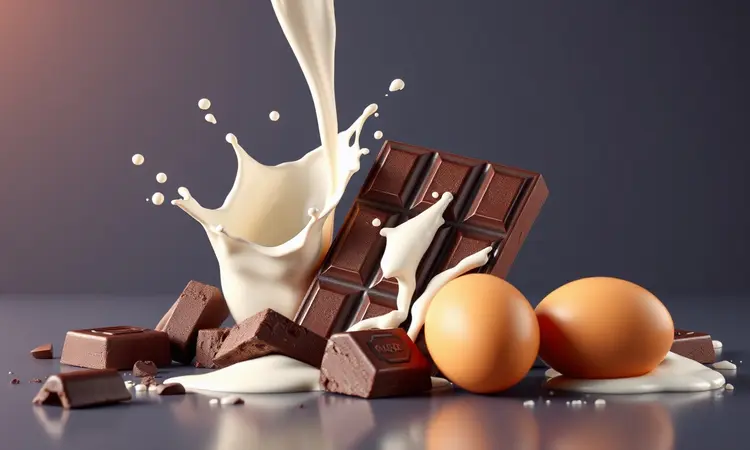
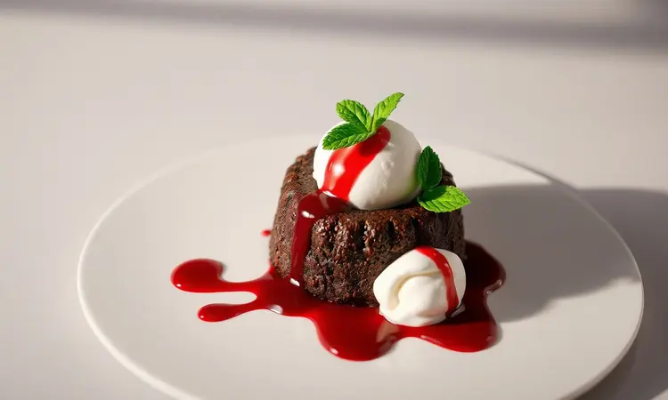

Já aconteceu de você desejar uma sobremesa de restaurante, mas desistiu só de pensar no tempo que o forno convencional levaria?

Pois imagine ter aquele bolinho perfeito, com exterior fofinho e o coração de chocolate derretido, pronto em menos tempo do que você leva para escolher um filme na Netflix.

A air fryer transforma essa fantasia em realidade, e vamos te mostrar como conquistar isso em apenas 10 minutos.

<SummaryList products={frontmatter.top_products} />

## Por que fazer Petit Gâteau na Air Fryer é uma excelente ideia?

Pense na última vez que você adiou um desejo por chocolate porque parecia muito trabalhoso. A air fryer muda completamente essa equação. Ela captura aquela magia do forno tradicional, mas com a agilidade que seu dia a dia exige.

Em vez de esperar 20 minutos só para o forno aquecer, você terá sua sobremesa pronta do início ao fim no tempo de uma pausa para café.

E não se trata apenas de rapidez. A textura fica incrivelmente consistente, com as bordas firmes e o centro cremoso na medida certa.

É como ter um chef de confeitaria em miniatura na sua cozinha, que entende exatamente o ponto em que o chocolate precisa derreter sem cozinhar demais.

## Recipientes seguros: O que você pode (e não deve) colinar na fritadeira

Antes de mergulhar na receita, vamos falar sobre onde seu petit gâteau vai nascer. Essa é a etapa que define se sua criação será um sucesso ou uma frustração.

Metal e cerâmica são seus grandes aliados, materiais que conversam bem com o calor intenso e uniforme da air fryer.

Mas atenção: plásticos comuns são traiçoeiros. Eles podem derreter no meio do processo ou, pior ainda, liberar substâncias que comprometem não apenas o sabor, mas sua saúde. Sempre verifique se o recipiente foi feito para suportar altas temperaturas.

### Melhores Air Fryers para receitas de confeitaria

<ProductBox 
  title={frontmatter.top_products[0].title} 
  image={frontmatter.top_products[0].image} 
  link={frontmatter.top_products[0].link} 
/>

Agora que você sabe onde colocar sua massa, que tal conhecer as melhores ferramentas para o trabalho? Algumas air fryers parecem ter nascido para a confeitaria.

O Electrolux Air Fryer Oven (12L), por exemplo, tem um painel digital intuitivo e funções específicas para bolos, além daquela porta de vidro que permite acompanhar cada etapa do crescimento do seu petit gâteau.

Se você costuma cozinhar para mais pessoas, o Mallory Air Oven Unique (30L) oferece espaço generoso sem comprometer a precisão.

Já a Oster Oven Fryer 3 em 1 (12L) é a opção perfeita para quem está começando nessa aventura, com controles tão simples que você se sente confiante desde o primeiro uso.

Cada modelo tem sua personalidade, e essa diversidade é justamente o que torna a experiência tão rica. Você aprende a ajustar temperaturas e tempos, desenvolvendo um sexto sentido para quando seu doce está no ponto exato.

## Lista de Ingredientes: O segredo da cremosidade

Aqui está onde a magia realmente começa. Para criar aquele centro derretido que faz os olhos brilharem, você vai precisar de:

- 100g de chocolate meio amargo (essa escolha define o caráter do seu petit gâteau)

- 100g de manteiga (ela é responsável pela textura sedosa que derrete na boca)

- 100g de açúcar (o equilíbrio perfeito entre doce e intenso)

- 2 ovos inteiros mais 2 gemas (o segredo da liga perfeita)

- 50g de farinha de trigo (apenas o suficiente para dar estrutura sem pesar)

Veja esses ingredientes não como uma lista de compras, mas como os ingredientes de um momento especial que você está prestes a criar.

## Passo a Passo: Como fazer Petit Gâteau na Air Fryer

Pré-aqueça sua air fryer a 180°C enquanto prepara a mágica. Derreta o chocolate com a manteiga até formar uma mistura aveludada. Acrescente os ovos e gemas, batendo até obter um creme homogêneo. Agora vem o açúcar e a farinha, incorporados com movimentos suaves.

Despeje essa promessa de felicidade em forminhas untadas, deixando aquele espaço generoso para o crescimento. Leve à air fryer e aguarde entre 8 e 10 minutos. Esse é o momento da verdade, onde você precisa confiar no processo.

Ao retirar, deixe respirar por alguns minutos antes de desenformar. A primeira colherada quente, acompanhada de uma bola de sorvete, será sua recompensa por ter acreditado que gourmet pode ser simples.

## O Grande Segredo: Tempo e Temperatura exatos para o centro derretido

Aqui está a alquimia que transforma ingredientes em experiência. Mantenha a temperatura em 180°C e o tempo entre 8 e 10 minutos. O sinal visual? As bordas estarão firmes, formando uma casquinha delicada, enquanto o centro permanece macio e convidativo.

Essa combinação específica cria o contraste que define um verdadeiro petit gâteau: segurança por fora, surpresa por dentro.

### Ramequins e Utensílios ideais para porções individuais

<ProductBox 
  title={frontmatter.top_products[1].title} 
  image={frontmatter.top_products[1].image} 
  link={frontmatter.top_products[1].link} 
/>

Os ramequinos de 100ml a 150ml são como moldes perfeitos para sua criação. A porcelana brilha nesse papel, resistindo ao calor enquanto apresenta seu doce com elegância natural.

Algumas pessoas se preocupam com limites de temperatura, mas aqui está o segredo: a air fryer trabalha com calor distribuído de forma tão inteligente que você raramente precisará dos extremos que preocupam. E o melhor?

Esses mesmos ramequins servirão para forno convencional e micro-ondas, tornando-se aliados versáteis na sua cozinha.

Escolha o tamanho que conversa com sua fome e sua generosidade. Um pouco menor para um momento só seu, um pouco maior para dividir (ou não).

## 5 Erros Comuns que estragam o seu Petit Gâteau (e como evitá-los)

1. Impaciência com a massa: dar alguns minutos de descanso antes de assar melhora dramaticamente a textura final.

2. Economizar no chocolate: essa é a alma do doce. Escolha qualidade, sabor agradece.

3. Não verificar a temperatura da air fryer: cada aparelho tem sua personalidade. Conheça o seu.

4. Esquecer de untar bem as forminhas: nada mais frustrante que um doce perfeito preso no molde.

5. Abrir antes da hora: essa curiosidade pode desestabilizar o crescimento. Confie no tempo combinado.

## Dicas de Acompanhamento: Transforme sua receita em um prato gourmet

Uma bola de sorvete de baunilha não é apenas um acompanhamento, é o contraponto gelado que realça o calor do chocolate derretido.

Framboesas ou morangos frescos adicionam aquele toque ácido que corta a doçura, enquanto uma calda de chocolate amargo intensifica a experiência.

Para o toque final, uma pitada de açúcar de confeiteiro cria uma geografia de sabores, e folhas de hortelã oferecem frescor. Esses detalhes transformam "uma sobremesa" em "aquele petit gâteau que todo mundo lembra".

## Perguntas Frequentes (FAQ)

Posso usar diferentes tipos de chocolate? Absolutamente. O meio amargo traz intensidade, o ao leite oferece suavidade, e opções com nuances diferentes podem criar versões inesquecíveis. Seja fiel ao seu paladar.

Quanto tempo devo deixar na air fryer? Entre 8 e 10 minutos a 180°C. Seu olho se tornará expert em identificar o ponto: quando parece firme mas ainda promete surpresa no centro.

Posso fazer a massa e deixar na geladeira antes de assar? Não apenas pode como deve. Essa pausa permite que os sabores se casem mais profundamente, criando uma experiência ainda mais rica. Prepare com calma, asse na hora do desejo.

## Conclusão

O petit gâteau na air fryer representa mais que uma receita prática. Ele simboliza a conquista do gourmet acessível, a prova de que momentos especiais não precisam de planejamentos complexos.

Em 10 minutos, você transforma desejo em realidade, ingredientes simples em memória compartilhada.

Cada vez que você prende a respiração ao abrir a air fryer, esperando ver aquele centro perfeito, está participando de um ritual que une tradição francesa à tecnologia moderna.

A próxima colherada quente com sorvete não será apenas uma sobremesa, será sua declaração de que prazer pode ser simples, rápido e profundamente satisfatório.

Que tal experimentar hoje mesmo? Sua air fryer está esperando para começar essa transformação.