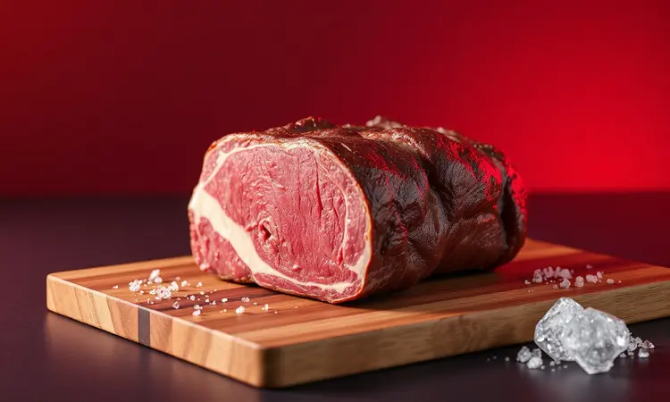
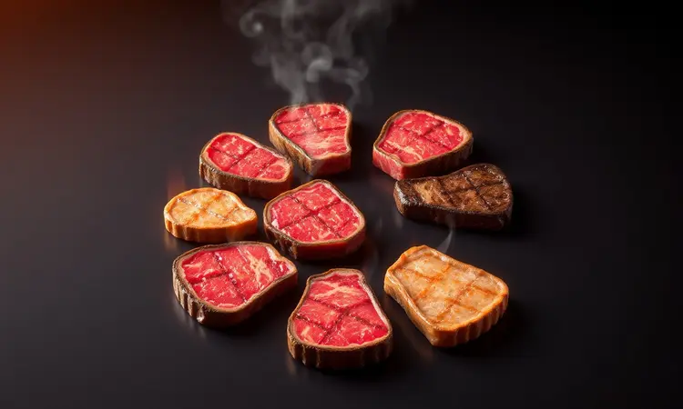

Você ama picanha, mas já se perguntou se seria possível reproduzir aquela suculência perfeita sem todo o trabalho de uma churrasqueira tradicional?

O preconceito com a airfryer ressecando a carne é comum, mas a verdade é que, com técnica adequada, você pode transformar sua fritadeira elétrica em uma aliada gourmet que produz resultados dignos de restaurante especializado em poucos minutos.

Este guia não apenas vai te ensinar o passo a passo definitivo, mas vai revelar como cada detalhe, do tempero aos acompanhamentos, contribui para uma experiência completa que vai fazer você reconsiderar completamente seu método de preparo.

<SummaryList products={frontmatter.top_products} />

## Picanha na Airfryer: Vale a pena fazer?

Imagine poder saborear uma picanha suculenta sem precisar se preocupar com churrasqueira, carvão ou longos períodos de preparo. A airfryer oferece essa praticidade transformadora.

O método de cozimento consegue criar uma crosta dourada externa enquanto mantém a maciez interna, tudo em um tempo que faz parecer que você tem um chef pessoal na sua cozinha.

E enquanto alguns podem sentir nostalgia do aroma defumado do carvão, a versão elétrica traz uma vantagem adicional: menos óleo, tornando o momento não apenas gourmet, mas também uma escolha consciente.

Para quem busca equilibrar tempo, sabor e praticidade, esta é uma alternativa que realmente vale cada minuto investido.

## Como escolher a peça de picanha ideal para a Airfryer

Agora que você está convencido de transformar sua airfryer, o primeiro passo é escolher a peça perfeita.

O segredo está em buscar uma picanha com camada de gordura generosa, essa gordura não apenas adiciona sabor, mas funciona como um selo natural que mantém a suculência durante todo o processo de cozimento.

Prefira uma coloração vermelha vibrante e espessura uniforme: isso garante que cada parte cozinhe de maneira equilibrada, evitando que algumas áreas ficam prontas enquanto outras ainda precisam de atenção.

### O corte perfeito: tiras ou peça inteira?

<ProductBox 
  title={frontmatter.top_products[0].title} 
  image={frontmatter.top_products[0].image} 
  link={frontmatter.top_products[0].link} 
/>

Esta decisão define completamente sua experiência. Optar pela peça inteira traz aquela apresentação impressionante que parece saída de um restaurante, a gordura dourada, a crosta perfeita, a sensação de celebrar algo especial.

Requer um pouco mais de atenção durante o cozimento (virar e ajustar), mas o resultado final tem um peso visual que transforma qualquer refeição em evento.

As tiras, por outro lado, são a escolha da praticidade absoluta. Cozinham mais rápido, são mais fáceis de servir e se adaptam melhor ao dia-a-dia. Se sua cesta tem espaço limitado, elas permitem sessões controladas que garantem uniformidade.

Para quem quer saborear essa delícia sem dedicar tempo extra, essa abordagem é a resposta ideal.

## Ingredientes e Temperos Essenciais

<ProductBox 
  title={frontmatter.top_products[1].title} 
  image={frontmatter.top_products[1].image} 
  link={frontmatter.top_products[1].link} 
/>

O que realmente transforma uma boa peça de picanha em uma experiência memorável são os temperos. Comece com sal grosso, esse clássico não apenas realça o sabor, mas cria textura. Complemente com pimenta-do-reino para um toque de complexidade.

Para quem busca um nível extra, o alvo em pó adiciona profundidade aromática que faz diferença.

Se você tem tempo para explorar, experimente uma marinada com vinho branco e ervas frescas: essa combinação penetra na carne e cria notas sutis que elevam o resultado final.

E para os dias onde praticidade é prioridade, existem opções pré-temperadas como as da Seara que oferecem qualidade sem complicação, perfeito para quando o tempo é escasso mas o desejo por qualidade permanece.

## Passo a Passo: Como fazer Picanha na Airfryer Suculenta

A magia começa com o tempero. Cubra sua picanha com sal e pimenta, permitindo que esses elementos se integrem. Pré-aqueça sua airfryer a 200°C, esse ritual de preparação cria a atmosfera perfeita.

Coloque a carne com a gordura voltada para cima, posicionando esse selo natural na direção que maximiza a distribuição de sabor. Cozinhe por 20-25 minutos, virando na metade do tempo para garantir uniformidade.

Esse período é suficiente para você preparar acompanhamentos enquanto a transformação acontece.

### Pré-aquecimento: O segredo para selar a carne

O pré-aquecimento é o momento onde sua airfryer se transforma em churrasqueira instantânea. Ao alcançar 200°C antes da carne entrar, você cria um ambiente que sela os sucos imediatamente, formando uma crosta dourada que protege a maciez interna.

Esses 5-10 minutos de preparação são o diferencial que separa um resultado comum de uma experiência gourmet, é o ritual que antecede a celebração.

### Tempo e Temperatura para cada ponto da carne

Aqui está onde você personaliza completamente sua experiência. Para o ponto mal passado (60°C), 15-20 minutos criam aquela carne que mantém sua essência vibrante enquanto desenvolve sabor.

O ponto médio (70°C) em 20-25 minutos equilibra suculência com textura desenvolvida. E o bem passado (75°C) com 30-35 minutos oferece segurança total para quem prefere consistência uniforme.

Lembre que esses tempos podem variar com o peso da peça e potência do seu equipamento, sua observação durante o processo é o guia mais valioso.

## Guia de Pontos: Malpassada, Ao Ponto e Bem Passada

<ProductBox 
  title={frontmatter.top_products[2].title} 
  image={frontmatter.top_products[2].image} 
  link={frontmatter.top_products[2].link} 
/>

Conhecer os pontos da carne é como aprender a linguagem da suculência. A malpassada (50-55°C) apresenta um centro vermelho vivo que mantém máxima intensidade de sabor.

O ao ponto para mal (55-60°C) tem um tom rosado-avermelhado que equilibra vibração com desenvolvimento. O ao ponto tradicional (60-65°C) oferece centro levemente rosado com textura equilibrada.

Se você possui termômetro de cozinha, ele oferece precisão científica que elimina dúvidas. Caso não tenha, o teste do toque desenvolve uma conexão intuitiva com o processo, prática transforma esse método em confiança.

Independente da escolha, o objetivo é o mesmo: traduzir sua preferência pessoal em realidade na sua mesa.

## 5 Erros comuns que deixam a picanha dura na Airfryer

Transformar esses erros em aprendizados é o caminho para resultados consistentes. Primeiro: não deixar a carne em temperatura ambiente antes do cozimento. Esse descanso de 30 minutos garante que o calor se distribua uniformemente desde o início.

Segundo: temperar sem antecedência. O sal precisa tempo para integrar-se, realçando sabor profundamente.

Terceiro: temperatura excessivamente alta cria crosta externa rápida mas pode sacrificar suculência interna. Quarto: não virar a carne durante o processo compromete uniformidade. E o erro mais crucial: não permitir descanso após o cozimento.

Esses minutos onde a carne repousa são quando os sucos se redistribuem, transformando textura potencial em realidade suculenta.

## Acompanhamentos Irresistíveis: Batatas e Maionese de Alvo

Esta é a celebração do seu trabalho. Batatas são o acompanhamento clássico que completa a experiência, fritas para crocância contrastante, assadas para rusticidade, ou como purê para cremosidade que harmoniza. Cada estilo conversa com a picanha de maneira única.

E a maionese de alvo? Essa criação simples (maionese com alvo picado e temperos) adiciona um elemento cremoso que realça cada bite. Transforma o prato de carne em composição gastronômica, o detalhe que mostra cuidado até no último elemento.

## Melhores modelos de Airfryer para preparar carnes altas

<ProductBox 
  title={frontmatter.top_products[3].title} 
  image={frontmatter.top_products[3].image} 
  link={frontmatter.top_products[3].link} 
/>

Se você está comprometido com essa transformação culinária, o equipamento certo faz diferença. A WAP Fritadeira Elétrica Air Fryer Barbecue Digital 10L com espeto rotativo e 1800W de potência é ideal para cortes maiores que demandam espaço.

O Oster Forno e Fryer 15L Multifunções combina várias funções em um único aparelho, perfeito para quem busca versatilidad máxima.

O Philco Air Fryer Oven 12L oferece tamanho e adaptabilidade, enquanto a Mondial AFO 12L se destaca por agilidade que serve famílias maiores eficientemente. A Oster OFRT780 12L com função rotisserie é considerada uma das mais completas disponíveis.

Avalie seu espaço de cozinha, modelos maiores ocupam área mas oferecem capacidade que transforma preparos em eventos regulares.

## Conclusão

Preparar picanha na airfryer não é apenas uma alternativa prática, é uma redefinição completa do que você pode alcançar dentro da sua própria cozinha.

Cada etapa, da escolha da peça com sua camada generosa de gordura, através do ritual do pré-aquecimento que sela suculência, até o momento de descanso que redistribui sabores, converte técnica simples em experiência gourmet.

Os pontos personalizados, os acompanhamentos complementares e o equipamento adequado formam um sistema que transforma desejo em realidade gastronômica.

Agora você não apenas sabe como fazer, você compreende por que cada detalhe importa. Esta não é apenas outra receita, é um método que respeita sua paixão por picanha enquanto honra seu tempo e espaço.

Experimente, ajuste conforme sua preferência, e descubra como sua airfryer pode se tornar o centro de celebrações culinárias que antes pareciam distantes.

O próximo passo é seu: selecione sua peça, prepare seus temperos, e transforme expectativa em experiência memorável.