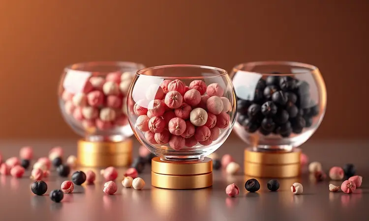
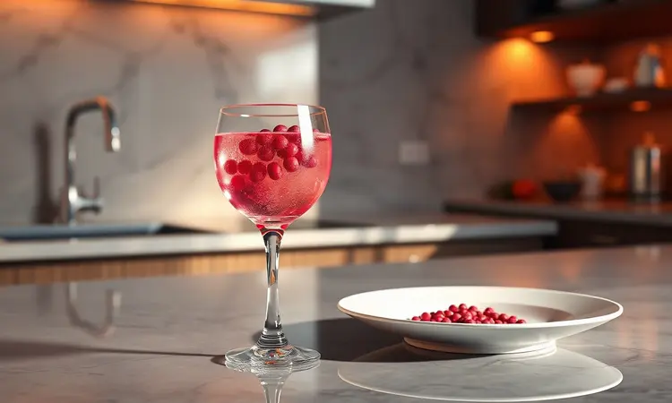
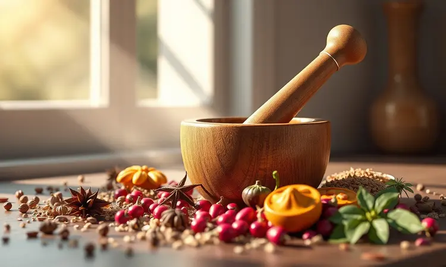

Você já parou para observar como alguns ingredientes conseguem essa mágica na cozinha? Aquela capacidade de transformar o visual de um prato instantaneamente, mas com uma personalidade completamente diferente do que o nome sugere.

É exatamente isso o que acontece com a pimenta-rosa. Enquanto você espera aquela ardência familiar das pimentas tradicionais, ela surpreende com um sabor suave e levemente adocicado.

Se você quer transformar sua culinária e entender como essa especiaria brasileira conquistou os paladares mais exigentes do mundo, está no lugar certo.

Vamos juntos desvendar o universo da pimenta-rosa, explorando desde seus segredos botânicos até as técnicas mais refinadas para usá-la em tudo, desde carnes grelhadas até sobremesas sofisticadas e coquetéis de autor.

<SummaryList products={frontmatter.top_products} />

## O que é a pimenta-rosa e por que ela não é uma pimenta "de verdade"?

A primeira revelação sobre essa especiaria começa com uma verdade surpreendente: tecnicamente, ela não é uma pimenta. A pimenta-rosa, também conhecida como pimenta-da-brejaúva, é na verdade o fruto maduro de uma árvore do gênero Schinus, nativa da América do Sul.

Essa origem botânica já explica sua personalidade única. Longe da família das pimentas tradicionais, como a pimenta-do-reino, ela oferece um perfil completamente diferente, focado em sutileza e elegância, não em ardência.

Imagine adicionar a um prato não apenas sabor, mas também cor e uma história. É isso que a pimenta-rosa faz. Seu sabor suave e delicadamente adocicado a torna perfeita para pratos que pedem sofisticação sem agressividade.

Por isso, ela conquistou um lugar especial em saladas refinadas, risotos cremosos e até em sobremesas que pedem um contraste inesperado. A pimenta-rosa não quer competir com outros sabores, quer complementá-los, elevando a experiência a outro patamar.

## Diferenças cruciais: Pimenta-rosa vs. Pimentas tradicionais

Entender essa distinção é fundamental para usar a pimenta-rosa com maestria. Enquanto as pimentas tradicionais apostam na intensidade e na picância, a pimenta-rosa trabalha com nuance e harmonia.

O contraste não poderia ser mais claro: de um lado, a assertividade das pimentas verdadeiras, do outro, a conversa delicada dessa baga especial.

### Origem botânica e a árvore Aroeira

Para compreender verdadeiramente a pimenta-rosa, precisamos conhecer sua origem. Ela nasce na aroeira, uma árvore majestosa da família Anacardiaceae que pode alcançar até 10 metros de altura.

Nativa da América do Sul, é facilmente reconhecida pelas folhas verdes brilhantes e, principalmente, pelos frutinhos que, quando maduros, ganham a coloração rosa-avermelhada que tanto encanta.

No Brasil, essa árvore transcende a culinária. Sua madeira é valorizada na marcenaria e no artesanato, enquanto os frutos representam uma tradição gastronômica que combina beleza e sabor.

Esse duplo valor, utilitário e estético, reflete perfeitamente o que a pimenta-rosa oferece na cozinha: uma experiência que envolve todos os sentidos.

### O nível de ardência e perfil de sabor

Aqui está o ponto que mais confunde (e encanta) os iniciantes: a pimenta-rosa praticamente não arde. Seu charme está em outro lugar.

O perfil de sabor é uma jornada sensorial que começa com notas frutadas e termina com um final levemente terroso, tudo envolvido por uma doçura sutil que surpreende o paladar.

Essa ausência de ardência explosiva é justamente sua maior virtude. Ela permite que a pimenta-rosa harmonize com ingredientes delicados que seriam dominados por temperos mais intensos.

Peixes de carne branca, saladas refrescantes e até sobremesas complexas encontram nela uma parceira perfeita, alguém que realça sem jamais ofuscar.

## 5 Benefícios surpreendentes da pimenta-rosa para a saúde

Além de transformar pratos, a pimenta-rosa traz consigo uma série de benefícios que vão direto ao seu bem-estar. Rica em antioxidantes, ela atua como uma guardiã das suas células, combatendo os radicais livres que aceleram o envelhecimento.

Suas propriedades anti-inflamatórias oferecem alívio natural, enquanto seu auxílio à digestão transforma refeições pesadas em momentos mais leves e confortáveis.

Mas os benefícios não param por aí. A pimenta-rosa também pode contribuir para uma melhor circulação sanguínea, garantindo que seu corpo funcione em sua potência máxima.

É uma especiaria que nutre tanto o paladar quanto o organismo, provando que sabor sofisticado e saúde podem caminhar juntos.

### Alerta: Alergias e contraindicações importantes

Com toda essa riqueza, é essencial abordar também a cautela. A pimenta-rosa, como muitos ingredientes naturais, pode desencadear reações alérgicas em pessoas com sensibilidade específica.

Se você tem histórico de alergias a especiiras ou temperos, experimente uma pequena quantidade antes de incorporá-la generosamente à sua dieta.

O consumo moderado é sempre a chave. Em quantidades exageradas, pode causar desconfortos gastrointestinais. E para gestantes ou lactantes, a recomendação é clara: consulte seu médico ou nutricionista antes de introduzir qualquer novo ingrediente de forma regular.

Cuidar da saúde é o primeiro passo para desfrutar plenamente de qualquer experiência gastronômica.

## Como usar a pimenta-rosa: Do prato principal ao drinque

Agora que entendemos sua essência, chegamos à parte mais prática (e prazerosa). A versatilidade da pimenta-rosa é impressionante, capz de transitar entre pratos salgados e doces com naturalidade.

Seu sabor suave e levemente adocicado cria pontes inesperadas entre diferentes elementos do seu menu.

### Harmonização com carnes brancas e peixes

Pense em um frango grelhado ou um peru assado. Agora imagine esses pratos ganhando uma camada extra de sofisticação com notas florais e adocicadas. É exatamente isso que a pimenta-rosa oferece para carnes brancas.

Ela complementa o paladar suave sem competir com ele, criando uma harmonia perfeita.

Com peixes, especialmente os de carne branca como robalo ou tilápia, a magia se repete. Você pode moer as bolinhas na hora para liberar o aroma máximo, ou usá-las inteiras para criar um visual que antecipa o prazer do sabor.

A escolha depende do efeito que deseja criar: discrição total ou um toque de teatralidade gastronômica.

### Uso em molhos cremosos e marinadas

Os molhos cremosos encontram na pimenta-rosa uma aliada de luxo. Imagine um molho à base de creme de leite ou queijos cremosos ganhando uma nuance adocicada que corta a riqueza gordurosa. O contraste é fascinante, transformando o comum em extraordinário.

Nas marinadas, ela trabalha como um intensificador de sabor sutil. Suas notas frutadas penetram nas carnes e peixes, garantindo que cada garfada seja mais aromática e memorável.

Para resultados máximos, moa as pimentas na hora do uso, preservando assim toda a complexidade de seus óleos essenciais.

### O toque gourmet em queijos e embutidos

Esta é uma das combinações mais celebradas pelos chefs. Queijos cremosos como brie ou camembert encontram na pimenta-rosa um contraponto perfeito para sua riqueza láctea.

A doçura sutil da especiaria conversa elegantemente com a cremosidade do queijo, criando uma experiência que vai muito além do simples petisco.

Para embutidos como mortadela ou salame, a pimenta-rosa adiciona uma camada de complexidade que desafia as expectativas.

A nota adocicada realça os sabores salgados sem anulá-los, oferecendo uma nuance que transforma um antipasto comum em uma declaração de estilo gastronômico.

### Sobremesas: O equilíbrio entre o doce e o aromático

Aqui a pimenta-rosa revela sua face mais ousada. Em sobremesas, ela atua como uma ponte entre mundos, adicionando profundidade aromática onde normalmente só existe doçura.

Uma mousse de chocolate ganha sofisticação incomparável com algumas pitadas de pimenta-rosa moída na hora. Um sorvete de baunilha se transforma em uma experiência gourmet com essa adição inesperada.

A dosagem é crucial nesse território. Comece com parcimônia, pois a pimenta-rosa deve complementar, nunca dominar os sabores doces.

Sua cor vibrante ainda oferece um presente visual, transformando a apresentação da sobremesa em algo que antecipa a surpresa que o paladar vai experimentar.

### Drinques e coquetelaria: A pimenta-rosa no Gin Tônica

A coquetelaria de alta qualidade descobriu há tempos o potencial da pimenta-rosa. No clássico Gin Tônica, ela oferece um contraponto genial à amargura do gin e à refrescância da tônica.

A leve picância e as notas adocicadas criam uma complexidade que transforma um drinque simples em uma experiência sensorial completa.

A técnica é simples, mas o resultado é sofisticado: macere algumas sementes de pimenta-rosa junto com o gin antes de montar o drinque. A cor vibrante que ela empresta visualmente é apenas o começo da surpresa.

Experimente combiná-la com frutas cítricas para intensificar ainda mais essa dança de sabores.

## Receita: Molho de pimenta-rosa artesanal passo a passo

Criar seu próprio molho de pimenta-rosa é mais do que uma receita, é um ritual de conexão com esse ingrediente especial.

Você precisará de: 100g de pimenta-rosa, 1 xícara de azeite de oliva de boa qualidade, suco de 1 limão fresco, sal marinho a gosto e apenas uma pitada de açúcar para equilibrar.

No liquidificador, comece com a pimenta-rosa e o azeite, batendo até obter uma mistura homogênea que já libera seus aromas. Acrescente então o suco de limão, o sal e o açúcar, batendo apenas o suficiente para incorporar. A textura deve ser sedosa, não líquida demais.

Guarde em um recipiente hermético na geladeira, onde manterá suas qualidades por até duas semanas.

Use esse molho como seu segredo pessoal: em saladas que pedem um toque especial, sobre carnes grelhadas para surpreender os convidados, ou simplesmente como acompanhamento para queijos, transformando um momento casual em uma pequena celebração.

## Utensílios essenciais para trabalhar com especiarias

Dominar a pimenta-rosa vai além de conhecer receitas. Envolve ter as ferramentas certas para extrair todo seu potencial.

Um bom pilão, um moedor de especiarias de qualidade e colheres medidoras precisas não são apenas utensílios, são extensões das suas mãos na busca pelo sabor perfeito.

### Moedor de pimenta com ajuste de moagem

<ProductBox 
  title={frontmatter.top_products[0].title} 
  image={frontmatter.top_products[0].image} 
  link={frontmatter.top_products[0].link} 
/>

Investir em um moedor de pimenta com ajuste de moagem é investir em controle.

Essa ferramenta permite que você decida como quer que a pimenta-rosa se expresse em cada prato: finamente moída para integrar completamente, ou com grãos mais grossos para textura e surpresas pontuais.

Existem duas filosofias aqui. Os moedores manuais oferecem a precisão tátil e o ritual quase meditativo de transformar as especiarias. Os elétricos trazem conveniência e rapidez para o dia a dia mais agitado.

A escolha não é sobre qual é melhor, mas sobre qual dialoga com seu estilo na cozinha, com o tempo que quer dedicar ao processo e com a experiência que deseja criar.

### Pimenta-rosa em grãos selecionados

<ProductBox 
  title={frontmatter.top_products[1].title} 
  image={frontmatter.top_products[1].image} 
  link={frontmatter.top_products[1].link} 
/>

A qualidade dos grãos que você compra define o teto do que poderá criar. Grãos selecionados de pimenta-rosa não são apenas matéria-prima, são a garantia de que cada prato começará com o melhor possível.

Seu perfil de sabor, mais suave e delicadamente adocicado, se expressa com mais clareza quando a origem é cuidadosamente escolhida.

Esses grãos trazem consigo não apenas sabor, mas também cor. A tonalidade vibrante que eles emprestam aos pratos é parte integral do encanto, antecipando visualmente a experiência única que o paladar terá.

Escolher pimenta-rosa de qualidade é o primeiro passo para transformar suas receitas em memórias gastronômicas.

### Potes de vidro herméticos para conservação

<ProductBox 
  title={frontmatter.top_products[2].title} 
  image={frontmatter.top_products[2].image} 
  link={frontmatter.top_products[2].link} 
/>

Depois de encontrar a pimenta-rosa perfeita, proteger sua qualidade torna-se uma missão. Os potes de vidro herméticos são seus aliados nessa jornada, criando uma barreira contra ar, umidade e luz que podem degradar até a mais nobre das especiarias.

Marcas como Bormioli Rocco ou Weck oferecem opções que combinam funcionalidade e estética. Alguns modelos em vidro borossilicato resistem até a mudanças bruscas de temperatura, indo do freezer ao micro-ondas sem problemas.

A escolha do vidro sobre o plástico é uma declaração: você valoriza durabilidade, saúde e a preservação autêntica dos sabores que escolheu para sua cozinha.

## Dicas de conservação: Como manter o aroma por mais tempo

Guardar corretamente sua pimenta-rosa é tão importante quanto escolhê-la bem. O armazenamento ideal acontece em três etapas simples: primeiro, um recipiente hermético, preferencialmente de vidro, que isole completamente do ar externo.

Segundo, um local fresco e escuro, longe da luz solar direta que desbota tanto cor quanto sabor. Terceiro, distância de outras especiarias de aroma forte, pois a pimenta-rosa, em sua delicadeza, pode absorver aromas alheios.

Para uma preservação ainda mais longa, o congelador se torna seu aliado. Nele, a pimenta-rosa mantém suas características por até seis meses, sempre pronta para quando a inspiração gourmet bater à sua porta.

Esses cuidados garantem que cada vez que você abrir seu pote, seja recebido pelo mesmo aroma vibrante da primeira vez.

## Perguntas Frequentes (FAQ) sobre Pimenta-rosa

Algumas dúvidas persistem mesmo entre os mais curiosos. A mais comum: "É picante?" A resposta é não, pelo menos não no sentido tradicional. A pimenta-rosa oferece sabor, não ardência. Outra pergunta frequente trata da harmonização ideal.

Ela encontra sua melhor expressão com peixes, carnes brancas e pratos onde a sutileza é virtude.

No uso, a liberdade é grande: sementes inteiras para visual e textura, ou trituradas para integração completa do sabor. Quanto à conservação, as regras são claras: local fresco e seco, longe da luz, em recipiente que preserve seus óleos essenciais.

Seguindo essas orientações, você terá sempre à mão uma especiaria capaz de transformar o comum em extraordinário.

## Conclusão

A jornada pela pimenta-rosa revela muito mais do que uma simples especiaria. Ela nos mostra que na cozinha, como na vida, as surpresas mais gratificantes muitas vezes vêm disfarçadas de familiaridade.

O que parece ser apenas mais uma pimenta revela-se um universo de sutilezas, uma baga que conquista não pela força, mas pela elegância.

Dominar seu uso é aprender uma nova linguagem gastronômica, uma onde o sabor conversa em tom baixo mas com eloquência incrível.

Desde o molho artesanal que guarda como segredo pessoal até o drinque que surpreende os convidados, cada aplicação da pimenta-rosa é uma oportunidade de criar memórias sensoriais únicas.

O convite está feito. Agora é sua vez de explorar essa maravilha brasileira que conquistou o mundo.

Experimente, arrisque combinações, descubra como essa especiaria de nome enganoso pode se tornar sua aliada na busca por uma cozinha mais criativa, sofisticada e, acima de tudo, pessoal.