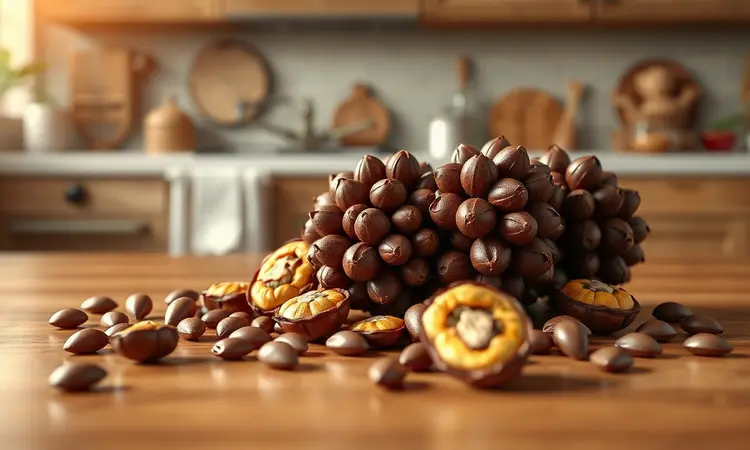
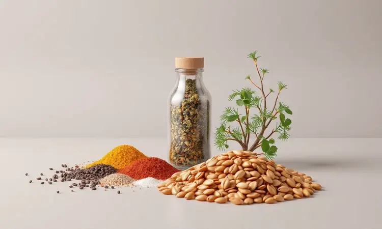
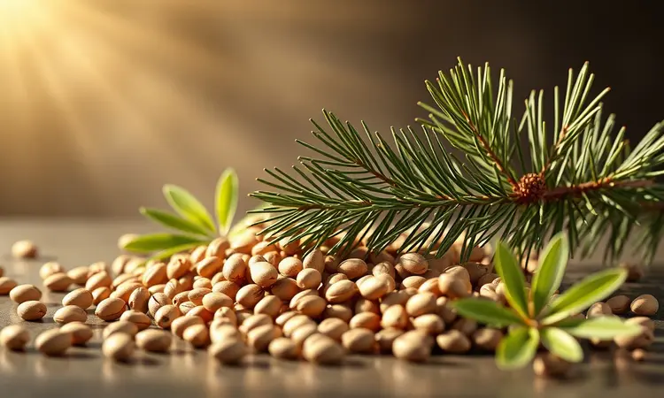

Você adora pinhão, mas desanima só de pensar no tempo que ele leva para cozinhar na panela de pressão e no gasto de gás? Você não está sozinho.

A boa notícia é que a fritadeira elétrica revolucionou o preparo dessa semente típica do inverno, entregando um resultado crocante por fora e macio por dentro em poucos minutos.

Vou te ensinar o passo a passo infalível para fazer pinhão na airfryer, revelando segredos profissionais para ele não ressecar e como escolher os melhores grãos para um petisco inesquecível.

<SummaryList products={frontmatter.top_products} />

## Por que preparar pinhão na airfryer é a melhor escolha?

Imagine sair da rotina do fogão e ainda assim conquistar aquele pinhão perfeito, com a crocância que faz seu paladar vibrar. A airfryer utiliza a circulação de ar quente para transformar os grãos, dispensando quantidades exageradas de óleo. O resultado?

Um petisco mais leve, que mantém todo o sabor que você ama, mas com a praticidade de preparar em minutos. É como ter um assistente na cozinha que entrega textura e rapidez, deixando você mais tempo para saborear cada mordida.

## Como escolher e preparar o pinhão para assar

Tudo começa com a matéria-prima certa. Procure pinhões com cascas firmes, livres de manchas ou rachaduras. Uma boa seleção garante que o sabor se desenvolva plenamente durante o cozimento.

Lave-os bem em água corrente para remover qualquer impureza e, em seguida, dê atenção especial ao próximo passo: faça um corte em forma de 'X' na casca de cada um.

Essa pequena ação faz toda diferença, pois permite que o calor penetre uniformemente e facilita a remoção da casca depois de pronto.

## Passo a passo: Como fazer pinhão na airfryer rápido e fácil

Com os pinhões selecionados e preparados, chegou a hora da transformação. Comece pré-aquecendo sua airfryer enquanto tempera os grãos a gosto. Depois, espalhe-os na cesta em uma única camada e programe para 200ºC por 10 a 15 minutos.

O segredo está na observação: quando estiverem dourados e emitindo aquele aroma irresistível, você saberá que estão no ponto ideal.

### O segredo do corte: Por que você deve cortar as pontas?

Você já percebeu como alguns pinhões podem ficar mais duros nas extremidades? Cortar as pontas antes de cozinhar resolve isso de forma elegante.

Essa técnica não apenas acelera o processo, mas abre caminho para que os temperos penetrem profundamente, realçando cada nuance de sabor. O resultado é uma textura uniformemente macia que transforma cada mordida em uma experiência completa.

### Tempo e temperatura ideal para um pinhão perfeito

Com as pontas cortadas, o próximo desafio é encontrar a combinação perfeita de calor e tempo. Para a maioria das airfryers, 180°C por 15 a 20 minutos funciona como um ponto de partida excelente. Durante o processo, sacuda a cesta na metade do tempo.

Esse movimento garante que todos os lados recebam atenção igual, resultando em um dourado uniforme que sinaliza quando estão macios por dentro e levemente crocantes por fora.

## Melhores modelos de Airfryer para preparar petiscos

<ProductBox 
  title={frontmatter.top_products[0].title} 
  image={frontmatter.top_products[0].image} 
  link={frontmatter.top_products[0].link} 
/>

O sucesso do seu pinhão também depende do equipamento certo. Para casais, a Mondial Air Fryer Pratic 3,6L oferece relação custo-benefício imbatível e facilidade de limpeza.

Se você busca equilíbrio entre capacidade e investimento, a Philco Air Fryer Gourmet 4,4L se destaca pela versatilidade. Para espaços menores, a Elgin Air Fryer Start Fry 3,5L combina potência e tamanho compacto.

Já famílias maiores encontram na Mondial Air Fryer Grand Family 5L, com seus 1900W de potência, a capacidade ideal para preparações generosas. A escolha final deve refletir seu ritmo na cozinha e quantas pessoas costumam compartilhar suas criações.

## Acessórios úteis: Cortador de pinhão para facilitar sua vida

<ProductBox 
  title={frontmatter.top_products[1].title} 
  image={frontmatter.top_products[1].image} 
  link={frontmatter.top_products[1].link} 
/>

Embora não existam cortadores específicos para pinhão, alguns acessórios manuais podem transformar o preparo em uma tarefa mais fluida.

Descascadores ou cortadores de alumínio ajudam a abrir a casca e cortar as pontas com precisão, garantindo que o calor se distribua de maneira uniforme durante o cozimento.

Sim, pode exigir um pouco de força inicial, especialmente com pinhões mais frescos, mas a recompensa vem na praticidade e na consistência que você conquista em cada lote.

## Dicas de especialista para o pinhão não ficar duro ou seco

Nada pior do que abrir a airfryer e encontrar pinhões ressecados. Para evitar essa decepção, experimente um truque simples: adicione uma pequena quantidade de água na cesta antes de começar. O vapor gerado durante o cozimento ajuda a manter a umidade interna dos grãos.

Outra técnica valiosa é pré-cozinhar os pinhões em água fervente por cerca de 10 minutos. Esse passo extra amolece a casca e prepara o interior para receber o calor da airfryer sem perder a suculência.

Ajuste para 180°C e não se esqueça de mexer as porções periodicamente.

## Variações de sabor: Temperos para elevar o seu petisco

Aqui está onde a criatividade ganha espaço. Enquanto sal e pimenta formam a base clássica, experimente adicionar páprica defumada para um sabor terroso ou curry para notas exóticas. Ervas frescas como alecrim e tomilho trazem um aroma que lembra campo e cozinha de vó.

Para momentos especiais, um fio de azeite trufado ou parmesão ralado na finalização cria uma experiência gourmet que impressiona até os paladares mais exigentes. Cada combinação conta uma história diferente.

## Pinhão na airfryer vs. Panela de pressão: Qual a real diferença?

Essa escolha define completamente o caráter do seu pinhão. A airfryer entrega crocância e praticidade, com aquele sabor levemente torrado que convida a repetir.

Já a panela de pressão preserva a umidade natural, resultando em uma textura mais cremosa e macia, ideal para quem busca intensidade de sabor.

A decisão final depende do momento: você quer a experiência crocante de um petisco ou a consistência reconfortante de um acompanhamento?

## 5 Erros comuns ao assar pinhão e como evitá-los

Alguns deslizes podem comprometer o resultado final. O primeiro, e mais perigoso, é esquecer de furar os pinhões antes de assar, o que pode levar a pequenas explosões devido ao vapor interno.

Outro equívoco é sobrecarregar a cesta, impedindo a circulação de ar necessária para um cozimento uniforme. Não pré-aquecer o aparelho resulta em temperaturas inconsistentes. Ajustar mal o tempo e a temperatura produz grãos crus ou queimados.

Por último, pular o tempero antes de assar deixa o sabor plano. Atenção a esses detalhes garante sucesso em cada tentativa.

## O que fazer com pinhão? Ideias de receitas deliciosas (Farofa, Arroz e Sopas)

Depois de dominar o pinhão na airfryer, você pode levá-lo para outras aventuras culinárias. Na farofa, ele adiciona crocância e sabor adocicado que conversa perfeitamente com cebola e alho.

No arroz, transforma um acompanhamento simples em algo especial, com texturas que se complementam. Nas sopas, cozido lentamente com outros vegetais, oferece nutrição e conforto em cada colherada.

Cada receita é uma nova maneira de explorar as possibilidades dessa semente versátil.

## Benefícios nutricionais do pinhão para sua saúde

Além do prazer gastronômico, o pinhão traz uma série de vantagens para seu bem-estar. Rico em proteínas, fibras e gorduras saudáveis, ele ajuda na saciedade e no controle do colesterol.

Vitaminas do complexo B, magnésio, fósforo e potássio trabalham em conjunto para manter seu organismo funcionando harmoniosamente. Seu alto poder antioxidante protege as células contra danos, contribuindo para a prevenção de doenças.

Incorporar essa semente na alimentação significa nutrir o corpo enquanto se deleita com o paladar.

## Perguntas Frequentes (FAQ)

Se dúvidas ainda persistirem, aqui estão respostas para as questões mais comuns. Sobre o tempo de cozimento, normalmente varia entre 15 e 20 minutos a 180°C, mas sempre confie na textura desejada.

Quanto à casca, não é necessário removê-la antes de colocar na airfryer, pois ela ajuda a preservar sabor e nutrientes durante o processo. Para intensificar o sabor, tempere antes de começar o cozimento.

## Conclusão

Preparar pinhão na airfryer vai muito além de uma simples técnica culinária. É sobre reconectar-se com um sabor tradicional de forma moderna, sobre transformar a ansiedade do tempo longo de cozimento em satisfação quase instantânea.

Desde a escolha dos melhores grãos até o momento em que você sente a crocância perfeita dando lugar à maciez interior, cada etapa foi pensada para simplificar sua experiência.

Agora você tem não apenas um método, mas uma nova maneira de celebrar esse ingrediente sazonal.

Que tal experimentar hoje mesmo e descobrir como a combinação certa de calor, tempo e cuidado pode transformar seu pinhão em uma memória gustativa que você vai querer repetir sempre?