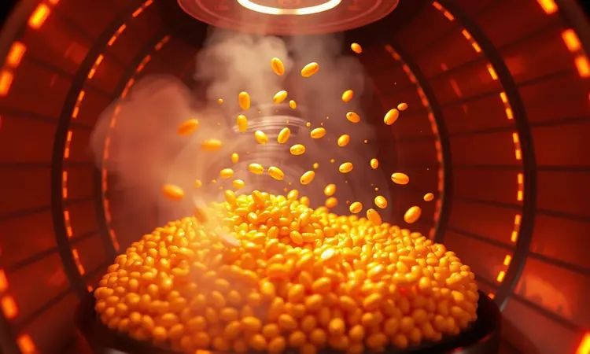
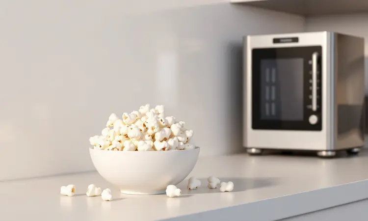

Você já viu aqueles vídeos virais onde alguém transforma grãos secos em pipoca crocante em apenas minutos, tudo sem uma gota de óleo? Aquela promessa de praticidade salva-vidas para o cinema em casa é tentadora demais para resistir.

Mas enquanto fecha o carrinho de compras online, uma dúvida ecoa na sua mente: será que vale realmente arriscar a sua preciosa airfryer em nome de um lanche?

A respiração de alívio vem primeiro: sim, é perfeitamente possível. Essa é sua oportunidade de trocar aquela pipoca de micro-ondas cheia de conservantes por uma versão caseira que você controla cada ingrediente.

O ar quente circulando na sua airfryer faz a mágica acontecer, transformando grãos em pipocas crocantes que parecem ter sido feitas no cinema.

Mas aqui está o segredo que os vídeos de 30 segundos não contam: a linha entre sucesso e desastre é mais fina que um grão de pipoca.

<SummaryList products={frontmatter.top_products} />

## Por que especialistas alertam sobre os perigos desse método?

Antes de entrar na cozinha animado, imagine abrir sua airfryer após os primeiros estouros e encontrar um grão branco grudado na resistência, ou pior, sentir aquele cheiro de queimado que nunca mais sai. Os alertas dos especialistas não são exageros para assustar.

Eles vêm de histórias reais onde a praticidade encontrou seu limite.

### O risco do milho voar no motor e resistência

Quando o grão explode sob aquela temperatura controlada, ele não respeita limites. Em vez de ficar contido na cesta, pode voar direto para onde o ar quente nasce, grudando-se em partes sensíveis do seu aparelho.

Não é apenas uma questão de limpeza chata: aquela pequena massa carbonizada pode comprometer o funcionamento do motor ou, com o tempo, causar danos permanentes. A solução? Não sobrecarregar a cesta parece óbvio, mas é a armadilha mais comum.

Espaço para respirar não é luxo, é necessidade.

### Risco de superaquecimento e curto-circuito

Seu rosto próximo ao visor digital, ouvindo atentamente cada estouro enquanto o tempo passa. O cheiro começa a mudar, sutilmente. De pipoca fresca para algo que lembra... fumaça?

Airfryers trabalham em temperaturas que beiram os 200°C, criando um ambiente perfeito para pipoca, mas também para superaquecimento se os grãos bloquearem a circulação de ar.

Um curto-circuito não significa apenas uma noite de cinema estragada: é a porta de entrada para riscos reais que vão além da cozinha.

## Como fazer pipoca na airfryer: Passo a passo com segurança

Agora que você conhece os perigos, pode transformá-los em precauções inteligentes. Este não é apenas um método, é um ritual de segurança que garante seu lanche e sua tranquilidade.

### Ingredientes e utensílios necessários

O básico é realmente simples: grãos de pipoca (quanto mais naturais, melhor), sua airfryer e uma pitada de confiança. O truque está na quantidade: meia xícara é mais que suficiente para uma porção generosa sem sobrecarregar o aparelho.

Para temperar, esqueça as misturas prontas com nomes químicos. Sal marinho, especiarias que já estão no seu armário, e talvez um fio de azeite depois de pronta para dar aquele brilho que grudará os temperos.

### O truque do papel alumínio para proteger sua fritadeira

Aqui está o segredo que separa os iniciantes dos mestres: forre a cesta com papel alumínio, mas não como se estivesse embrulhando um presente. Deixe espaço nas laterais para que o ar continue circulando livremente.

Essa barreira fina não apenas protege sua airfryer dos grãos que insistem em voar, mas transforma a limpeza pós-cinema de um pesadelo em apenas um rápido enxágue.

A psicologia é simples: quando você sabe que não precisará esfregar por horas, a experiência se torna prazer puro.

### Tempo e temperatura ideal para não queimar

200°C pode parecer apenas um número no visor, mas é o ponto exato onde a mágica acontece sem tragédias. Configure seu aparelho e prepare-se para o mais importante: ouvir.

Os primeiros estouros começam por volta do quinto minuto, crescendo em intensidade até formar uma sinfonia deliciosa. Quando o intervalo entre os estouros parecer uma pausa musical prolongada, é seu sinal para interromper.

Geralmente, entre 8 e 12 minutos é o suficiente, mas seu ouvido será sempre o melhor guia.

## Vale a pena? Comparativo: Airfryer vs. Panela vs. Micro-ondas

Imagine três heróis na sua cozinha, cada um com seu superpoder. A airfryer é o herói saudável: menos gordura, controle total do processo, e aquela satisfação única de criar algo do zero.

A panela tradicional é o herói clássico: aquele sabor inconfundível que lembra infância, mesmo exigindo sua atenção constante e um pouco mais de sujeira.

O micro-ondas é o herói da velocidade: quando o filme já começou e você precisa de pipoca em 3 minutos, mesmo que o sabor seja... bem, lembrança do sabor de pipoca.

A escolha entre eles não é sobre qual é melhor, mas sobre qual momento você está vivendo: saúde em primeiro lugar, tradição em dia especial, ou emergência cinematográfica.

## Melhores alternativas para uma pipoca saudável e sem riscos

Se mesmo com todos os cuidados, a ideia de arriscar sua airfryer ainda lhe causa frio na barriga, existem alternativas que entregam o mesmo resultado crocante sem o peso da preocupação.

### Pipoqueira Elétrica: A opção mais segura sem óleo

<ProductBox 
  title={frontmatter.top_products[0].title} 
  image={frontmatter.top_products[0].image} 
  link={frontmatter.top_products[0].link} 
/>

Pense nela como a versão especializada da airfryer para pipoca. Desenhada especificamente para a tarefa, elimina todos os riscos de grãos voando para lugares errados. O resultado? Pipoca uniformemente estourada, grão por grão, sem necessidade de supervisão constante.

A única consideração: sem óleo, o sal pode precisar de um pequeno incentivo para grudar. Uma leve névoa de azeite após o preparo resolve o problema, mantendo a experiência 95% mais saudável que qualquer método tradicional.

### Pipoqueira de Silicone para Micro-ondas

<ProductBox 
  title={frontmatter.top_products[1].title} 
  image={frontmatter.top_products[1].image} 
  link={frontmatter.top_products[1].link} 
/>

Para quem tem espaços mínimos na cozinha, esta é a solução que se dobra e desaparece quando não está criando mágica. A pipoqueira de silicone transforma seu micro-ondas em uma fábrica de pipoca sem óleo em minutos.

O material de grau alimentício suporta o calor intenso sem transmitir nenhum sabor estranho. A limitação de capacidade? Apenas um motivo para fazer uma segunda rodada, o que na verdade aumenta a sensação de frescor a cada porção.

### Panela Pipoqueira Tradicional com Revestimento Cerâmico

<ProductBox 
  title={frontmatter.top_products[2].title} 
  image={frontmatter.top_products[2].image} 
  link={frontmatter.top_products[2].link} 
/>

A ponte perfeita entre tradição e modernidade. Mantém a ritualística da panela no fogão, com aquele barulho reconfortante de grãos saltando, mas com uma superfície cerâmica que praticamente se limpa sozinha.

Livre de compostos químicos prejudiciais, é a escolha para quem quer controle total do processo sem comprometer saúde ou tempo de limpeza. Use uma espátula de silicone para preservar o revestimento, e você terá uma companheira de cinema por anos.

## Dicas extras para temperar sua pipoca como um chef

Aqui está onde sua pipoca deixa de ser lanche e se torna experiência. Após o preparo, enquanto ainda está quente e receptiva, comece com o clássico manteiga derretida (feita separadamente, nunca direto na airfryer) e sal marinho.

Para a próxima evolução, experimente páprica defumada que transporta você para um acampamento noturno, ou queijo parmesão ralado fino que adere perfeitamente.

A ousadia gourmet vem com alecrim fresco picado ou uma mistura secreta de especiarias que você desenvolverá como sua assinatura pessoal. Para os momentos doces, canela e açúcar mascavo criam um contraste que confunde os sentidos em um jeito bom.

## Perguntas Frequentes (FAQ)

Diante do balanço entre curiosidade e cautela, estas são as questões que realmente importam na jornada para a pipoca perfeita.

### A pipoca na airfryer fica murcha?

A textura é o maior medo e a maior recompensa. Quando feita corretamente, a pipoca da airfryer tem uma crocância única porque cada grão é envolvido uniformemente pelo ar quente, não banhado em óleo.

O segredo está na quantidade e na paciência: poucos grãos, espaço para expandir, e retirada no momento exato. Se notar que ficou murcha, geralmente é porque esperou muito tempo após o preparo na cesta quente. Transfira imediatamente para uma tigela e verá a diferença.

### Posso colocar manteiga direto na gaveta da airfryer?

Imagine a manteiga derretendo e escorrendo para partes do aparelho que não foram feitas para recebê-la. O resultado é fumaça, cheiro persistente, e uma limpeza que parece nunca terminar.

A técnica dos chefs caseiros é simples: derreta a manteiga separadamente em fogo baixo ou no micro-ondas, e regue generosamente sobre a pipoca já na tigela, mexendo para que cada grão receba seu toque dourado. Assim, o sabor adere sem o risco.

## Conclusão

Fazer pipoca na airfryer é mais do que um truque de cozinha viral: é uma declaração sobre como você equilibra praticidade, saúde e cuidado com o que possui.

A estrada entre o vídeo de 30 segundos e a realidade tem curvas de atenção, pausas para ouvir o estouro perfeito, e decisões sobre quanta conveniência vale uma tranquila noite de cinema.

Você não precisa escolher entre a airfryer intocada e a pipoca cinematográfica. Com os passos certos, pode ter ambos: a satisfação de criar algo saudável com suas mãos, e a segurança de saber que seu investimento na cozinha está protegido.

A próxima vez que aquela vontade surgir durante os créditos iniciais, você não precisará mais hesitar. Sabe o caminho. Conhece os riscos. E mais importante: domina as soluções. Agora, o que vai assistir acompanhando sua criação?