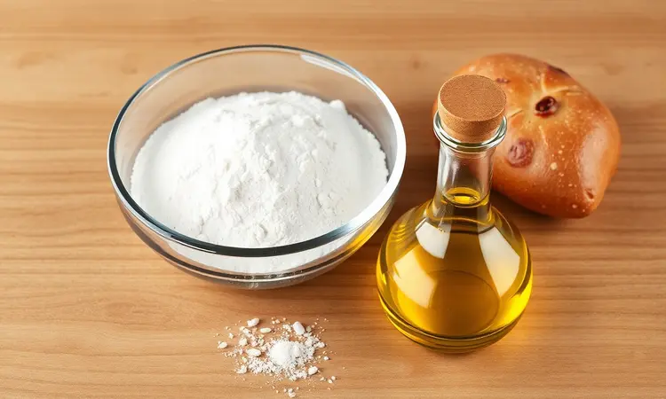
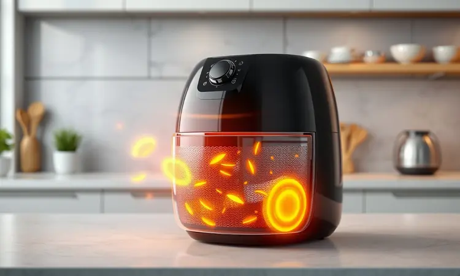

Imagine aquela vontade de pizza artesanal em um dia corrido, mas a ideia de esperar o forno aquecer e depois limpar toda a bagunça parece um pesadelo.

E se você pudesse transformar esse desejo em realidade em apenas 15 minutos, com uma massa que fica crocante por fora e macia por dentro, sem sujar metade da cozinha?

Você está prestes a descobrir como sua airfryer pode se tornar sua aliada secreta para noites de pizza que parecem saídas de uma pizzaria italiana, mas com o conforto do seu lar.

<SummaryList products={frontmatter.top_products} />

## Por que a Pizza na Airfryer é a Melhor Opção para Dias Corridos?

<ProductBox 
  title={frontmatter.top_products[0].title} 
  image={frontmatter.top_products[0].image} 
  link={frontmatter.top_products[0].link} 
/>

A resposta está em três palavras: velocidade, praticidade e resultado. Enquanto um forno convencional precisa de 20 minutos só para pré-aquecer, sua airfryer entrega uma pizza perfeita em 5 a 15 minutos no total.

Pense nisso como o tempo que você levaria para pedir uma entrega, mas com o sabor caseiro que faz toda diferença.

E a crocância? A circulação de ar quente intensa cria aquela casquinha dourada que todos amamos, com o interior permanecendo macio e o queijo perfeitamente derretido.

O melhor: você pode usar bases práticas como wraps ou pão sírio quando o tempo está realmente curto, ou investir 30 minutos em uma massa caseira que vai impressionar qualquer convidado.

A limpeza rápida é apenas a cereja do bolo, transformando o que seria uma tarefa demorada em um momento prazeroso.

## Receita de Massa de Pizza Caseira Especial para Airfryer

<ProductBox 
  title={frontmatter.top_products[1].title} 
  image={frontmatter.top_products[1].image} 
  link={frontmatter.top_products[1].link} 
/>

Esta massa é o segredo para pizzas que rivalizam com as das melhores casas. Ela desenvolve uma textura única na airfryer, ficando crocante nas bordas enquanto mantém a maciez no centro.

### Ingredientes Necessários para a Massa Perfeita

Reúna: 2 xícaras de farinha de trigo, 1 colher de chá de fermento biológico seco, 1 colher de sopa de azeite de oliva, 1 colher de chá de sal e aproximadamente 3/4 de xícara de água morna.

O azeite não só traz sabor, como garante que a massa fique úmida por dentro mesmo depois de crocante por fora.

### Passo a Passo: Preparo e Tempo de Descanso

Misture todos os ingredientes secos primeiro, depois adicione o azeite e a água aos poucos, até formar uma massa homogênea. Sove por 5 minutos até sentir ela ficar lisa e elástica. Aqui está o segredo: deixe descansar por 30 minutos coberta com um pano úmido.

Esse tempo não é espera, é transformação. O fermento trabalha criando pequenas bolhas de ar que vão garantir uma massa leve e aerada. Enquanto isso, prepare seus ingredientes favoritos para a cobertura.

Após o descanso, abra a massa finamente (lembre-se que na airfryer tudo cozinha mais rápido) e está pronta para receber seus sabores.

O espaço limitado da airfryer se torna uma vantagem, incentivando você a fazer pizzas menores e mais pessoais, onde cada uma pode ter sua combinação única.

## Segredos para uma Massa Crocante e Recheio Suculento

Dois truques separam uma pizza boa de uma excepcional na airfryer, e ambos envolvem timing perfeito.

### O Pulo do Gato: Pré-cozimento da Massa

Coloque a massa vazia na airfryer pré-aquecida por apenas 3-4 minutos. Você vai ver ela firmar e começar a criar pequenas bolhas.

Esse passo simples faz milagres: cria uma barreira que impede o molho de encharcar a base, garantindo aquela crocância que resiste até o último pedaço. Depois do pré-cozimento, é só adicionar os ingredientes e finalizar.

### A Ordem Certa do Recheio para Não Queimar o Queijo

Siga esta sequência como um ritual: primeiro o molho de tomate, depois ingredientes que precisam de mais cozimento (como cogumelos ou calabresa), e só então o queijo por cima de tudo. Por que essa ordem?

O queijo funciona como um escudo térmico, derretendo lentamente enquanto protege os ingredientes abaixo do calor direto. O resultado é uma pizza onde tudo está no ponto perfeito, do queijo dourado aos vegetais macios.

## 7 Opções de Sabores Gourmet para Fazer na Airfryer

Aqui está onde a magia acontece. Estas combinações transformam sua airfryer em um bistrô particular.

### 1. Margherita Clássica com Manjericão Fresco

Às vezes, a simplicidade é a sofisticação máxima. Molho de tomate caseiro, muçarela de búfala e folhas de manjericão fresco colhidas na hora. A airfryer intensifica os sabores básicos, criando uma experiência que transporta você direto para Nápoles em 10 minutos.

### 2. Abobrinha com Limão e Parmesão (Estilo Rita Lobo)

Transforme este acompanhamento clássico em uma pizza surpreendente. Fatias finas de abobrinha grelhadas, uma camada generosa de parmesão e um fio de azeite com raspas de limão.

A acidez cítrica corta a riqueza do queijo, criando um equilíbrio que é ao mesmo leve e indulgente.

### 3. Cogumelos, Cebola-Roxa e Rúcula Fresca

Para os amantes de sabores terrosos. Cogumelos salteados com alho, cebola-roxa caramelizada e um punhado de rúcula fresca adicionada depois de assada.

A rúcula ligeiramente murcha com o calor residual, liberando seu sabor picante que contrasta perfeitamente com a doçura da cebola.

### 4. Calabresa Acebolada com Toque de Orégano

O clássico brasileiro ganha nova vida. Calabresa em rodelas finas, cebola caramelizada até ficar translúcida e orégano fresco. Na airfryer, a calabresa fica levemente crocante nas bordas enquanto mantém sua suculência, criando texturas que se completam.

### 5. Quatro Queijos com Mel e Nozes

Uma experiência de contrastes. Muçarela, gorgonzola, parmesão e ricota se encontram sob um fio delicado de mel e nozes picadas.

O calor da airfryer derrete os queijos em uma única camada cremosa, enquanto o mel carameliza levemente nas bordas, criando doçura e crocância em cada mordida.

### 6. Escarola com Alho Crocante e Muçarela

Para quem busca sabor com leveza. Escarola refogada com alho dourado e cubos de muçarela.

O alho fica crocante como lascas, adicionando uma textura surpreendente a cada mordida, enquanto a escarola murcha levemente, concentrando seu sabor levemente amargo que complementa o queijo.

### 7. Pizza Doce de Brigadeiro com Morango

Porque toda refeição merece um final doce. Uma base crocante coberta com brigadeiro cremoso e morangos frescos fatiados.

Na airfryer, o brigadeiro fica levemente aquecido, quase derretendo, enquanto os morangos liberam seu suco doce, criando uma sobremesa que é comfort food em sua forma mais pura.

## Acessórios Indispensáveis para Facilitar o Preparo

<ProductBox 
  title={frontmatter.top_products[2].title} 
  image={frontmatter.top_products[2].image} 
  link={frontmatter.top_products[2].link} 
/>

Agora que você já tem sabores para experimentar a semana toda, alguns acessórios podem transformar o preparo de pizza de uma tarefa para um momento de prazer culinário.

### Formas de Silicone vs. Papel Perfurado: Qual Escolher?

<ProductBox 
  title={frontmatter.top_products[3].title} 
  image={frontmatter.top_products[3].image} 
  link={frontmatter.top_products[3].link} 
/>

Pense nas formas de silicone como seu investimento de longo prazo. Elas são reutilizáveis, facilitam a limpeza e mantêm seus alimentos suculentos. Porém, se você busca aquela crocância máxima que faz barulho ao morder, o papel perfurado é seu aliado.

Ele garante circulação de ar por todos os lados, criando uma base uniformemente dourada. Minha sugestão? Tenha ambos. Use o silicone para pizzas com molhos mais líquidos e o papel perfurado quando quiser aquela crocância perfeita.

### Utensílios para um Corte Profissional

<ProductBox 
  title={frontmatter.top_products[4].title} 
  image={frontmatter.top_products[4].image} 
  link={frontmatter.top_products[4].link} 
/>

Há uma satisfação especial em cortar uma pizza perfeitamente. O cortador tipo roda com lâmina de aço inox desliza pela massa crocante com facilidade, garantindo fatias limpas.

Para pizzas carregadas de ingredientes, a mezzaluna (aquela lâmina curva) faz o trabalho com um movimento suave de balanço. E se você quer praticidade total, a tesoura para pizza com espátula integrada permite cortar e servir em um único gesto.

Esses detalhes transformam o ato de servir em parte da experiência.

## Variações de Massa: Rap10, Liquidificador e Sem Glúten

Sua criatividade não precisa parar na cobertura. A própria massa oferece um mundo de possibilidades. O Rap10 é para aqueles momentos 'preciso de pizza agora' - em 5 minutos você tem uma base crocante pronta.

Para uma textura diferente, experimente bater a massa no liquidificador: ela fica mais aerada e homogênea, perfeita para quem busca consistência.

E para amigos com restrições alimentares, massas sem glúten com farinha de arroz ou amêndoas não são apenas uma alternativa, mas uma descoberta de novos sabores e texturas que podem surpreender até os mais tradicionais.

## Perguntas Frequentes (FAQ) sobre Pizza na Airfryer

### Posso fazer pizza congelada na airfryer?

Absolutamente, e ela fica ainda melhor que no forno convencional. A circulação de ar intensa revive aquela crocância que se perde no congelamento.

Coloque na cesta a 180°C por 10-15 minutos (sempre cheque a embalagem para ajustes) e você terá uma pizza que parece recém-assada, com o queijo borbulhante e as bordas douradas.

### Como evitar que a massa grude no cesto?

Três segredos infalíveis: primeiro, um spray antiaderente de alta temperatura aplicado levemente. Segundo, polvilhe uma fina camada de fubá ou farinha no fundo - ela cria uma barreira e ainda adiciona um sabor leve.

Terceiro, e mais importante, pré-aqueça a airfryer por 3 minutos antes de colocar a massa. A superfície quente sela a massa instantaneamente, impedindo que ela grude. Com essas dicas, sua pizza desliza para fora inteira, pronta para ser fatiada.

## Conclusão: Praticidade e Sabor no seu Dia a Dia

O que começou como uma solução para dias corridos pode se transformar em um novo hobby culinário. Sua airfryer não é apenas um eletrodoméstico, é um atalho para momentos de prazer gastronômico que se encaixam na sua rotina.

Em 15 minutos, você transforma ingredientes simples em memórias saborosas: a pizza do sábado à noite que vira tradição familiar, o lanche rápido que recarrega suas energias, a receita especial para impressionar visitas inesperadas.

Cada crocância da massa conta uma história de praticidade conquistada, cada combinação de sabores revela sua personalidade na cozinha. Experimente, adapte, crie.

A pizza perfeita não é aquela que segue regras rígidas, mas a que traz um sorriso ao seu rosto ao primeiro pedaço. Sua airfryer está esperando para mostrar que cozinhar pode ser rápido, divertido e deliciosamente recompensador. Qual será sua primeira criação?