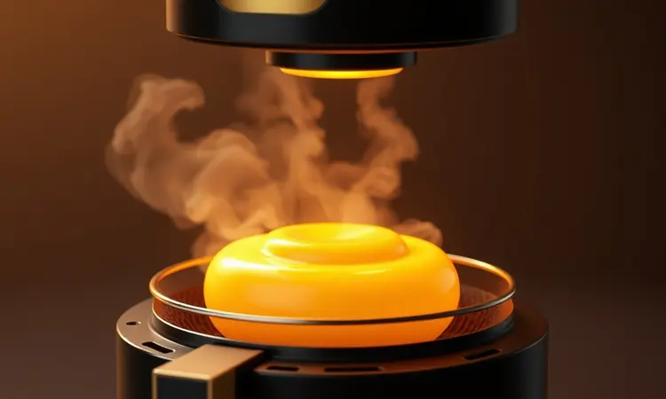
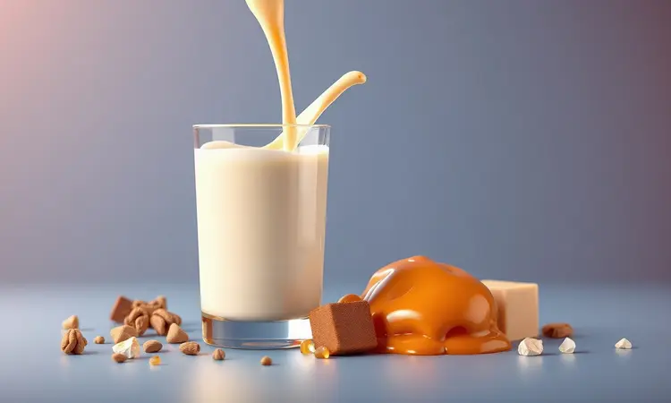
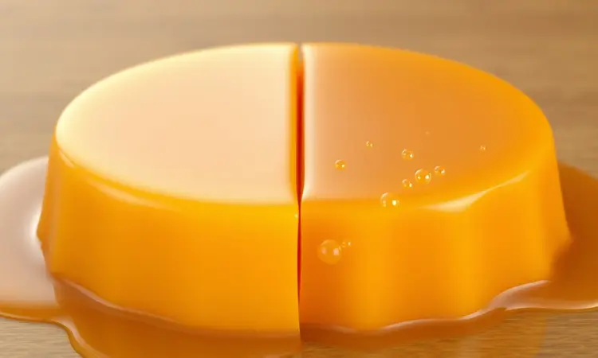
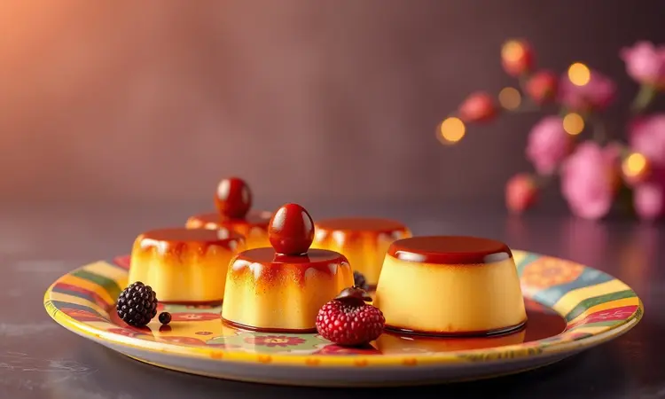

Você adora um pudim de leite condensado bem cremoso, mas desanima só de pensar no tempo que ele leva no forno tradicional e no gasto de gás? Você não está sozinho.

A boa notícia é que a fritadeira elétrica não serve apenas para salgados; ela é capaz de preparar sobremesas impecáveis. Neste guia completo, eu vou te mostrar que é possível fazer o pudim perfeito na Air Fryer, mais rápido, prático e com a mesma textura irresistível.

Você vai aprender desde a calda de caramelo brilhante até o tempo exato para não errar o ponto, garantindo um resultado de chef na sua cozinha.

<SummaryList products={frontmatter.top_products} />

## Por que fazer pudim na Air Fryer vale a pena?

Imagine poder preparar sua sobremesa favorita sem ter que esperar horas para o forno atingir a temperatura ideal, ou sem a preocupação de gastar muita energia. A Air Fryer traz essa praticidade para sua vida.

Além da economia de tempo e energia que você sente desde o primeiro uso, ela oferece uma textura única: cremosidade por dentro com aquela leve crocância na camada superior que só faz você querer mais.

A facilidade de limpeza também é um ponto que transforma sua experiência. Muitos modelos têm partes removíveis que você pode simplesmente lavar na lava-louças, deixando você livre para focar apenas no prazer de comer, sem o trabalho árduo da limpeza depois.

Essas vantagens tornam cada preparo uma experiência que combina praticidade com resultados saborosos.

## Utensílios necessários: Qual forma usar?

Para aproveitar todos esses benefícios, o primeiro passo é escolher a forma adequada. Use uma forma de silicone ou de metal que seja compatível com o tamanho da cesta do aparelho.

Essa escolha garante que o calor se distribua uniformemente durante todo o cozimento, e torna a desinformação um processo tranquilo, sem estresse.

### Melhores modelos de forma de pudim para Air Fryer

<ProductBox 
  title={frontmatter.top_products[0].title} 
  image={frontmatter.top_products[0].image} 
  link={frontmatter.top_products[0].link} 
/>

Quando pensamos em cozimento uniforme e rápido, as formas de alumínio são a escolha preferida de muitos chefs. Elas absorvem e distribuem o calor de maneira eficiente, garantindo que seu pudim seja perfeito em cada ponto.

As formas de metal com furo central são igualmente recomendadas, pois esse design ajuda na circulação do calor, evitando que o centro demore mais que as bordas.

As formas de silicone são válidas, mas podem exigir um pouco mais de tempo de cozimento.

Independentemente do material que você escolha, o tamanho é crucial: diâmetros entre 16 cm e 20 cm se ajustam bem à maioria dos modelos, proporcionando espaço suficiente para o pudim crescer sem problemas.

Um detalhe que faz toda diferença é cobrir a forma com papel alumínio antes de colocar na Air Fryer. Isso cria um ambiente protegido que mantém a umidade interna, garantindo aquela cremosidade perfeita que você busca em cada porção.

### As melhores Air Fryers para sobremesas

<ProductBox 
  title={frontmatter.top_products[1].title} 
  image={frontmatter.top_products[1].image} 
  link={frontmatter.top_products[1].link} 
/>

Se você quer explorar o universo das sobremesas na Air Fryer, alguns modelos se destacam pela versatilidade que oferecem.

A Electrolux Air Fryer Oven EAF90 e a Philco Air Fryer Oven PFR2200P, ambas com 12L de capacidade, têm espaço suficiente para bolos e pudins maiores, além de controle preciso de temperatura que evita erros.

Para quem precisa de ainda mais espaço, a Oster Forno e Fryer Multifunções de 25L é uma escolha prática que se adapta a diversas receitas.

Se seu foco são porções menores ou cupcakes individuais, a Philips Walita RI9252/91, com 4,1L, oferece desempenho rápido e a conveniência de controle via aplicativo que simplifica todo o processo.

Esses modelos transformam o preparo de sobremesas em uma experiência saudável e rápida, eliminando a ansiedade de longos processos tradicionais.

## Receita de Pudim de Leite Condensado na Air Fryer

Com os utensílios escolhidos, chegamos ao momento mais esperado: a receita que vai trazer o sabor do pudim tradicional para sua Air Fryer. Você vai precisar de leite condensado, leite, ovos e açúcar para criar essa delícia.

A mistura cuidadosa, seguida pelo caramelo perfeito e o cozimento de cerca de 30 minutos, resulta em uma sobremesa que impressiona.

### Ingredientes para a calda de caramelo

A calda de caramelo é a base que define o charme do pudim. Para conquistar aquela cor dourada e brilhante, você precisa de uma xícara de açúcar e meia xícara de água.

O segredo está na panela: escolha uma de fundo grosso para evitar que o caramelo queime enquanto você transforma o açúcar.

Comece colocando o açúcar na panela e depois adicione a água. Cozinhe em fogo baixo, sem mexer, até que o açúcar se dissolva completamente e alcance uma cor dourada que convida ao paladar.

Quando atingir o tom perfeito, despeje imediatamente na forma do pudim, pois o caramelo endurece rapidamente ao esfriar, criando aquela base perfeita para sua massa.

### Ingredientes para a massa do pudim

A massa é onde a magia acontece. Para garantir a cremosidade característica, comece com 1 lata de leite condensado. Em seguida, adicione 2 medidas da mesma lata de leite integral, que equilibra a doçura e traz leveza.

Os 3 ovos dão estrutura e consistência, enquanto 1 xícara de açúcar já caramelizado prepara o fundo da forma.

Para um toque final que realça o sabor, uma pitada de essência de baunilha transforma o pudim comum em uma experiência memorável. Com esses ingredientes simples, você cria uma textura incrível e um gosto que conquista qualquer ocasião.

## Passo a Passo: Preparando o Pudim Perfeito

O processo começa com o caramelo preparado com cuidado, seguido pela mistura dos ingredientes no liquidificador para garantir homogeneidade. Despeje na forma já caramelizada e leve à Air Fryer por cerca de 30 minutos a 160°C.

O momento final é deixar esfriar antes de desenformar, revelando a sobremesa perfeita.

### Como fazer a calda diretamente na forma

Fazer a calda diretamente na forma é um método prático que elimina etapas extras. Comece colocando o açúcar na forma e leve ao fogo baixo. Mexa suavemente até que o açúcar derreta e alcance aquela cor dourada que você ama, sempre tomando cuidado para não queimar.

Uma dica que transforma o resultado: adicione um pouco de água quente após o açúcar derreter. Isso ajuda a evitar cristais indesejados, garantindo uma calda líquida e uniforme. Após atingir a cor desejada, despeje rapidamente na forma, espalhando com cuidado.

Deixe esfriar antes de adicionar a mistura do pudim por cima, criando uma base perfeita para seu creme.

### Preparando a massa: Liquidificador ou batedor de arame?

A escolha entre liquidificador e batedor de arame define a personalidade do seu pudim. O liquidificador mistura os ingredientes de maneira homogênea e aerada, resultando em um pudim mais leve e cremoso que parece feito por um profissional.

O batedor de arame, por outro lado, oferece controle maior sobre a mistura, ideal para quem prefere uma textura mais densa e rica que lembra receitas tradicionais.

Independentemente da sua escolha, o fundamental é evitar incorporar ar em excesso, pois bolhas indesejadas podem alterar a experiência final.

### O truque do papel alumínio na Air Fryer

Usar papel alumínio na Air Fryer é uma estratégia que protege seu pudim durante o cozimento. Ao cobrir a forma, você cria um ambiente fechado que evita que o pudim resseque, mantendo aquela umidade interna que define a cremosidade.

Essa proteção também ajuda a evitar que o pudim grude na forma, facilitando a remoção após o cozimento sem frustrações.

É importante não obstruir a circulação de ar no aparelho, então certifique-se de que o papel alumínio esteja bem ajustado e não bloqueie as aberturas da cesta, permitindo que o calor circule livremente.

## Tempo e Temperatura: O Guia de Ajuste Ideal

O ponto perfeito do pudim depende da relação entre tempo e temperatura. Em geral, recomenda-se uma temperatura entre 160°C e 180°C para garantir cozimento sem ressecamento.

O tempo varia entre 25 e 35 minutos, dependendo do tamanho e da profundidade do molde que você escolheu.

Durante o processo, fique atento ao pudim. O teste do palito é seu aliado: se ele sai limpo, seu pudim está pronto! Além disso, pré-aqueça a Air Fryer por cerca de 5 minutos antes de colocar o pudim.

Isso garante cozimento uniforme desde o início, eliminando variações que podem comprometer o resultado.

## Segredos da Textura: Pudim Lisinho vs. Pudim com Furinhos

A textura do pudim é onde você expressa sua preferência pessoal. Um pudim lisinho, obtido com mistura homogênea e cuidado especial no preparo, oferece cremosidade suave que parece um abraço no paladar.

Misturar bem os ingredientes e coar a mistura antes de colocá-la na forma eliminam bolhas de ar, criando essa experiência.

Se você prefere um pudim com furinhos, isso acontece pelo uso de ingredientes que incorporam ar ou pela mistura menos cuidadosa. Essas pequenas variações podem dar um charme especial ao seu pudim, tornando cada porção única e cheia de personalidade.

A escolha é sua, e ambas trazem prazer.

## Como desenformar o pudim sem quebrar: Dicas de especialista

Desenformar um pudim pode parecer desafiador, mas algumas dicas simples garantem que ele mantenha sua forma perfeita até o momento de servir. Primeiro, deixe o pudim esfriar completamente na forma antes de tentar qualquer movimento. Essa paciência é fundamental.

Em seguida, passe uma faca ao redor das bordas para soltar o pudim da forma, criando espaço para a remoção. Para facilitar ainda mais, você pode aquecer rapidamente o fundo da forma em água quente por alguns segundos. Isso ajuda a soltar o pudim sem força excessiva.

Por fim, coloque um prato sobre a forma e vire rapidamente com confiança. Com cuidado e essas técnicas, seu pudim chegará à mesa intacto e delicioso, pronto para impressionar.

## Variações Deliciosas para Testar

A versatilidade do pudim na Air Fryer permite explorar sabores além do tradicional.

Ingredientes como chocolate meio amargo, coco ralado ou frutas como maracujá e limão transformam a receita básica em experiências irresistíveis que surpreendem seu paladar e ampliam suas possibilidades.

### Pudim de chocolate na Air Fryer

O pudim de chocolate na Air Fryer combina praticidade com o sabor intenso que você ama. Comece preparando a mistura com leite condensado, leite, ovos, chocolate em pó e açúcar, garantindo que todos os ingredientes se integrem completamente.

Despeje a mistura em uma forma adequada e cozinhe por cerca de 25 a 30 minutos a 160°C. O resultado é um pudim cremoso por dentro com textura que convida a cada spoon.

Para um toque final que eleva a experiência, finalize com uma calda de chocolate ou frutas frescas que complementam o sabor.

### Mini pudins individuais

Os mini pudins individuais são a solução para quem quer saborear essa delícia de forma prática e porcionada. Ideais para festas ou lanches rápidos, eles oferecem a mesma cremosidade e sabor do pudim tradicional em formato que facilita o compartilhamento.

A preparação é simples: use formas de silicone ou ramequins que vão na Air Fryer e assam uniformemente.

Esses mini pudins também permitem que você experimente diferentes combinações de sabores, como chocolate ou frutas, tornando cada porção única e irresistível para seus convidados.

## Perguntas Frequentes (FAQ)

Se dúvidas surgem durante o processo, aqui estão respostas que esclarecem os pontos mais comuns. O tempo de cozimento pode variar dependendo do seu modelo, então sempre fique atento e faço o teste do palito para confirmar.

Ajustes na receita podem ser necessários conforme sua Air Fryer, mas a base permanece sólida.

### Pode colocar forma de alumínio na Air Fryer?

Sim, você pode usar formas de alumínio na Air Fryer, e isso é comum na preparação de receitas como pudim. Essas formas suportam bem as altas temperaturas e são leves, facilitando o manuseio durante todo o processo.

Certifique-se apenas que a forma se encaixe bem no cesto da fritadeira, permitindo a circulação do ar quente para que o pudim cozinhe uniformemente em todos os pontos.

Evite recipientes com revestimentos não resistentes ao calor, pois isso pode afetar o sabor e a segurança da sua receita.

### Quanto tempo o pudim deve ficar na geladeira antes de desenformar?

Após preparar o pudim na Air Fryer, é fundamental deixá-lo esfriar em temperatura ambiente antes de levá-lo à geladeira. O ideal é que o pudim permaneça na geladeira por, no mínimo, 4 horas.

Esse tempo é necessário para que ele firme adequadamente e desenvolva a textura cremosa que define a experiência perfeita. Para resultados ainda melhores, muitos chefs recomendam deixar o pudim de um dia para o outro na geladeira.

Assim, ele não apenas fica mais firme, mas também ganha um sabor ainda mais intenso e equilibrado.

### Qual a validade do pudim caseiro?

O pudim caseiro, quando bem preparado e armazenado, costuma ter uma validade de 3 a 5 dias na geladeira. Mantenha-o em um recipiente fechado para evitar que absorva odores de outros alimentos que podem alterar sua pureza.

Observe sempre a consistência e o cheiro do pudim antes de consumir, pois sinais de alteração podem indicar que não está mais seguro.

Para prolongar a durabilidade, você também pode considerar congelar o pudim, estendendo sua vida útil por até um mês sem perder qualidade.

## Conclusão

Fazer pudim na Air Fryer transforma uma tarefa tradicional em uma experiência moderna que combina praticidade com resultados impressionantes.

Você elimina o tempo de espera do forno tradicional, a preocupação com gasto de energia e a sujeira excessiva, mantendo aquela textura cremosa e sabor marcante que define o pudim perfeito.

A versatilidade desse eletrodoméstico permite explorar receitas adaptadas aos seus gostos pessoais, desde o tradicional até variações com chocolate ou frutas.

Cada preparo se torna uma oportunidade de surpreender sua família e amigos com uma sobremesa que parece feita por um profissional, mas com a facilidade que sua rotina precisa.

Com essa receita em mente, você pode adicionar um toque especial ao seu dia a dia, transformando momentos simples em ocasiões memoráveis.

Aproveite para experimentar, ajustar conforme sua preferência e descobrir como a Air Fryer pode revolucionar sua relação com as sobremesas. O prazer está no processo e no resultado final que conquista qualquer paladar.