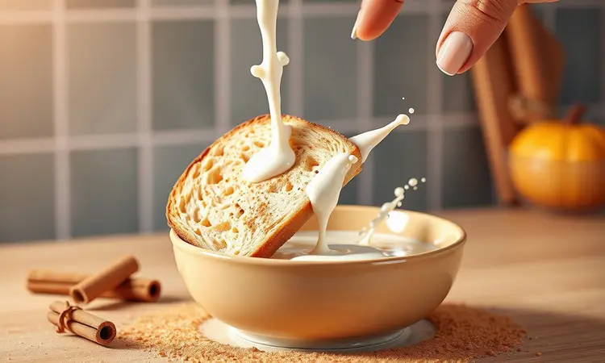

Você adora rabanada, mas foge da sujeira do óleo e do excesso de gordura da fritura tradicional? Você não está sozinho. Imagine eliminar o drama do óleo derramado, a sujeira persistente no fogão e aquela sensação de comida gordurosa depois de comer.

A boa notícia é que é perfeitamente possível obter aquele exterior dourado e crocante com um interior macio usando apenas a sua fritadeira elétrica.

Neste guia, vamos te ensinar a receita definitiva de rabanada na airfryer, revelando os segredos para ela não grudar e como escolher o pão ideal para um resultado profissional.

Prepare-se para transformar sua ceia com praticidade e sabor, mantendo toda a tradição mas sem os inconvenientes.

<SummaryList products={frontmatter.top_products} />

## Por que fazer rabanada na airfryer é a melhor escolha?

Fazer rabanada na airfryer é uma excelente alternativa para quem busca praticidade e saúde, mas acima de tudo, paz na cozinha.

A airfryer utiliza ar quente para cozinhar os alimentos, permitindo que você desfrute de uma rabanada crocante por fora e macia por dentro, com muito menos óleo do que a receita tradicional.

Isso significa menos calorias e gordura, sem abrir mão do sabor que você ama desde criança. Além disso, o tempo de preparo é reduzido, transformando uma tarefa que normalmente exigia atenção constante em algo que você quase pode fazer enquanto prepara o café.

Essa técnica ainda facilita a limpeça radical, já que você evita a sujeira gerada pela fritura convencional e aquela panela que precisa ser lavada com detergente extra.

## Qual o melhor pão para rabanada? (O segredo da textura)

Escolher o pão certo é fundamental para conseguir uma rabanada deliciosa e com a textura perfeita. Pães mais densos, como o pão francês ou o brioche, costumam oferecer melhores resultados, pois absorvem bem a mistura de leite e ovos sem desmanchar.

O brioche, em particular, traz uma leveza e um sabor adocicado que elevam a receita a outro nível, garantindo que cada fatia mantenha sua estrutura e entregue aquela satisfação visual de uma rabanada perfeita, não um pão ensopado.

Por outro lado, pães mais finos ou muito frescos podem deixar a rabanada encharcada e sem firmeza. Portanto, optar por pães que tenham um dia ou dois de fabricação é o ideal para garantir crocância e sabor na sua rabanada.

## Utensílios que facilitam sua vida na cozinha

Para preparar rabanadas na Airfryer com máxima eficiência, alguns utensílios são essenciais. Não são apenas objetos, são seus aliados para garantir que tudo aconteça sem stress.

Uma tigela para misturar os ingredientes, um pincel para untar e, claro, pratos ou bandejas para organizar as fatias tornam o processo mais prático e quase intuitivo.

### Fritadeira Elétrica Airfryer de alta performance

<ProductBox 
  title={frontmatter.top_products[0].title} 
  image={frontmatter.top_products[0].image} 
  link={frontmatter.top_products[0].link} 
/>

Quando se fala em fritadeiras elétricas Airfryer de alta performance, a potência e a capacidade são fatores cruciais para garantir resultados incríveis nas suas receitas.

Modelos com potência acima de 1400W tendem a oferecer um desempenho superior, proporcionando alimentos mais crocantes e um preparo mais ágil. Além disso, é importante verificar a capacidade do cesto.

Se você tem uma família maior, escolher uma com pelo menos 6 litros pode ser ideal.

Outra característica interessante é o tipo de controle. Modelos digitais oferecem precisão, mas podem exigir um cuidado extra na hora da limpeça, enquanto os mecânicos costumam ser mais duráveis.

Lembre-se que algumas fritadeiras não são apenas para fritar; muitas também vêm com funções de assar e gratinar, o que agrega versatilidade à sua cozinha.

Contudo, algumas opções podem ser um pouco grandes para cozinhas menores, mas isso pode ser compensado pela eficiência e praticidade que trazem ao dia a dia.

### Pinça culinária de silicone para não riscar

<ProductBox 
  title={frontmatter.top_products[1].title} 
  image={frontmatter.top_products[1].image} 
  link={frontmatter.top_products[1].link} 
/>

As pinças culinárias de silicone são uma excelente opção para quem busca não riscar panelas e superfícies antiaderentes. Feitas em geral com uma estrutura de aço inoxidável e pontas de silicone, essas pinças combinam durabilidade com proteção.

O silicone é um material macio que não danifica os revestimentos delicados das suas panelas, permitindo o uso sem preocupação.

Embora algumas pinças possam ser um pouco mais caras do que as tradicionais, o investimento vale a pena, especialmente pela segurança que oferecem ao manusear alimentos.

Além disso, muitos modelos possuem pontas removíveis e são fáceis de limpar, podendo até ir na máquina de lavar louça. Lembre-se sempre de escolher pinças que sejam resistentes ao calor e ofereçam uma pegada firme para garantir eficiência nas suas tarefas culinárias.

### Papel antiaderente perfurado para Airfryer

<ProductBox 
  title={frontmatter.top_products[2].title} 
  image={frontmatter.top_products[2].image} 
  link={frontmatter.top_products[2].link} 
/>

O papel antiaderente perfurado para Airfryer é um acessório que pode transformar sua experiência na cozinha. Ele age como uma barreira protetora, evitando que resíduos e gordura grudem no cesto da fritadeira, facilitando a limpeça e prolongando a vida útil do aparelho.

Além disso, os furos no papel permitem a circulação do ar, garantindo que os alimentos cozinhem de maneira uniforme.

Embora seja uma ótima adição, vale lembrar que o papel não deve ser colocado na Airfryer durante o pré-aquecimento sem alimentos, pois isso pode levar ao queimado. No entanto, se utilizado corretamente, ele torna o cozimento muito mais prático e higiênico.

Compreendendo essas nuances, você poderá aproveitar ao máximo esse recurso e deixar suas refeições ainda mais saborosas e crocantes!

## Ingredientes para a Rabanada Perfeita

Para preparar uma rabanada deliciosa na Airfryer, você vai precisar de alguns ingredientes simples que provavelmente já tem na sua casa. Comece com 4 fatias de pão (o ideal é o pão francês ou o próprio pão de rabanada, mais firme).

Em seguida, utilize 2 ovos batidos, que ajudarão a dar liga e sabor à receita. Para a mistura de leite, adicione 200 ml de leite integral junto com 2 colheres de sopa de açúcar e uma pitada de canela em pó.

Essa combinação vai garantir que suas rabanadas fiquem bem temperadas. Não esqueça também da manteiga para untar a cesta da Airfryer e garantir que elas não grudem!

## Passo a Passo: Como fazer rabanada na airfryer

Para fazer rabanada na airfryer, comece umedecendo as fatias de pão em uma mistura de leite e ovos. Em seguida, passe na mistura de açúcar e canela. Coloque na airfryer a 180°C por cerca de 10 minutos, virando na metade do tempo.

### Preparação dos pães e calda

Para preparar as rabanadas na Airfryer, comece cortando o pão em fatias grossas, aproximadamente 2 cm. Um pão de forma tradicional ou brioche é ideal, pois proporciona uma textura macia.

Em um recipiente, misture leite com ovos batidos, açúcar e canela a gosto para formar a calda. Mergulhe cada fatia de pão nessa mistura, garantindo que fiquem bem umedecidas, mas não encharcadas.

Deixe-as descansar por alguns minutos, o que ajudará a absorver bem os sabores antes de levá-las à Airfryer para ficarem crocantes.

### Tempo e temperatura ideais na fritadeira

Quando se trata de preparar rabanadas na airfryer, o tempo e a temperatura são cruciais para garantir que fiquem sequinhas e crocantes. A recomendação é pré-aquecer a fritadeira a 180°C.

Cozinhe as rabanadas por cerca de 8 a 10 minutos, virando-as na metade do tempo para que dourem de maneira uniforme.

Ajustar o tempo e a temperatura pode ser necessário, dependendo da espessura do pão e da quantidade que você está preparando, mas essa é uma base sólida para alcançar o resultado perfeito.

## Dicas de Ouro para a rabanada ficar sequinha e não grudar

Para garantir que sua rabanada fique bem sequinha e não grude na Airfryer, comece utilizando o pão adequado. O ideal é escolhar pães que não estejam muito frescos, pois pães mais antigos absorvem melhor a mistura de leite e ovo.

Ao preparar a mistura, adicione uma pitada de canela ao leite para dar um sabor extra. Evite encharcar as fatias; mergulhe rapidamente e retire o excesso.

Outra dica importante é não sobrecarregar a cesta da Airfryer; deixe espaço entre as rabanadas para que o ar circule livremente, tornando-as ainda mais crocantes. Por fim, um toque de óleo em spray pode ajudar a obter uma crocância ainda melhor.

## Variações Gourmet: Rabanada Recheada na Airfryer

Experimente rabanadas gourmet recheadas com cream cheese, doce de leite ou frutas. Basta abrir um pouco o pão antes de empanar, adicionar o recheio e seguir a receita tradicional na Airfryer. O resultado é uma delícia!

### Rabanada com Doce de Leite ou Nutella

Uma deliciosa variação da rabanada é a versão recheada com doce de leite ou Nutella. Para prepará-la, comece fazendo as rabanadas tradicionais: mergulhe o pão em uma mistura de leite, açúcar e ovos.

Após fritar na Airfryer, você pode cortar as fatias ao meio e adicionar uma generosa camada de doce de leite ou Nutella. Isso traz uma explosão de sabor a cada mordida! Finalize polvilhando um pouco de açúcar e canela por cima para um toque extra.

Essa combinação é perfeita para quem ama um doce mais indulgente e irresistível.

## Versão Saudável: Rabanada Fit e Funcional

A rabanada saudável é uma excelente opção para quem deseja aproveitar essa delícia de maneira mais leve, sem abrir mão do sabor.

Para preparar a versão fit, utilize pão integral ou de forma low carb, que, além de ser mais nutritivo, contribui para uma absorção menor de açúcares.

Em vez de mergulhar em leite condensado, opte por leite desnatado ou vegetal e substitua o açúcar por adoçantes naturais, como o mel ou o xilitol.

O uso da Airfryer garante uma textura crocante sem a necessidade de fritura em óleo, tornando a rabanada funcional e perfeita para quem busca uma alimentação equilibrada.

## Sugestão de Cardápio: O que serve com rabanada?

A rabanada é uma sobremesa deliciosa que combina perfeitamente com diversas opções de acompanhamentos. Para um café da manhã especial, você pode servir rabanadas com frutas frescas, como morangos e bananas, que trazem um toque refrescante.

Além disso, um fio de mel ou uma calda de frutas vermelhas complementa a doçura. Para um lanche da tarde, experimente combiná-las com um café ou chá aromático.

Se preferir algo mais sofisticado, uma bola de sorvete de creme ou baunilha pode transformar sua rabanada em uma sobremesa irresistível. A versatilidade da rabanada permite que você brinque com sabores e texturas!

## Perguntas Frequentes (FAQ)

Rabanada na Airfryer é uma alternativa saudável e prática aos métodos tradicionais. Pode-se ajustar os ingredientes ao gosto pessoal, tornando a receita ainda mais versátil. Uma ótima opção para aproveitar o pão amanhecido!

### Pode guardar rabanada na geladeira?

Sim, você pode guardar rabanadas na geladeira para preservar sua frescura e sabor por mais tempo. O ideal é armazená-las em um recipiente hermético ou bem envoltas em papel alumínio para evitar que fiquem ressecadas ou absorvam odores de outros alimentos.

Ao reaquecer, a Airfryer pode ajudar a recuperar a crocância. No entanto, é bom consumir as rabanadas dentro de poucos dias para garantir que mantenham a melhor textura e sabor.

### Como requentar a rabanada sem murchar?

Requentar a rabanada sem que ela perca a crocância é bem simples. A melhor forma é utilizar a Airfryer, pois ela permite que o ar quente circule ao redor do alimento, mantendo a textura sequinha.

Preaqueça a Airfryer a 180°C por cerca de 3 minutos e, em seguida, coloque as rabanadas na cesta por aproximadamente 5 a 7 minutos. Lembre-se de não sobrecarregar a cesta, para que o ar quente possa circulate livremente.

Isso garante que sua rabanada fique quentinha e crocante, como no primeiro dia!

### Posso congelar o pão de rabanada já pronto?

Sim, você pode congelar o pão de rabanada já pronto! Para garantir que ele mantenha sua crocância e sabor, é importante que você deixe as rabanadas esfriarem completamente antes de embalá-las.

Use um recipiente hermético ou papel alumínio para envolvê-las bem, evitando que fiquem ressecadas ou queimadas no congelador. Quando quiser saboreá-las novamente, basta descongelar na geladeira e aquecer rapidamente na Airfryer ou no forno.

Assim, suas rabanadas ficarão deliciosas como se tivessem acabado de ser feitas!

## Conclusão

Fazer rabanadas na airfryer é uma maneira prática e saudável de saborear essa delícia tradicional, mantendo a crocância e o sabor irresistível.

Com a utilização desse eletrodoméstico, você reduz a quantidade de óleo necessária, resultando em um prato mais leve, mas igualmente gostoso. Além disso, o processo é rápido e fácil, ideal para quem tem uma rotina agitada.

Experimente essa receita e surpreenda sua família e amigos com um lanche ou sobremesa que traz toda a felicidade do natal, sem complicações. Aproveite essa versatilidade que a airfryer oferece na cozinha!