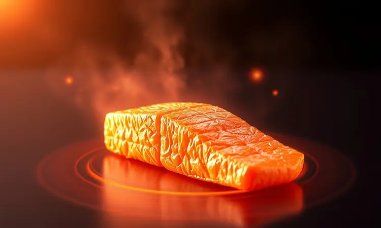
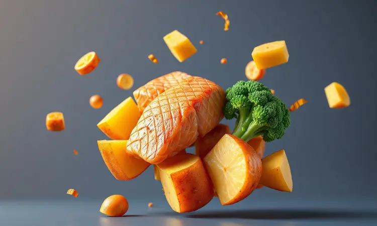
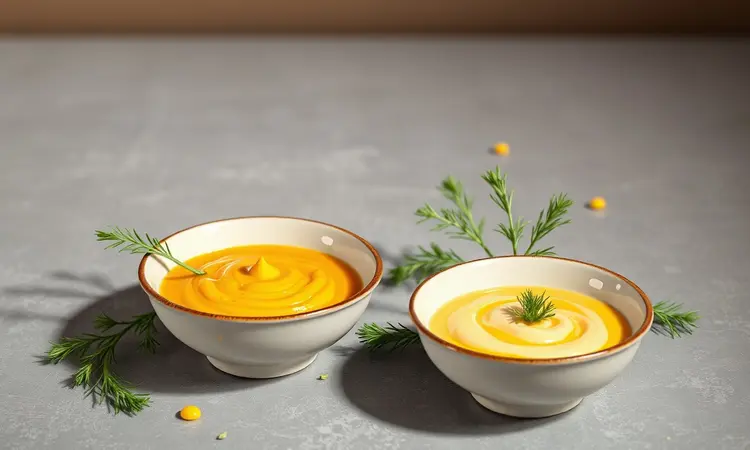

Imagine chegar em casa após um dia cansativo e, em menos de 15 minutos, ter um jantar digno de restaurante sobre a mesa, sem aquele cheiro de óleo que impregna a cozinha.

É exatamente essa praticidade que a airfryer traz para quem ama salmão, mas tem pouco tempo ou receio de errar o ponto.

Eu vou te mostrar como transformar um simples filé em uma experiência gastronômica que preserva toda a suculência e nutrientes, com aquela crocância que faz a diferença.

<SummaryList products={frontmatter.top_products} />

## Por que preparar Salmão na Airfryer é a melhor escolha?

A praticidade é apenas o começo. Ao contrário do forno tradicional, que esquenta toda a cozinha, a airfryer concentra calor por todos os lados do filé, criando uma camada crocante impecável enquanto o interior permanece cremoso e úmido.

E o melhor: você usa apenas uma colher de azeite, não uma frigideira cheia. Isso significa sabor intenso sem culpa, além de uma limpeza que leva segundos - muitos cestos vão direto para a lava-louças.

É a solução perfeita para quem quer saúde no prato sem abrir mão do prazer de uma boa refeição.

## Como escolher o filé de salmão ideal para grelhar

Tudo começa antes mesmo de ligar o aparelho. Procure filés com cor vibrante, entre o rosa e o laranja intenso, sinal de frescor e alto teor de ômega-3. Evite aqueles com manchas acinzentadas ou bordas escuras.

Ao toque, o peixe deve ser firme e elástico, não desmanchando sob leve pressão. Prefira cortes mais grossos (cerca de 2,5 cm), que resistem melhor ao calor intenso e garantem aquela textura suculenta no centro.

Se possível, escolha salmão selvagem - seu sabor mais marcante se destaca mesmo com preparos simples.

## Receita de Salmão na Airfryer: O Passo a Passo Clássico

Com o filé perfeito em mãos, vamos à magia. Esta receita básica é sua base para infinitas variações.

### Ingredientes e Temperos que realçam o sabor

Dois filés de salmão (com pele, se preferir mais crocante) são o ponto de partida. Para o tempero, mantenha o clássico: sal marinho, pimenta-do-reino moída na hora e o brilho ácido do limão siciliano.

O azeite extravirgem não apenas ajuda na crocância, mas carrega os aromas. Ervas frescas como endro ou salsinha picada trazem frescor, enquanto uma pontinha de alho amassado acrescenta profundidade.

Para um toque surpresa, experimente uma colher de chá de mel ou mostarda dijon na marinada - cria um contraste doce-ácido que complementa a gordura natural do peixe.

### Modo de Preparo detalhado para não errar

Comece secando muito bem os filés com papel toalha. Umidade superficial é inimiga da crocância. Em uma tigela, misture o azeite, suco de meio limão, as ervas e o alho.

Pincele generosamente sobre o salmão, incluindo as laterais, e deixe descansar por 15 minutos - tempo suficiente para os sabores penetrarem sem que o ácido do limão "cozinhe" o peixe. Enquanto isso, preaqueça sua airfryer a 200°C por 3 minutos.

Disponha os filés na cesta, com espaço entre eles para o ar circular. Para filés de 2,5 cm, 10 a 12 minutos são ideais. O ponto perfeito é quando as fibras começam a se separar com leve pressão do garfo, mas o centro ainda mantém um tom levemente rosado.

## O Segredo do Tempo e Temperatura: Como evitar que o salmão resseque

O maior medo de qualquer cozinheiro é transformar um filé caro em uma tira de borracha seca. A chave está na combinação: 180°C por 10 a 12 minutos para a maioria dos cortes.

Filés mais finos (1,5 cm) podem precisar de apenas 8 minutos, enquanto os extra grossos (3 cm) talvez exijam 14. Lembre-se que o peixe continua cozinhando um pouco após sair do aparelho.

A marinada que você preparou não apenas dá sabor, mas cria uma barreira protetora contra a perda de umidade. Se quiser uma garantia extra, coloque um pedaço de papel manteiga na base da cesta - impede que grude e permite que você transfira o salmão inteiro para o prato.

## Variações de Sucesso: Salmão com Batatas e Brócolis na mesma cesta

Por que sujar várias panelas se a airfryer pode fazer tudo junto? Corte batatas doces em cubos de 2 cm, tempere com azeite, alecrim e sal, e espalhe na cesta. Cozinhe a 200°C por 8 minutos. Abra, acrescente os brócolis em pedaços e os filés de salmão já temperados.

Mais 10 a 12 minutos e você tem uma refeição completa, onde os sucos do peixe acarinham os legumes. É a solução para noites corridas que não abrem mão do sabor.

## Melhores Molhos para Acompanhar seu Peixe

Um bom molho é como a moldura de uma obra de arte. Para um clássico atemporal, derreta duas colheres de manteiga com o suco de um limão e raspas da casca - a acidez corta a riqueza do peixe.

Se busca um toque asiático, reduza molho de soja, gengibre ralado e uma colher de mel até ficar espesso. Para dias quentes, uma salsa cremosa de iogurte grego com hortelã e pepino ralado refresca sem pesar.

E para impressionar, um purê de abacate com coentro limão e uma pitada de pimenta dedo-de-moça traz cremosidade com personalidade.

## Utensílios que facilitam a vida e a limpeza

Os detalhes fazem a diferença entre uma tarefa e um prazer culinário. Uma espátula de silicone fina desliza sob a pele crocante sem quebrá-la. Um pincel de cerdas macias espalha azeite e marinadas com controle preciso, sem desperdício.

E um recipiente raso para marinadas com tampa permite que você tempere o salmão diretamente nele, minimizando louça suja.

### Formas de Silicone Reutilizáveis para Airfryer

<ProductBox 
  title={frontmatter.top_products[0].title} 
  image={frontmatter.top_products[0].image} 
  link={frontmatter.top_products[0].link} 
/>

Essas aliadas são o segredo para expandir seu repertório sem dor de cabeça. As formas perfuradas são ideais para o salmão - permitem que o ar quente circule por baixo, garantindo crocância uniforme sem grude.

Já as versões fundas transformam sua airfryer em um forno em miniatura, perfeitas para preparar legumes ao molho ou até pequenas porções de gratinado.

Feitas de silicone grau alimentício, suportam até 230°C, vão da airfryer direto para a mesa, e depois para a lava-louças. É investimento único que poupa tempo e papel aluminio.

### Termômetro Digital de Cozinha para Ponto Perfeito

<ProductBox 
  title={frontmatter.top_products[1].title} 
  image={frontmatter.top_products[1].image} 
  link={frontmatter.top_products[1].link} 
/>

Acabe com as adivinhações. Um termômetro de ponta fina inserido na parte mais grossa do filé entre 60°C e 63°C garante aquele ponto médio perfeito - firme por fora, quase derretendo por dentro.

Modelos com leitura instantânea (2 a 3 segundos) permitem que você verifique sem abrir a airfryer por muito tempo, mantendo a temperatura estável. Procure por aqueles com ponteira dobrável e à prova d'água, que duram anos na sua gaveta de utensílios.

### Fritadeira Elétrica (Airfryer) de Grande Capacidade

<ProductBox 
  title={frontmatter.top_products[2].title} 
  image={frontmatter.top_products[2].image} 
  link={frontmatter.top_products[2].link} 
/>

Para famílias ou quem gosta de preparar porções para a semana, modelos como a Philips Walita AI551/08 (12 litros) ou Philco PFR2200P são game changers. Com espaço para quatro filés grandes lado a lado, você cozinha uma refeição completa de uma só vez.

Funções pré-programadas para peixe eliminam qualquer dúvida sobre temperatura e tempo. Sim, ocupam mais espaço no armário, mas essa desvantagem some quando você consegue preparar o jantar para todos na mesma leva, enquanto aproveita a companhia da família.

## 5 Erros Comuns ao fazer peixe na Airfryer (e como evitá-los)

1. Não secar o peixe: A umidade superficial cria vapor em vez de crocância. Pressione papel toalha contra todos os lados antes de temperar.

2. Lotar a cesta: Ar precisa circular. Se os filés se tocarem, vão cozinhar no vapor próprio e perderão textura.

3. Ignorar o pré-aquecimento: Três minutos a quente garantem que o cozimento comece imediatamente, selando os sucos.

4. Excesso de óleo: Uma fina camada de azeite borrifada é suficiente. Muito óleo escorre e pode causar fumaça.

5. Cozinhar por tempo fixo: Espessuras variam. Use o termômetro ou teste com garfo nos minutos finais.

## Perguntas Frequentes (FAQ)

### Posso colocar o salmão congelado direto na Airfryer?

Sim, e é uma das maiores vantagens! A circulação de ar intensa descongela e cozinha simultaneamente. Aumente o tempo para 15 a 18 minutos a 180°C, e vire o filé na metade do processo.

O resultado será ligeiramente menos crocante que o fresco, mas igualmente suculento e seguro para consumo.

### Preciso usar papel alumínio ou papel manteiga?

Depende do seu objetivo. Papel manteiga é melhor para crocância geral e evita que grude - ideal para filés com pele. Papel alumínio cria um ambiente mais úmido, ótimo se você prefere textura mais macia ou está preparando uma variação com molho.

Experimente ambos para descobrir sua preferência pessoal.

## Conclusão

Incorporar salmão à sua rotina com a ajuda da airfryer é mais do que uma técnica culinária, é um convite a refeições que nutrem o corpo e o paladar sem exigir horas na cozinha.

Você domina desde a escolha do peixe perfeito até os truques que garantem suculência, passando por acompanhamentos que transformam um simples filé em um evento gastronômico.

Os utensílios certos eliminam o estresse da limpeza, enquanto o controle preciso de temperatura devolve a confiança para experimentar.

Comece com a receita clássica, ouse nas variações e descubra como esse peixe extraordinário pode se tornar protagonista das suas refeições mais memoráveis, semana após semana.