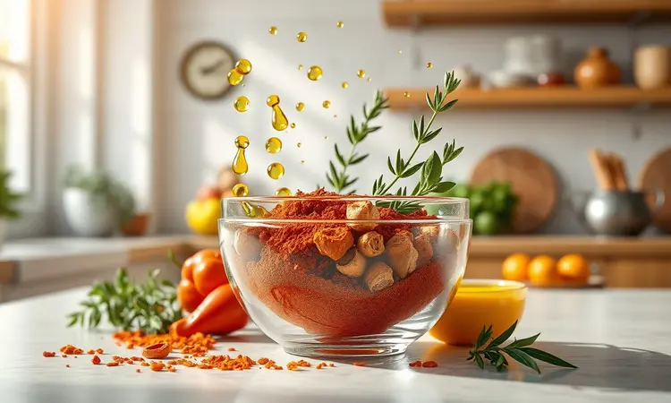
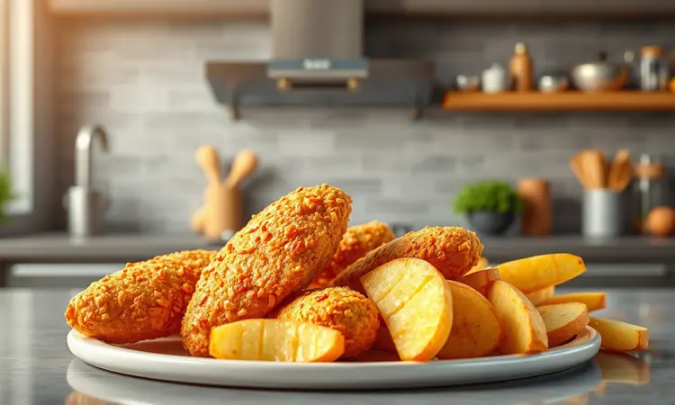
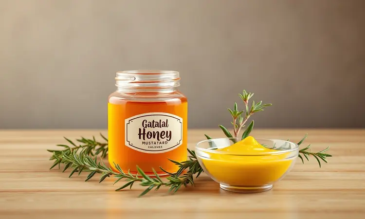

Preparar frango na air fryer parece simples, mas conseguir aquela pele dourada e ultra crocante sem ressecar a carne por dentro é um desafio que já frustrou muitos cozinheiros domésticos.

Se você já se decepcionou abrindo a air fryer e encontrando um frango pálido e borrachudo, respire fundo. Este guia foi feito justamente para transformar essas experiências em resultados que farão sua família pedir bis.

Vou revelar a técnica definitiva, desde a marinada poderosa que penetra na carne até o ajuste exato de temperatura que sela os sucos, garantindo que sua sobrecoxa de frango com batatas seja a estrela indiscutível do almoço.

Prepare-se para aprender como ingredientes simples se transformam em uma refeição digna de restaurante, com toda a praticidade da sua fritadeira sem óleo.

<SummaryList products={frontmatter.top_products} />

## Por que a Sobrecoxa é o Melhor Corte de Frango para a Air Fryer?

Imagine um corte de frango que praticamente cozinha sozinho, mantendo-se suculento por natureza enquanto a pele estoura em crocância. Esse é o poder da sobrecoxa.

Ao contrário do peito, que tende a ressecar com facilidade, a sobrecoxa possui mais gordura natural que age como uma barreira protetora durante o cozimento, garantindo que a umidade permaneça onde importa: dentro da carne.

E é justamente essa gordura que, ao entrar em contato com o ar quente circulante da air fryer, se transforma naquela camada dourada e crocante que todos amamos.

O resultado é uma combinação perfeita de praticidade e sabor intenso, onde a air fryer realça os temperos enquanto reduz drasticamente a necessidade de óleo, entregando tudo o que você ama no frango frito tradicional sem a culpa.

## Ingredientes Essenciais para uma Receita de Sucesso

A jornada para um frango perfeito começa com escolhas inteligentes. Comece com sobrecoxas frescas e bem limpas, o protagonista do seu prato.

O tempero básico é seu melhor aliado: sal, pimenta-do-reino moída na hora e alho picado formam a trindade que realça qualquer sabor.

Para levar a experiência a outro nível, considere marinadas com suco de limão ou iogurte natural, que trabalham para amaciar as fibras da carne profundamente.

Um fio de azeite de oliva não só ajuda a distribuir os temperos como é o segredo para uma crocância final uniforme. Se quiser surpreender, acrescente ervas como alecrim fresco ou tomilho, que liberam aromas incríveis durante o cozimento.

Com esses ingredientes, você tem todos os elementos para uma receita que impressiona.

## O Segredo da Marinada: Como Temperar para Máximo Sabor

Marinar não é apenas um passo a mais na receita, é o ritual que transforma um frango comum em uma experiência memorável.

A ciência por trás é simples: ingredientes ácidos como suco de limão, vinagre de maçã ou mesmo iogurte quebram suavemente as proteínas da carne, criando canais para que sabores como alho amassado, páprica defumada e ervas frescas penetrem profundamente.

Deixe as sobrecoxas descansando nesse banho de sabor por pelo menos 30 minutos, mas se tiver tempo, algumas horas na geladeira farão uma diferença perceptível.

O azeite na mistura não só ajuda a emulsionar os temperos como forma uma película protetora que mantém a suculência durante o cozimento intenso da air fryer. Esta é sua oportunidade de criar uma assinatura pessoal, ajustando os sabores ao seu palate.

## Passo a Passo: Sobrecoxa de Frango com Batatas na Air Fryer

Com os ingredientes preparados e o frango marinado, chegou a hora da mágica acontecer.

O processo é surpreendentemente simples: tempere generosamente as sobrecoxas, corte as batatas em pedaços uniformes, distribua tudo na cesta da air fryer já pré-aquecida e deixe o calor fazer seu trabalho por 25 a 30 minutos, virando na metade do tempo.

Parece básico, mas são os detalhes em cada etapa que separam o bom do extraordinário.

### Preparando o Frango e as Batatas (O Corte Ideal)

O segredo está nos detalhes antes mesmo do cozimento. Para as sobrecoxas, uma decisão importante: manter ou remover a pele. Manter resulta em um sabor e crocância incomparáveis, enquanto remover oferece uma opção mais leve.

Se optar por manter, seque bem a pele com papel toalha - essa etapa é crucial para conseguir a crocância perfeita. Quanto às batatas, cortá-las em cubos ou palitos de tamanho similar garante que todas terminem de cozinhar no mesmo momento.

Uma técnica profissional que faz diferença é deixá-las de molho em água fria por 30 minutos antes de secar bem.

Esse processo remove o excesso de amido da superfície, que é exatamente o que você precisa para conseguir aquela textura crocante por fora e macia por dentro quando assadas junto com o frango.

### Tempo e Temperatura: O Guia para Não Errar o Ponto

Aqui está onde muitos erram, mas você não vai. Pré-aqueça sua air fryer a 200°C - esse calor intenso inicial é fundamental para selar rapidamente a superfície do frango, mantendo todos os sucos presos dentro.

Distribua as sobrecoxas na cesta sem amontoar, garantindo que o ar quente circule livremente ao redor de cada peça. Programe 25 a 30 minutos de cozimento, mas o verdadeiro segredo acontece na metade do caminho: vire cada sobrecoxa cuidadosamente.

Esse movimento simples garante que todos os lados recebam aquela cor dourada uniforme. Para eliminar qualquer dúvida sobre o ponto ideal, a carne deve atingir 75°C internamente, temperatura que garante segurança alimentar completa sem sacrificar a suculência.

O resultado é um equilíbrio perfeito onde cada mordida oferece o contraste entre a pele crocante e a carne que derrete na boca.

## 5 Dicas Infalíveis para uma Pele Ultra Crocante

Conseguir aquela pele que estala ao toque do garfo é mais simples do que parece quando você conhece os truques certos. Primeiro, seque muito bem a pele com papel toalha antes de temperar - a umidade é inimiga da crocância.

Segundo, não tenha medo de usar sal generosamente na pele, ele ajuda a extrair a umidade residual e cria textura.

Terceiro, um leve toque de fermento em pó (apenas 1/2 colher de chá misturado aos temperos secos) altera o pH da pele e acelera o processo de douramento durante o cozimento.

Quarto, não amontoe as peças na cesta; o espaço entre elas permite que o ar quente circule e resseque a pele uniformemente.

Quinto e mais importante, termine os últimos 2-3 minutos em temperatura máxima (200°C ou mais se sua air fryer permitir) para dar aquele acabamento final perfeito.

## Melhores Modelos de Air Fryer para Assar Frango Inteiro ou em Pedaços

<ProductBox 
  title={frontmatter.top_products[0].title} 
  image={frontmatter.top_products[0].image} 
  link={frontmatter.top_products[0].link} 
/>

A escolha do equipamento pode transformar sua experiência na cozinha.

Para famílias ou quem gosta de preparar refeições completas de uma vez, modelos com capacidade a partir de 5 litros são ideais, acomodando confortavelmente um frango inteiro ou várias sobrecoxas com acompanhamentos.

Marcas como Philco e Mondial oferecem opções de até 12 litros que são verdadeiras aliadas para cozinhar para grupos maiores. A Elgin Chrome Fry, com seus 8 litros e cesto quadrado, otimiza cada centímetro de espaço para distribuir o calor de forma mais uniforme.

Uma inovação interessante são os modelos com espeto giratório, como a Dako Grandes Apetites, que imita o princípio do churrasco e garante que cada parte do frango receba calor igualmente, resultando em uma crocância perfeita em 360 graus.

Sim, equipamentos mais robustos exigem mais espaço de armazenamento, mas a versatilidade que proporcionam - desde assar um frango inteiro até preparar diversas camadas de alimentos simultaneamente - compensa o investimento.

Considere sua rotina de cozimento e o espaço disponível na bancada antes de decidir.

### Use um Termômetro de Carne para Suculência Perfeita

<ProductBox 
  title={frontmatter.top_products[1].title} 
  image={frontmatter.top_products[1].image} 
  link={frontmatter.top_products[1].link} 
/>

Abandonar as suposições e adotar a precisão é o que separa cozinheiros caseiros de verdadeiros entusiastas.

Um termômetro de carne digital é seu olho mágico dentro do frango, mostrando exatamente quando a carne atinge os 74°C internos que garantem segurança alimentar sem um segundo sequer de cozimento excessivo que ressecaria a carne.

Modelos digitais oferecem leitura instantânea, enquanto versões analógicas são praticamente indestrutíveis e não dependem de baterias.

Sim, um bom termômetro representa um investimento inicial, mas pense no que ele economiza: frustrações com frango secos, desperdício de ingredientes e, principalmente, a confiança de servir sempre um prato perfeito.

E lembre-se deste segredo profissional: a carne continua cozinhando com seu calor residual após sair da air fryer, então retire-a quando o termômetro marcar cerca de 2 graus abaixo da temperatura ideal.

Esses minutos de repouso finalizam o cozimento suavemente, distribuindo os sucos por toda a carne.

### Acessórios que Facilitam a Limpeza e o Preparo

<ProductBox 
  title={frontmatter.top_products[2].title} 
  image={frontmatter.top_products[2].image} 
  link={frontmatter.top_products[2].link} 
/>

Transformar sua air fryer em uma estação de cozinha completa é mais simples com os acessórios certos. Formas de silicone específicas para air fryer não só permitem assar bolos e tortas sem grudar como facilitam a limpeza posterior - basta enxaguar.

Grelhas em camadas multiplicam sua capacidade de cozimento, permitindo que você prepare o frango em um nível e legumes no outro simultaneamente.

Para quem detesta a tarefa de limpar o cesto após cozinhar alimentos gordurosos, os protetores descartáveis antiaderentes são uma revelação.

Eles criam uma barreira que mantém a sujeira longe do revestimento original, reduzindo a limpeza para uma simples remoção do papel. Embora alguns desses itens representem um custo adicional, eles ampliam dramaticamente o que você pode fazer com seu equipamento.

Apenas certifique-se de que todos os acessórios sejam compatíveis com sua air fryer específica para preservar o revestimento antiaderente e garantir que dure por anos.

### Pulverizador de Azeite: O Aliado da Crocância Saudável

<ProductBox 
  title={frontmatter.top_products[3].title} 
  image={frontmatter.top_products[3].image} 
  link={frontmatter.top_products[3].link} 
/>

Quantas vezes você já derramou azeite em excesso tentando garantir que cada pedaço de frango ficasse crocante? O pulverizador resolve esse dilema com elegância e eficiência.

Com alguns borrifos, você cobre uniformemente cada sobrecoxa com a finíssima camada de óleo necessária para transformar a pele em uma casca dourada e crocante, usando até 80% menos azeite do que o método tradicional.

Existem opções para todos os gostos: modelos em vidro que preservam o sabor puro do azeite, versões com bico duplo para borrifar e despejar conforme a necessidade, e até pulverizadores com bomba pressurizada para um controle ainda mais preciso.

Alguns requerem limpeza cuidadosa para manter os mecanismos funcionando perfeitamente, mas a economia em azeite e a consistência nos resultados tornam o esforço mínimo. É o tipo de acessório que, uma vez incorporado à sua rotina, você se pergunta como vivia sem ele.

## Erros Comuns que Deixam o Frango Seco ou Cru por Dentro

Conhecer os erros mais frequentes é sua vacina contra decepções culinárias. O principal deles é não descongelar completamente o frango antes de cozinhar - o centro gelado exige tanto calor para aquecer que o exterior inevitavelmente resseca.

Outro equívoco é subestimar o poder de secar bem a pele com papel toalha antes de temperar; a umidade na superfície cria vapor que impede a crocância. Ignorar o pré-aquecimento da air fryer é como colocar comida em um forno frio - o cozimento desigual é garantido.

Mas talvez o erro mais sutil seja o amontoamento. Quando as peças de frango se tocam na cesta, elas cozinham no vapor uma da outra em vez de no ar quente seco, resultando em uma textura borrachuda em vez de crocante.

Espaço é luxo na air fryer, e respeitar isso faz toda a diferença entre um frango perfeito e uma decepção.

## Variações: Sobrecoxa com Mel e Mostarda ou Ervas Finas

Por que se limitar ao básico quando você pode explorar um mundo de sabores? A combinação de mel e mostarda Dijon cria uma experiência que equilibra doçura e acidez em cada mordida, formando uma crosta caramelizada que é simplesmente viciante.

Misture duas colheres de mel para cada uma de mostarda, adicione um dente de alho amassado e deixe o frango marinar nessa glória por pelo menos uma hora.

Para os amantes de aromas herbais, uma mistura de ervas finas transforma o frango em algo que parece saído de uma cozinha mediterrânea. Combine orégano seco, tomilho fresco, alecrim picado e uma pitada de raspas de limão siciliano.

O contraste entre a crocância da pele e o frescor das ervas cria camadas de sabor que tornam cada refeição especial. Essas variações não apenas quebram a rotina como demonstram como um mesmo corte pode oferecer experiências completamente diferentes com ajustes simples.

## Perguntas Frequentes (FAQ) sobre Frango na Air Fryer

É normal ter dúvidas quando se explora um novo método de cozimento.

A mais comum é sobre a necessidade real da marinada: enquanto temperos secos entregam bom sabor, a marinada líquida penetra na carne, garantindo suculência mesmo se você exceder levemente o tempo de cozimento.

Outra dúvida frequente é quanto ao pré-aquecimento - sim, é essencial para que o frango comece a selar imediatamente ao entrar na air fryer.

Muitos perguntam sobre virar o frango: absolutamente necessário na metade do tempo para cor uniforme. E sobre congelados?

Podem ir direto para a air fryer, mas adicione 5-8 minutos ao tempo total e comece em temperatura ligeiramente mais baixa (180°C) por alguns minutos antes de aumentar para 200°C.

Essas pequenas adaptações fazem toda a diferença entre um resultado aceitável e um excepcional.

## Conclusão

Dominar a sobrecoxa de frango na air fryer é mais do que aprender uma receita; é adquirir a confiança para transformar ingredientes simples em experiências memoráveis à mesa.

Cada dica compartilhada - desde secar meticulosamente a pele até investir em um termômetro de qualidade - remove um degrau da escada entre a tentativa e a excelência.

Lembre-se que a air fryer é apenas uma ferramenta, mas o verdadeiro segredo está na atenção aos detalhes que você, cozinheiro doméstico, dedica a cada etapa.

Agora imagine a cena: o prato chega à mesa com aquele aroma inconfundível de frango dourado e ervas frescas, a pele estala ao ser cortada revelando uma carne suculenta que libera seus sucos. As batatas crocantes por fora e macias por dentro completam a harmonia.

Esta não é apenas uma refeição; é a confirmação de que cozinhar bem está ao alcance de suas mãos, todos os dias. Comece pelas sobrecoxas, experimente as variações, ajuste os tempos ao seu gosto pessoal e, acima de tudo, compartilhe esses momentos com quem você ama.

Sua air fryer está esperando para se tornar sua aliada em incontáveis almoços e jantares especiais. O primeiro passo é escolher suas sobrecoxas e dar início a essa transformação - seu próximo prato perfeito está a apenas 30 minutos de distância.