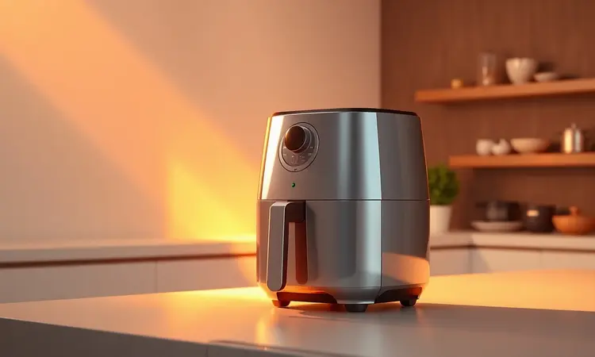
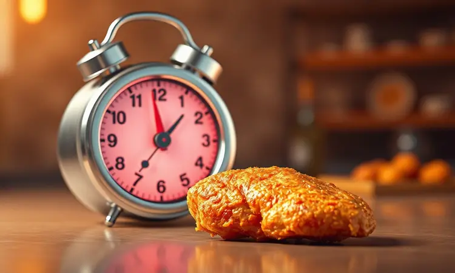
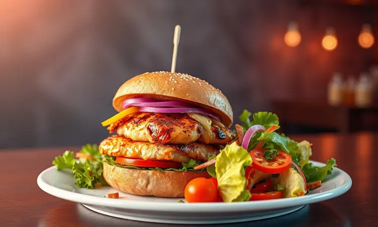
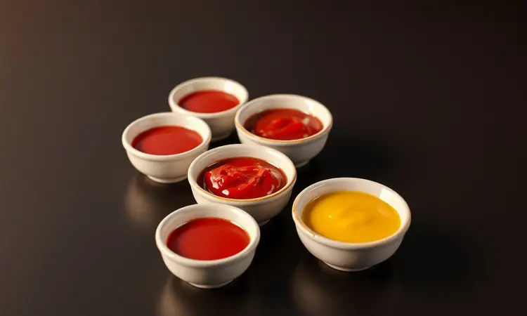

Quantas vezes você já abriu a geladeira, viu aquele steak congelado e pensou 'vai ficar uma borracha no micro-ondas'? Ou pior, se resignou a sujar a cozinha toda com óleo só por um pedaço de frango crocante?

Existe uma terceira via que poucos exploram: a airfryer não só promete praticidade como entrega o mesmo prazer de uma lanchonete, direto na sua bancada.

Neste guia, vou te levar além da receita básica - mostrarei como transformar o produto mais simples num banquete que engana até quem cozinha profissionalmente, mantendo a suculência como seu segredo principal.

<SummaryList products={frontmatter.top_products} />

## Por que Preparar Steak de Frango na Airfryer é a Melhor Opção?

Imagine terminar o dia com vontade de algo rápido, mas sem abrir mão da textura. A airfryer faz mágica aqui: ela cria a mesma sensação crocante da fritura, só que com uma fração da gordura que você usaria normalmente.

O segredo está na circulação de ar intensa que envolve o alimento por completo, garantindo que cada centímetro fique igualmente dourado, sem aquelas manchas pálidas que acontecem na frigideira.

Além disso, perceba o tempo que você ganha não só no preparo, mas principalmente na limpeza. Enquanto o frango cozinha sozinho, você pode montar o resto do prato ou simplesmente relaxar. Não há óleo respingando, nem panelas para deixar de molho.

A praticidade aqui é real, não apenas promessa de comerciais.

## Como Fazer Steak de Frango Congelado na Airfryer (Passo a Passo)

Retire o steak diretamente do freezer - sem precisa descongelar, essa é a beleza. Pré-aqueça sua airfryer a 200°C por 3 minutos (se seu modelo permitir), depois distribua os filés em uma única camada no cesto. O ar precisa circular livremente, então não amontoe.

Deixe por 15 minutos, vire com cuidado na metade do tempo, e mais 5 minutos finalizam o trabalho. O resultado? Uma crosta dourada que estala ao cortar, com o interior mantendo os sucos.

### Tempo e Temperatura Ideal: A Regra de Ouro

Esses números são seu ponto de partida seguro: 200°C por 15 a 20 minutos. Mas entenda o porquê. A temperatura alta sela rapidamente a superfície, trancando a umidade dentro antes que ela escape.

Os 15 minutos iniciais criam a crosta, enquanto os 5 minutos extras (para peças mais grossas) garantem que o calor penetre completamente sem ressecar.

A virada no meio do caminho não é apenas ritual - ela evita que o lado de baixo fique úmido pela condensação natural. Se quiser precisão cirúrgica, um termômetro de cozinha confirmará os 75°C internos, temperatura onde qualquer bactéria se rende mas a maciez permanece.

## 5 Segredos para o Steak não Ficar Seco ou Duro

Acertar a temperatura é metade da batalha. A outra metade está nestes detalhes que transformam o bom em excepcional:

1. **A paciência da marinada**: Mesmo 30 minutos em temperos líquidos (limão, azeite, alho) fazem diferença abissal. A acidez amacia as fibras, criando uma textura que praticamente dissolve na boca.

2. **O toque do descanso**: Assim como sair do forno, retire o steak da airfryer e deixe descansar 2 minutos antes de cortar. Isso redistribui os sucos que fugiram para as extremidades durante o cozimento.

3. **Espessura inteligente**: Se estiver preparando caseiro, mantenha os filés com pelo menos 1,5cm de grossura. Mais fino que isso, o calor não tem tempo de criar crosta antes de secar o interior.

4. **O pulverizador de azeite**: Este pequeno aliado merece atenção especial.

### Use um Pulverizador de Azeite para Extra Crocância

<ProductBox 
  title={frontmatter.top_products[0].title} 
  image={frontmatter.top_products[0].image} 
  link={frontmatter.top_products[0].link} 
/>

Um borrifador comum de cozinha já muda completamente o jogo. Em vez de regar o frango com óleo (o que cria poças e deixa partes encharcadas), uma névoa fina e uniforme cobre toda a superfície.

Cada gotinha se transforma em ponto de caramelização, criando uma rede de crocância que envolve completamente o steak.

Disponível em versões de vidro ou aço por preços acessíveis, seu único 'defeito' é exigir algumas bombadas manuais. Mas quando você vê aquele brilho dourado uniforme, sem áreas pálidas, percebe que vale cada esforço.

É a diferença entre 'frito na airfryer' e 'parece que veio de um restaurante'.

5. **A ordem dos fatores**: Tempere, borrife óleo, só então coloque na airfryer. O contrário - óleo primeiro - faz os temperos escorrerem.

## Variação Saudável: Filé de Frango Empanado Caseiro na Airfryer

Agora que você domina o básico, que tal elevar o nível? O empanado caseiro na airfryer é onde mágica acontece: todos s acham que você fritou, mas apenas você sabe o segredo. Comece com os filés temperados (sal, pimenta e um toque de paprika para cor).

Passe na farinha, depois no ovo batido e finalmente na farinha de rosca misturada com suas especiarias favoritas - queijo parmesão ralado fino funciona maravilhas.

Aqui, a airfryer a 200°C por 12-15 minutos cria uma casquinha que estala ao morder, mas mantém o interior incrivelmente úmido. O ar quente circula por todos os lados do empanado, cozinhando-o uniformemente sem a necessidade de virar constantemente como na frigideira.

## Melhores Modelos de Airfryer para Receitas Rápidas

<ProductBox 
  title={frontmatter.top_products[1].title} 
  image={frontmatter.top_products[1].image} 
  link={frontmatter.top_products[1].link} 
/>

Escolher sua companheira de cozinha é pessoal, mas algumas características fazem diferença real no dia a dia.

A Philips Walita com sua tecnologia Rapid Air garante que o calor atinja até os cantos mais escondidos do cesto, perfeita para quando você coloca vários steaks de uma vez.

Modelos como a Mondial Air Fryer Oven oferecem versatilidade extra - além do cesto tradicional, incluem grelhas e espetos, ideal para quem gosta de variar o cardápio sem acumular eletrodomésticos.

Já a Oster Multi Touch impressiona pelo controle digital preciso, onde você ajusta temperatura e tempo com toques suaves, quase como programar um encontro perfeito com seu jantar.

O espaço na bancada realmente importa, mas pense nisso como investir em um atalho que economiza tempo toda semana, não apenas hoje.

## Ideias de Acompanhamento: Do Sanduíche ao Prato Executivo

Um steak perfeito pede companhias à altura. Para uma refeição rápida, fatias de abacate, tomate e maionese caseira entre pães levemente tostados criam um sanduíche que rivaliza com qualquer lanchonete gourmet.

Se o momento pede algo mais elaborado, uma cama de quinoa ou arroz integral com legumes assados (na própria airfryer, enquanto o frango descansa) transforma o simples em prato de restaurante.

### Melhores Molhos para Servir com seu Steak

O molho é o abraço final que completa a experiência. Para manter a linha saudável, misture iogurte natural com suco de limão, hortelã picada e um fio de azeite - a cremosidade corta a crocância de forma sublime.

Se quiser ousadia, um chimichurri caseiro (salsa, orégano, alho, vinagre e pimenta) traz a personalidade que falta em molhos prontos.

E para os clássicos, reduza molho barbecue com um pouco de mel na airfryer por 5 minutos - fica espesso, caramelizado e com profundidade.

## Perguntas Frequentes (FAQ)

### Precisa preaquecer a Airfryer?

Funciona das duas formas, mas o pré-aquecimento (2-3 minutos a 200°C) garante que o steak comece a selar imediatamente ao entrar. Sem ele, os primeiros minutos são de aquecimento gradual, o que pode liberar um pouco mais de umidade antes da crosta se formar.

### Posso colocar um steak em cima do outro?

Evite. A circulação de ar precisa envolver cada peça completamente. Sobreposições criam pontos de vapor que amolecem a crosta e deixam áreas mal cozidas. Se precisar fazer quantidade maior, cozinhe em lotes - o tempo extra vale pela qualidade.

### O steak de frango Sadia ou Perdigão fica bom na Airfryer?

Excelentes opções de conveniência. Seguindo os mesmos parâmetros (200°C, 15-20 minutos, virada no meio), eles desenvolvem crosta uniforme. Como já vêm temperados, atenção extra ao sal no acompanhamento.

## Conclusão

Preparar steak de frango na airfryer vai além de substituir a fritura - é redescobrir como fazer comida rápida sem sentir que está se traindo com qualidade inferior.

A crocância que estala, o interior que mantém seus sucos, a praticidade de limpar apenas um cesto lavável... tudo converge para uma experiência que reconcilia o desejo por conforto com o cuidado com sua rotina e saúde.

Comece com o básico: steak congelado direto do freezer, 200°C, 20 minutos com virada no meio. Depois, conforme ganha confiança, experimente as variações - o empanado caseiro, os diferentes temperos, os molhos que transformam.

Cada tentativa revela uma nova faceta desse eletrodoméstico que, nas mãos certas, deixa de ser gadget para se tornar extensão natural da sua criatividade na cozinha. Qual será sua primeira combinação?