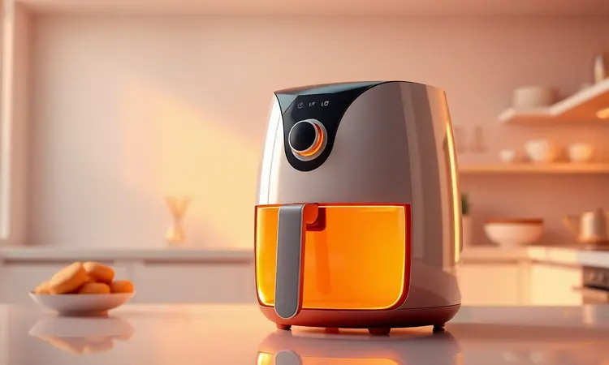
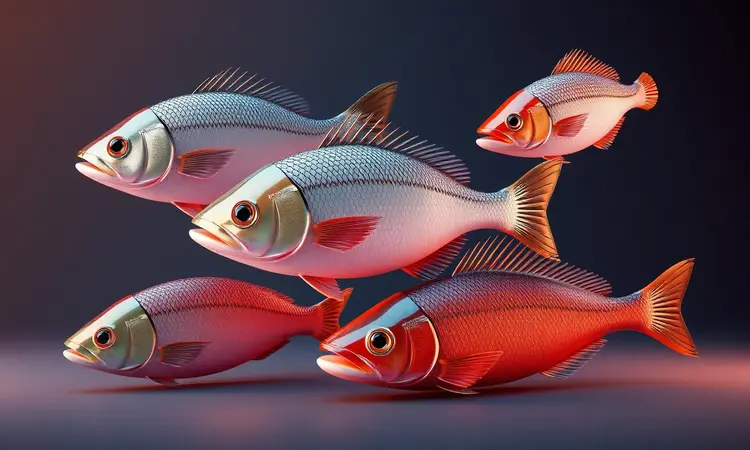
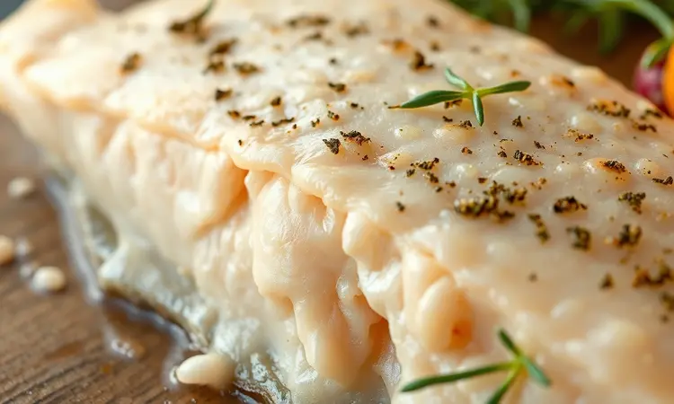
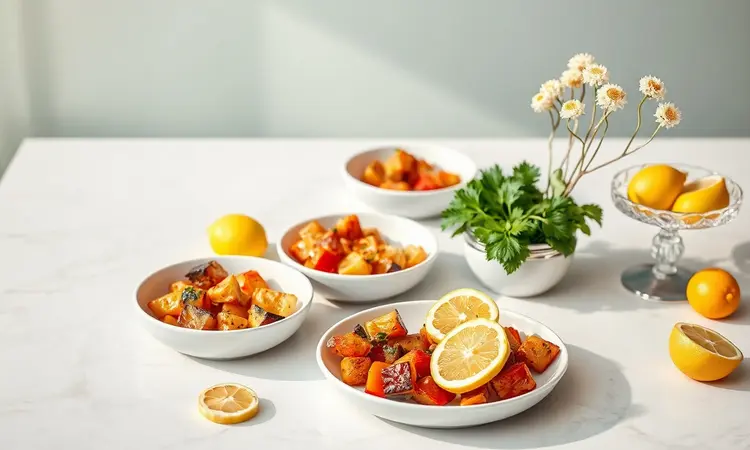

Já imaginou acabar com a louça engordurada das frituras ou evitar aquela sensação de peixe ressecado do forno? Existe uma solução que transforma sua relação com frutos do mar.

Preparar filé de peixe na airfryer é a revelação que você precisava: rápido, saudável e com um sabor que rivaliza com os melhores restaurantes. Neste guia, vamos muito além da receita básica.

Você vai descobrir os segredos dos chefs para garantir a crocância perfeita e a suculência que derrete na boca. Prepare-se para reinventar como cozinha peixe na sua casa.

<SummaryList products={frontmatter.top_products} />

## Por que Preparar Filé de Peixe na Airfryer é a Melhor Opção?

Imagine sair da cozinha sem aquela sensação oleira nas mãos, nem o cheiro que impregna na roupa. A airfryer conquista você de três formas. Primeiro, ela entrega algo quase mágico: um exterior dourado e crocante enquanto mantém o interior incrivelmente macio e úmido.

Segundo, troca litros de óleo por apenas um leve spray, transformando uma refeição que antes pesava na consciência em algo que você saboreia sem culpa. Terceiro, ela libera seu tempo.

Em 15 minutos você tem um prato pronto, e a limpeza é tão fácil quanto lavar uma tigela. É praticidade que transforma o peixe de uma refeição especial para algo que faz parte do seu cardápio semanal.

## Como Escolher o Melhor Peixe: Tilápia, Merluza ou Salmão?

Agora, qual peixe escolher para essa aventura? Cada um tem sua personalidade. A tilápia é sua aliada do dia a dia: carne branca, sabor suave que absorve qualquer tempero como uma tela em branco para sua criatividade.

A merluza traz uma textura mais firme, perfeita para quem gosta daquele "mordida" satisfatória e busca uma refeição nutritiva que realmente sacia. Já o salmão é o sofisticado do grupo. Rico em ômega-3, tem um sabor marcante que pede poucos acompanhamentos para brilhar.

A escolha depende do momento: tilápia para o almoço rápido, merluza para o jantar em família, salmão para impressionar.

## O Segredo do Tempero Perfeito para Peixes Brancos

Peixes brancos como tilápia e merluza são como atores que precisam de um bom diretor. O tempero é esse diretor.

Comece com o básico infalível: sal marinho para realçar os sabores naturais, pimenta-do-reino moída na hora para um toque caloroso, alho fresco (não em pó) que acaricia o paladar, e limão espremido na hora que não apenas tempera, mas derrete suavemente as fibras da carne.

Para elevar ao nível restaurante, acrescente ervas frescas. Dill (endro) é o casamento perfeito com peixe, trazendo uma frescura herbácea. Salsinha picada fininha adiciona cor e um sutil toque terroso. Lembre-se: menos é mais.

Deixe o peixe respirar e os temperos conversarem entre si.

## Receita Passo a Passo: Filé de Tilápia na Airfryer Suculento

Vamos à prática com a tilápia, a mais versátil de todas. A proposta é simples: em 15 minutos, você terá um filé dourado, crocante por fora e que se desfaz em lascas suculentas ao garfo.

### Ingredientes Necessários para o Preparo Perfeito

Para dois filés generosos, você precisa de apenas alguns itens: 2 filés de tilápia frescos (cerca de 200g cada), 1 colher de chá de sal marinho, meia colher de chá de pimenta-do-reino moída na hora, 2 dentes de alho amassados, suco de meio limão, 1 colher de sopa de azeite de oliva extra virgem, e um punhado de salsinha ou dill fresco picado.

Opcional para crocância extra: 2 colheres de sopa de farinha panko para uma camada mais texturizada.

### Modo de Preparo Detalhado em Poucos Minutos

Comece secando muito bem os filés com papel toalha. A umidade superficial é o inimigo da crocância. Em uma tigela, misture o azeite, suco de limão, alho amassado, sal e pimenta.

Pincele generosamente essa marinada sobre os dois lados dos filés e deixe descansar por 10 minutos. Esse breve repouso permite que os sabores penetrem. Enquanto isso, preaqueça sua airfryer a 200°C por 3 minutos.

Coloque os filés na cesta sem se sobreporem. Se usar o panko, polvilhe agora sobre a superfície. Cozinhe por 8 minutos. Na metade do tempo (após 4 minutos), abra cuidadosamente e vire os filés com uma espátula de silicone. Esta virada é crucial para o dourado uniforme.

Complete os 4 minutos restantes. Quando pronto, o peixe estará opaco por inteiro e se lascará facilmente com o garfo. Sirva imediatamente com fatias de limão e as ervas frescas por cima.

### Utensílios que Facilitam sua Vida na Cozinha

<ProductBox 
  title={frontmatter.top_products[0].title} 
  image={frontmatter.top_products[0].image} 
  link={frontmatter.top_products[0].link} 
/>

Para transformar essa receita em ritual, alguns utensílios fazem diferença. Tenha uma pinça de silicone longa para virar o peixe sem perfurá-lo. Uma espátula fina de silicone ajuda a desgrudar com delicadeza se necessário.

Para medir seus ingredientes rapidamente, jogueiros medidores economizam tempo. E o mais importante: se sua airfryer não tiver cesta antiaderente, invista em uma folha de papel manteiga redonda ou um tapete de silicone reutilizável específico para airfryer.

Esses pequenos aliados transformam o preparo de peixe de uma tarefa para um prazer culinário.

## 3 Truques Infalíveis para o Peixe Não Ficar Seco ou Borrachudo

O maior medo ao cozinhar peixe na airfryer é exagerar e obter uma solado de borracha. Estas três estratégias eliminam esse risco.

Primeiro: nunca subestime o poder de secar. Antes de qualquer tempero, pressione papel toalha firmemente sobre toda a superfície do filé, inclusive nas laterais.

A umidade exterior evapora rapidamente no calor intenso, criando uma barreira que impede que os sucos internos escapem.

Segundo: conheça a regra do dedo. Para filés de 2cm de espessura (o padrão), 8-10 minutos a 200°C é o ponto ideal. Peixe mais fino reduz para 6-7 minutos.

Em vez de seguir cegamente o tempo, faça o teste do garfo após o mínimo recomendado: se as lascas se separam com facilidade, está pronto.

Terceiro: o óleo certo no momento certo. Um leve spray de azeite em spray APÓS o pré-aquecimento, diretamente sobre o peixe já temperado e seco, cria uma fina película protetora. Isso incentiva o douramento sem gerar vapor excessivo que cozinha demais o interior.

## Como Fazer Peixe Empanado na Airfryer: Dicas de Crocância Extrema

Para quem ama a crocância da empanadura sem a gordura da fritura, a airfryer é uma revelação. O segredo está em três camadas distintas. Na primeira tigela, farinha de trigo temperada com sal e páprica.

Na segunda, ovo batido com uma colher de água (a água torna a empanadura mais leve). Na terceira, farinha panko, que cria uma textura extraordinariamente crocante e areada, superior à farinha de rosca tradicional.

Passe cada filé seco pela farinha (sacuda o excesso), depois pelo ovo (deixe escorrer), e finalmente pressione no panko para aderir bem. Pré-aqueça a airfryer a 200°C por 5 minutos. Coloque os filés empanados sem tocar-se.

Borrife leve spray de azeite sobre a superfície. Cozinhe por 10 minutos, virando na metade do tempo e borrifando novamente o lado virado. O resultado é uma crocância que estala ao cortar, revelando um interior perfeitamente cozido.

## Como Evitar que o Peixe Grude no Cesto da Airfryer

<ProductBox 
  title={frontmatter.top_products[1].title} 
  image={frontmatter.top_products[1].image} 
  link={frontmatter.top_products[1].link} 
/>

Nada mais frustrante que perder parte do dourado perfeito porque o peixe grudou. A solução combina prevenção e técnica. Sempre, sempre pré-aqueça.

Esses 3-5 minutos a 200°C fazem com que o metal da cesta atinja temperatura uniforme, selando instantaneamente o peixe ao contato.

Para peixes delicados ou empanados, use um forro. Papel manteiga perfurado em vários pontos com palito permite a circulação de ar enquanto protege. Tapetes de silicone específicos para airfryer são reutilizáveis e antiaderentes por natureza.

O azeite aplicado diretamente no peixe, não na cesta, é mais eficiente. E o espaço é fundamental. Se os filés se tocarem, criam vapor que os "cola". Deixe pelo menos 1cm entre eles.

Por fim, a paciência ao desenformar. Após o cozimento, desligue a airfryer e deixe o peixe descansar na cesta por 1 minuto. Essa breve pausa permite que ele se solte naturalmente.

Use uma espátula fina de silicone, começando pelas pontas, deslizando suavemente por baixo.

## Tabela de Tempo e Temperatura por Tipo de Corte de Peixe

Considere esta tabela seu mapa do tesouro para nunca errar. Anote ou salve em seus favoritos:

- **Tilápia (filé de 2cm)**: 200°C | 8-10 minutos | Viro no meio

- **Merluza (filé de 2cm)**: 200°C | 9-11 minutos | Viro no meio

- **Salmão (filé de 2.5cm)**: 190°C | 7-9 minutos | Não viro (para manter a pele crocante)

- **Peixe empanado (qualquer tipo)**: 200°C | 10-12 minutos | Viro no meio

- **Peixe congelado (sem descongelar)**: 200°C | 12-15 minutos | Viro no meio

Esses tempos são para airfryers de 1500W a 1800W. Para modelos menos potentes, adicione 1-2 minutos. A melhor confirmação é sempre o teste do garfo.

## Melhores Modelos de Airfryer para Preparar Peixes e Carnes

<ProductBox 
  title={frontmatter.top_products[2].title} 
  image={frontmatter.top_products[2].image} 
  link={frontmatter.top_products[2].link} 
/>

Se está investindo ou atualizando seu equipamento, alguns modelos se destacam para proteínas. A Philips Walita Airfryer Essential XL Conectada tem um controle de temperatura excepcionalmente preciso, crucial para peixes sensíveis.

Sua função "manter aquecido" é um salva-vidas quando precisa coordenar vários pratos.

A Cosori AirFryer Premium II Chef Edition oferece programas pré-definidos incluindo um específico para peixe, tirando as adivinhações do processo. Para famílias maiores, a Midea GrandGourmet 5,5L tem espaço generoso para múltiplos filés sem aglomerar.

A Oster OFRT590 impressiona pela potência que reduz tempos de cozimento, mantendo a suculência. Para orçamento mais apertado, a Mondial Family AFN-40-BI entrega resultados consistentes com timer e controle manual simples e eficaz.

## Melhores Acompanhamentos para Servir com Peixe Assado

Um grande peixe merece grandes acompanhamentos. Para algo cremoso que contrasta com a crocância, purê de batata baroa (mandioquinha) com um fio de azeite trufado.

Para leveza e frescor, uma salada de grãos com quinoa, pepino em cubos, hortelã e molho de iogurte grego com limão. Para um contraste de texturas, aspargos grelhados na própria airfryer por 6 minutos com sal grosso.

Para um toque doce que complementa peixes como salmão, cenoura baby com mel e alecrim, também assadas junto. Ou simplesmente arroz branco soltinho com muito cheiro-verde, o clássico que nunca falha.

## Perguntas Frequentes (FAQ) sobre Peixe na Airfryer

As dúvidas mais comuns surgem na prática, e estas respostas resolvem 90% dos problemas.

### Pode colocar peixe congelado direto na airfryer?

Sim, e é um dos superpoderes do aparelho. O peixe congelado vai direto para a cesta pré-aquecida. A grande diferença é o tempo: adicione 4-5 minutos ao tempo normal.

A vantagem é dupla: evita a perda de suco que acontece no descongelamento à temperatura ambiente, e a crocância fica ainda mais pronunciada porque o exterior seca rapidamente enquanto o interior descongela e cozinha gradualmente.

### Quanto tempo o peixe precisa ficar na airfryer para não passar do ponto?

A regra de ouro são 4 minutos por centímetro de espessura a 200°C. Para um filé de 2cm, comece com 8 minutos. Abra, verifique com o garfo. Se ainda oferece resistência, adicione 1 minuto por vez, nunca mais.

Lembre-se: o peixe continua cozinhando pelo calor residual após sair da airfryer. Por isso, é melhor retirar quando ainda está "quase pronto", ele termina no prato. O sinal visual: quando o peixe perde o aspecto translúcido e fica completamente opaco, está no ponto.

## Conclusão

Preparar filé de peixe na airfryer é mais do que uma técnica de cozimento. É um convite para reimaginar seus hábitos na cozinha. Você troca a expectativa por uma tarefa complicada pela certeza de um resultado incrível em minutos.

Troca a culpa de uma fritura pesada pelo prazer limpo de uma refeição nutritiva. E troca a rotina monótona por uma infinidade de possibilidades com diferentes peixes, temperos e acompanhamentos.

O que começa como curiosidade rapidamente se transforma em um hábito semanal. A tilápia crocante de terça-feira, o salmão com ervas para impressionar no jantar de sexta, a merluza empanada que as crianças adoram no sábado.

Cada preparo acumula confiança, cada prato bem-sucedido expande seu repertório. A airfryer não é apenas um eletrodoméstico, é seu parceiro para criar memórias à mesa com mais saúde e menos esforço.

Portanto, pegue seus filés favoritos, pré-aqueça seu aparelho, e dê o primeiro passo para transformar sua relação com o peixe. Sua próxima refeição gourmet está a apenas 15 minutos de distância.