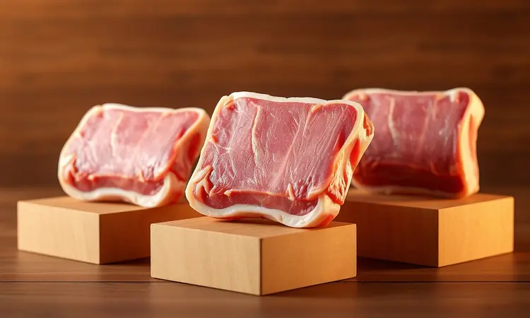
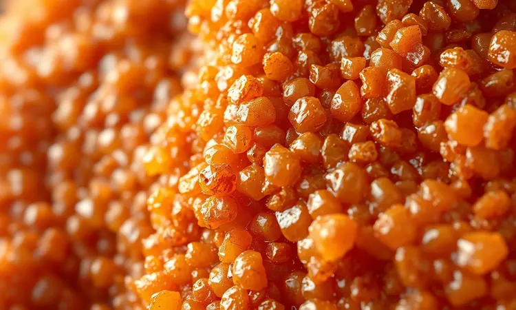

Você ama torresmo, mas evita fazer em casa por causa da sujeira de óleo espalhada por toda a cozinha? Você não está sozinho. A boa notícia é que é totalmente possível conseguir aquele resultado digno de boteco usando apenas a tecnologia da sua fritadeira elétrica.

Neste guia definitivo, eu vou te mostrar não apenas uma receita, mas a técnica exata para garantir um torresmo na air fryer extremamente crocante, sequinho e com aquela pururuca perfeita.

Prepare-se para dominar o tempo, a temperatura e os segredos que os chefs não contam para transformar uma simples barriga de porco em um petisco inesquecível.

<SummaryList products={frontmatter.top_products} />

## Por que fazer Torresmo na Air Fryer é a melhor escolha?

Imagine sair de casa sem o carregador e trabalhar o dia todo sem aquela ansiedade de ver o ícone da bateria ficando vermelho. Essa mesma sensação de liberdade você conquista quando prepara torresmo na air fryer.

A bagunça desaparece, o risco de acidentes diminui drasticamente e você ainda obtém um resultado mais saudável, com menos óleo impregnando cada pedaço.

A crocância é garantida porque o ar circula uniformemente, criando uma casquinha perfeita em todos os cubos. O tempo de preparo também é uma vantagem: em minutos você tem um petisco pronto, sem precisar monitorar uma panela cheia de óleo.

É a escolha inteligente para quem quer aproveitar essa iguaria sem culpa, mas com toda a praticidade do dia a dia.

## Escolhendo a Carne Certa: Toucinho, Barriga ou Panceta?

Na hora de fazer torresmo, a escolha da carne é como selecionar a protagonista de uma história. Cada uma tem sua personalidade:

- **O toucinho** é o especialista em crocância, focando quase exclusivamente na pururuca.

- **A barriga** é mais equilibrada, oferecendo carne saborosa junto com a casquinha.

- **A panceta** é a versatil, com um equilíbrio perfeito que promete resultados incríveis.

O que você vai preferir depende do que deseja sentir: uma experiência focada na textura ou um petisco mais completo?

### O Corte Ideal: Espessura e Tamanho dos Cubos

<ProductBox 
  title={frontmatter.top_products[0].title} 
  image={frontmatter.top_products[0].image} 
  link={frontmatter.top_products[0].link} 
/>

Mas a escolha da carne só vale se você também prestar atenção ao corte. Cubos com aproximadamente 3 cm de espessura não são apenas uma medida matemática: são a proporção perfeita onde cada pedacinho guarda uma combinação de crocância, maciez e sabor.

Essa dimensão garante que a carne, a gordura e a pele trabalham juntas durante o cozimento. Antes de temperar, passe um papel toalha para secar bem os cubos. Essa etapa simples remove a umidade superficial e é o primeiro passo para conquistar a pururuca.

## Receita de Torresmo na Air Fryer: O Passo a Passo Infalível

<ProductBox 
  title={frontmatter.top_products[1].title} 
  image={frontmatter.top_products[1].image} 
  link={frontmatter.top_products[1].link} 
/>

Vamos transformar teoria em prática. Este método elimina tentativas frustradas e garante resultados consistentes.

### Ingredientes e Temperos Essenciais

Comece com 500g a 1kg de barriga de porco ou toucinho. Os temperos essenciais são o sal e a pimenta-do-reino, que realçam o sabor natural. Para dar um toque especial, você pode adicionar alho em pó ou cominho.

Se desejar um sabor mais intenso, marinadas como limão ou vinagre podem ser utilizadas antes do cozimento, ajudando a deixar a carne mais macia.

### Modo de Preparo: Da Preparação ao Clique do Timer

1. **Prepare a carne:** Corte em cubos de 3 cm e tempere com suas escolhas.

2. **Marine:** Deixe por 20 a 30 minutos para os temperos penetrar.

3. **Pré-aqueça:** Coloque sua air fryer em 200°C por 3-5 minutos. Não é um número aleatório; é o ponto onde o calor penetra fundo na pele sem ressecar a carne.

4. **Distribua:** Coloque os cubos na cesta sem sobrepor. Isso garante que cada um receba calor igual.

5. **Cozinhe:** Programe 25-30 minutos a 200°C.

6. **Monitore:** Agite a cesta a cada 10-15 minutos para uniformizar o processo.

7. **Retire a gordura:** Entre os ciclos, retire o excesso de gordura acumulado.

## O Segredo da Pururuca: Como Garantir a Crocância Máxima

A pururuca perfeita não é magia; é técnica. O segredo está na preparação adequada da pele: escolha uma peça com bastante camada de gordura e pele. Corte a pele em quadrados e faça pequenos furos com uma faca.

Isso não é apenas um detalhe; é o canal onde a gordura derrete e cria as bolhas que você ama.

Tempere a gosto, mas evite usar muito líquido. O pré-aquecimento é crucial para garantir um calor uniforme desde o primeiro momento. Cozinhe em temperatura alta e você terá aquela casquinha que estala ao primeiro bite, derretendo na boca.

## 3 Erros Comuns que Deixam o Torresmo Borrachudo (e como evitá-los)

1. **Não secar a pele:** A umidade excessiva é a inimiga da crocância. A pele molhada impede a pururuca de formar. Solução: papel toalha é seu melhor aliado.

2. **Temperatura muito baixa:** Cozinhar abaixo do ideal resulta em textura borrachuda. Solução: pré-aqueça e mantenha 200°C.

3. **Cortes grandes:** Pedaços grandes demoram mais para pururucar, aumentando o risco de borracha. Solução: cubos de 3 cm são o tamanho ideal.

Seguindo essas dicas, você elimina o risco do torresmo borrachudo e garante apenas crocância.

## Dicas de Segurança e Limpeza: Como Lidar com a Gordura Extra

<ProductBox 
  title={frontmatter.top_products[2].title} 
  image={frontmatter.top_products[2].image} 
  link={frontmatter.top_products[2].link} 
/>

A gordura liberada durante o cozimento é parte do processo, mas precisa de atenção. Após cada uso, remova as sobras enquanto as peças ainda estão mornas. Use papel toalha para facilitar.

Para uma limpeza mais profunda, deixe a gaveta de molho em água morna com detergente por 10-15 minutos. Evite produtos abrasivos, que podem danificar o revestimento. Uma mistura de bicarbonato de sódio ajuda a soltar a gordura mais difícil.

Sempre desligue o aparelho e deixe esfriar antes de começar a limpeza. Este ritual não é uma obrigação; é o cuidado que garante que sua próxima receita tenha o mesmo resultado perfeito, sem interferências.

## Variações de Sabor: Do Tradicional ao Toque de Cachaça e Limão

O torresmo clássico com sal e pimenta continua sendo uma opção amada, mas as variações são onde a criatividade brilha.

Experimente um toque de cachaça e limão: essa combinação traz um sabor único e refrescante, com um leve toque cítrico que contrasta perfeitamente com a crocância.

Outras opções incluem ervas finas ou temperos defumados. Cada variação permite que você crie sua própria receita personalizada e surpreenda com sabores inesperados.

## Perguntas Frequentes (FAQ)

### Quanto tempo o torresmo deve ficar na air fryer?

O tempo varia entre 25 a 30 minutos a 200°C, dependendo da espessura da carne e da potência do seu aparelho. O segredo é virar os cubos na metade do tempo para garantir uma crocância uniforme.

Cada modelo pode aquecer de forma diferente, então fique atento e ajuste conforme necessário. Verifique a textura ao final do tempo recomendado para obter aquela pururuca perfeita.

### Precisa preaquecer a air fryer antes de colocar a carne?

Sim, o pré-aquecimento é uma etapa que faz diferença. Ao pré-aquecer por 3 a 5 minutos, você garante que a temperatura interna atinha rapidamente o nível ideal para uma cocção uniforme.

Isso ajuda a obter um torresmo mais crocante porque o calor intenso sela a carne rapidamente. Use essa dica para elevar sua receita e garantir aquela casquinha irresistível.

### Como guardar o torresmo para não murchar?

Para manter a crocância, armazene em um recipiente hermético apenas quando o torresmo estiver completamente frio. A umidade acumulada de resfriamento inadequado pode afetar a textura. Coloque um papel toalha no fundo do recipiente para absorver qualquer excesso.

Evite refrigerar se possível, pois isso também pode comprometer a textura. Assim, você mantém aquela crocância que conquistou.

## Conclusão: O Petisco Perfeito com Zero Sujeira

Preparar torresmo na air fryer transforma um petisco tradicional em uma experiência moderna, limpa e satisfatória. Você conquista aquela pururuca perfeita sem enfrentar a bagunça do óleo espalhado ou o risco de frituras profundas.

O processo respeita tanto seu desejo por sabor quanto sua preocupação com saúde e praticidade.

Ao seguir este guia, você não apenas reproduz uma receita, mas domina uma técnica que garante resultados consistentes. Cada cubo crocante representa a liberdade de comer algo que ama sem as complicações do método tradicional.

Experimente, adapte com suas variações de sabor e descubra como transformar uma simples barriga de porco em um momento memorável. Sua próxima experiência com torresmo está esperando para ser mais crocante, mais limpa e mais satisfatória do que nunca.