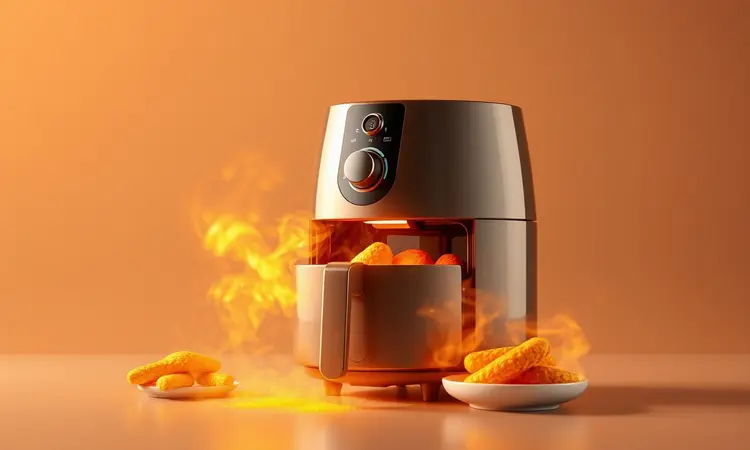
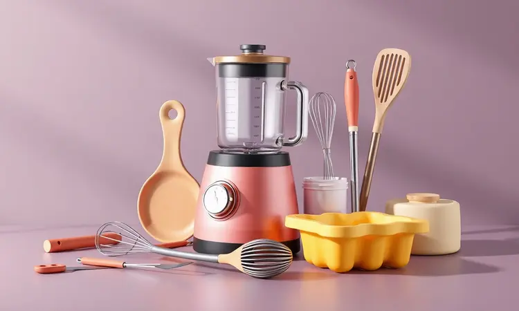
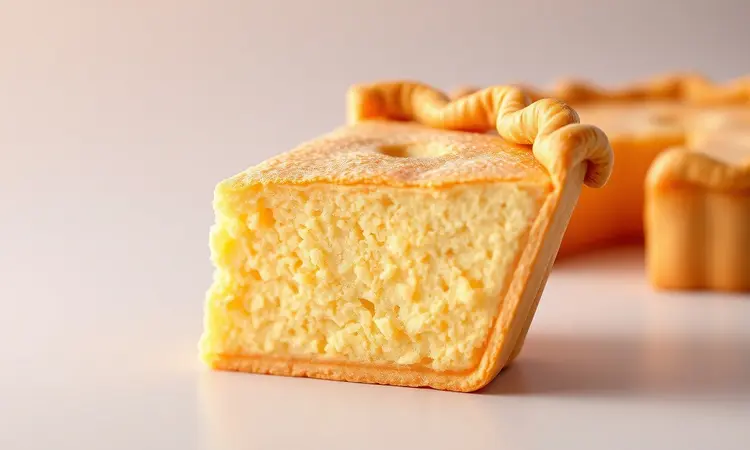
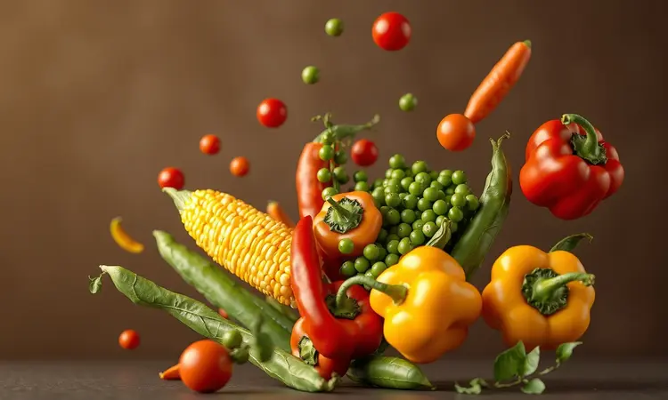

Que tal reviver aquele sabor caseiro que traz memórias de infância, mas com toda a praticidade que a vida moderna exige?

A torta de sardinha de liquidificador na Air Fryer é aquele companheiro perfeito para dias corridos: rápida, nutritiva e com uma limpeza tão simples que você mal vai notar que cozinhou.

Talvez você já tenha tentado assar massas na fritadeira elétrica e ficou com medo do resultado, mas o segredo não está apenas no equipamento. Está na combinação certa de ingredientes e no timing perfeito que transforma ingredientes básicos em uma refeição completa.

Neste guia, você vai descobrir como criar uma massa tão leve que parece flutuar, enquanto o recheio de sardinha fica irresistivelmente saboroso, tudo isso sem sujar meia cozinha. Pronto para transformar sua próxima refeição?

<SummaryList products={frontmatter.top_products} />

## Por que preparar a Torta de Sardinha na Air Fryer?

Imagine abrir sua Air Fryer e encontrar uma torta perfeitamente dourada por fora, com aquela crosta crocante que faz o som ideal quando você corta, enquanto por dentro ela permanece macia e úmida.

Isso é o que a circulação de ar inteligente da fritadeira elétrica proporciona, sem a necessidade de banhar tudo em óleo.

A mágica acontece rápido: enquanto um forno tradicional ainda estaria pré-aquecendo, sua Air Fryer já está trabalhando a todo vapor, entregando uma refeição completa em menos tempo que um delivery.

O resultado não é apenas mais rápido, é também mais saudável, porque você controla exatamente o que entra na receita, da massa ao recheio. E o melhor: sem aquela sensação de estar fazendo algo complicado demais para um dia comum.

## Utensílios Essenciais para o Sucesso da Receita

Com os instrumentos certos nas mãos, a cozinha deixa de ser um campo de batalha e se transforma em seu estúdio criativo.

Para essa receita, três protagonistas farão toda a diferença: seu liquidificador confiável, uma forma que se adapte perfeitamente à sua Air Fryer, e aquelas colheres e espátulas que você já conhece bem.

A combinação certa não só garante praticidade, mas transforma o processo em algo quase terapêutico.

### Fritadeira Elétrica (Air Fryer) de Alta Performance

<ProductBox 
  title={frontmatter.top_products[0].title} 
  image={frontmatter.top_products[0].image} 
  link={frontmatter.top_products[0].link} 
/>

Pense na sua Air Fryer como o maestro de uma orquestra culinária. Modelos de alta performance, geralmente acima de 1500 watts, não apenas aquecem rápido, mas distribuem o calor com uma precisão que faz toda a diferença.

É essa tecnologia de circulação de ar, como a RapidAir da Philips, que cria aquele equilíbrio perfeito entre exterior crocante e interior fofinho.

Com controles de temperatura que permitem ajustes sutis e timers programáveis, você tem nas mãos não apenas um eletrodoméstico, mas um aliado que previne queimaduras e garante resultados consistentes.

Sim, alguns modelos podem ser mais volumosos, mas quando você experimenta a facilidade de preparar uma torta perfeita com menos gordura e menos preocupação, percebe que o espaço ocupado vale cada centímetro.

### Liquidificador Potente para Massas

<ProductBox 
  title={frontmatter.top_products[1].title} 
  image={frontmatter.top_products[1].image} 
  link={frontmatter.top_products[1].link} 
/>

Aqui está onde a experiência muda completamente. Um liquidificador de verdadeira potência, na faixa dos 1000W a 1400W, faz com que ingredientes como farinha e ovos se transformem numa massa homogênea em segundos, sem deixar aqueles grumos frustrantes.

É como ter um ajudante profissional na cozinha: ele lida com ingredientes densos enquanto você prepara o recheio. Preste atenção na jarra também, com pelo menos 1,5 litros, para que você não precise parar no meio por medo de transbordar.

As lâminas em aço inoxidável, especialmente as que têm design otimizado, não apenas cortam, mas incorporam ar à massa, dando aquela textura leve que faz toda a diferença.

Marcas como Arno Power Max ou Mondial Turbo L-1200 BI são investimentos que retornam em cada receita bem-sucedida.

### Formas de Silicone ou Alumínio Compatíveis

<ProductBox 
  title={frontmatter.top_products[2].title} 
  image={frontmatter.top_products[2].image} 
  link={frontmatter.top_products[2].link} 
/>

Este é o momento decisivo: escolher a forma certa é como garantir que seu trabalho tenha o palco perfeito. Formas de silicone são seus melhores amigos quando você quer praticidade absoluta.

Elas se moldam, despejam a torta sem esforço, e não guardam sabores de receitas anteriores, como se estivessem sempre prontas para uma nova performance.

Mas se você busca aquele tradicionalismo que só o alumínio oferece, encontrará ali uma durabilidade que aguenta inúmeras receitas, com um cozimento tão uniforme que parece mágica.

O segredo, independente do material, está em uma medida simples: a forma precisa caber confortavelmente naquela cesta da Air Fryer, deixando espaço para o ar circular.

Uma forma retangular de 22x24x6 cm costuma ser a medida perfeita para a maioria dos modelos, criando a espessura ideal para um cozimento uniforme.

## Ingredientes para a Massa Fofinha

A beleza desta receita está na simplicidade que se transforma em algo extraordinário. Você precisará apenas de 3 ovos, 1 xícara de leite, meia xícara de óleo e 2 xícaras daquela farinha de trigo que já está na sua despensa.

Mas o verdadeiro truque está na colher de sopa de fermento em pó, que trabalha silenciosamente para criar aquela textura aerada que parece flutuar no prato.

Para personalizar, pense nos temperos que mais combinam com suas memórias: uma pitada de sal, uma leve torção de pimenta-do-reino, e um punhado generoso de cheiro-verde picado.

Esta combinação básica se transforma, diante dos seus olhos, na base perfeita para qualquer recheio que você imaginar.

## Ingredientes para o Recheio de Sardinha Especial

Aqui é onde a personalidade da sua torta ganha vida. Comece com uma lata de sardinha, escorrida e delicadamente desfiada, liberando todo seu sabor marinho. Adicione cebola picada, que caramelizará suavemente, trazendo um contraponto doce à receita.

Tomates maduros picados entram não apenas por cor, mas por sua acidez natural, enquanto azeitonas verdes ou pretas oferecem aquela pitada salgada que prende o paladar.

Os temperos são a sua assinatura pessoal: sal e pimenta ajustam o equilíbrio, cheiro-verde traz frescor, e uma leve espremida de limão funciona como o toque final que realça todos os sabores sem dominá-los.

Misture com cuidado, como se estivesse preparando um segredo que logo será revelado ao primeiro mordida.

## Passo a Passo: Preparando a Torta de Liquidificador

Este é o momento em que técnica e intuição se encontram. Comece batendo ovos, leite e óleo no liquidificador até obter uma base cremosa. Então, adicione a farinha e o fermento, observando a transformação em uma massa homogênea que promete leveza.

Finalmente, incorpore a sardinha e seus temperos escolhidos, criando a união perfeita antes de confiar tudo à sua Air Fryer.

### 1. Preparando o Recheio e Limpando a Sardinha

Comece dando atenção ao coração da receita: a sardinha. Retire cuidadosamente a espinha central e as peles, se preferir um sabor mais sutil.

Se estiver usando enlatadas, um rápido enxágue em água corrente remove o excesso de sal, permitindo que você controle melhor o tempero. Reserve essas sardinhas limpas em uma tigela como se fossem pequenos tesouros.

Agora é hora de construir camadas de sabor: cebola picada oferece doçura, tomate traz acidez, cheiro-verde entrega frescor. Misture com a mão, sentindo como cada ingrediente se integra, criando um recheio que será a surpresa suculenta dentro da massa.

### 2. Batendo a Massa no Liquidificador

Aqui a ciência se encontra com a arte. Na jarra do liquidificador, combine primeiro os líquidos, ovos, leite e óleo, criando uma base aveludada. Então, acrescente a farinha de trigo, o sal e o fermento, observando o líquido se transformar em uma massa sedosa.

Bata em velocidade média apenas até que todos os grumos desapareçam, imaginando cada bolha de ar sendo incorporada para criar leveza. Parar no momento certo é crucial, muito tempo tornaria a massa pesada.

Este é também o momento para sua criatividade: uma pitada de orégano, um pouco de manjericão, o que fizer sentido para sua memória gustativa.

### 3. Montagem e Ajuste da Air Fryer

Agora chegamos à hora da verdade. Remova a cesta da Air Fryer, garantindo que esteja limpa e completamente seca, como preparando um palco. Pré-aqueça por cerca de 5 minutos a 180°C, criando o ambiente perfeito para que sua torta comece a cozinhar assim que entrar.

Despeje a massa na forma preparada, observando como ela se acomoda naturalmente. Ajuste o tempo, entre 20 e 25 minutos, mas mantenha seus sentidos alertas: cada Air Fryer tem sua personalidade, seu olfato e visão serão seus melhores guias.

É como dançar com seu equipamento, em vez de apenas seguir instruções.

## 5 Dicas de Ouro para a Torta não Solar na Air Fryer

Você sabe aquela frustração de encontrar uma torta queimada por fora e crua por dentro? Estas dicas são seu antídoto. Primeiro, aqueça sua Air Fryer por 5 minutos, criando uma base de calor que forma uma crosta protetora.

Segundo, evite encher a forma até a borda, uma camada mais moderada permite que o ar circule por todos os lados, cozinhando uniformemente.

Terceiro, se notar que a superfície está dourando rápido demais, abaixe ligeiramente a temperatura, como um piloto ajustando sua nave. Quarto, use papel alumínio como um escudo temporário se as pontas começarem a escurecer antes do centro estar pronto.

Por último, permita que sua torta descanse por alguns minutos após sair da Air Fryer, esse tempo de repouso faz a estrutura firmar, tornando cada fatia perfeita.

## Variações de Recheio: Use o que tem na Geladeira

Esta receita é sua tela em branco. O recheio de sardinha é delicioso, mas sua geladeira guarda infinitas possibilidades. Que tal cenoura ralada para um toque levemente adocicado e cor vibrante?

Brócolis picadinho oferece textura e nutrientes extras, enquanto espinafre cozido desaparece na massa, entregando sabor sem ser óbvio. Queijos são seus aliados secretos: muçarela derrete em fios cremosos, queijo minas traz suavidade.

Para personalidades mais marcantes, azeitonas picadas ou um punhado de ervas frescas como alecrim ou tomilho transformam completamente o perfil de sabor.

Esta versatilidade significa que você nunca fará exatamente a mesma torta duas vezes, cada versão conta uma história diferente dos ingredientes que você escolheu naquele dia.

## Perguntas Frequentes (FAQ)

### Qual o melhor tipo de forma para usar na Air Fryer?

Pense na forma como o parceiro da sua Air Fryer. Materiais como alumínio, silicone ou cerâmica de alta resistência trabalham em harmonia com o calor circulante. O alumínio é o clássico confiável, leve e com excelente condução térmica para um dourado uniforme.

Silicone é o prático, que libera a torta com um simples movimento e se adapta a espaços diferentes. Cerâmica funciona bem, mas exige verificação prévia para garantir que suporta as altas temperaturas da Air Fryer.

Independente da escolha, a regra de ouro é simples: sua forma precisa ter espaço para respirar dentro da cesta, permitindo que o ar faça sua mágica ao redor de todos os lados.

### Posso substituir a sardinha por atum ou frango?

Absolutamente, essa é a beleza da receita. Atum em lata, escorrido e desfiado, oferece uma variação mais suave enquanto mantém o espírito prático da receita.

Frango desfiado, especialmente se você tiver sobras de um assado do dia anterior, traz uma textura diferente e um sabor neutro que funciona como tela para outros temperos.

Ambas as substituições mantêm a essência do que faz essa torta especial: a combinação de praticidade com possibilidade de personalização. É como descobrir que sua receita favorita tem irmãos igualmente interessantes.

### Como saber se a torta está assada no meio?

Este é o teste do cozinheiro que nunca falha. Insira um palito ou faca fina no centro da torta e retire. Se sair limpo, sem vestígios de massa úmida, você acertou o ponto perfeito.

Complemente com outros sinais: a superfície deve estar uniformemente dourada, firmando ao toque mas ainda com leve elasticidade.

E não ignore seu olfato, aquele aroma característico de pão assado com toques do recheio lhe diz que a química está acontecendo exatamente como deveria. É uma combinação de ciência e intuição que se torna mais natural a cada vez que você pratica.

## Conclusão

A verdadeira magia desta torta de sardinha de liquidificador na Air Fryer vai muito além da praticidade ou do sabor.

Ela representa uma reconquista: a capacidade de criar refeições caseiras significativas mesmo quando o tempo escasseia, sem depender de processos complexos ou limpezas intermináveis.

Cada etapa, da escolha dos ingredientes ao momento em que você retira aquela forma dourada da Air Fryer, reconecta você com o prazer simples de cozinhar.

A versatilidade do recheio transforma cada preparo em uma expressão pessoal, enquanto a consistência da Air Fryer garante sucesso mesmo para quem está começando.

Esta não é apenas uma receita, é uma ferramenta que devolve à sua rotina a possibilidade de surpreender a si mesmo e aos que compartilham sua mesa, provando que sabor e praticidade podem, sim, andar juntos.

Experimente hoje, adapte amanhã, e descubra como uma receita aparentemente simples pode se tornar seu coringa culinário favorito, sempre pronto para transformar ingredientes básicos em momentos especiais.