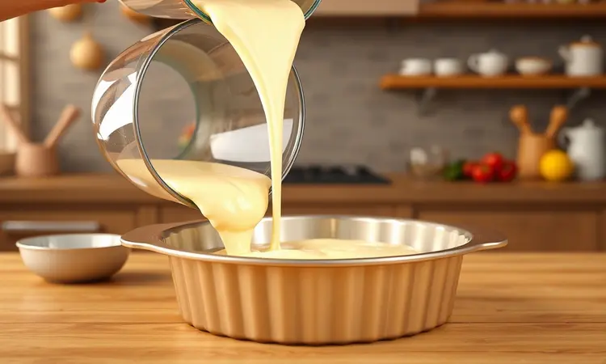
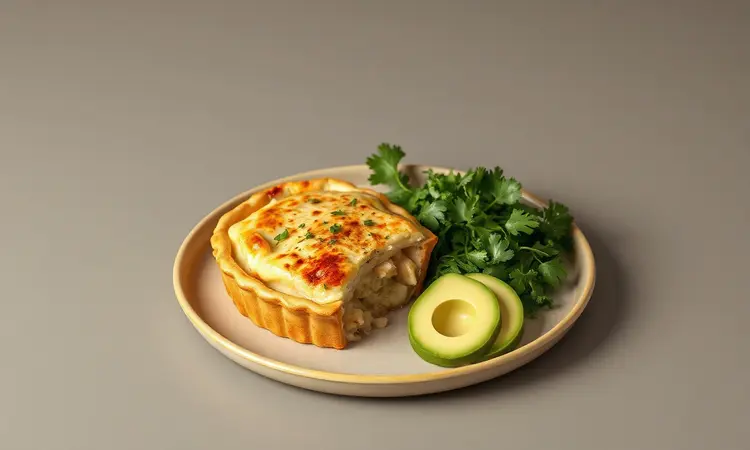

Já passou pela sua cabeça aquela vontade de uma torta de frango quentinha, mas desistiu só de imaginar o trabalho de ligar o forno e sujar várias panelas? Você não está sozinho nessa busca por praticidade na cozinha.

A boa notícia é que sua Airfryer pode ser a solução perfeita para criar pratos assados incríveis em tempo recorde.

Neste artigo, vou te guiar pela receita definitiva de torta de frango na Airfryer, mostrando como evitar que a massa fique crua no meio e quais acessórios garantem resultados dignos de padaria profissional.

<SummaryList products={frontmatter.top_products} />

## Por que a Airfryer é Perfeita para Fazer Tortas Salgadas?

Imagine conseguir aquela crosta dourada e crocante que todo mundo adora, mas sem precisar de toneladas de óleo. É exatamente isso que a Airfryer entrega com sua circulação inteligente de ar quente.

Ela cozinha de forma mais rápida e saudável que métodos tradicionais, resultando em tortas mais leves e menos calóricas.

A versatilidade é outro ponto forte. Você pode explorar diferentes combinações de recheios e massas com a mesma facilidade, transformando sua cozinha em um laboratório de sabores sem complicação.

Se busca praticidade sem abrir mão do sabor, essa se tornou a escolha certeira para tortas deliciosas no dia a dia.

## Acessórios Essenciais: Qual Forma Pode ir na Airfryer?

<ProductBox 
  title={frontmatter.top_products[0].title} 
  image={frontmatter.top_products[0].image} 
  link={frontmatter.top_products[0].link} 
/>

Com o equipamento certo em mãos, surge a dúvida: quais formas realmente funcionam? As de silicone são verdadeiras aliadas pela flexibilidade que facilita a remoção das tortas e pela limpeza que se torna bem mais simples.

Formas metálicas também são opção, mas exigem um cuidado extra para evitar que os alimentos grudem. Independente do material, sempre verifique as dimensões antes de comprar para garantir compatibilidade com seu modelo específico.

Esse pequeno detalhe faz toda diferença na hora de expandir suas possibilidades culinárias e garantir que seu equipamento dure muito mais.

## Ingredientes para a Massa de Liquidificador Prática

Agora vamos ao que realmente importa: os ingredientes. Para uma massa de liquidificador fofinha e prática, você vai precisar de:

- 3 ovos para dar leveza

- 1 xícara de leite para umidade e sabor

- 1/4 de xícara de óleo para textura macia

- 2 xícaras de farinha de trigo como base

- 1 colher de sopa de fermento em pó para crescimento

- Sal a gosto para realçar todos os sabores

Bata tudo no liquidificador até ficar homogêneo e já tem sua massa pronta para a próxima etapa.

## Como Preparar um Recheio de Frango Cremoso e Suculento

O segredo de uma boa torta está no equilíbrio entre massa e recheio. Comece cozinhando o peito de frango em água com sal até ficar macio o suficiente para desfiar facilmente.

Em uma panela, derreta manteiga e refogue cebola picada até dourar. Junte o frango desfiado e misture bem. Agora vem a magia: acrescente creme de leite ou requeijão para aquela cremosidade que derrete na boca.

Complete com seus temperos favoritos. Pimenta do reino, salsinha e um toque de limão criam uma combinação clássica. Cozinhe por alguns minutos até tudo se incorporar perfeitamente, resultando em um recheio suculento que será o coração da sua torta.

## Passo a Passo: Como Montar e Assar sua Torta

Com os ingredientes preparados, a montagem é mais simples do que parece. Misture farinha, manteiga, sal e água até obter uma massa homogênea. Abra com um rolo e forre cuidadosamente a forma da Airfryer, reservando uma parte para a cobertura.

Distribua o recheio de frango de forma uniforme e cubra com a massa reservada, fazendo pequenos cortes para permitir que o vapor escape durante o cozimento.

Agora o momento mágico: asse em sua Airfryer pré-aquecida a 180°C por aproximadamente 25 minutos. Quando estiver com aquele dourado perfeito e aroma irresistible, sua torta está pronta para ser servida ainda quente.

## 3 Segredos para a Massa não Ficar Crua no Meio

Esse é o desafio que mais preocupa quem está começando, mas com três segredos simples você garante sucesso total. Primeiro, nunca pule o pré-aquecimento da Airfryer por pelo menos 5 minutos. Isso cria o ambiente ideal para o cozimento uniforme desde o primeiro instante.

Segundo, respeite o espaço da cesta. Não sobrecarregue com muita massa, pois o ar quente precisa circular livremente para cozinhar todos os lados igualmente.

Terceiro, fique atento à temperatura e ao tempo. Trabalhe entre 160°C e 180°C, e na metade do processo sugerido, dê uma olhada. Se necessário, gire ou reposicione a torta para garantir que todos os cantos recebam calor suficiente. Resultado?

Massa dourada por fora, perfeitamente cozida por dentro.

## Melhores Modelos de Airfryer para Receitas de Forno

<ProductBox 
  title={frontmatter.top_products[1].title} 
  image={frontmatter.top_products[1].image} 
  link={frontmatter.top_products[1].link} 
/>

Se está considerando investir em uma Airfryer especificamente para receitas como essa torta, alguns modelos se destacam. O Electrolux Family Efficient (EAF50) com seus 5 litros de capacidade e potência de 1.700 watts é ideal para receitas maiores e famílias.

O painel intuitivo e as 8 receitas pré-programadas tornam tudo mais prático.

Para quem busca equilíbrio entre custo e benefício, o Mondial Family oferece 4 litros de capacidade e controle preciso até 200°C. Já o Philco PFR2200P é a escolha dos versáteis, combinando funções de fritadeira a ar e forno elétrico em um só aparelho.

Um detalhe a considerar: alguns modelos podem emitir um ruído durante o funcionamento. É um pequeno preço a pagar pela praticidade e pelos resultados que transformam sua relação com a cozinha.

## Variações Saudáveis: Torta de Frango Fit e Low Carb

Quem está de olho na alimentação também pode aproveitar essa receita com adaptações inteligentes. Na versão fit, substitua a massa tradicional por uma base de aveia ou farinha de amêndoas. Mantém o sabor enquanto aumenta o valor nutricional.

Para a opção low carb, a couve flor se transforma na base perfeita. Além de leve e deliciosa, é rica em fibras que ajudam na saciedade.

Essas adaptações não apenas reduzem calorias, mas abrem um mundo de possibilidades para quem não quer abrir mão do prazer de uma boa refeição.

## Dicas de Armazenamento e Como Reaquecer sem Perder a Crocância

A torta ficou perfeita e sobrou? Sem problemas. Deixe esfriar completamente antes de guardar em um recipiente hermético na geladeira. Isso evita a formação de umidade que amolece a massa.

Para congelar, envolva em papel filme e depois em saco próprio para freezer. Quando a saudade bater, sua Airfryer será novamente sua aliada: aqueça por 5 a 10 minutos a 180°C e ela recupera aquela crocância que parece feita na hora.

Evite o microondas, que tende a deixar a massa encharcada e perde o charme da textura perfeita.

## Perguntas Frequentes (FAQ) sobre Torta na Fritadeira Elétrica

Algumas dúvidas são comuns quando exploramos novos métodos na cozinha. Muitos se perguntam sobre a necessidade de pré aquecer a fritadeira. Embora algumas receitas sugiram esse passo, a maioria dos modelos modernos não exige, simplificando ainda mais o processo.

Sobre o tempo de cozimento, normalmente 20 a 30 minutos são suficientes, mas seu melhor guia será o olho: quando estiver com aquele dourado convidativo e cheiro irresistível, está pronto.

Um truque que facilita muito é o papel manteiga na base da forma. Além de ajudar na limpeza posterior, previne que a torta grude, garantindo que ela saia inteira e linda para ser servida.

## Conclusão

Transformar sua Airfryer em uma aliada para tortas de frango perfeitas é mais simples do que imagina. Desde a escolha dos acessórios certos até os segredos para evitar massa crua, cada passo foi pensado para trazer praticidade sem abrir mão do sabor que encanta.

A beleza dessa receita está na adaptabilidade: seja na versão tradicional que lembra a casa da vó, nas variações fit para quem cuida da saúde, ou na praticidade do armazenamento e reaquecimento que salvam jantares corridos.

Sua Airfryer não é apenas um eletrodoméstico, é uma porta para reinventar suas receitas favoritas com menos trabalho e mais resultado.

Que tal testar ainda hoje? Com os ingredientes que provavelmente já tem em casa e essas dimas que compartilhei, sua próxima torta de frango pode surpreender a todos na mesa. A cozinha prática e saborosa está a seu alcance, um clique de distância. Bom apetite!