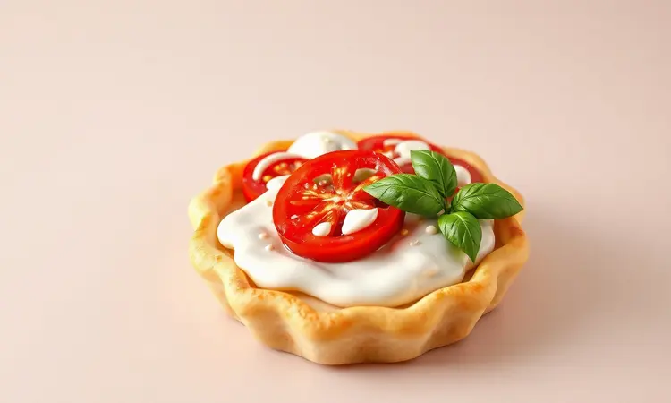
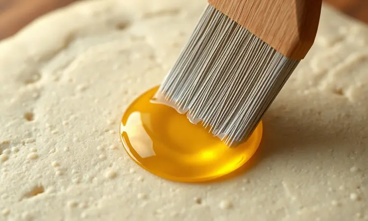
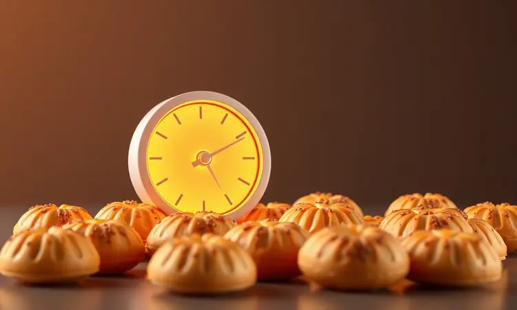

Você já abriu a airfryer cheio de expectativa, só para encontrar aquele pastel pálido e seco que parece mais uma casca que comida? A promessa de um lanche crocante e saudável desaparece em segundos, deixando você com aquela sensação de ter perdido tempo e ingredientes.

Esse ciclo de frustração acaba agora. Eu vou te mostrar como transformar sua cozinha em uma verdadeira barraca de feira gourmet, onde cada pastel sai dourado por fora, suculento por dentro, e com aquela crocância que faz você esquecer que não foi frito.

<SummaryList products={frontmatter.top_products} />

## Por que fazer pastel na airfryer? (Saúde vs. Sabor)

Imagine saborear seu pastel favorito sem aquela sensação pesada depois, sem o cheiro de óleo impregnando na cozinha, e sem precisar se sentir culpado por estar fugindo da dieta.

A airfryer faz exatamente isso: ela usa o poder do ar quente circulante para criar uma textura incrivelmente crocante, usando até 80% menos óleo que a fritura tradicional. O melhor?

O recheio mantém toda sua suculência, porque o calor é distribuído de forma mais uniforme. Você não precisa escolher entre saúde e prazer gastronômico. Com a técnica certa, você tem os dois no mesmo prato.

## Melhores Air Fryers para Resultados Profissionais

<ProductBox 
  title={frontmatter.top_products[0].title} 
  image={frontmatter.top_products[0].image} 
  link={frontmatter.top_products[0].link} 
/>

Ter as ferramentas certas é metade da batalha vencida. Alguns modelos se destacam por transformar sua experiência culinária.

O Ninja Foodi Max Dual Zone Air Fryer AF400 é como ter um chef particular, com controles precisos que garantem que cada lado do pastel fique perfeito.

Se você prefere versatilidade, o Philco Air Fryer Oven PFR2200P funciona como um forno compacto, perfeito para assar uma fornada inteira de uma vez.

Para quem busca um equilíbrio entre investimento e qualidade, a Cosori Pro LE Air Fryer L501 entrega consistência em cada uso. E se sua família é pequena ou você quer apenas testar a ideia, o Cadence Pratic Fryer FRT515 cuida das porções individuais sem ocupar espaço.

Escolha pensando no seu ritmo de vida: quantas vezes por semana você quer essa crocância saudável na sua mesa?

## A Escolha da Massa: Caseira, Rolo ou Pronta?

A base de tudo começa aqui. Uma massa caseira te dá controle total sobre a textura, permitindo ajustar até a espessura perfeita para segurar o recheio sem quebrar.

Já as opções práticas de rolo ou prontas salvam seu tempo em dias corridos, mas prometem: mesmo com elas, o resultado final ainda depende dos segredos que você vai aprender a seguir.

### Receita de Massa de Pastel Caseira com 3 Ingredientes

Parece mágica, mas a textura perfeita nasce de apenas três ingredientes. Em uma tigela, misture 2 xícaras de farinha de trigo com 1/4 de xícara de óleo até formar uma farofa homogênea.

Aos poucos, incorpore 1/2 xícara de água, amassando até sentir a massa lisa e elástica sob seus dedos. Deixe descansar por 30 minutos coberta com um pano úmido.

Esse repouso é o segredo: a gordura se distribui, criando camadas que vão expandir na airfryer, resultando em uma crocância que estala ao primeiro mordida.

## Recheios que não Ressecam na Airfryer

O calor intenso da airfryer pode ser inimigo da suculência se você não souber jogar com ele. A chave está em escolher ingredientes que liberem umidade durante o cozimento, criando um microclima úmido dentro do pastel.

Queijos que derretem bem, carnes preparadas com molhos e vegetais com alto teor de água são seus maiores aliados.

### Recheio de Carne Moída com Segredinho de Umidade

Enquanto refoga a carne moída com cebola e alho, adicione duas colheres de sopa de molho de tomate ou uma colher de caldo de carne dissolvido.

Esse líquido extra é absorvido pela carne durante o cozimento, depois liberado lentamente dentro do pastel, mantendo cada pedaço macio e saboroso. Espere esfriar completamente antes de rechear, assim a massa não fica úmida e perde a crocância.

### Frango Desfiado com Catupiry Real

Cozinhe o peito de frango com alho e louro até ficar macio o suficiente para desfiar com os dedos. Misture com catupiry ainda morno, criando uma textura cremosa que envolve cada fio de frango.

Essa combinação é inteligente: enquanto o calor da airfryer derrete o queijo, ele protege o frango da desidratação, garantindo que cada mordida seja uma experiência cremosa e suculenta.

### Opções Vegetarianas: Queijo, Tomate e Manjericão

Fatias de queijo muçarela, rodelas de tomate firmes e folhas frescas de manjericão criam uma sinfonia de sabores que se transformam no forno. O tomate libera seus sucos, que são absorvidos pelo queijo, criando um molho natural dentro do pastel.

Um fio de azeite por cima antes de fechar realça os aromas e ajuda na formação da crosta dourada.

### Delícias Doces: Romeu e Julieta e Chocolate

Para sobremesa, fatias finas de goiabada entre duas camadas de queijo minas criam aquele contraste doce e salgado que derrete na boca. Já o chocolate, preferencialmente em pedaços pequenos ou gotas, transforma-se em uma cascata cremosa ao primeiro mordida.

Ambas as opções mantêm a textura crocante da massa enquanto oferecem um recheio que literalmente flui.

## O Segredo da Crocância: Como Pincelar para Dourar

Você já tem o recheio perfeito e a massa na espessura ideal. Agora, o toque final que transforma bom em extraordinário.

Uma fina camada de mistura de ovo batido com uma colher de água aplicada com pincel antes de assar cria uma barreira que sela a umidade interna enquanto promove um dourado uniforme e brilhante.

Não é apenas estética, é ciência: essa camada reage com o calor intenso, criando uma textura crocante que estala ao toque.

### Pulverizador de Azeite: O Acessório Indispensável

<ProductBox 
  title={frontmatter.top_products[1].title} 
  image={frontmatter.top_products[1].image} 
  link={frontmatter.top_products[1].link} 
/>

Um pulverizador de azeite não é apenas mais um utensílio na gaveta. Ele é seu controle remoto para a crocância perfeita. Com ele, você aplica uma névoa fina e uniforme sobre os pastéis, garantindo que cada centímetro receba exatamente a mesma quantidade de gordura.

Modelos em aço inoxidável ou vidro não retêm odores e são fáceis de limpar. A economia é perceptível: você usa até 70% menos óleo, mas com resultados visivelmente superiores.

## Passo a Passo: Montagem e Fechamento Seguro

Coloque o recheio no centro, deixando uma borda generosa de pelo menos 1,5 cm. Dobre a massa ao meio e pressione firmemente com os dedos, começando do centro em direção às pontas para expulsar o ar.

Depois, use um garfo para selar definitivamente, criando aquelas marcas características que não apenas decoram, mas garantem que nenhuma delícia escape durante o cozimento.

### Pincel de Silicone Culinário para Finalização

<ProductBox 
  title={frontmatter.top_products[2].title} 
  image={frontmatter.top_products[2].image} 
  link={frontmatter.top_products[2].link} 
/>

Esqueça os pincéis tradicionais que soltam cerdas e acumulam odores. Um pincel de silicone de grau alimentício resiste a temperaturas acima de 230°C sem derreter ou transmitir sabores.

Suas cerdas macias distribuem óleos, ovos ou manteiga derretida de forma tão uniforme que parece pintura profissional. A limpeza é instantânea, e ele seca rápido para a próxima fornada.

## Guia de Tempo e Temperatura: Acerte de Primeira

Aqui está o mapa do tesouro: 200°C por 10 minutos, virando na metade do tempo. Mas esse é apenas o ponto de partida. Pastéis maiores ou com recheios mais densos podem precisar de 12 minutos.

O truque está na observação: quando o aroma invade a cozinha e o dourado atinge um tom âmbar, eles estão prontos. Nunca sobrecarregue a cesta, deixando espaço para o ar circular livremente.

É essa circulação que cria a crocância uniforme que parece feita profissionalmente.

## 5 Erros Comuns que deixam o Pastel Seco (e como evitar)

Primeiro, recheio insuficiente. A massa precisa de umidade interna para não virar uma biscoito. Segundo, pular o pincelamento externo, que é essencial para selar e dourar. Terceiro, temperatura muito alta por muito tempo, que desidrata tudo rapidamente.

Quarto, não virar na metade do tempo, criando um lado perfeito e outro pálido. Quinto, usar massa muito fina que não consegue reter a umidade do recheio. Cada um desses erros tem correção simples, mas juntos, eles arruínam a experiência.

## Como Congelar e Reaquecer para manter o Sabor

Prepare uma fornada extra e congele antes de assar. Disponha os pastéis em uma bandeja sem que se toquem e leve ao congelador por 2 horas, depois transfira para sacos herméticos.

Quando a fome bater, não precisa descongelar, apenas asse diretamente a 180°C por 12-15 minutos, virando na metade. O resultado? Crocância preservada, sabor intacto, e a praticidade de ter uma feira gourmet sempre à mão.

## Perguntas Frequentes (FAQ)

Preciso descongelar antes de assar? Não, asse direto do congelador, apenas aumente 2-3 minutos no tempo.

Posso usar óleo em spray comum? Pode, mas um pulverizador com azeite dá mais controle e sabor.

E se a massa abrir durante o cozimento? Significa que você não selou bem as bordas ou colocou recheio demais.

Qual a temperatura máxima? 200°C é o ideal, acima disso pode queimar por fora antes de cozinhar por dentro.

Posso fazer em forno comum? Sim, mas precisará de mais óleo e o resultado será diferente, menos crocante.

## Conclusão

Fazer pastel na airfryer deixa de ser um experimento arriscado para se tornar uma habilidade culinária que impressiona.

Comece dominando a relação entre umidade interna e crocância externa, escolha ingredientes que trabalham a seu favor, e confie nos sinais que cada estágio do cozimento oferece.

Logo você estará criando combinações pessoais, adaptando receitas tradicionais e descobrindo que o segredo não está apenas na receita, mas na confiança de saber que cada fornada será perfeita.

Sua próxima conquista na cozinha está a poucos ingredientes e 10 minutos de distância. Que tal começar hoje mesmo?