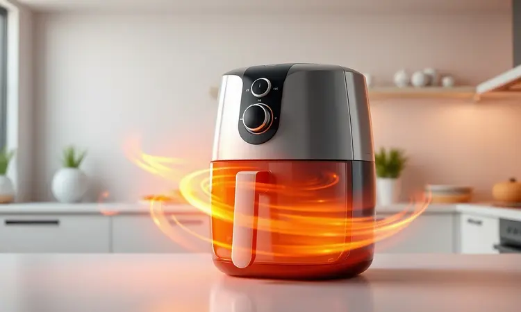
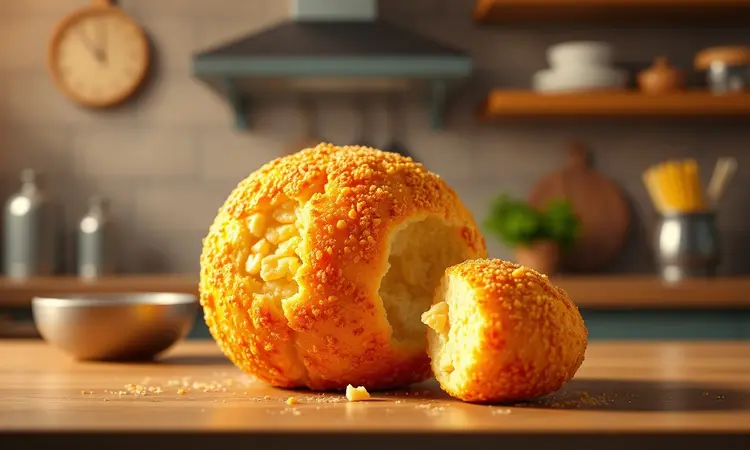
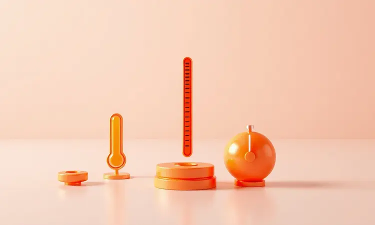

Você adora a praticidade dos salgadinhos, mas está cansado da sujeira da fritura a óleo ou de resultados murchos no forno? Esse dilema é mais comum do que você imagina.

Preparar petiscos na fritadeira sem óleo parece simples, mas existe uma linha tênue entre um salgado seco e um perfeitamente crocante. E é justamente nesse espaço que mora a frustração: quando abrimos a cesta esperando alegria e encontramos apenas decepção.

Neste guia, vamos além das instruções básicas. Prometemos revelar os segredos dos especialistas para transformar salgadinhos congelados ou frescos em petiscos irresistíveis, dourados e sequinhos.

Você aprenderá não apenas 'o que fazer', mas 'por que fazer' - entendendo a ciência por trás de cada crocância perfeita. Vamos começar pelo motivo pelo qual a Airfryer se tornou a melhor amiga de quem quer petiscar sem culpa.

<SummaryList products={frontmatter.top_products} />

## Por que preparar salgadinhos na Airfryer é a melhor opção?

Imagine conseguir aquela textura crocante que só a fritura promete, mas sem a nuvem de gordura que fica pairando na cozinha. A Airfryer faz exatamente isso usando tecnologia de circulação de ar quente que literalmente envolve cada salgado em calor intenso. O resultado?

Uma casquinha dourada que estala ao morder, mantendo o interior perfeitamente aquecido.

Mas os benefícios vão além da saúde. Pense na praticidade: sem respingos de óleo no fogão, sem aquele cheiro que impregna nas cortinas, sem horas limpando. A Airfryer é como ter um assistente de cozinha que transforma qualquer congelado em festa em minutos.

De coxinhas a batatas fritas, tudo acontece em um só lugar, com a mesma facilidade de apertar um botão.

E quando as regras são dominadas, os resultados são tão bons que seus convidados vão jurar que você pediu delivery de uma lanchonete especializada. Falando em regras, existem algumas que separam os amadores dos verdadeiros mestres da crocância.

## As 5 Regras de Ouro para um Salgadinho Crocante e Sequinho

<ProductBox 
  title={frontmatter.top_products[0].title} 
  image={frontmatter.top_products[0].image} 
  link={frontmatter.top_products[0].link} 
/>

Essas não são apenas dicas, são princípios que transformam completamente sua relação com a Airfryer. Vamos desconstruir cada uma delas para você entender exatamente o que acontece dentro daquela cesta mágica.

### 1. O segredo do pré-aquecimento adequado

Pense no pré-aquecimento como dar boas-vindas aos seus salgados. Quando você coloca alimentos congelados em uma Airfryer já quente, a reação é imediata.

O choque térmico forma uma crosta protetora que segura a umidade interna enquanto cria aquela textura perfeita por fora. Três a cinco minutos são suficientes para criar esse ambiente, como um chef profissional que liga sua chapa antes do primeiro filé chegar.

### 2. Pincelar ou borrifar gordura: O truque para o dourado perfeito

<ProductBox 
  title={frontmatter.top_products[1].title} 
  image={frontmatter.top_products[1].image} 
  link={frontmatter.top_products[1].link} 
/>

Aqui mora um dos maiores segredos. A gordura não é apenas 'um pouco de óleo'. Ela age como condutora de calor, facilitando a reação de Maillard - aquela transformação química que cria sabores complexos e a cor dourada irresistível.

Com um borrifador, você cobre batatas e legumes uniformemente com apenas alguns toques. Com um pincel, trata carnes e empanados com o cuidado de um pintor, garantindo uma camada fina e estratégica.

O resultado é aquele brilho que engana qualquer um: 'Isso foi frito, não foi?'

### 3. A regra do espaço: Por que não sobrecarregar o cesto

Quando você dá espaço para cada coxinha respirar, ela retribui com uma crocância perfeita em todos os lados. O ar quente precisa circular livremente, abraçando cada pedaço igualmente.

Salgados amontoados cozinham no vapor uns dos outros, resultando em alguns pontos crocantes e outros moles. É a diferença entre um salgado de festa elegante e uma marmita esquecida no micro-ondas.

### 4. Técnica de agitação para fritura uniforme

Essa pequena pausa a cada 5-10 minutos não é interrupção, é cuidado. Dar uma sacudida na cesta ou usar uma espátula para virar os salgados é como virar um filé na grelha.

Garante que todos os lados recebam o mesmo carinho do calor, evitando que grudem e criando uma douração uniforme. É o movimento simples que transforma um lanche aceitável em uma experiência memorável.

### 5. Controle de umidade e descongelamento parcial

A água é inimiga da crocância. Salgados congelados carregam cristais de gelo que, ao derreterem, viram vapor e amolecem a massa. O descongelamento parcial resolve isso elegantemente.

Deixar seus salgados fora da geladeira por alguns minutos ou usar a função de descongelamento do micro-ondas remove umidade excessiva sem comprometer a estrutura. O resultado? Sequidão que estala ao morder, não umidade que embebe o prato.

Com essas regras em mente, vamos ao passo a passo prático para nunca mais errar.

## Como preparar salgadinhos congelados na Airfryer sem erro

Retire seus salgados direto do congelador - sem descongelar, essa é a primeira regra. Enquanto isso, sua Airfryer já deve estar pré-aquecendo a 200°C por cerca de 5 minutos.

Quando estiver pronta, arrume os salgadinhos na cesta como se fossem convidados em uma festa: cada um com seu espaço pessoal. Tempere levemente, coloque na máquina e programe entre 10 e 15 minutos, dependendo do tamanho.

Aqui está a parte mágica: você não precisa ser escravo do timer. Após o tempo sugerido, abra e verifique. Quer mais dourado? Mais alguns minutos. Perfeito assim? Pare. Essa flexibilidade é o que torna a Airfryer tão amigável.

Ao final, deixe descansar por um minuto - como um bom vinho, os sabores se assentam melhor assim.

## Guia de Tempo e Temperatura para diferentes tipos de salgados

<ProductBox 
  title={frontmatter.top_products[2].title} 
  image={frontmatter.top_products[2].image} 
  link={frontmatter.top_products[2].link} 
/>

Cada salgado tem sua personalidade, e tratá-los igualmente é receita para frustração. Vamos entender como agradar cada tipo:

### Coxinhas e Bolinhas de Queijo: Crocância externa e recheio derretido

Esses clássicos pedem carinho especial. A temperatura ideal (180°C) é alta o suficiente para criar uma casca dourada, mas não tanto que queime antes do recheio aquecer.

Em 12 a 15 minutos, você terá o equilíbrio perfeito: exterior que estala entre os dentes, interior cremoso que escorre suavemente. A dica crucial? Nunca cortar o tempo - o recheio precisa desse período completo para chegar ao ponto derretido.

### Quibes e Assados: Mantendo a suculência interna

Aqui o desafio é diferente. Quibes e assados têm mais umidade interna que precisa ser preservada. Trabalhe com 170°C por 15 a 18 minutos, e use um leve spray de óleo só na superfície.

Essa abordagem mais gentil cozinha uniformemente sem ressecar, mantendo aquela suculência que faz você fechar os olhos ao morder. Espaço na cesta é ainda mais crítico aqui - cada quibe precisa respirar livremente.

### Risoles e Enroladinhos: Evitando que a massa rache

A massa fina desses salgados é delicada, mas pode ser dominada. Comece com uma temperatura mais baixa (160°C) por 3-4 minutos para 'selar' a superfície, depois aumente para 180°C por mais 8-10.

Esse sistema em duas etapas cria uma barreira protetora que segura o recheio enquanto a crocância se desenvolve. Um pincel leve com óleo antes de começar faz toda diferença.

## Problemas Comuns: Por que meu salgado estourou ou ficou duro?

Esses fantasmas assombram qualquer cozinheiro de Airfryer. Vamos exorcizá-los. Salgados estouram geralmente por dois motivos: recheios muito líquidos que criam pressão interna, ou temperatura muito alta que cozinha rápido demais a casca externa. A solução?

Recheios mais consistentes e temperatura controlada.

Salgados duros, por outro lado, geralmente sofrem de 'overcooking' - tempo excessivo em temperatura alta que resseca tudo. Ou então a massa estava muito espessa e não cozinhou por igual. A correção está na observação: se já está dourado, está pronto.

Não deixe mais só porque 'o tempo não acabou'.

## Acessórios Essenciais para facilitar sua vida na cozinha

<ProductBox 
  title={frontmatter.top_products[3].title} 
  image={frontmatter.top_products[3].image} 
  link={frontmatter.top_products[3].link} 
/>

Alguns pequenos investimentos multiplicam sua habilidade com a Airfryer. Um borrifador de óleo de qualidade (não aqueles de supermercado que entopem) dá controle preciso sobre a gordura. Formas de silicone permitem preparar desde mini-quiches até brownies sem grudar.

Um separador de alimentos é genial para cozinhar diferentes salgados simultaneamente sem misturar sabores.

Mas o acessório mais importante? Sua curiosidade. Experimentar, ajustar, testar. Cada Airfryer tem sua personalidade, e conhecê-la é parte da jornada.

## Perguntas Frequentes sobre Salgadinhos na Airfryer (FAQ)

'Preciso mesmo pré-aquecer?' Sim. É a diferença entre salgados uniformes e aleatórios. 'Quanto óleo usar?' Bem menos do que você imagina. Uma colher de sopa distribuída estrategicamente vale mais que um copo despejado.

'Como saber quando está pronto?' Quando o dourado é uniforme e o cheiro é irresistível. Confie nos seus sentidos mais que no timer. 'Posso encher a cesta?' Só se quiser resultados desiguais. Espaço é carinho em forma de ar quente.

## Conclusão

Essa jornada começou com uma frustração comum: salgadinhos que prometiam crocância e entregavam desapontamento. Termina com você dominando uma máquina que transforma congelados simples em pequenas obras de arte gastronômicas.

Lembre-se: a Airfryer não é apenas um eletrodoméstico. É um atalho para refeições mais saudáveis sem abrir mão do prazer. É a solução para imprevistos ('Chegaram visitas!').

É a garantia de que, independentemente do seu nível na cozinha, você pode produzir petiscos que impressionam.

As regras que aprendemos aqui são seu mapa. O pré-aquecimento, o espaço, o controle de umidade - cada uma é um degrau em direção à maestria. Mas o verdadeiro segredo está em experimentar. Sua próxima coxinha pode ser sua melhor até agora.

Sua próxima batata frita pode ser a que fará todos perguntarem: 'Como você faz isso?'

Agora é sua vez. Escolha seu salgado favorito, siga essas orientações e descubra o prazer de servir não apenas comida, mas experiências. Porque no final, não se trata apenas de alimentar o corpo.

Trata-se de alimentar a alegria de compartilhar momentos especiais com quem amamos. E que melhor forma de fazer isso do que com um salgado perfeito na ponta do garfo?