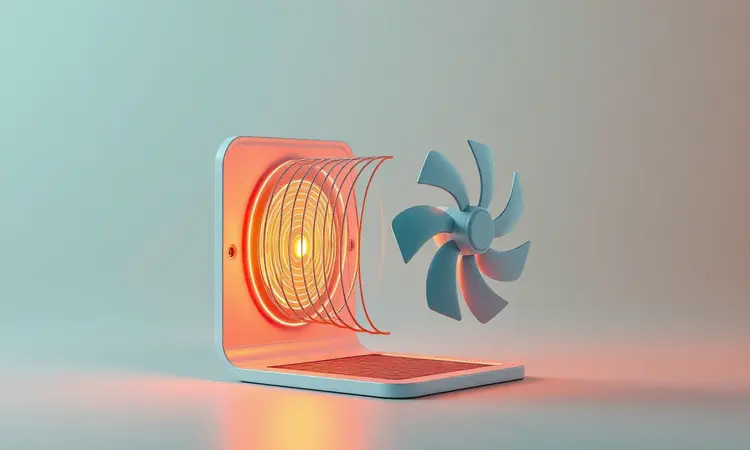

Imagine chegar em casa após um dia corrido e, em vez de enfrentar a panela de óleo quente, poder preparar batatas crocantes e douradas com apenas uma colher de azeite.

Essa conveniência transformou a air fryer em uma verdadeira parceira na cozinha brasileira, mas você já parou para entender como essa tecnologia funciona de verdade?

Neste guia, vamos além da superfície para revelar a ciência que torna possível fritar com ar, descobrir os segredos da crocância perfeita e encontrar o modelo ideal para sua rotina.

Ao final, você não apenas saberá escolher, mas também cuidar do seu aparelho para anos de refeições saudáveis.

<SummaryList products={frontmatter.top_products} />

## O que é uma Air Fryer e por que ela revolucionou a cozinha?

Pense na última vez que você resistiu a comer algo frito por preocupação com a saúde. A air fryer chegou para acabar com esse dilema. Ao usar ar quente em alta velocidade, ela conquista aquela textura crocante que amamos, mas com até 80% menos óleo.

Isso não é apenas sobre menos calorias, mas sobre preservar o sabor natural dos alimentos. Você notará que legumes mantêm seu brilho, carnes ficam suculentas por dentro e cada mordida tem mais sabor do que gordura.

Essa versatilidade transforma seu espaço culinário: de batatas fritas a bolos, de frango a vegetais assados, tudo ganha praticidade sem sacrificar o prazer à mesa. E essa revolução começa com um princípio científico fascinante.

## A Ciência por Trás do Sabor: Como a Tecnologia de Convecção Funciona na Prática

Você já observou como o ar quente sobe em espirais em um dia de verão? Essa mesma física está no coração da sua air fryer.

Enquanto um forno tradicional deixa o calor se espalhar lentamente, aqui um ventilador poderoso impulsiona ar quente em um redemoinho constante ao redor dos alimentos. Cada lado recebe atenção igual, eliminando aquelas vezes que você precisa virar tudo manualmente.

O resultado é uma crocância uniforme que conquista desde batatas fritas até espetinhos de legumes, sem pontos queimados ou partes moles. Essa eficiência se traduz em tempo: em minutos você tem resultados que antes levariam até o dobro do tempo no forno.

Tudo acontece graças a duas peças chave trabalhando em perfeita harmonia.

### O papel da resistência elétrica e do ventilador de alta velocidade

Dentro daquela caixa compacta, uma resistência aquece o ar a temperaturas precisas, criando o ambiente perfeito para transformar ingredientes crus em iguarias douradas. Mas o verdadeiro truque está no ventilador.

Ele não apenas sopra, mas projeta esse ar quente com tanta força que forma um casulo de calor ao redor de cada pedaço de alimento. Imagine um cobertor invisível e intenso envolvendo seus legumes ou carnes, cozinhando todas as superfíções simultaneamente.

Essa parceria entre calor constante e movimento ininterrupto é o que elimina a necessidade de óleo profundo. Cada watt de energia trabalha para criar textura, não apenas para aquecer.

E quando esse calor encontra os açúcares naturais dos alimentos, a mágica realmente acontece.

### Efeito Maillard: O segredo da crocância sem óleo explicado pela ciência

Aquela cor dourada perfeita e o aroma irresistível que desperta o apetite têm nome: efeito Maillard. Em temperaturas entre 140°C e 165°C, os aminoácidos e açúcares presentes nos alimentos se transformam em centenas de novos compostos aromáticos.

É a mesma reação que torna o pão torrado tão saboroso ou a carne grelhada tão apetitosa. Na air fryer, esse processo é otimizado porque o ar quente seco acelera a evaporação da superfície dos alimentos, concentrando esses sabores.

Você não está apenas cozinhando, está realçando o perfil natural de cada ingrediente. Essa reação química é a responsável por transformar uma batata comum em algo que parece ter sido frito, mas mantém sua essência saudável.

Com essa compreensão, surge uma questão natural.

## Air Fryer Realmente "Frita" ou é Apenas um Forno Pequeno? Entenda a Diferença

A resposta está no meio termo. Se você espera o mergulho tradicional em óleo borbulhante, essa não é a experiência. Mas se busca a sensação crocante na boca sem a gordura residual, então sim, ela "frita" de forma inteligente.

A diferença crucial está na intensidade: enquanto um forno aquece o ar ao redor, a air fryer o direciona com força cirúrgica. Pense na diferença entre caminhar em um dia de vento suave e enfrentar um túnel de vento.

Essa concentração de calor em movimento é o que cria a textura superficial rápida que associamos à fritura. Além disso, o espaço compacto mantém a umidade baixa, crucial para a crocância.

O resultado é um alimento com todas as características sensoriais da fritura, mas com a consciência tranquila de quem optou por uma alternativa mais inteligente. Para entender como tudo isso se materializa, vamos abrir a caixa preta.

## Anatomia do Aparelho: Conheça os Principais Componentes Internos

Cada parte da sua air fryer tem um propósito claro que contribui para sua experiência culinária. O elemento de aquecimento é o coração, transformando eletricidade em calor preciso capaz de atingir até 200°C em minutos.

Logo acima, o ventilador age como os pulmões, movendo constantemente esse calor para evitar pontos frios.

O cesto removível não é apenas um recipiente, mas um projetor de ar: suas ranhuras permitem que o fluxo circule por baixo dos alimentos, garantindo cozimento 360 graus.

O revestimento antiaderente não facilita apenas a limpeza, mas permite que você use menos óleo, já que nada gruda. Por fim, o termostato age como um maestro invisível, ajustando a temperatura automaticamente para manter o cozimento perfeito.

Esses componentes, trabalhando em sintonia, entregam benefícios que mudam sua relação com a cozinha.

## 5 Vantagens de Cozinhar com uma Fritadeira Elétrica no Dia a Dia

Primeiro, imagine abrir mão da ansiedade de respirar fumaça de óleo e limpar respingos pela cozinha. A segurança aumenta drasticamente, já que não há líquido fervente para causar acidentes.

Segundo, o tempo ganha novo significado: em 15 minutos você tem batatas crocantes que levariam o dobro no forno, liberando minutos preciosos para sua família ou para você.

Terceiro, a versatilidade surpreende: de torradas matinais a jantares completos, o mesmo aparelho assume múltiplos papéis, economizando espaço na bancada.

Quarto, a saúde se transforma em hábito: ao reduzir óleo, você naturalmente consome menos gordura sem sentir falta do sabor. Finalmente, a limpeza vira questão de minutos: as peças removíveis vão direto para a pia, sem necessidade de produtos especiais.

Essas vantagens se tornam ainda mais significativas quando você prepara o aparelho corretamente desde o primeiro contato.

## Guia de Uso: Como Preparar sua Air Fryer para o Primeiro Uso (Técnica da Cura)

Antes de preparar sua primeira refeição, esse ritual simples garante anos de bom desempenho. Comece lavando todas as peças removíveis com água morna e sabão neutro, enxaguando bem para eliminar qualquer resíduo de fabricação.

Seque completamente, pois a umidade pode interferir no primeiro aquecimento. Agora vem o passo crucial: ligue o aparelho vazio a 200°C por 15 minutos. Esse ciclo elimina odores de produção e estabiliza os componentes internos.

Você pode notar um leve cheiro de plástico novo, completamente normal e temporário. Após desligar, deixe esfriar completamente antes de usar. Essa atenção inicial recompensa você com um aparelho que aquece uniformemente desde o primeiro uso e mantém sua performance.

Com o aparelho preparado, surge a curiosidade sobre suas possibilidades.

## O Que Pode e o Que NÃO Pode Colocar na Air Fryer: Guia de Materiais e Alimentos

Sua criatividade encontra aqui um playground culinário: vegetais ficam com bordas caramelizadas, carnes mantêm seus sucos enquanto ganham uma crosta dourada, e até pequenos bolos sobem uniformemente.

O segredo está no espaço: evite sobrecarregar o cesto, mantendo uma única camada de alimentos para que o ar circule livremente. Alimentos naturalmente gordurosos, como coxas de frango ou linguiças, praticamente não precisam de óleo adicional.

Para empanados, uma leve borrifada de azeite em spray garante a crocância perfeita. Por outro lado, evite materiais que não suportem altas temperaturas: recipientes plásticos comuns derretem, e papel toalha solta fibras que podem queimar.

Massas muito líquidas ou alimentos com cobertura excessiva podem respingar e criar fumos. Com essas orientações, você está pronto para explorar um universo de receitas, mas primeiro precisa do parceiro ideal.

## Melhores Modelos de Air Fryer para Diferentes Necessidades em 2024

Encontrar a air fryer certa é como escolher o melhor parceiro para sua rotina: precisa alinhar estilo de vida, espaço disponível e ambições culinárias. Analisamos dezenas de modelos para destacar três que representam diferentes abordagens à cozinha saudável.

### Air Fryer Mondial Family 4L: O melhor custo-benefício para famílias

<ProductBox 
  title={frontmatter.top_products[0].title} 
  image={frontmatter.top_products[0].image} 
  link={frontmatter.top_products[0].link} 
/>

Quando praticidade e economia se encontram, esse modelo se destaca. Com 4 litros de capacidade, prepara refeições para até quatro pessoas de uma só vez, ideal para almoços rápidos durante a semana.

Os 1500W de potência garantem que os alimentos atinjam a crocância rapidamente, enquanto o timer de 60 minutos com desligamento automático permite que você cuide de outras tarefas sem preocupação.

O revestimento antiaderente facilita não apenas a limpeza, mas também reduz a necessidade de óleo. Alguns usuários notam que a parte externa esquente durante uso prolongado, mas o design compacto se adapta mesmo a cozinhas menores.

Para famílias que desejam entrar no mundo da fritura saudável sem investimento inicial elevado, essa opção entrega resultados consistentes.

### Air Fryer Philips Walita Essential: A pioneira em tecnologia de circulação de ar

<ProductBox 
  title={frontmatter.top_products[1].title} 
  image={frontmatter.top_products[1].image} 
  link={frontmatter.top_products[1].link} 
/>

Como criadora da tecnologia Rapid Air, a Philips entrega a experiência mais próxima da fritura tradicional.

Seus 6,2 litros acomodam refeições familiares generosas, e o sistema patenteado cria uma circulação tão eficiente que muitos usuários relatam resultados visivelmente superiores em crocância e uniformidade.

A economia de até 90% de óleo torna-se palpável quando você comparar batatas preparadas aqui com as do forno convencional.

A versão mais avançada oferece conectividade Wi-Fi, permitindo controle remoto e acesso a receitas, mas essa funcionalidade pode parecer supérflua para quem busca simplicidade.

Para quem valoriza referência tecnológica e está disposto a investir um pouco mais por performance comprovada, essa escolha justifica cada diferença no resultado final.

### Air Fryer Oven Britânia 12L: Versatilidade para assar e fritar grandes porções

<ProductBox 
  title={frontmatter.top_products[2].title} 
  image={frontmatter.top_products[2].image} 
  link={frontmatter.top_products[2].link} 
/>

Quando espaço e volume são prioridades, esse modelo se transforma em uma cozinha compacta. Com 12 litros, acomoda um frango inteiro ou porções para até oito pessoas, perfeito para reuniões familiares ou meal prep da semana.

Além da função air fryer tradicional, ele assa, desidrata e reaquece, substituindo múltiplos aparelhos. O painel digital intuitivo com programas pré-definidos remove adivinhações, ideal para iniciantes que desejam explorar diferentes técnicas.

Alguns usuários recomendam cuidado extra com a assadeira de vidro, que pode ser mais sensível que outras peças.

Mas para quem deseja uma única solução para múltiplas necessidades culinárias e possui espaço na bancada, essa versatilidade transforma a experiência de cozinhar, especialmente quando dúvidas comuns surgem.

## Mitos e Verdades: Dúvidas Frequentes sobre Fritadeiras Sem Óleo (FAQ)

Conforme você explora essa nova forma de cozinhar, perguntas naturais surgem, especialmente sobre eficiência e saúde. Vamos esclarecer as mais frequentes com base em dados reais de uso.

### Air fryer gasta muita energia elétrica?

Comparada a um forno elétrico convencional, que precisa aquecer um espaço muito maior, a air fryer se mostra surpreendentemente econômica.

Consome entre 1200W e 2000W, dependendo do modelo e temperatura, mas como o tempo de cozimento reduz pela metade em muitos casos, o consumo total é menor.

Pense assim: um forno médio consome cerca de 2000W e leva 25 minutos para preparar batatas, enquanto uma air fryer média usa 1500W por apenas 15 minutos.

A matemática favorece o aparelho compacto, especialmente para porções menores onde ligar o forno inteiro seria desperdício. O consumo significativo aparece apenas com uso contínuo por horas, situação incomum no dia a dia familiar.

### Cozinhar na air fryer pode fazer mal à saúde ou causar câncer?

Essa preocupação surge de estudos sobre acrilamida, substância que pode se formar quando alimentos ricos em amido são expostos a altas temperaturas.

A verdade é que essa formação ocorre em qualquer método de cocção em alta temperatura, seja forno, grelha ou fritura tradicional.

A vantagem da air fryer está no controle: por cozinhar mais rápido e frequentemente requerer menos óleo, ela pode até reduzir a formação desses compostos em comparação com fritura convencional.

A chave é a variedade: alternar métodos de preparo, evitar temperaturas excessivamente altas por longos períodos e incluir alimentos crus na dieta.

Usada com equilíbrio, ela representa um avanço significativo em relação às frituras profundas que realmente apresentam riscos à saúde.

## Conclusão

A verdadeira pergunta não é se vale a pena investir em uma air fryer, mas como essa tecnologia se encaixa no seu estilo de vida.

Se você busca praticidade sem abrir mão do sabor, se deseja reduzir o consumo de óleo sem perder a textura crocante, ou se simplesmente quer reconquistar o prazer de cozinhar sem a bagunça tradicional, esse aparelho entrega transformação real.

Ele não substitui completamente outras técnicas, mas acrescenta uma ferramenta poderosa ao seu arsenal culinário: rápida, versátil e surpreendentemente capaz de tornar o saudável irresistível.

Dos modelos econômicos às versões mais completas, há uma opção para cada cozinha e orçamento. Mais do que um eletrodoméstico, a air fryer representa uma mudança de mentalidade: comer bem pode ser simples, seguro e profundamente saboroso.

Agora que você conhece a ciência por trás da crocância, as vantagens do dia a dia e como escolher seu parceiro ideal, resta apenas fazer a primeira receita e descobrir por si mesmo como ar quente pode transformar sua relação com a comida.