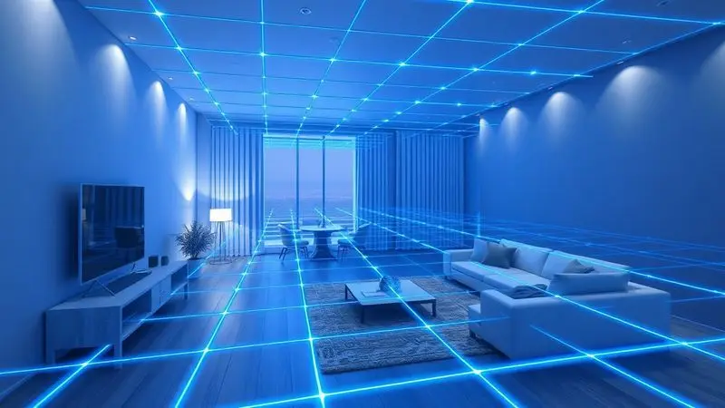
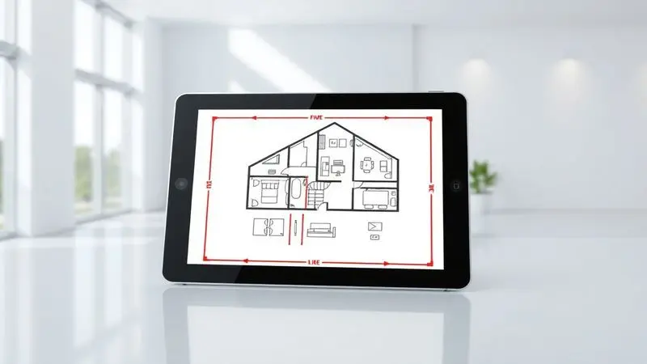
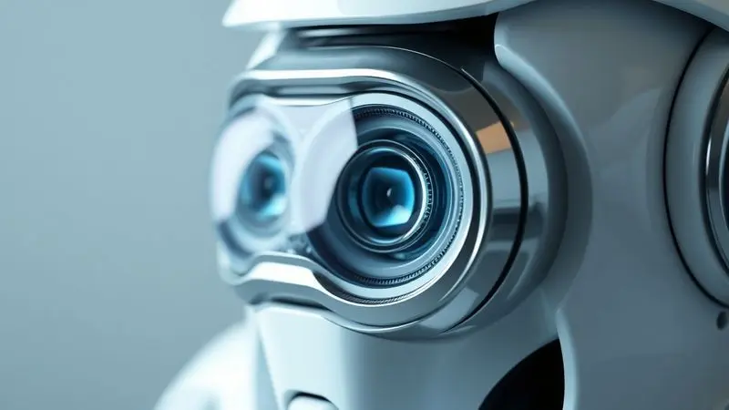

Manter a casa limpa todos os dias parece uma batalha perdida contra a poeira, não é mesmo?

Se você já viu um robô aspirador "batendo cabeça" nos móveis de forma aleatória, saiba que a tecnologia de mapeamento é o verdadeiro divisor de águas que transforma um simples gadget em um assistente de limpeza inteligente.

Neste guia completo, você vai entender exatamente como funcionam os sensores laser e as câmeras, as diferenças cruciais entre os tipos de navegação e como configurar zonas de exclusão para ter uma casa impecável sem mover um dedo.

<SummaryList products={frontmatter.top_products} />

## O que é o Mapeamento do Robô Aspirador e por que ele é essencial?

Imagine ter um zelador que conhece cada centímetro da sua casa e nunca esquece onde já limpou. É exatamente isso que o mapeamento oferece.

Mais do que uma tecnologia, é o cérebro do seu [robô aspirador](/robo-aspirador-bowai-e-bom/), criando um mapa digital do seu espaço que guia cada movimento com propósito.

Essa inteligência evita aquela sensação frustrante de ver o robô passar três vezes no mesmo lugar enquanto ignora o canto mais sujo. Ele aprende a distribuição dos seus móveis, reconhece obstáculos e planeja rotas que economizam tempo e energia. O resultado?

Uma limpeza que parece ter sido feita por alguém que conhece todos os seus segredos, não por uma máquina perdida.

## Como funciona o mapeamento na prática? As principais tecnologias de navegação

<ProductBox 
  title={frontmatter.top_products[0].title} 
  image={frontmatter.top_products[0].image} 
  link={frontmatter.top_products[0].link} 
/>

O segredo está em como o robô "enxerga" o mundo. Enquanto [modelos básicos](/como-funciona-o-robo-aspirador/) se movem como um turista perdido em uma cidade desconhecida, os robôs com mapeamento navegam como um GPS humano, com visão 360 graus.

### Tecnologia LiDAR: O "olho" laser de alta precisão

Pense em um robô que literalmente mede cada centímetro do seu ambiente. O LiDAR emite pulsos de luz laser que ricocheteiam nas superfícies, calculando distâncias com precisão milimétrica.

É como se seu aspirador tivesse um raio X para o chão da sua casa, criando mapas em 3D que mostram não apenas onde os móveis estão, mas a altura deles.

Essa precisão cirúrgica significa que seu robô nunca mais vai ficar preso entre as pernas da cadeira ou ignorar o espaço estreito atrás do sofá. Ele sabe exatamente o que cabe onde, adaptando sua rota em tempo real para cobrir até os recantos mais esquecidos.

### Navegação Visual (vSLAM): O uso de câmeras inteligentes

Aqui, seu robô ganha olhos. A tecnologia vSLAM utiliza câmeras que constantemente fotografam o ambiente, comparando imagens para construir um mapa e localizar-se nele.

É o mesmo princípio que você usa quando volta a um restaurante e reconhece a decoração para saber onde está sentado.

Essa abordagem visual permite que o robô identifique objetos específicos, aprendendo que "aquela mancha escura perto da porta" é o tapete que deve ser evitado ou que "aquela área clara" é o corredor que precisa de atenção extra.

Ele não apenas limpa, mas compreende os espaços que habita.

### Giroscópio e Sensores Infravermelhos: A navegação de entrada

Muitos modelos combinam essas tecnologias de orientação básica com sistemas de mapeamento mais avançados.

O giroscópio funciona como uma bússola interna, mantendo o robô consciente da direção em que está se movendo, enquanto os sensores infravermelhos atuam como mãos preventivas que "sentem" obstáculos antes do contato.

Essa combinação garante que mesmo durante a limpeza noturna ou em áreas com pouca luz, seu ajudante robótico navegue com confiança, detectando degraus e objetos baixos que poderiam passar despercebidos.

## 5 Vantagens Imbatíveis de um Robô com Sistema de Mapeamento

Essas tecnologias não são apenas recursos técnicos, são promessas cumpridas de uma vida mais fácil. Aqui está o que realmente muda quando seu robô deixa de ser cego e começa a enxergar.

### 1. Limpeza Estruturada em "S" vs. Movimentos Aleatórios

Esqueça o zigue-zague caótico. Com mapeamento, seu robô traça linhas paralelas perfeitas, como um agricultor arando seu campo. Esse padrão sistemático em "S" significa zero sobreposição desnecessária e nenhuma área esquecida.

Em vez de gastar bateria repetindo caminhos, cada movimento tem propósito, cobrindo 100% do piso na primeira passada.

### 2. Criação de Zonas de Exclusão e Paredes Virtuais

Finalmente, você tem o controle. Através do aplicativo, desenha limites invisíveis que seu robô respeita religiosamente. Aquele tapete de pêlo alto que sempre emperrava? Zona de exclusão. O quarto do bebê que precisa de silêncio durante a soneca? Paredes virtuais.

É como dar instruções detalhadas a um funcionário perfeccionista que nunca esquece seus pedidos.

### 3. Retomada Inteligente: Ele sabe exatamente onde parou

Já precisou recarregar no meio da faxina e, ao retornar, não sabia por onde continuar? Seu [robô com mapeamento](/robo-aspirador-liectroux-xr500-e-bom/) nunca tem essa dúvida. Ele memoriza o ponto exato onde interrompeu, retornando para completar o serviço com eficiência militar.

Em casas maiores, essa função é a diferença entre uma limpeza completa em uma sessão ou áreas permanentemente negligenciadas.

### 4. Limpeza Personalizada por Cômodos Selecionados

Por que gastar energia limpando o escritório vazio se a cozinha precisa de atenção urgente? Agora você pode programar limpezas por ambiente, direcionando o poder de sucção onde realmente importa. Mais sujeira na sala de estar após uma festa?

Programa potência máxima apenas lá. É a personalização que transforma um eletrodoméstico em um serviço de limpeza sob demanda.

### 5. Relatórios Detalhados e Histórico de Cobertura

Aqui está a verdadeira paz de espírito. Seu aplicativo mostra um mapa colorido exibindo onde o robô passou, quanto tempo dedicou a cada cômodo e até áreas que demandaram mais esforço. Não é mais preciso adivinhar se a limpeza foi completa, você tem evidência visual.

É a satisfação de ver o trabalho bem feito, mesmo quando você estava no escritório.

## Passo a Passo: Como realizar o primeiro mapeamento da sua casa com sucesso

O primeiro mapeamento é o ritual de iniciação do seu novo ajudante. Reserve 30 minutos para preparar o ambiente como se fosse receber um fotógrafo profissional: retire brinquedos, levante cabos soltos e certifique-se de que portas estejam abertas para acesso total.

No aplicativo, selecione "Novo Mapeamento" e acompanhe a exploração inicial. Evite mover móveis durante esse processo, seu robô está criando o mapa mental que usará pelos próximos meses.

Assim que o mapeamento estiver completo, aproveite para nomear os cômodos e configurar suas preferências, estabelecendo a parceria perfeita desde o primeiro dia.

## Desafios Comuns: O que pode atrapalhar a precisão do mapeamento?

<ProductBox 
  title={frontmatter.top_products[1].title} 
  image={frontmatter.top_products[1].image} 
  link={frontmatter.top_products[1].link} 
/>

Como qualquer sistema inteligente, existem fatores que podem confundir seu robô. Reconhecê-los é o primeiro passo para evitá-los.

### Espelhos e superfícies reflexivas: O inimigo do laser?

Superfícies altamente reflexivas, como espelhos de parede inteira ou pisos de mármore polido, podem fazer com que os lasers do LiDAR se percam em reflexos. O mesmo vale para câmeras que encontram seu próprio reflexo. A solução?

Modelos que combinam múltiplas tecnologias navegam melhor nesses ambientes, usando sensores de proximidade como backup quando a visão principal encontra um espelho.

### Mudanças constantes de móveis e objetos no chão

Seu robô ama consistência. Quando você troca a mesa de centro de lugar ou deixa uma caixa no meio da sala por dias, ele nota. Embora modelos modernos se adaptem a mudanças menores, reorganizações radicais podem exigir um novo mapeamento.

Pense nisso como reconectar com um amigo após uma reforma, é preciso tempo para reaprender o espaço.

## Vale a pena investir em um robô com mapeamento? (Comparativo de Custo-Benefício)

<ProductBox 
  title={frontmatter.top_products[2].title} 
  image={frontmatter.top_products[2].image} 
  link={frontmatter.top_products[2].link} 
/>

A pergunta verdadeira é: qual valor você atribui ao seu tempo e paz mental? [Robôs com mapeamento](/melhor-robo-aspirador-com-mapeamento/) custam mais, mas transformam horas mensais de limpeza em minutos de configuração.

Enquanto modelos básicos exigem que você os mova de cômodo em cômodo e espere que cubram tudo (eventualmente), um robô mapeado trabalha enquanto você dorme, trabalha ou relaxa.

Para [apartamentos pequenos](/robo-aspirador-kabum-smart-100-e-bom/), a diferença pode ser menos impactante. Para casas com múltiplos cômodos, pisos diferentes e móveis valiosos, o mapeamento não é um luxo, é uma necessidade.

Ele evita danos, economiza eletricidade e, mais importante, cumpre sua promessa: limpeza verdadeiramente automática.

## Manutenção dos Sensores: Como garantir que seu robô nunca se perca

Esses olhos eletrônicos precisam de cuidado simples mas regular. Uma vez por mês, passe um [pano macio e seco](/como-limpar-o-robo-aspirador/) sobre as cúpulas dos sensores laser e as lentes das câmeras. Verifique se não há fiapos de tapete ou cabelos acumulados ao redor dos sensores infravermelhos.

Mantenha o software atualizado, as fabricantes frequentemente melhoram os algoritmos de navegação através de atualizações gratuitas. Com esses poucos minutos de manutenção, você garante que seu robô continue enxergando o mundo com a mesma clareza do primeiro dia.

## Perguntas Frequentes sobre Mapeamento de Robôs (FAQ)

Preciso refazer o mapeamento se comprar um móvel novo?
A maioria dos modelos reconhece mudanças menores e ajusta-se automaticamente. Para reformas significativas, um novo mapeamento garante precisão máxima.

O mapeamento funciona no escuro?
Robôs com LiDAR funcionam perfeitamente, pois usam sua própria luz. Modelos baseados em câmeras precisam de iluminação normal.

Posso ter múltiplos mapas para diferentes andares?
Modelos premium memorizam mapas separados e automaticamente reconhecem em qual andar estão quando você os transporta.

E se perder a conexão WiFi durante a limpeza?
O mapeamento acontece localmente no robô, então ele continua navegando com precisão. Você apenas perde o controle remoto até a reconexão.

## Conclusão: O futuro da limpeza automatizada na sua casa

O mapeamento não é apenas uma tecnologia, é a ponte entre a automação mecânica e a inteligência verdadeiramente útil.

Quando seu robô deixa de ser um acessório que se move aleatoriamente e se torna um assistente que compreende seu espaço, algo profundo muda em sua rotina.

A ansiedade de "será que realmente limpou tudo?" desaparece, substituída pela confiança de sistemas que relatam seu trabalho. O tempo gasto supervisionando dá lugar a momentos genuínos de descanso ou produtividade.

E aquela sensação sutil de que a casa está sempre pronta para receber visitas inesperadas torna-se um conforto constante.

Investir em um [robô com mapeamento](/qual-o-robo-aspirador-mais-potente/) é investir em uma parceria. Ele aprende seus hábitos, respeita seus espaços e evolui com suas necessidades.

Enquanto você vive sua vida, ele mantém discretamente o palco preparado, não como uma máquina, mas como um membro silencioso e eficiente da casa. O futuro da limpeza não é sobre robôs mais rápidos, é sobre robôs que compreendem.

E compreender é a verdadeira forma de servir.