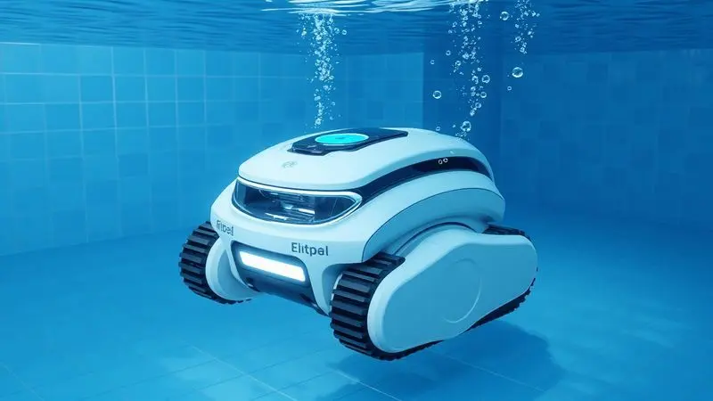
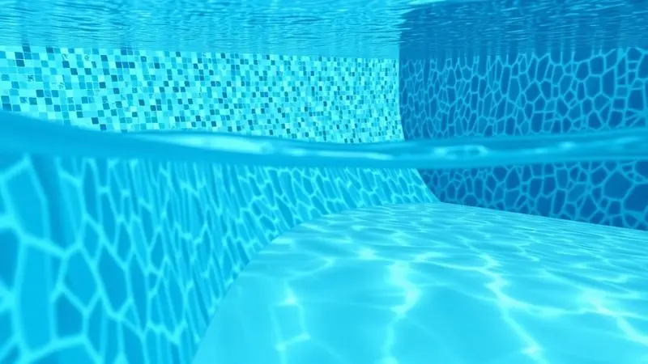
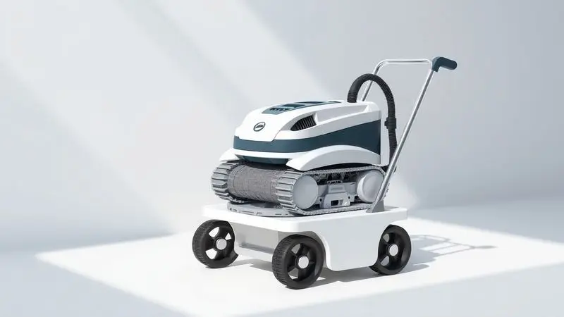

Imagine seu próximo final de semana sem aquela tarefa inevitável de esfregar o fundo da piscina. Sem se curvar por horas manuseando mangueiras pesadas.

A limpeza manual não cansa só o corpo, ela também deixa passar as partículas mais finas que deixam sua água com aquele aspecto leitoso. A boa notícia é que a tecnologia chegou para transformar essa obrigação em um simples toque no aplicativo.

Neste guia, você vai descobrir como um robô para limpeza de piscina funciona na prática, as vantagens reais que vão além do tempo economizado e, principalmente, o que considerar para escolher o seu parceiro ideal na missão de ter uma água cristalina com esforço zero.

<SummaryList products={frontmatter.top_products} />

## O que é um robô para limpeza de piscina e como ele funciona?

Pense em um assistente leal que mergulha na sua piscina e faz uma varredura completa por você. Esse é o robô de limpeza.

Um dispositivo automatizado que combina sistemas de aspiração, escovação e filtragem para remover desde folhas caídas até a poeira mais fina que se instala no fundo e nas paredes. Muitos modelos seguem cronogramas programáveis.

Você define o horário e ele entra em ação sozinho, mantendo a piscina sempre pronta para o mergulho. A energia vem de bateria recarregável ou conexão direta, enquanto a inteligência de navegação garante que cada cantinho seja coberto.

A verdadeira conquista aqui não é apenas a automação, mas a recuperação do seu tempo livre.

## A anatomia do robô: motores, escovação e sistemas de filtragem

A eficiência desse pequeno gigante vem de uma combinação precisa de componentes. Motores potentes garantem o movimento e a força de sucção.

Escovas estrategicamente posicionadas desgrudam a sujeira incrustada, enquanto os sistemas de filtragem trabalham como um pente fino, capturando os detritos e garantindo que só água limpa volte para a piscina.

Este é o coração da operação automatizada que mantém seu espaço de lazer sempre convidativo.

### Por que ele retém até 4 vezes mais sujeira que o aspirador comum?

Enquanto um aspirador tradicional muitas vezes apenas movimenta a sujeira, os robôs modernos são projetados para capturá-la de verdade.

A resposta está em seus sistemas de filtragem avançados, que usam cartuchos ou espumas densas capazes de reter partículas microscópicas. O movimento meticuloso e programado permite que alcancem cada curva e esquina, áreas que normalmente são ignoradas na limpeza manual.

Este combo de tecnologia resulta em uma eficiência tão elevada que pode reter até quatro vezes mais impurezas, transformando não só a clareza da água, mas também a saúde do ambiente aquático.

## 7 Vantagens imbatíveis de automatizar a limpeza da sua piscina

Automatizar essa tarefa vai muito além da mera conveniência. É sobre recuperar preciosas horas do seu fim de semana, garantir uma água consistentemente limpa e reduzir o uso de químicos, já que menos matéria orgânica se decompõe na água.

### Praticidade e economia de água: o impacto no seu bolso e no meio ambiente

A tecnologia inteligente desses robôs significa economia em dobro. Diferente dos métodos tradicionais que podem desperdiçar litros de água em cada limpeza, eles utilizam uma quantidade mínima e direcionada.

Isso se traduz em uma conta de água mais leve no final do mês e, ao mesmo tempo, em um consumo consciente de um recurso vital. Muitos modelos ainda operam com uma eficiência energética notável, combinando baixo consumo com operação silenciosa.

O resultado é um investimento que cuida do seu lazer, do seu orçamento e do planeta.

## O robô limpa paredes e bordas? Conheça os diferentes ciclos de limpeza

Esta é uma das dúvidas mais comuns. A resposta é que a maioria dos modelos atuais é projetada justamente para essa tarefa completa.

Muitos dispositivos oferecem ciclos de limpeza programáveis onde você pode escolher focar apenas no fundo, ou incluir uma escovação detalhada das paredes e linha d'água.

Sensores inteligentes ajudam o robô a reconhecer onde está na piscina, ajustando a tração e a pressão das escovas conforme a superfície.

O objetivo é garantir que não sobre um único ponto de algas ou acúmulo de sujeira, tornando o processo não só mais prático, mas também mais eficaz do que qualquer esforço manual.

## Como escolher o robô ideal: o que observar antes da compra?

Escolher o parceiro certo para sua piscina envolve alguns critérios fundamentais. Comece pela compatibilidade com o tamanho e formato do seu espaço aquático, o tipo de sujeira predominante (folhas, areia, poeira) e a eficiência no consumo de energia.

A facilidade de uso e manutenção também são decisivos para uma experiência sem frustrações.

### Tamanho da piscina e tipo de revestimento (Alvenaria, Vinil ou Fibra)

Essas duas informações são o ponto de partida. Para piscinas maiores, você precisa de um robô com autonomia e poder de cobertura adequados. Já para as menores, um modelo compacto pode ser mais ágil e econômico.

Quanto ao revestimento, cada material pede um cuidado específico. Superfícies de alvenaria, mais ásperas, exigem escovas resistentes. Já o vinil e a fibra, mais delicados, são melhor atendidos por modelos projetados para não riscar ou danificar o material.

Escolher com essas variáveis em mente é a garantia de um investimento acertado.

### Robô com fio vs. Robô sem fio (a bateria): qual o melhor?

Cada opção atende a um perfil diferente. Robôs com fio geralmente oferecem sucção mais poderosa e a confiança de uma conexão contínua com a energia elétrica. A limitação fica no cabo, que precisa ter comprimento adequado e requer atenção durante o manuseio.

Já os [modelos sem fio](/robo-aspirador-electrolux-erb11-e-bom/) brilham na liberdade: sem fios para enrolar, são mais fáceis de colocar, retirar e guardar. A [autonomia da bateria](/como-carregar-aspirador-robo/) é o ponto de atenção, especialmente para piscinas muito grandes.

A escolha final depende de quanto valor você dá à potência constante versus a [praticidade absoluta](/robo-aspirador-ilife-e-bom/).

Agora que você já conhece os critérios, que tal ver [alguns dos modelos](/melhor-robo-aspirador-piscina/) que estão conquistando os proprietários de piscina?

## Melhores Robôs de Piscina para Investir Atualmente

O mercado oferece opções que combinam eficiência comprovada com tecnologia acessível. Marcas consolidadas como Dolphin, Hayward e Zodiac se destacam pela durabilidade e desempenho consistente, cada uma com seus pontos fortes.

### Robô Aspirador de Piscina Dolphin: Referência em Durabilidade

<ProductBox 
  title={frontmatter.top_products[0].title} 
  image={frontmatter.top_products[0].image} 
  link={frontmatter.top_products[0].link} 
/>

A linha Dolphin, da Maytronics, é sinônimo de robustez no setor. Construídos com materiais de alta qualidade, estes robôs são feitos para resistir ao uso contínuo e às condições químicas da piscina.

A tecnologia por trás, como a navegação digital inteligente e sistemas de filtragem em múltiplas camadas, não só entrega uma limpeza profunda, como também contribui para a longevidade impressionante do equipamento.

Muitos usuários relatam anos de serviço fiel sem falhas significativas. Cuidados básicos, como a limpeza regular dos filtros após o uso, são o segredo para maximizar essa vida útil já notável.

### Robô Aspirador de Piscina Sodramar: Alta Performance e Tecnologia

<ProductBox 
  title={frontmatter.top_products[1].title} 
  image={frontmatter.top_products[1].image} 
  link={frontmatter.top_products[1].link} 
/>

Para quem busca eficiência aliada à tecnologia moderna, a Sodramar se apresenta como uma excelente opção. Modelos como o Wave 100 e o RB4i são capazes de aspirar e escovar fundo e paredes em poucos ciclos, entregando uma limpeza completa rapidamente.

O RB4i, por exemplo, adiciona a conveniência do controle via aplicativo via Bluetooth, colocando o agendamento de limpeza na palma da sua mão.

A curva de aprendizado pode ter uma pequena etapa inicial de familiarização, mas a maioria dos usuários rapidamente se adapta à operação intuitiva. O resultado é uma economia tangível de tempo, água e produtos químicos, tornando-o um investimento prático e sustentável.

### Robô Aspirador Nautilus Aspira Max: Versatilidade para o Dia a Dia

<ProductBox 
  title={frontmatter.top_products[2].title} 
  image={frontmatter.top_products[2].image} 
  link={frontmatter.top_products[2].link} 
/>

Se sua busca é por um parceiro eficiente e versátil para a rotina, o Nautilus Aspira Max merece sua atenção. Essa linha automatiza completamente a aspiração de fundos e paredes, liberando seus finais de semana.

Com opções como os modelos 7320 e 5201, ela atende piscinas de várias dimensões e profundidades, mostrando ampla compatibilidade. Um dos seus grandes atrativos é o consumo energético modesto, que varia entre 40W e 100W, uma economia que você sente na conta de luz.

É importante verificar a compatibilidade do modelo com o tipo de fundo da sua piscina (alguns, como o 5201, são indicados apenas para fundos planos), mas dentro das especificações corretas, ele se destaca pela praticidade e custo-benefício.

## Segurança e Manutenção: Dicas para seu robô durar muito mais

Para garantir que seu investimento trabalhe por você por muitos anos, alguns cuidados simples fazem toda a diferença. Após cada uso, reserve um minuto para [limpar os filtros](/como-limpar-o-robo-aspirador/), evitando que a sujeira acumulada sobrecarregue o motor.

Verifique periodicamente o estado das escovas e partes móveis, pois o desgaste natural pode ser acelerado por detritos presos. Na hora de guardar, escolha um local seco, longe da luz solar direta, para preservar os componentes eletrônicos e a estrutura.

Seguir as orientações do manual do fabricante não é apenas uma recomendação, é a garantia de segurança e da máxima eficiência do seu equipamento ao longo do tempo.

## Perguntas Frequentes (FAQ) sobre Robôs de Piscina

É natural ter dúvidas antes de trazer uma nova tecnologia para sua rotina. Aqui, respondemos às questões mais comuns para que você tome sua decisão com total confiança.

### O robô de piscina gasta muita energia elétrica?

Pelo contrário, a eficiência energética é uma das grandes vantagens. Estes robôs consomem significativamente menos eletricidade do que uma bomba de filtragem tradicional funcionando por horas.

Muitos modelos possuem modos de operação inteligentes que otimizam o trajeto e o tempo de limpeza, usando apenas a energia necessária. Ao escolher, observe a classificação de eficiência do modelo, assim você terá desempenho sem sustos na conta no final do mês.

### Posso deixar o robô dentro da água o tempo todo?

Não é recomendado. Embora sejam à prova d'água, a exposição contínua à água e, principalmente, aos produtos químicos como o cloro, pode causar corrosão e desgaste prematuro de componentes ao longo dos meses. O ideal é retirá-lo da piscina após cada ciclo de limpeza.

Guardá-lo seco e protegido mantém todas as suas partes em perfeito estado de funcionamento, pronto para a próxima tarefa.

### Robô de piscina vale a pena para piscinas pequenas?

Absolutamente. Para piscinas pequenas, a agilidade e precisão de um robô são ainda mais impactantes.

Eles acessam cantos compactos com facilidade e completam a limpeza em um ciclo rápido, eliminando justamente aquele trabalho manual que parece desproporcional ao tamanho do espaço.

Manter a limpeza regular com um robô não só economiza seu esforço, como também preserva a qualidade da água e a integridade do revestimento, tornando-se um investimento inteligente independentemente do volume de água.

## Conclusão

O futuro da manutenção de piscinas não é apenas automático, é sobre reconquistar o propósito do seu espaço de lazer.

A tecnologia dos robôs limpadores transforma uma obrigação trabalhosa em uma gestão discreta e eficiente, liberando você para o que realmente importa: momentos de relaxamento e diversão com família e amigos.

Mais do que máquinas, eles são parceiros que garantem uma água cristalina dia após dia, com consistência que a limpeza manual raramente oferece.

Ao escolher o [modelo certo](/robo-aspirador-idali-life-e-bom/) para sua piscina, você não está apenas adquirindo um eletrodoméstico, está investindo em mais qualidade de tempo e em uma experiência de uso da piscina sem preocupações.

O mergulho refrescante em uma água perfeita pode, finalmente, ser a única coisa em que você precisa pensar.