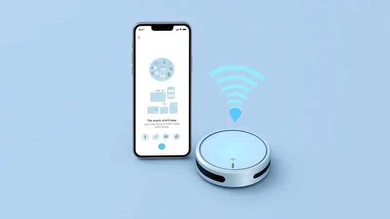
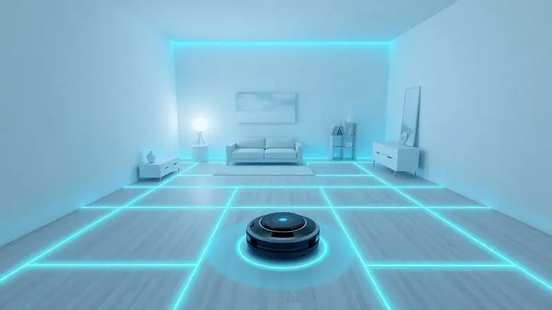
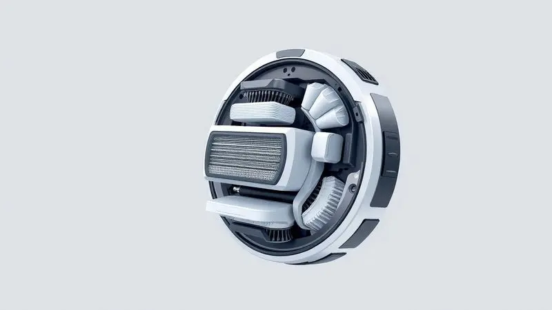

Você acabou de adquirir um robô aspirador Xiaomi e quer saber como tirar o melhor proveito dele? Ou talvez já tenha um, mas está com dúvidas sobre a configuração do aplicativo Mi Home ou a manutenção correta dos filtros?

Ter uma casa limpa sem esforço é o sonho de muitos, e os dispositivos da Xiaomi são referência em tecnologia e custo-benefício.

Neste guia definitivo, você vai aprender desde o passo a passo da configuração inicial até dicas avançadas de manutenção e segredos sobre o uso de produtos de limpeza, garantindo que seu robô funcione perfeitamente por anos.

<SummaryList products={frontmatter.top_products} />

## Por que os Robôs Aspiradores Xiaomi são Líderes de Mercado?

Imagine chegar em casa após um dia cansativo e encontrar todos os cômodos impecáveis, sem que você tenha movido um dedo. Essa é a promessa que faz dos robôs Xiaomi líderes no mercado: uma combinação de inteligência prática que entende o ritmo da sua vida.

Eles não apenas limpam, planejam rotas inteligentes que economizam tempo e energia. Pense no mapeamento que reconhece os cantos mais complicados da sua sala, ou no aplicativo que permite programar a limpeza enquanto você está no trânsito.

Essa versatilidade, acessível em diferentes faixas de preço, transforma a limpeza doméstica de uma obrigação em uma experiência quase mágica de bem-estar.

## Xiaomi Robot Vacuum S20: Conheça as Novidades do Modelo de Entrada

<ProductBox 
  title={frontmatter.top_products[0].title} 
  image={frontmatter.top_products[0].image} 
  link={frontmatter.top_products[0].link} 
/>

Um exemplo perfeito dessa filosofia de acessibilidade inteligente é [o S20](/robo-aspirador-xiaomi-s20-e-bom/), que chegou para democratizar ainda mais a automação doméstica. Com seus 5000Pa de sucção, ele não só remove sujeira aparente, mas aquela areia fina que parece teimosamente grudada no tapete.

A função Mop com seu movimento em "Y" simula o cuidado manual, enquanto o controle eletrônico da água garante que cada mancha receba a atenção necessária, sem encharcar o piso. Imagine seu chão de cerâmica brilhando como recém-lavado, enquanto você faz outras coisas.

O mapeamento a laser em 360° garante que ele conheça cada centímetro do seu espaço, evitando choques com móveis e objetos delicados.

Embora não tenha todos os recursos dos modelos premium, para quem está começando nesse universo, é como ter um assistente pessoal de limpeza que cabe no orçamento.

## Passo a Passo: Como Configurar o Robô no Aplicativo Mi Home

A magia começa com uma conexão simples. Baixe o Mi Home na loja de aplicativos, crie sua conta e [prepare sua rede Wi-Fi](/como-conectar-robo-aspirador-xiaomi-no-wifi/) (lembre que ele precisa da faixa 2.4GHz). Agora, ligue o robô e pressione o botão de Wi-Fi até ouvir o sinal sonoro.

No aplicativo, selecione "Adicionar Dispositivo", escolha seu modelo e siga as instruções que aparecem na tela.

Em poucos minutos, você já pode programar horários de limpeza, como aquele momento em que todos saem para trabalhar ou estudar, e quando voltam, a casa está pronta para recebê-los.

## Como Usar as Funções de Mapeamento Inteligente e Barreiras Virtuais

Uma vez conectado ao Mi Home, seu robô revela sua verdadeira inteligência. Após a primeira limpeza completa, ele cria um mapa detalhado da sua casa que você visualiza diretamente no aplicativo.

É quando a personalização começa: você pode determinar especificamente quais cômodos quer limpar em determinados horários, ou definir zonas proibidas com as barreiras virtuais.

Aquele tapete especial da sala, o cantinho dos brinquedos das crianças ou uma área com muitos fios podem ser protegidos com simples linhas traçadas na tela do seu celular. É como ensinar ao robô os segredos da sua casa, para que ele limpe com respeito e precisão.

## Manutenção e Limpeza: Como Prolongar a Vida Útil do seu Dispositivo

Para que essa parceria dure anos, alguns cuidados simples fazem toda diferença.

O segredo está na rotina: esvaziar o compartimento de sujeira após cada ciclo, verificar se nada está obstruindo as rodas e, claro, dar atenção especial aos componentes que fazem o trabalho pesado.

### Filtro HEPA Xiaomi: Onde Fica e Quando Trocar?

<ProductBox 
  title={frontmatter.top_products[1].title} 
  image={frontmatter.top_products[1].image} 
  link={frontmatter.top_products[1].link} 
/>

Localizado geralmente na parte inferior ou traseira do robô, o filtro HEPA é o guardião da qualidade do ar na sua casa. Ele retém partículas minúsculas, ácaros e alérgenos que você nem vê, mas que afetam sua respiração.

A troca é recomendada a cada três meses, porém seu robô pode avisar antes se notar redução na potência de sucção ou se odores começarem a surgir.

Alguns modelos oferecem filtros laváveis, mas atenção: a secagem completa é essencial antes da reinstalação, para evitar mofo e danos.

### Escovas Laterais e Principais: Guia de Limpeza e Reposição

<ProductBox 
  title={frontmatter.top_products[2].title} 
  image={frontmatter.top_products[2].image} 
  link={frontmatter.top_products[2].link} 
/>

A escova principal, aquela que varre os detritos para dentro do aspirador, [precisa de limpeza quinzenal](/como-limpar-o-robo-aspirador/) para remover fios de cabelo e fiapos acumulados. Com cuidado, desenrole esses materiais sem puxar com força excessiva.

A substituição completa deve acontecer entre 6 e 12 meses, dependendo do uso. Já as escovas laterais, responsáveis por alcançar cantos junto às paredes, geralmente duram de 3 a 6 meses.

Ao buscar kits de reposição, priorize as peças originais Xiaomi para garantir o encaixe perfeito e a durabilidade que você espera. A compatibilidade com seu [modelo específico](/robo-aspirador-wap-w300-como-usar/) é crucial para manter o desempenho inalterado.

## Pode Usar Desinfetante ou Outros Produtos de Limpeza no Robô Xiaomi?

Para proteger o investimento feito nessas peças de reposição, a escolha dos produtos de limpeza é estratégica. Os robôs Xiaomi são projetados para funcionar otimamente com água ou soluções específicas recomendadas pelo fabricante.

A tentação de adicionar desinfetantes comuns é compreensível, mas pode corroer componentes internos e invalidar sua garantia. Se deseja uma desinfecção profunda, o caminho mais seguro é aplicar esses produtos manualmente nas superfícies após a passagem do robô.

Assim, você mantém a eficiência da limpeza diária e complementa com tratamentos específicos quando necessário, preservando a saúde do seu dispositivo a longo prazo.

## Assistência Técnica Xiaomi no Brasil: Como Proceder em Caso de Defeitos

Mesmo com todos os cuidados, imprevistos acontecem. Se seu robô apresentar algum problema, seu primeiro aliado é a garantia do produto. Consulte a documentação que acompanhou o aparelho para verificar prazos e cobertura.

Dentro do período garantido, o suporte técnico da Xiaomi oferece múltiplos canais: telefone, chat online e e-mail. Em diversas cidades brasileiras há também autorizadas para atendimento presencial.

Guarde sempre a nota fiscal e todos os acessórios originais, essa documentação acelera significativamente qualquer processo de assistência, garantindo que você volte a contar com seu parceiro de limpeza o mais rápido possível.

## Inovações Tecnológicas: Limpeza com Água Quente e Secagem Automática

<ProductBox 
  title={frontmatter.top_products[3].title} 
  image={frontmatter.top_products[3].image} 
  link={frontmatter.top_products[3].link} 
/>

Para entender até onde a tecnologia Xiaomi pode levar sua experiência de limpeza, observe modelos como o Mi Home Robot Vacuum and Mop 6. Eles utilizam água aquecida a 80°C para higienizar os panos de limpeza, eliminando bactérias com eficiência quase hospitalar.

A [base de autolimpeza](/melhor-robo-aspirador-autolimpante/) não só remove resíduos acumulados, mas seca os componentes automaticamente, prevenindo mofo e odores.

Sistemas inteligentes ajustam a umidade do pano conforme o tipo de piso, evitando excessos que poderiam danificar madeiras ou deixar cerâmicas escorregadias.

A configuração inicial pode demandar um pouco mais de atenção, mas o resultado é um nível de limpeza que antes só se alcançava com serviços profissionais especializados.

## FAQ: Respostas Rápidas para as Dúvidas Mais Comuns dos Usuários

Vamos esclarecer algumas dúvidas que costumam surgir na convivência com seu novo assistente:

*   *Ele limpa todos os tipos de piso?* Sim, desde madeira e cerâmica até carpetes de altura moderada, ajustando automaticamente a potência.

*   *Quanto dura a bateria?* Geralmente oferece autonomia para até duas horas de limpeza contínua, suficiente para residências pequenas e médias.

*   *É difícil configurar?* O aplicativo Mi Home guia você passo a passo, tornando o processo acessível mesmo para quem não é familiarizado com tecnologia.

*   *E se algo der errado?* O suporte online da Xiaomi tem se mostrado ágil e eficiente para solucionar a maioria das questões técnicas.

## Conclusão

Ao longo deste guia, você descobriu como transformar o [robô aspirador](/como-funciona-o-robo-aspirador-de-piscina/) Xiaomi de um simples eletrodoméstico em um verdadeiro parceiro doméstico.

Desde a [escolha do modelo ideal](/melhor-robo-aspirador-xiaomi/) para seu espaço até os segredos de manutenção que garantem anos de serviço fiel, cada informação compartilhada teve um objetivo: devolver seu tempo.

O tempo que antes gastava varrendo, passando pano ou se preocupando com poeira alérgica, agora é seu para dedicar ao que realmente importa.

A tecnologia avançada de mapeamento, a inteligência das barreiras virtuais e a promessa de inovações como a água quente não são apenas especificações técnicas.

São ferramentas que, quando bem compreendidas e utilizadas, criam um ambiente de bem-estar quase imperceptível, mas profundamente transformador. Sua casa limpa não é mais uma conquista pessoal, é um dado adquirido, uma constante no seu dia a dia.

O investimento em um robô Xiaomi, portanto, vai muito além do produto físico. É um investimento na qualidade do seu ar, na tranquilidade da sua rotina e, principalmente, na liberdade de viver seu tempo com mais propósito.

Quando pensa nesses benefícios, percebe que a questão não é se vale a pena, mas por que você esperou tanto tempo para dar esse passo em direção a um lar mais inteligente e, consequentemente, uma vida mais leve.