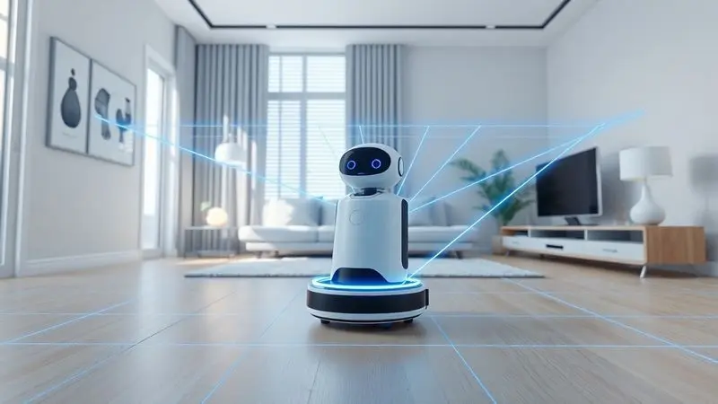
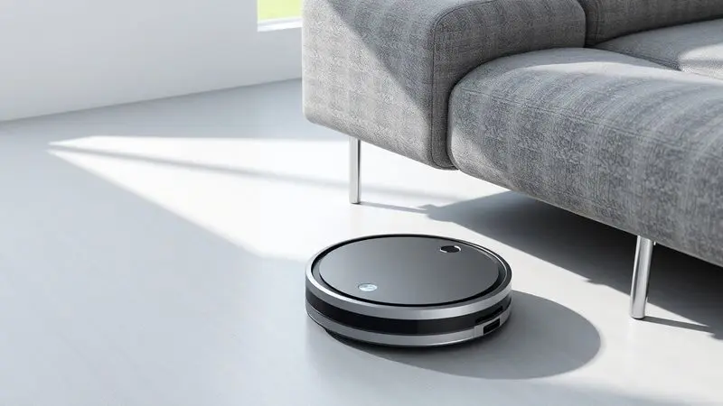
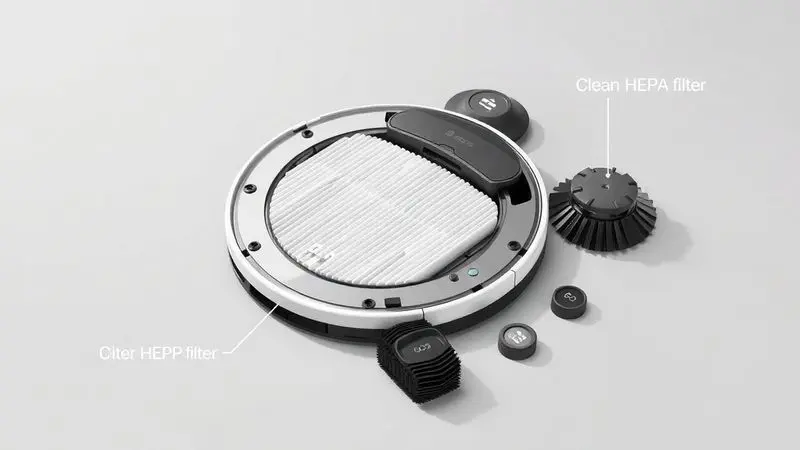

Imagine acordar sabendo que alguém já cuidou daquele chão cheio de migalhas da janta de ontem, enquanto você ainda estava no segundo sonho. Essa paz que parece luxo está mais acessível do que você imagina.

O segredo está em um assistente silencioso que aprende como sua casa funciona para trabalhar de forma inteligente, não apenas mais forte.

Você vai descobrir exatamente como essa tecnologia transforma pequenos gestos do dia a dia em tempo reconquistado para o que realmente importa.

<SummaryList products={frontmatter.top_products} />

## O que é um robô aspirador e como ele 'enxerga' a sua casa?

Pense no seu robô não como uma máquina cega, mas como um parceiro que precisa entender o espaço onde atua. Ele precisa saber onde estão os perigos (escadas), os obstáculos (pernas de mesa) e os cantos esquecidos (embaixo do sofá).

E é justamente essa capacidade de 'enxergar' que separa um mero brinquedo eletrônico de um verdadeiro aliado na limpeza.

### Tecnologia de Sensores: Do infravermelho ao mapeamento Laser (LiDAR)

Os modelos mais básicos utilizam sensores infravermelhos como sistemas de segurança. São como as mãos que tocam as paredes no escuro, impedindo colisões e protegendo-o de quedas. Mas a evolução acontece quando o robô se torna um cartógrafo da sua casa.

Com tecnologia LiDAR, ele emite um feixe laser que [mapeia centímetro por centímetro](/como-funciona-o-mapeamento-do-robo-aspirador/) do ambiente, criando um modelo 3D mental do seu espaço. O resultado prático?

Em vez de navegar em zigue-zague sem rumo, ele traça rotas lógicas, sabe exatamente qual área já limpou e otimiza cada movimento para economizar energia e tempo. Você assiste ao trabalho acontecer com uma precisão quase humana.

### Como funciona o sistema de sucção e as escovas rotativas

A 'visão' seria inútil sem a capacidade de limpar de verdade. Aqui entram dois componentes que trabalham em dupla perfeita. Primeiro, o motor cria um vácuo que suga a sujeira com força surpreendente para um aparelho tão compacto.

Mas é como se alguém tentasse aspirar um carpete encardido apenas com a força da sucção. As escovas rotativas são as parceiras essenciais que agitam as fibras, soltam os pelos grudados e direcionam tudo para o caminho da sucção.

Em pisos de madeira ou cerâmica, elas varrem para perto do aparelho. Em carpetes, mergulham nas profundezas para trazer à tona a sujeira escondida. Juntos, eles transformam movimento em limpeza genuína.

## 7 Vantagens comprovadas de ter um aspirador robô no dia a dia

Agora que você entende o funcionamento, a verdadeira magia aparece quando essa tecnologia encontra sua rotina.

A primeira vantagem não está na caixa, mas na sua agenda: programe a limpeza para as 10 da manhã de segunda-feira e encontre sua sala limpa ao voltar do trabalho. Enquanto ele trabalha, você reconecta com o sofá e um bom livro.

E sim, ele alcança aqueles lugares sob a cama que você só lembra na mudança de estação. A eficiência do mapeamento significa que cada centímetro quadrado recebe atenção, sem desperdiçar voltas desnecessárias.

Muitos modelos operam com um sussurro abaixo de 60 decibéis, permitindo ligá-lo durante uma reunião online sem constrangimentos. Para famílias com crianças pequenas, a limpeza diária reduz drasticamente ácaros e alérgenos.

Para quem tem pets, o fim da eterna guerra contra os pelos. E por fim, a economia mensal de horas que se transforma em tempo para um hobby, um descanso extra ou simplesmente não fazer nada com a consciência tranquila.

## Robô aspirador que passa pano (MOP): Realidade vs. Expectativa

<ProductBox 
  title={frontmatter.top_products[0].title} 
  image={frontmatter.top_products[0].image} 
  link={frontmatter.top_products[0].link} 
/>

E se esse assistente pudesse não apenas aspirar, mas também dar aquele brilho final no piso? Modelos como o DREAME D10 Plus e o Xiaomi Mi Robot Vacuum-Mop 2 prometem exatamente isso: aspirar primeiro, depois [passar um pano levemente umedecido](/aspirador-robo-philco-pas22p-mop-filtro-hepa-bivolt-e-bom/).

Para a manutenção diária, é uma revolução. Acordar com o café pronto e os pisos já aspirados e levemente lustrados tem um sabor diferente.

A verdade que você precisa saber: essa função não substitui a limpeza profunda manual com balde e esfregão para manchas teimosas ou áreas muito sujas. Pense nela como o equivalente a passar um pano úmido rápido após varrer.

Para apartamentos com piso frio que acumulam poeira diária, ou para manter o brilho entre uma faxina maior, ele performa maravilhas. Se suas expectativas estão alinhadas com manutenção, não com substituição total da faxina, você encontrará um aliado fiel.

## Guia de Compra: O que observar antes de investir?

Escolher seu robô é como escolher um colega de apartamento: precisa se encaixar no seu espaço e nas suas necessidades.

Quatro pilares sustentam essa decisão: potência para lidar com seus desafios, bateria para cobrir sua área, inteligência para navegar pelos seus móveis e silêncio para não perturbar sua paz.

### Potência de sucção (Pa) e nível de ruído

A potência, medida em Pascais (Pa), determina se o aparelho apenas coleta poeira solta ou realmente desafia um carpete entupido de pelos de gato. Valores de [2000Pa para cima](/robo-aspirador-makita-e-bom/) lidam bem com a maioria dos desafios domésticos. O ruído é o lado B dessa equação.

Um modelo que parece uma turbina de aviação pode cumprir sua função, mas você nunca o ligará quando estiver em casa. Procure equilíbrio: força suficiente para o trabalho, discrição suficiente para não se tornar uma presença intrusiva.

### Autonomia da bateria e tempo de recarga automático

Imagine seu robô começando entusiasmado a limpar a sala e 'morrendo' no corredor. Para evitar essa cena comum, a autonomia precisa acompanhar o tamanho da sua casa. Entre 60 a 120 minutos de funcionamento cobrem de 50 a 120m² com tranquilidade.

A beleza está no que acontece quando a bateria chega ao fim: ele encontra sozinho o caminho de volta para a base, se recarrega e pode até retomar exatamente de onde parou. Em 2 a 4 horas, está pronto para outra rodada.

É a inteligência que transforma uma limitação técnica em conveniência prática.

### Altura do aparelho e acessibilidade sob móveis

Essa é a medida mais prática e frequentemente esquecida. Seu sofá tem 8cm de altura livre? Seu robô tem 10cm? Então existe uma faixa de 2cm de sujeira acumulando embaixo dele para sempre.

A maioria dos móveis modernos permite espaços de 7 a 10cm, que é exatamente onde a maioria dos modelos se encaixa. Tire essa medida antes de comprar. Um robô que não passa sob sua cama ou seu sofá deixa de cumprir metade de sua missão.

Escolha um companheiro que realmente alcance todos os territórios do seu reino.

## Melhores opções de Robô Aspirador de Entrada (Custo-Benefício)

<ProductBox 
  title={frontmatter.top_products[1].title} 
  image={frontmatter.top_products[1].image} 
  link={frontmatter.top_products[1].link} 
/>

Iniciar nesse universo não precisa significar gastar uma fortuna. O [WAP Robot W90](/robo-aspirador-wap-w90-e-bom/) é o iniciante completo: aspira, varre e passa pano em um pacote acessível.

Sim, você precisará umedecer o pano manualmente, mas para apartamentos compactos, ele entrega muito pelo investimento.

O [Mondial Fast Clean Advanced RB-04](/robo-aspirador-mondial-rb-04-e-bom/) é o clássico confiável. Não tem mapeamento laser nem WiFi, mas limpa com honestidade e durabilidade. Já o Positivo Smart Robô Aspirador Wi-Fi adiciona conectividade ao jogo.

Controlar pelo celular e ver o histórico de limpeza traz um toque moderno.

Para quem quer um passo além ainda na faixa de entrada, o [Xiaomi Robot Vacuum S10](/robo-aspirador-xiaomi-s10-e-bom/) oferece a combinação perfeita: navegação inteligente que evita repetições e a função mop integrada. Todos esses modelos provam que a automação da limpeza cabe em diferentes orçamentos.

## Modelos Avançados: Mapeamento Inteligente e Integração com Alexa

<ProductBox 
  title={frontmatter.top_products[2].title} 
  image={frontmatter.top_products[2].image} 
  link={frontmatter.top_products[2].link} 
/>

Aqui a tecnologia mostra seu charme. Robôs como o Neatsvor X600 Pro não apenas limpam, mas aprendem. Com mapas digitais da sua casa, você pode definir 'zonas proibidas' (como a área da comida do pet) ou 'zonas de atenção redobrada' (como a cozinha).

Abra o aplicativo e veja exatamente quais rotas ele seguiu.

A integração com Alexa ou Google Assistant transforma comandos em conveniência pura. "Alexa, aspirar a sala" enquanto você está com as mãos ocupadas na massa do bolo. O investimento é maior, mas retorna em personalização e integração perfeita à sua casa inteligente.

É para quem quer não apenas um eletrodoméstico, mas um sistema que comunica, aprende e se adapta.

## Robô Aspirador e Pets: A solução definitiva para pelos de animais?

<ProductBox 
  title={frontmatter.top_products[3].title} 
  image={frontmatter.top_products[3].image} 
  link={frontmatter.top_products[3].link} 
/>

Se você compartilha sua casa com amigos peludos, conhece a batalha diária contra tapetes que parecem confeitados.

Os modelos ideais para essa missão têm pelo menos 3000Pa de sucção para arrancar pelos profundamente encravados e filtros HEPA que prendem alérgenos microscópicos.

A limitação prática é o reservatório: casas com múltiplos pets podem exigir esvaziamento diário. A recompensa é acabar com o ritual de passar o rolo removedor de pelos no sofá todos os dias.

Com mapeamento, você programa limpezas extras nos cômodos preferidos dos animais enquanto está no trabalho. Não é mágica, mas é o mais próximo que temos de um trégua na guerra contra a pelugem.

## Manutenção e Cuidados: Como fazer seu robô durar mais

Seu robô cuida da sua casa, e você precisa cuidar dele. A relação é simples: alguns minutos de atenção semanal garantem anos de serviço fiel. 

### Limpeza de filtros HEPA e escovas centrais

Os filtros HEPA são os pulmões do aparelho. [Limpá-los a cada 15 dias](/como-limpar-o-robo-aspirador/) (ou a cada mês em uso normal) mantém a sucção forte e o ar da sua casa realmente purificado. As escovas centrais são os cabelos do robô.

Fios humanos, fios de animais e fiapos naturalmente se enrolam nelas. Livrá-las desse emaranhado semanalmente mantém o giro livre e eficiente. Esses dois rituais rápidos são como trocar o óleo do carro. Previnem problemas maiores e mantêm tudo funcionando suavemente.

## Erros comuns: O que NÃO fazer com seu aspirador robô

Tratar seu robô como uma máquina indestrutível é o caminho mais rápido para a frustração. O maior erro é ignorar a manutenção básica que descrevemos acima. Um filtro entupido transforma um aspirador potente em um soprador de poeira.

Não espere que ele navegue por um campo minado de cabos soltos e brinquedos pequenos. Prepare o terreno antes de ligá-lo. E por mais tentador que seja, não o observe 24/7. Programe para limpar quando não estiver em casa.

Ele trabalha melhor sem plateia, e você aproveita melhor seu tempo livre sem microgerenciar cada movimento.

## Conclusão

Vale a pena? A resposta não está nas especificações técnicas, mas na transformação silenciosa da sua rotina. Um robô aspirador não é um luxo, é uma renegociação do seu tempo mais valioso. Troque minutos diários de vassoura e rodo por horas mensais reconquistadas.

Troque a ansiedade de receber visitas inesperadas com o chão sujo pela tranquilidade de saber que sua casa está sempre aceitável.

Para alguns, é a solução definitiva para alergias. Para outros, o alívio da eterna guerra contra pelos de animais. Para famílias ocupadas, é um aliado que trabalha nos bastidores. O investimento inicial retorna não apenas em limpeza, mas em paz mental.

Sua casa merece esse cuidado constante, e você merece o tempo que isso libera. Comece com um modelo de entrada que se encaixe no seu orçamento e espaço.

Em poucas semanas, você se perguntará como viveu tanto tempo sem esse companheiro silencioso que transforma tarefas em tempo livre.