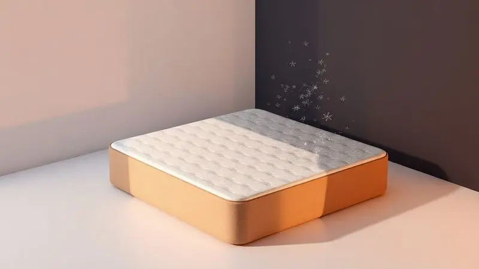

Você já gastou uma pequena fortuna em um bom colchão e agora precisa armazená-lo? O pensamento de ver seu investimento se deteriorar enquanto fica guardado pode tirar o sono de qualquer um.

Mas aqui está a verdade que ninguém conta: o armazenamento inadequado não apenas danifica seu colchão, ele transforma seu dinheiro suado em um problema de saúde.

Imagine abrir aquele espaço de armazenamento depois de seis meses e encontrar manchas de mofo, sentir aquele cheiro característico de umidade ou, pior ainda, perceber que seu colchão perdeu a forma e não oferece mais o apoio que sua coluna precisa.

É como comprar um carro zero e deixá-lo estacionado na chuva por um ano.

Neste guia, você vai aprender não apenas o passo a passo técnico, mas o jeito certo de pensar sobre o armazenamento do seu colchão.

Vamos desde a primeira ação (aquela limpeza que faz toda diferença) até escolher o local perfeito, com atenção especial para o tipo específico do seu colchão.

No final, você terá a segurança de saber que seu investimento está protegido, pronto para oferecer noites revigorantes quando você precisar.

<SummaryList products={frontmatter.top_products} />

## Por que o armazenamento correto é fundamental para seu colchão?

Pense no seu colchão como um atleta de elite. Assim como um corredor precisa de recuperação adequada entre treinos, seu colchão precisa de cuidados especiais durante o período em que não está em uso.

O armazenamento não é apenas 'guardar em algum lugar' - é preservar as características que fizeram você escolher aquele modelo específico.

Quando você investe em um bom colchão, está comprando anos de sono de qualidade, saúde postural e bem-estar. Deixá-lo exposto aos elementos errados é como comprar um vinho caro e guardá-lo num lugar quente. O resultado?

Todo aquele investimento perdido, e você voltando à estaca zero.

O cuidado certo mantém a memória do material intacta. A espuma continua reagindo ao seu corpo da forma certa, as molas mantêm sua resiliência, e o látex preserva sua elasticidade natural.

É a diferença entre reabrir um pacote perfeito e descobrir que seu tesouro virou um problema.

## 5 riscos catastróficos do armazenamento inadequado

Vamos falar sobre o que realmente acontece quando você deixa o armazenamento para a sorte. Esses não são apenas 'danos', são consequências que afetam diretamente sua saúde e seu bolso.

Primeiro, o mofo. Ele não aparece apenas como manchas feias - libera esporos no ar que você respira quando reinstala o colchão. Pessoas com alergias ou problemas respiratórios sentem isso na pele (ou melhor, nos pulmões).

Depois vem a deformação. Um colchão armazenado em pé por muito tempo desenvolve 'memória' na posição errada. Quando você o deita novamente, ele não volta ao formato original. É como dobrar um livro precioso na página errada para sempre.

Terceiro ponto: os ácaros adoram ambientes escuros e úmidos. Um colchão mal armazenado vira um hotel cinco estrelas para esses visitantes indesejados, que depois vão para sua cama quando você menos espera.

Quarto, a luz solar direta. Parece inofensiva, mas age como um agente de desgaste acelerado nos materiais. É o equivalente a deixar um sofá de couro exposto ao sol diariamente.

Por último, o peso de outros objetos. Empilhar coisas em cima do colchão cria pontos de pressão que comprometem sua estrutura interna. Cada caixa, cada móvel extra é um convite para deformações permanentes.

Mas calma, evitar todos esses problemas é mais simples do que parece. Tudo começa com uma preparação inteligente.

## Preparação essencial: o que fazer ANTES de guardar seu colchão

Esta etapa é o segredo que separa o armazenamento profissional do amador. Pular qualquer um desses passos é como construir uma casa sem alicerce.

Comece dando ao seu colchão um 'banho' digno. Use um aspirador com acessório para estofados para sugar cada centímetro, removendo não apenas poeira, mas também ácaros e partículas invisíveis que poderiam fermentar com o tempo.

Encontrou manchas? Não ignore. Um pano úmido com detergente neutro resolve a maioria dos problemas. A chave é garantir que o colchão esteja completamente seco antes do próximo passo. Nada de pressa - a umidade residual é o ingrediente principal do mofo.

Agora vem o abraço protetor: envolva seu colchão em um plástico específico para armazenamento. Não vale qualquer saco plástico. Pense nisso como uma segunda pele que vai respirar na medida certa, mantendo a umidade fora sem criar um efeito estufa interno.

Essa preparação meticulosa não é perda de tempo. É o ritual que garante que, quando você precisar do colchão novamente, ele estará exatamente como você deixou: pronto para oferecer conforto, não preocupações.

## Materiais indispensáveis para proteção máxima

<ProductBox 
  title={frontmatter.top_products[0].title} 
  image={frontmatter.top_products[0].image} 
  link={frontmatter.top_products[0].link} 
/>

Escolher os materiais certos é como selecionar o time de defesa do seu colchão. Cada um tem uma função específica, e juntos criam uma barreira quase impenetrável.

O algodão é o aliado da respirabilidade. Permite que o colchão 'respire' naturalmente, evitando o acúmulo de umidade por condensação. Perfeito para quem vai armazenar em locais com circulação de ar controlada.

Já o poliuretano (PU) é o guarda-costas contra líquidos. Se você tem crianças que podem derramar algo ou simplesmente quer uma proteção extra contra umidades repentinas, essa é sua escolha. Ele cria uma barreira física que diz 'não' a qualquer líquido que se aproxime.

Para situações extremas, o PVC oferece a fortaleza definitiva. Resistente, durável e com proteção máxima contra umidade e insetos. É a opção para quem vai armazenar em locais menos controlados, como depósitos compartilhados.

E se você busca conforto com benefícios extras, a viscose de bambu traz a inteligência da natureza. Além de macia, ela regula naturalmente a temperatura e tem propriedades bactericidas. É como dar ao seu colchão um sistema imunológico próprio.

O que todos esses materiais têm em comum? Eles transformam o armazenamento de uma tarefa chata em um ato de cuidado inteligente. Você não está apenas protegendo um objeto, está preservando a qualidade do seu sono futuro.

## O guia definitivo para cada tipo de colchão

Cada colchão tem sua personalidade, seu DNA material. Tratar todos do mesmo jeito é como dar o mesmo remédio para doenças diferentes. Aqui está como honrar as particularidades do seu.

### Colchão de Molas: cuidados específicos que ninguém conta

As molas são o coração do seu colchão, e elas têm memória. Quando você as força a uma posição não natural por muito tempo, elas 'esquecem' como voltar ao formato original.

A regra de ouro: sempre na horizontal. Deixar um colchão de molas em pé é como pedir para um pianista carregar peso nas mãos antes de um concerto. As molas internas se comprimem de forma desigual, criando pontos fracos que você sentirá na primeira noite de uso.

Outro segredo pouco divulgado: a rotação periódica. Mesmo durante o armazenamento, girar o colchão a cada três meses distribui qualquer pressão residual. É um movimento simples que adia o envelhecimento do material.

E nunca, em hipótese alguma, use o colchão como prateleira temporária. Cada objeto que você coloca em cima é um convite para que as molas cedam em pontos específicos.

### Colchão Viscoelástico: como evitar deformações permanentes

A magia da viscoelasticidade está na memória do material. Mas essa mesma característica que se molda ao seu corpo pode se tornar sua pior inimiga no armazenamento errado.

Imagine a espuma viscoelástica como uma esponja inteligente. Quando você a pressiona em um ponto específico por muito tempo, ela mantém a marca. Por isso, dobrar ou enrolar é proibido absoluto. A deformação que parece temporária no momento pode se tornar permanente.

A solução? Mantenha-o sempre estendido, em superfície plana. Se o espaço for limitado, considere soluções criativas como plataformas elevadas que permitam circulação de ar por baixo, mas sem pressão pontual.

E atenção ao peso: esses colchões são sensíveis à distribuição desigual de carga. Se precisar colocar algo sobre ele durante o armazenamento, que seja algo leve e distribuído uniformemente.

### Colchão de Látex: proteção especial contra umidade e fungos

O látex natural já vem com defesas incorporadas. É naturalmente resistente a ácaros e fungos, mas isso não significa imunidade total. Pense nele como um atleta com boa genética - ainda precisa de treino adequado.

Sua maior vulnerabilidade? A oxidação acelerada pela luz solar direta. Os raios UV atuam como um envelhecedor precoce, quebrando as cadeias moleculares do látex muito mais rápido que o normal.

Armazene sempre em locais escuros ou com iluminação indireta. Se isso não for possível, duplique a proteção com capas opacas que bloqueiem completamente a luz.

E mesmo com sua resistência natural à umidade, não subestime a importância da ventilação. O látex precisa 'respirar' para manter suas propriedades elásticas. Um local arejado, mas não úmido, é o equilíbrio perfeito.

## Passo a passo: como guardar colchão corretamente em 7 etapas

Vamos transformar teoria em ação. Este é o mapa que leva do colchão vulnerável ao colchão protegido.

1. Diágnostico completo: Antes de qualquer coisa, examine cada centímetro. Procure manchas, áreas amolecidas, sinais de desgaste. Anote tudo. Este é o ponto de partida que determina a intensidade dos cuidados.

2. Limpeza profunda: Aspire não apenas a superfície, mas as laterais e os cantos. Use o acessório de fenda para alcançar áreas difíceis. Manchas específicas recebem tratamento específico - nunca generalize.

3. Secagem absoluta: Este não é o momento para pressa. Deixe o colchão em ambiente ventilado pelo tempo necessário. Teste com a mão - se sentir qualquer frescor de umidade, espere mais.

4. Envoltório estratégico: Escolha o material protetor baseado no seu tipo de colchão e local de armazenamento. Aplique com cuidado, garantindo que todas as extremidades estejam seladas.

5. Posicionamento inteligente: Horizontal sempre, sobre uma superfície plana e limpa. Se precisar elevar do chão, use suportes largos que distribuam o peso uniformemente.

6. Ambiente otimizado: O local não é apenas 'um lugar vazio'. É um ecossistema controlado que você prepara para receber seu colchão.

7. Monitoramento programado: Marque no calendário verificações periódicas. Não espere problemas aparecerem - vá buscá-los antes que se tornem visíveis.

## Onde guardar: escolhendo o local perfeito (e saindo do improviso)

O local de armazenamento é o cenário onde seu colchão vai viver sua 'aposentadoria temporária'. Escolher errado é como colocar uma obra de arte num depósito comum.

Primeiro, faça uma varredura sensorial do espaço potencial. Sinta o ar: está úmido? Cheira a mofo? Observe a luz: entra sol direto em algum horário? Verifique a temperatura: varia muito entre dia e noite?

Idealmente, você quer um espaço com umidade relativa entre 40% e 60%. Acima disso, risco de mofo. Abaixo, ressecamento dos materiais. Um higrômetro barato resolve essa dúvida.

Evite porões e garagens como primeira opção. São naturalmente mais úmidos e sujeitos a variações térmicas. Se for a única opção, prepare-se para reforçar a proteção com desumidificadores e isolamento térmico.

O canto esquecido do quarto de hóspedes? Pode ser perfeito se atender aos critérios de umidade e temperatura. Muitas vezes, a solução ideal está mais perto do que imaginamos, basta enxergar o espaço com novos olhos.

## Solução para espaço pequeno: como guardar colchão em apartamento

More em apartamento e ache que não tem espaço? Esta seção é para você. A falta de espaço não é um obstáculo, é um convite à criatividade.

Comece pensando verticalmente. Espaços altos e não utilizados podem ser transformados em soluções de armazenamento. Plataformas sob o teto, nichos acima de armários, até mesmo estruturas suspensas customizadas.

Sua cama atual é sua melhor aliada. O espaço sob ela, quando bem organizado, pode acomodar um colchão fino ou desmontável. Basta criar uma estrutura de suporte que mantenha o colchão plano e arejado.

Paredes também guardam segredos. Sistemas de prateleiras profundas ou nichos embutidos podem transformar uma parede ociosa em um santuário para seu colchão.

E se tudo parece impossível, considere soluções dobráveis específicas para armazenamento. Alguns modelos são projetados para compactação sem danos - verifique se o seu se enquadra nesta categoria.

Lembre-se: em espaços pequenos, a organização não é opcional. É a ferramenta que transforma o 'não cabe' em 'cabe perfeitamente'.

## 8 erros comuns que destroem seu colchão no armazenamento

Alguns erros são tão comuns que parecem inofensivos. Até o dia em que você abre o armazenamento e encontra o dano. Conhecê-los é sua primeira linha de defesa.

Erro 1: 'Vou guardar rápido e resolver depois'. O armazenamento não é tarefa para pressa. Cada minuto economizado na preparação pode custar meses na vida útil do colchão.

Erro 2: Usar plástico comum de supermercado. Ele não respira, criando um microclima úmido perfeito para fungos. É a armadilha mais comum e mais evitável.

Erro 3: Ignorar o peso próprio do colchão. Mesmo sem nada em cima, um colchão mal apoiado deforma com seu próprio peso ao longo do tempo.

Erro 4: Esquecer das verificações periódicas. 'Guardar e esquecer' funciona para latas de comida, não para colchões.

Erro 5: Confiar na memória. 'Acho que guardei há seis meses' vira 'será que já faz um ano?' Anote datas, crie lembretes.

Erro 6: Subestimar os cantos da sala. Aquele cantinho parece seco, mas esconde umidade nas paredes. Teste antes de confiar.

Erro 7: Usar o colchão como base para outros objetos. 'É só por alguns dias' são as palavras mágicas que precedem danos permanentes.

Erro 8: Não considerar a sazonalidade. O local perfeito no verão pode ser um desastre no inverno. O armazenamento inteligente é dinâmico.

## Manutenção durante o armazenamento: o que fazer mensalmente

Seu colchão armazenado não está em coma, está em repouso. E como qualquer organismo em repouso, precisa de check-ups regulares.

No primeiro sábado de cada mês, reserve 15 minutos para este ritual de cuidado. Comece abrindo o envoltório protetor (se aplicável) e faça uma inspeção visual. Procure por qualquer sinal novo: manchas, áreas de umidade, pontos de deformação.

Passe a mão pela superfície. Sente a textura, a temperatura. Se algo parece diferente do mês anterior, investigue. Nada de 'deve ser impressão minha'.

Aspire levemente, mesmo que pareça limpo. A poeira que se acumula em um mês é mínima, mas consistente ao longo do tempo.

Verifique o ambiente ao redor. Alguém colocou algo próximo que poderia afetar a umidade ou temperatura? O local continua adequado?

Por fim, se possível, gire o colchão 180 graus. Esta rotação mensal distribui micro-tensões e mantém o material saudável.

Estes 15 minutos mensais são o seguro mais barato que você pode fazer para prolongar a vida do seu colchão.

## Transporte seguro: como mover seu colchão sem danos

<ProductBox 
  title={frontmatter.top_products[1].title} 
  image={frontmatter.top_products[1].image} 
  link={frontmatter.top_products[1].link} 
/>

Chegou a hora de tirar o colchão do armazenamento. Este momento é tão crítico quanto o armazenamento em si. Um transporte mal feito pode desfazer meses de cuidados.

Primeiro, prepare o caminho. Remova obstáculos, proteja cantos afiados, garanta que duas pessoas estarão disponíveis. Um colchão nunca deve ser arrastado - cada centímetro de arrasto é um convite a rasgos e deformações.

Use luvas. Parece detalhe, mas faz diferença no controle que você tem sobre o movimento. As mãos suadas escorregam, as luvas dão firmeza.

No veículo, posicione o colchão sempre na horizontal. Se o espaço obrigar a posição vertical, apoie-o contra uma superfície macia e amarre de forma que não balance durante o trajeto.

E o maior segredo de todos: a velocidade. Conduza como se estivesse transportando cristais. Acelerações bruscas, frenagens repentinas e curvas fechadas transmitem forças que o colchão sente mesmo bem protegido.

Quando chegar ao destino, repita o ritual de inspeção antes da instalação. Melhor descobrir qualquer dano do transporte imediatamente do que depois de colocá-lo na cama.

## Quando o guardar não vale a pena: sinais de que é hora de descartar

Às vezes, a decisão mais inteligente é deixar ir. Guardar um colchão além do seu tempo útil é como tentar revitalizar um pneu careca.

O primeiro sinal é o afundamento que não se recupera. Deite no colchão e sinta se seu quadril afunda desproporcionalmente. Isso não é apenas desconforto, é seu corpo dando o veredito sobre a integridade estrutural.

Barulhos estranhos são o grito de ajuda das molas internas. Cada rangido, cada estalo é uma estrutura pedindo aposentadoria.

Manchas que resistem à limpeza profissional indicam que o material absorveu além da superfície. O que você vê é apenas a ponta do iceberg de danos internos.

E o mais subjetivo, mas mais importante: a sensação ao acordar. Se você está levantando mais cansado do que quando deitou, mesmo após boas noites de sono em outros lugares, seu corpo está falando sobre a qualidade do suporte.

Descartar um colchão no momento certo não é fracasso. É o reconhecimento de que ele cumpriu sua missão e merece ser substituído por algo que continue cuidando da sua saúde.

## FAQ: suas dúvidas respondidas por especialistas

'Posso guardar meu colchão em pé para economizar espaço?'
Só se for absolutamente necessário e por períodos curtos (até uma semana). Mesmo assim, com apoios laterais que distribuam o peso uniformemente. Para armazenamento prolongado, horizontal sempre.

'Qual a duração máxima de armazenamento?'
Seis meses é o limite seguro para a maioria dos colchões. Além disso, mesmo com cuidados perfeitos, os materiais começam a sofrer com a inatividade prolongada.

'Preciso acordar o colchão do armazenamento?'
Sim. Antes de usar, deixe-o arejar por 24 horas em ambiente ventilado. Isso permite que os materiais 'respirem' e voltem ao seu estado natural.

'E se encontrar uma pequena mancha de mofo?'
Não tente resolver sozinho. Profissionais de limpeza especializada têm produtos e técnicas que removem sem danificar o material. Tentativas caseiras podem espalhar os esporos ou piorar a situação.

'O protetor plástico pode ficar o tempo todo?'
Durante o armazenamento sim, mas retire-o assim que for usar o colchão. Deixá-lo permanentemente impede a transpiração natural do material.

## Conclusão

Armazenar um colchão vai muito além de encontrar um canto vazio e deixá-lo lá. É um ato de respeito pelo seu investimento, pela sua saúde e pelas noites de sono que ainda virão. Cada cuidado que você toma hoje é uma garantia de conforto futuro.

Lembre-se que você não está guardando um objeto, está preservando uma promessa: a promessa de acordar revigorado, sem dores, pronto para enfrentar o dia. Seu colchão é mais do que espuma, molas ou látex - é o palco onde seu corpo se recupera a cada noite.

As etapas que você aprendeu aqui são o manual do proprietário responsável. Desde a limpeza cuidadosa até a escolha estratégica do local, passando pela manutenção mensal que parece exagero até você precisar do colchão e encontrá-lo perfeito.

Agora você tem o conhecimento. Tem o passo a passo. Tem a consciência dos riscos e das soluções. O que resta é a ação.

Pegue seu colchão, siga este guia e durma tranquilo sabendo que, quando precisar dele novamente, ele estará tão pronto para cuidar de você quanto você cuidou dele.

Seu futuro eu, descansado e sem dores, agradece.