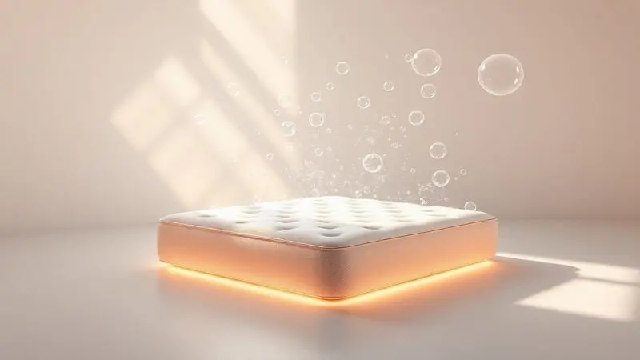
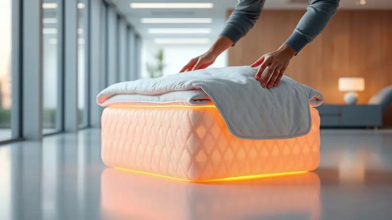

Guardar um colchão da maneira errada parece um detalhe pequeno até o dia em que você o tira do armazenamento e encontra uma mancha de mofo ou uma deformação que nunca mais some.

Aquele investimento que deveria durar anos se transforma em lembrete constante do que você deveria ter feito diferente.

Se você está se mudando, reorganizando a casa ou simplesmente precisa liberar espaço, acertar nesse processo não é apenas sobre conservar um objeto, mas sobre proteger suas noites de descanso por muito mais tempo.

Vamos eliminar a complicação e focar no que realmente importa: um método passo a passo que garante que seu colchão volte a ser usado com a mesma qualidade do primeiro dia.

Imagine abrir aquela embalagem depois de meses e sentir exatamente o mesmo conforto, sem surpresas desagradáveis.

<SummaryList products={frontmatter.top_products} />

## Por que o armazenamento correto é vital para a durabilidade do colchão?

Pense no seu colchão como um investimento na sua saúde. Cada noite mal dormida por causa de um colchão deformado ou com cheiro de umidade é um custo que você paga com seu bem-estar.

Quando ele é armazenado incorretamente, não são apenas as molas que sofrem: sua higiene é comprometida, criando um ambiente ideal para ácaros e mofo que podem afetar sua respiração e qualidade do sono.

A boa notícia é que evitar isso é mais simples do que parece. Não se trata de seguir uma lista interminável de regras, mas de entender três princípios básicos: manter a forma original, bloquear a umidade e garantir ventilação.

Quando você domina esses conceitos, o resto se encaixa naturalmente.

## Passo 1: Preparação e Higienização Profunda antes de Guardar

Antes de pensar em onde vai guardar seu colchão, precisa se certificar de que ele está limpo por dentro e por fora. Não é apenas sobre estética: sujeira residual se transforma em odor com o tempo, e umidade que passa despercebida vira mofo depois de meses armazenado.

Comece imaginando que está preparando seu colchão para uma longa viagem. Ele precisa estar leve, seco e pronto para enfrentar o tempo sem você.

### Aspiração e Remoção de Ácaros e Poeira

<ProductBox 
  title={frontmatter.top_products[0].title} 
  image={frontmatter.top_products[0].image} 
  link={frontmatter.top_products[0].link} 
/>

Aqui estamos falando da limpeza que você não vê. Ácaros e seus resíduos são invisíveis, mas são os principais responsáveis por alergias e aquele ar pesado no quarto.

Um aspirador comum pode ajudar na superfície, mas se você quer realmente proteger sua saúde, considere investir em um modelo com filtro HEPA que retém 99,9% dessas partículas microscópicas.

Alguns modelos mais especializados vão além, com luz UV-C que esteriliza a superfície ou tecnologia de vibração que solta alérgenos profundamente impregnados. Sim, podem custar um pouco mais, mas pense nisso como um seguro para o seu sono.

Um equipamento que dura anos e mantém o ar do seu quarto respirável vale cada centavo quando você acorda sem espirros ou coceira nos olhos.

### Secagem Total: O Segredo para Evitar Mofo e Umidade

Este é o ponto onde a maioria das pessoas erra. Você limpa, aspira, mas se deixa um mínimo de umidade, todo o trabalho foi em vão. Após qualquer limpeza, seu colchão precisa respirar.

Coloque-o em um local arejado, de preferência com luz solar direta, e gire-o periodicamente para que cada lado receba ar e calor.

Se você já sentiu aquela sensação pegajosa ao deitar em um colchão que ficou guardado úmido, sabe do que estamos falando. A secagem total não é um detalhe, é a garantia de que você não estará criando um ambiente perfeito para fungos.

A luz solar natural é sua maior aliada, eliminando microrganismos e deixando aquele frescor que dura meses.

## Passo 2: Proteção e Embalagem Adequada do Colchão

<ProductBox 
  title={frontmatter.top_products[1].title} 
  image={frontmatter.top_products[1].image} 
  link={frontmatter.top_products[1].link} 
/>

Com seu colchão limpo e completamente seco, chegou a hora de escolher sua armadura para o armazenamento. Os materiais que você usa aqui fazem toda a diferença entre um colchão que volta perfeito e um que precisa ser substituído.

Plástico bolha oferece amortecimento contra impactos durante transporte, enquanto mantas adicionais criam barreiras extra contra sujeira.

Sacos específicos para colchões são especialmente práticos porque são feitos na medida certa e fecham completamente, mas atenção: se for uma viagem longa ou mudança interestadual, uma camada extra de papelão ondulado pode salvar seu colchão de danos mais sérios.

O erro fatal que nunca pode cometer? Dobrar o colchão, a menos que ele seja especificamente projetado para isso. A pressão em um ponto específico destrói a estrutura interna de forma irreparável.

### O Uso de Plásticos Específicos e Mantas de Proteção

<ProductBox 
  title={frontmatter.top_products[2].title} 
  image={frontmatter.top_products[2].image} 
  link={frontmatter.top_products[2].link} 
/>

Esses dois materiais trabalham em equipe, cada um com sua função. Os plásticos criam uma barreira física impermeável, ideal para proteger contra derramamentos acidentais ou umidade ambiental. Feitos de polietileno, são especialmente úteis durante o transporte.

Já as mantas e protetores são para o longo prazo, oferecendo uma proteção respirável que permite que o colchão continue 'vivendo' mesmo armazenado.

Procure modelos que sejam ao mesmo tempo impermeáveis e que permitam a circulação de ar, evitando que a umidade fique presa. Quando você escolhe o protetor certo, está basicamente dando ao seu colchão uma segunda pele que o mantém intacto.

### Por que Usar Capas com Zíper para Armazenamento Longo?

<ProductBox 
  title={frontmatter.top_products[3].title} 
  image={frontmatter.top_products[3].image} 
  link={frontmatter.top_products[3].link} 
/>

Imagine que você precisa verificar algo dentro da embalagem depois de seis meses. Com uma capa comum, teria que desfazer tudo. Com uma capa de zíper, basta abrir, verificar e fechar novamente. Essa praticidade é apenas uma das vantagens.

Essas capas formam uma defesa completa contra poeira, ácaros e umidade, criando um ambiente selado que mantém seu colchão como novo. Para quem sofre de alergias, essa barreira extra significa acordar sem sintomas mesmo depois de meses guardado.

E quando precisar limpar, basta remover a capa e lavá-la, sem precisar mexer no colchão em si.

Sim, uma capa de qualidade pode ter um custo inicial maior, mas compare isso com o preço de um colchão novo e verá que é um dos melhores investimentos para prolongar a vida útil do seu.

## Passo 3: Onde e Como Posicionar o Colchão Corretamente?

O local de armazenamento é tão importante quanto a embalagem. De nada adianta uma capa perfeita se seu colchão ficar em um ambiente que o destrói por dentro.

Procure um espaço seco e arejado, mas cuidado com a luz solar direta constante, que pode desbotar e ressecar os materiais.

Uma base adequada faz mais do que apenas segurar o colchão: ela distribui o peso uniformemente, prevenindo deformações. Se você já viu um colchão que ficou com marcas de grades ou ripas, sabe exatamente o que acontece quando essa etapa é negligenciada.

### Horizontal vs. Vertical: Qual a Posição Recomendada?

Sempre que possível, mantenha seu colchão na posição horizontal. É assim que ele foi projetado para funcionar, e é assim que mantém sua forma original. A posição horizontal distribui o peso igualmente, evitando pontos de pressão que causam deformações permanentes.

Se o espaço realmente não permitir e você precisar armazená-lo na vertical, faça isso com precauções extras. Apoie-o contra uma superfície macia para evitar danos nas bordas, e certifique-se de que não está pressionando nenhuma área específica por muito tempo.

Pense nisso como uma solução temporária, não ideal.

### Por que Você Nunca Deve Dobrar um Colchão (Especialmente de Molas)

Dobrar um colchão de molas é como dobrar uma cadeira de aço: algo vai quebrar. As molas são projetadas para funcionar em uma estrutura específica, e quando você as força para fora dessa posição, elas não voltam ao lugar.

O resultado são pontos de pressão que tornam o sono desconfortável e uma perda gradual do suporte.

Mas o problema vai além do conforto. Quando você dobra o colchão, cria dobras internas onde a ventilação não chega. Esses cantos escuros e sem ar são o paraíso para o mofo, que começa a trabalhar silenciosamente enquanto você pensa que está tudo protegido.

Mantenha a superfície plana e preserve a integridade do que você comprou.

### Condições Ideais do Local: Temperatura e Ventilação

Seu local de armazenamento precisa imitar as condições de um quarto confortável: temperatura amena (nem muito quente nem muito fria) e boa circulação de ar. Ambientes úmidos transformam seu colchão em uma esponja, absorvendo a umidade que depois se torna mofo.

Um armário bem ventilado ou uma área seca da garagem pode funcionar bem, mas evite porões ou sótãos que tendem a ter flutuações extremas de temperatura e umidade. Lembre-se: você está procurando estabilidade, não apenas um espaço vazio.

## Cuidados no Transporte: Evitando Danos Estruturais

Transportar um colchão é o momento onde os erros acontecem mais rápido. Mantenha-o na posição vertical durante o movimento para minimizar a pressão sobre as estruturas internas.

Capas protetoras aqui são essenciais não apenas contra sujeira, mas contra pequenos impactos que podem não ser visíveis imediatamente.

Se estiver usando um veículo, certifique-se de que há espaço suficiente para que o colchão não fique dobrado ou pressionado contra outras coisas. Uma curva fechada com o colchão dobrado pode causar danos que só serão percebidos quando você for usá-lo novamente.

## Manutenção Durante o Período de Armazenamento Prolongado

Guardar não significa esquecer. Mesmo com todas as proteções, seu colchão precisa de atenção ocasional. Mantenha-o afastado do chão direto (use pallets ou uma base), e certifique-se de que a capa protetora está intacta.

### Ventilação Periódica e Rodízio do Produto

A cada poucos meses, tire seu colchão do armazenamento por algumas horas. Deixe-o respirar em um ambiente arejado, de preferência em um dia de sol. Essa ventilação periódica evita que odores se acumulem e mantém os materiais frescos.

Se for possível, gire o colchão durante essas verificações. Mudar sua posição assegura um desgaste uniforme caso alguma área esteja recebendo mais pressão do que outras. São poucos minutos de cuidado que fazem anos de diferença na durabilidade.

## Erros Comuns que Destroem o Colchão ao Guardar e Como Evitá-los

Os maiores inimigos do seu colchão guardado são simples de identificar. Armazenar na vertical sem suporte adequado deforma bordas. Esquecer de usar uma capa respirável cria uma estufa de umidade.

Deixar em contato direto com o chão permite que umidade suba pelos materiais.

E o pior de todos: exposição direta e prolongada ao sol. Os raios UV não apenas desbotam a superfície, mas ressecam e fragilizam os materiais internos. Proteja seu investimento desses erros básicos, e ele retribuirá com conforto por muito mais tempo.

## Perguntas Frequentes (FAQ) sobre Armazenamento de Colchões

A dúvida mais frequente sempre é sobre posição: pode guardar em pé? A resposta é não para períodos longos, a não ser que tenha um suporte especializado. A pressão constante em uma borda específica causa deformações que não se recuperam.

E quanto à proteção contra umidade? Materiais respiráveis como capas de algodão são melhores que plásticos totalmente selados para armazenamento prolongado, pois permitem que o ar circule enquanto bloqueiam a poeira.

Por último, a limpeza prévia não é opcional. Um colchão sujo guardado é um colchão com problemas garantidos quando for reaberto. Ácaros se multiplicam, odores se intensificam, e manchas que eram pequenas se tornam permanentes.

## Conclusão

Guardar um colchão corretamente vai além da mera conservação de um objeto. É sobre preservar um espaço sagrado de descanso, um investimento na sua saúde e bem-estar que impacta diretamente sua qualidade de vida.

Cada cuidado que você toma hoje se transforma em noites melhores amanhã.

Ao seguir este guia, você não está apenas protegendo espumas e molas, está garantindo que seu refúgio pessoal continue oferecendo o mesmo conforto reconfortante, livre de surpresas desagradáveis.

O segredo está na simplicidade: limpeza profunda, proteção adequada e um local que respeita as necessidades do material.

Quando finalmente desembalar seu colchão depois de meses, e sentir exatamente o mesmo aconchego da primeira noite, você entenderá que todo esse cuidado valeu infinitamente mais do que o tempo investido.

Seu sono agradece, seu corpo agradece e seu bolso agradece por não precisar substituir algo que poderia durar muitos anos a mais. Comece hoje a tratar seu colchão como ele merece: não como um móvel qualquer, mas como o aliado fundamental do seu descanso diário.