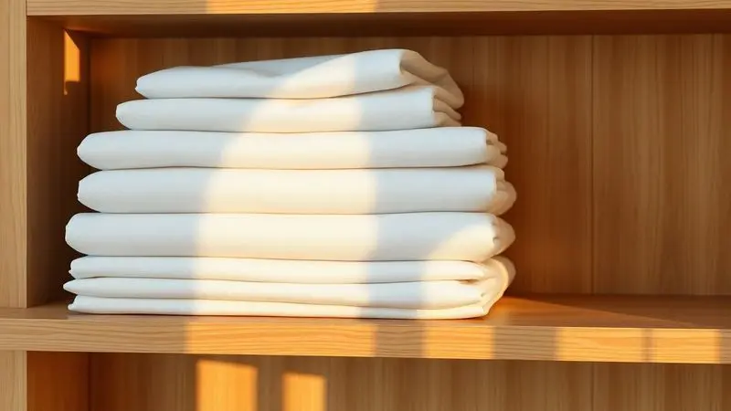
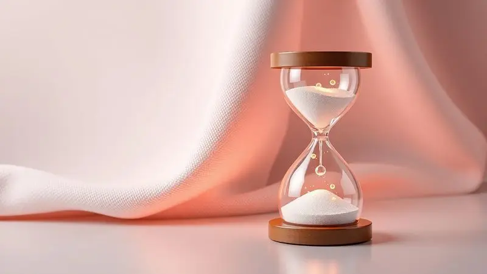

Imagine a sensação: você investe em um protetor de colchão pensando na saúde, na proteção, na tranquilidade.

Mas depois de alguns meses, aquela capa que prometia segurança começa a mostrar sinais de cansaço, manchas que não saem, odores que persistem, ou até mesmo a impermeabilidade que desapareceu. O investimento se transforma em preocupação.

Isso acontece não porque o produto é ruim, mas porque a maioria das pessoas não sabe como cuidar dele como cuidaria de qualquer outro item essencial do dia-a-dia.

O que você vai descobrir aqui não é apenas um manual de limpeza, mas um mapa para transformar esse acessório em um aliado duradouro para seu sono e sua saúde.

<SummaryList products={frontmatter.top_products} />

## Por que usar um protetor de colchão é indispensável para sua saúde?

Um protetor de colchão não é apenas uma barreira física entre você e o seu colchão. Ele é o guardião silencioso do seu espaço de descanso.

Enquanto você dorme, ele trabalha: bloqueando ácaros que poderiam transformar suas noites em episódios de alergia, impedindo que fungos e bactérias se instalem no lugar onde você recarrega suas energias, e criando uma defesa contra líquidos que, sem ele, penetrariam profundamente no colchão criando manchas e odores quase irreversíveis.

Mas o verdadeiro valor emocional está na liberdade que ele oferece: você pode dormir sabendo que seu colchão, um investimento significativo, está protegido contra acidentes cotidianos.

E quando esse protetor é lavável, você ganha controle sobre a higiene do seu ambiente mais pessoal. Em última análise, ele transforma seu sono em um ritual de cuidado, não apenas de repouso.

## Tipos de protetores: Como escolher o ideal para sua cama

<ProductBox 
  title={frontmatter.top_products[0].title} 
  image={frontmatter.top_products[0].image} 
  link={frontmatter.top_products[0].link} 
/>

Se você já decidiu que precisa dessa proteção, agora enfrenta outra decisão: qual tipo se encaixa na realidade da sua cama e da sua vida? O mercado oferece opções que parecem similares, mas atendem necessidades completamente diferentes.

A primeira divisão importante é entre aqueles que priorizam defesa máxima e aqueles que buscam um equilíbrio entre proteção e experiência sensorial.

E dentro dessa escolha, existe ainda a questão prática de como o protetor se fixa ao seu colchão, algo que influencia diretamente sua conveniência diária.

### Protetor de colchão impermeável vs. Matelassê: Qual a diferença?

<ProductBox 
  title={frontmatter.top_products[1].title} 
  image={frontmatter.top_products[1].image} 
  link={frontmatter.top_products[1].link} 
/>

Essa escolha define o propósito principal do seu protetor. Se você busca uma fortaleza contra líquidos, seja por crianças na casa, por transpiração intensa ou simplesmente pela paz mental contra acidentes, o impermeável é sua escolha.

Ele é construído com materiais como poliéster e revestimento de poliuretano para criar uma barreira quase impenetrável, sem sacrificar completamente o conforto.

O matelassê, por outro lado, é o especialista em experiência. Suas costuras e camadas adicionais transformam a superfície do seu colchão, ofereendo uma sensação mais macia e acolchoada.

A proteção contra líquidos aqui pode ser secundária ou até mesmo ausente em alguns modelos, mas para quem prioriza o toque e o conforto acima de tudo, ele é irresistível.

Existe, felizmente, um território de convergência: modelos que combinam impermeabilidade com acolchoamento. Para quem não quer abrir mão nem da segurança contra manchas nem da sensação de luxo ao dormir, essa fusão pode ser a resposta ideal.

### Tipos de fixação: Elástico lateral ou Slip (Cobre todo o colchão)?

Depois de decidir o material, pense no comportamento do protetor durante seu uso. O modelo com elástico lateral é como um abraço ajustável: suas bordas se moldam ao colchão, facilitando a colocação e a remoção em dias de limpeza.

É a escolha da praticidade, para quem valoriza tempo e facilidade.

O slip, que cobre o colchão inteiro como uma segunda pele, é o campeão da proteção total. Ele garante que nenhuma borda ficará exposta, defendendo cada centímetro contra sujeira e líquidos. O preço dessa defesa completa? Um pouco mais de esforço na instalação.

A decisão aqui reflete seu estilo de vida: você prefere a conveniência rápida ou a segurança absoluta?

## Guia de Medidas: Como não errar o tamanho na hora da compra

Um protetor que não se ajusta perfeito é quase como não ter protetor. Ele se move, se desalinha e pode até criar bolsas onde líquidos se acumulam. Para evitar esse cenário, transforme a medida do seu colchão em um ritual preciso.

Não confie apenas em dimensões padrão, colchões variam, especialmente em altura quando têm camadas de molas ou espuma mais densa. Use uma fita métrica e registre largura, comprimento e altura com atenção.

E considere um detalhe crucial: protetores com elástico nas bordas não apenas se ajustam melhor, mas também resistem aos movimentos da noite, garantindo que você não acorde com a proteção deslocada.

## Como lavar protetor de colchão corretamente: Passo a Passo Completo

A lavagem é onde muitos protetores perdem sua magia. Erros simples podem corroer a impermeabilidade, desgastar o material e reduzir anos de vida útil em meses. Mas seguindo um processo consciente, você pode manter seu protetor funcionando como novo por muito mais tempo.

O primeiro mandamento é sempre a etiqueta do fabricante. Ela é o manual escrito por quem conhece o material melhor que qualquer pessoa. Depois de consultá-la, prepare a lavagem com água morna e um detergente suave, elementos que limpam sem agredir.

E na secagem, priorize o tempo e o cuidado: deixar secar à sombra, completamente, é o ritual que preserva fibras e tratamentos.

### Lavagem na máquina: Ciclo, temperatura e sabão ideal

A máquina de lavar pode ser sua aliada ou sua sabotadora, dependendo de como você usa ela. Para protetores de colchão, o ciclo suave é o caminho da preservação, movimentos menos agressivos que mantêm a estrutura intacta.

A temperatura da água morna é a zona de equilíbrio: suficiente para eliminar ácaros e sujeira, mas não tão alta que desfaça tratamentos químicos de impermeabilidade.

E o sabão? Neutro. Neutro porque não carrega agentes químicos que podem deixar resíduos irritantes ou criar barreiras sobre o material. Neutro porque limpa sem comprometer o que foi cuidadosamente projetado para proteger você.

### O perigo do amaciante: Por que ele pode destruir a impermeabilidade?

O amaciante parece uma promessa de conforto extra, mais maciez, mais aroma agradável. Mas para um protetor impermeável, ele é um risco invisível.

Sua ação de revestir fibras pode, paradoxalmente, criar uma camada que obstrui a capacidade do material de respirar e repelir líquidos.

Imagine um impermeável que, depois de algumas lavagens com amaciante, começa a permitir que água penetre porque suas fibras estão "cobertas" por esse resíduo. É um efeito cumulativo: cada lavagem soma um pouco mais de bloqueio, até que a função principal desaparece.

A solução é simples: excluir o amaciante do processo e confiar no detergente neutro para fazer o trabalho limpo.

### Como remover manchas difíceis e odores de suor

Manchas e odores são os desafios que testam a resistência do seu protetor. Para manchas, comece com uma conversa gentil: água morna e detergente neutro aplicados com um pano limpo, em movimentos circulares.

Se a marca resistir, convoque o bicarbonato de sódio, um aliado natural que trabalha por horas, penetrando e dissolvendo o que ficou impregnado. Depois, aspire e veja a diferença.

Odores de suor exigem uma abordagem diferente: o vinagre branco diluído em água. Ele não mascara o odor; ele neutraliza, eliminando as moléculas que causam o problema. O passo final, comum a ambos os tratamentos, é a secagem completa ao ar livre.

Não apenas secar, mas secar totalmente, porque qualquer humidade residual é o terreno onde mofo e odores persistentes podem renascer.

## Secagem e Armazenamento: O segredo da durabilidade

A lavagem termina, mas o cuidado continua. Secar completamente o protetor não é uma recomendação, é uma regra de sobrevivência para o material.

Um protetor guardado com humidade mínima pode desenvolver mofo em suas fibras, criando odores e comprometendo a saúde do seu ambiente de sono.

E depois de secar, o armazenamento em local seco e arejado é o descanso que ele merece, longe de humidade, de luz solar direta que pode degradar fibras, e de pressões que podem deformar sua estrutura.

### Pode colocar protetor de colchão na secadora?

A secadora oferece velocidade, mas também oferece risco. A maioria dos protetores tolera calor moderado, mas "moderado" é uma palavra delicada.

Temperaturas altas podem, literalmente, desfazer tratamentos de impermeabilidade, alterar a textura do material e reduzir elasticidade.

Se você precisa usar a secadora, transforme-a em uma ferramenta de cuidado: ciclo delicado, temperatura baixa, e sempre acompanhada da consulta à etiqueta.

Mas lembre-se que a secagem ao ar livre, embora mais demorada, é quase sempre o caminho mais seguro para prolongar a vida do seu protetor, e proteger seu investimento.

## De quanto em quanto tempo devo lavar o protetor?

A frequência de lavagem é o ritmo da sua relação com o protetor. Para a maioria das pessoas, três meses é um intervalo saudável, suficiente para manter higiene sem sobrecarregar o material com lavagens constantes.

Mas se você vive com alergias ou problemas respiratórios, mensalmente pode ser a cadência que garante um ambiente realmente limpo.

E em cenários com crianças pequenas ou animais de estimação, duas semanas podem ser o período necessário para responder a acidentes e contatos mais frequentes.

O guia final, sempre, são as instruções do fabricante, elas consideram o material específico que você adquiriu.

## FAQ - Perguntas Frequentes sobre Cuidados com o Colchão

Perguntas que surgem quando você está prestes a dormir, ou quando algo parece não estar funcionando como esperado. Aqui estão respostas que funcionam como conversas, não apenas como listas de fatos.

### O protetor de colchão vai acima ou abaixo do lençol?

Sobre o colchão, diretamente. E então o lençol sobre ele. Esta ordem é a arquitetura da proteção: o protetor faz contato com o colchão para defender sua superficie, enquanto o lençol faz contato com você para oferecer conforto.

Colocar o protetor acima do lençol seria como vestir uma camisa de chuva por dentro da blusa, a proteção existe, mas não no lugar onde ela é necessária. Além disso, essa configuração natural ajuda a manter o protetor estável, sem movimentos durante a noite.

### O protetor faz barulho ou esquenta muito? Como resolver?

Barulho é normalmente o sinal de um material muito plástico ou sintético em modelos impermeáveis básicos. A solução está em escolher protetores que incorporam camadas de tecido macio sobre a base impermeável, eles amortecem o ruído enquanto mantêm a defesa.

Calor, por outro lado, acontece quando a impermeabilidade não é acompanhada por tecnologia respirável.

Procure modelos que mencionem "respirabilidade" ou "tecido termorregulador", eles permitem que o calor do corpo seja dissipado, mantendo você confortável mesmo com a proteção total.

### Qual a vida útil média de um protetor de boa qualidade?

Entre 3 e 10 anos. Essa variação enorme reflete não apenas o material, poliéster robusto ou algodão tratado tendem a durar mais, mas também como você cuida dele.

Lavagens seguindo as regras, secagens completas, armazenamento adequado: esses hábitos podem estender a vida útil para o limite superior. Um protetor bem cuidado não é apenas um acessório; é um investimento que retorna conforto e proteção ano após ano.

## Conclusão

Lavar e cuidar de um protetor de colchão não é uma tarefa doméstica rotineira; é a prática que transforma um objeto funcional em um guardião duradouro do seu espaço de descanso.

Cada passo, desde escolher o tipo certo para sua cama até seguir o ritual preciso de lavagem, é um investimento na qualidade do seu sono e na saúde do seu ambiente mais pessoal.

Quando você entende que impermeabilidade não é apenas uma característica técnica, mas a promessa de nights sem preocupações com acidentes; que hipoalergênico significa respirar fácil enquanto descansa; e que a fixação perfeita é a conveniência que não sacrifica proteção, o protetor de colchão se torna mais que um produto.

Ele se torna parte do ritual que prepara seu corpo e mente para o repouso verdadeiro. Comece hoje: meça seu colchão com atenção, escolha o protetor que conversa com sua realidade, e estabeleça o ciclo de cuidado que garantirá anos de serviço silencioso e eficiente.

O resultado não será apenas um colchão protegido, mas um sono renovado.