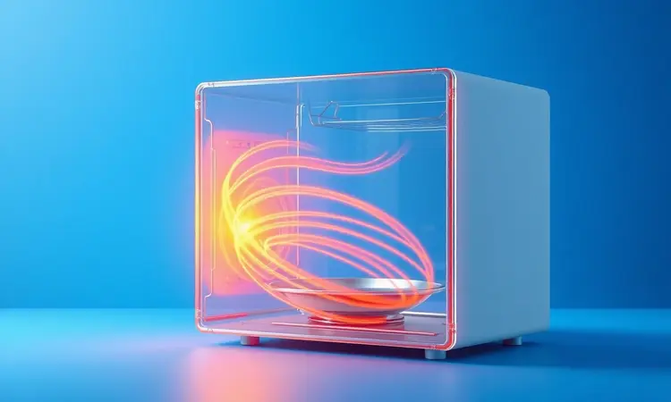
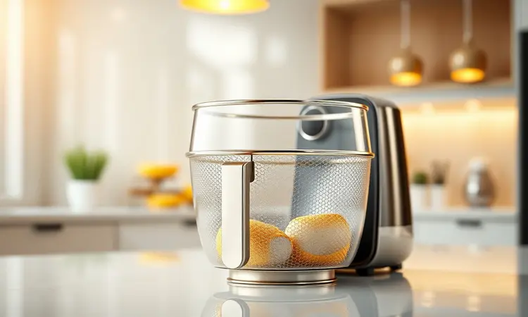

Você finalmente adquiriu sua fritadeira elétrica e quer transformar sua rotina na cozinha, mas sabia que pequenos deslizes podem arruinar seu aparelho ou até causar acidentes?

Imagine a frustração de preparar batatas fritas que saem murchas ou ver seu investimento danificado em poucas semanas por um simples descuido.

Neste guia completo, você vai descobrir como evitar os 12 erros mais perigosos e comuns ao usar a Airfryer, garantindo não apenas a máxima durabilidade do seu eletrodoméstico, mas também o sabor perfeito que faz cada refeição valer a pena.

<SummaryList products={frontmatter.top_products} />

## Por que entender o funcionamento da Airfryer é o primeiro passo?

Imagine abrir um presente de Natal e começar a usar sem ler as instruções. É exatamente isso que acontece quando você pula a etapa de compreender como sua Airfryer realmente funciona.

Esse aparelho mágico não frita, ele circula ar quente em alta velocidade para criar aquela textura crocante que todos amamos, usando até 80% menos óleo.

Quando você entende esse princípio básico, tudo faz sentido: por que não pode encher demais a cesta, por que o pré-aquecimento é essencial, por que cada alimento precisa de seu espaço para "respirar".

Esse conhecimento não é só técnico, ele é o passaporte para uma cozinha mais criativa, saudável e, acima de tudo, segura.

## 12 Erros que detonam sua Airfryer e como evitá-los

Você já sentiu aquela ansiedade ao preparar algo novo, com medo de estragar tudo? Esses 12 erros são os vilões invisíveis que transformam momentos de prazer culinário em frustração.

Mas a boa notícia é que, conhecendo cada um deles, você transforma sua Airfryer de simples eletrodoméstico em sua melhor aliada na cozinha.

### 1. Usar adaptadores de tomada (O perigo da sobrecarga)

Pense na sua Airfryer como um atleta de alta performance: ela precisa de energia direta e estável para dar o seu melhor. Colocar um adaptador de tomada é como pedir para um corredor olímpico competir com os pés amarrados.

Esses pequenos dispositivos podem não suportar a carga elétrica necessária, criando riscos de sobrecarga que vão desde simples quedas de energia até situações mais sérias. A solução? Conecte diretamente em uma tomada adequada, de preferência em um circuito exclusivo.

Seu aparelho agradece com anos de serviço fiel.

### 2. Esquecer de lavar o cesto antes do primeiro uso

Lembra daquele cheiro de "novo" que adoramos em carros, mas não queremos na nossa comida? Resíduos de fabricação e poeira acumulada durante o transporte podem deixar um gosto metálico na sua primeira refeição.

Uma lavagem rápida com água morna e detergente neutro remove qualquer vestígio indesejado, garantindo que o sabor dos seus alimentos seja puro e autêntico desde o primeiro uso.

### 3. Não remover as proteções de papelão internas

Aqueles pedacinhos de papelão que parecem insignificantes têm uma missão importante: proteger componentes delicados durante a viagem da fábrica até sua casa. Mas uma vez instalada, essas proteções precisam sair para que o ar circule livremente.

Mantê-las seria como tentar respirar com um saco plástico no rosto. Sua Airfryer precisa de espaço interno para trabalhar sua magia.

### 4. Colocar líquidos em excesso ou massas muito finas

Imagine jogar água em óleo quente. O caos que se forma é similar ao que acontece quando líquidos em excesso encontram o ar quente da sua Airfryer. O resultado? Alimentos que mais cozinham no vapor do que ficam crocantes.

Massas muito finas, por sua vez, viram pequenos furacões dentro da cesta, espalhando-se por todos os lados. O segredo está no equilíbrio: ingredientes com a consistência certa garantem resultados perfeitos.

### 5. Deixar papel alumínio ou papel manteiga soltos no cesto

Você já viu como uma folha de papel voa quando o vento está forte? Agora imagine esse mesmo papel dentro de um turbilhão de ar quente a 200°C.

Papel alumínio ou manteiga soltos podem se transformar em pequenas velas inflamáveis, além de obstruir a ventilação essencial para o cozimento. A solução é simples: fixe bem os papéis no fundo da cesta ou, melhor ainda, invista em forros reutilizáveis de silicone.

### 6. Ignorar a importância do pré-aquecimento

Colocar alimentos em uma Airfryer fria é como entrar em uma piscina gelada sem se acostumar primeiro. O choque térmico resulta em cozimento desigual: partes queimadas, partes cruas e aquela frustrante falta de crocância.

Dois a três minutos de pré-aquecimento fazem toda diferença entre um prato medíocre e uma experiência gastronômica memorável.

### 7. Superlotar o cesto e impedir o fluxo de ar

Seu aparelho precisa de espaço para fazer seu trabalho. Encher a cesta como se fosse uma lata de sardinhas impede que o ar quente envolva cada pedaço de comida. O resultado? Alimentos que mais cozinham no vapor do que ficam dourados e crocantes.

A regra é simples: se você precisa empurrar para caber mais, já passou do limite.

### 8. Posicionar o aparelho encostado na parede ou móveis

Sua Airfryer trabalha melhor quando pode "respirar". Encostá-la na parede ou em móveis é como fazer exercícios intensos em um quarto fechado: o calor se acumula, o desempenho cai e o risco de danos aumenta.

Mantenha pelo menos 15 centímetros de espaço livre em todos os lados, e você terá um aparelho mais eficiente e duradouro.

### 9. Utilizar utensílios de metal que riscam o antiaderente

Aqueles arranhões finos não são só feios, eles são portas de entrada para problemas. Cada risco no revestimento antiaderente significa mais áreas onde a comida gruda, mais dificuldade na limpeza e, pior, possíveis partículas liberadas na sua refeição.

Utensílios de silicone, madeira ou plástico resistente ao calor preservam a integridade da sua Airfryer por anos.

### 10. Não agitar os alimentos durante o preparo

Você já virou uma batata frita no meio do preparo e notou como ela fica uniformemente dourada? Esse simples movimento permite que cada lado receba seu momento de glória sob o fluxo de ar quente.

Uma ou duas paradas rápidas durante o cozimento garantem que todos os alimentos tenham a mesma chance de ficar perfeitos.

### 11. Limpar a Airfryer com o cesto ainda muito quente

A tentação é grande: acaba de usar, quer limpar rápido e guardar. Mas a gordura quente age como cola, grudando com mais força nas superfícies. Além do risco de queimaduras, você trabalha o dobro para limpar a mesma sujeira.

Espere alguns minutos, deixe esfriar naturalmente, e a limpeza será rápida e eficiente.

### 12. Usar produtos abrasivos ou esponjas de aço na limpeza

Aquelas esponjas de aço que resolvem tudo na cozinha são o pesadelo do revestimento antiaderente. Cada passada arranha microscópicamente a superfície, criando pontos fracos onde a comida gruda com mais facilidade.

Esponjas macias e detergentes neutros são tudo que você precisa para manter sua Airfryer como nova.

## Melhores Produtos e Acessórios para sua Airfryer

Assim como um pintor precisa das melhores tintas e pincéis, sua Airfryer se transforma com os acessórios certos. Eles não são apenas complementos, são multiplicadores de possibilidades que elevam cada receita a outro patamar.

### Melhores Modelos de Airfryer do Mercado

<ProductBox 
  title={frontmatter.top_products[0].title} 
  image={frontmatter.top_products[0].image} 
  link={frontmatter.top_products[0].link} 
/>

Escolher a Airfryer ideal é como encontrar o par de sapatos perfeito: precisa caber no seu espaço, atender suas necessidades e caber no seu orçamento.

A Mondial conquista pelo equilíbrio entre qualidade e preço, com modelos como a AF-32-RI (3,5L) para pequenas famílias ou solteiros práticos.

Já a Philips Walita traz a experiência de quem criou a tecnologia, com opções como a Viva Ri9217 que oferecem precisão e consistência.

Para quem busca versatilidade, a Philco apresenta a Air Fryer Oven PFR2200P com impressionantes 11L de capacidade, ideal para famílias maiores ou quem ama receber visitas.

Enquanto isso, marcas como Midea e Oster inovam com funcionalidades que unem air fryer e forno em um só aparelho. Cada modelo tem sua personalidade, seu tamanho ideal e seu conjunto de funções.

O segredo é encontrar aquela que conversa com sua rotina e aspirações culinárias.

### Kit de Acessórios de Silicone para Fritadeira Elétrica

<ProductBox 
  title={frontmatter.top_products[1].title} 
  image={frontmatter.top_products[1].image} 
  link={frontmatter.top_products[1].link} 
/>

Imagine preparar cupcakes, quiches e mini pizzas sem a dor de cabeça da limpeza depois. Os kits de silicone transformam essa fantasia em realidade.

Feitos com material de grau alimentício que suporta até 200°C, eles são os heróis silenciosos da cozinha prática: não grudam, vão à máquina de lavar louças e ainda podem ser usados no forno e micro-ondas.

Mas mais do que praticidade, esses acessórios representam liberdade criativa. Formas de muffin para cafés da manhã especiais, bandejas para assar legumes em porções individuais, divisórias para preparar diferentes alimentos ao mesmo tempo.

Eles transformam sua Airfryer de fritadeira para múltiplos chefs.

### Papel Manteiga Perfurado Biodegradável

<ProductBox 
  title={frontmatter.top_products[2].title} 
  image={frontmatter.top_products[2].image} 
  link={frontmatter.top_products[2].link} 
/>

Para quem valoriza praticidade sem abrir mão da consciência ecológica, o papel manteiga perfurado biodegradável é a solução elegante.

Resistente a temperaturas de até 230°C, ele cria uma barreira protetora entre seus alimentos e a cesta, facilitando uma limpeza que leva segundos.

Os furos estrategicamente posicionados permitem que o ar quente circule normalmente, garantindo que a crocância não seja comprometida.

O verdadeiro charme, porém, está na sustentabilidade: enquanto forros comuns vão para o lixo após cada uso, esta opção biodegradável fecha o ciclo de forma responsável. Apenas lembre-se de nunca pré-aquecer com o papel dentro, evitando surpresas desagradáveis.

## Dicas de Ouro para uma Airfryer Sempre Nova

Cuidar da sua Airfryer vai além da limpeza básica. É criar um ritual que preserva não apenas o aparelho, mas a qualidade de cada refeição. Comece pela limpeza imediata após o uso, quando os resíduos ainda saem com facilidade.

Guarde-a em local seco e arejado, longe da umidade que é inimiga de qualquer eletrônico.

Mas a dica mais valiosa é desenvolver uma relação de respeito com seu aparelho. Entenda seus limites, celebre suas capacidades e ela retribuirá com anos de serviço fiel e deliciosas refeições.

## Perguntas Frequentes (FAQ)

"Preciso mesmo usar óleo?" Essa é a dúvida que surge naturalmente. A beleza da Airfryer está justamente na possibilidade de preparar alimentos crocantes usando quantidades mínimas de óleo, ou até mesmo nenhuma, dependendo do que está cozinhando.

Uma borrifada rápida pode realçar sabores, mas nunca será a banheira de óleo das frituras tradicionais.

Quanto à limpeza, a maioria dos modelos modernos oferece componentes removíveis que vão direto para a lava-louças, transformando uma tarefa chata em questão de minutos.

E se você se perguntar por que algumas receitas não ficam tão crocantes quanto prometem, a resposta quase sempre está na quantidade: menos é mais quando se trata de encher a cesta.

## Conclusão

Dominar sua Airfryer não é sobre memorizar regras, é sobre entender uma nova linguagem culinária. Cada erro evitado, cada técnica aprendida, cada acessório escolhido com cuidado transforma seu relacionamento com a comida.

Deixe para trás a ansiedade dos primeiros usos e abrace a confiança de quem sabe extrair o melhor de cada ingrediente.

Os 12 erros que exploramos não são armadilhas, são lições disfarçadas. Cada um deles, quando compreendido, abre portas para criações mais ousadas, refeições mais saudáveis e momentos mais prazerosos na cozinha.

Sua Airfryer está pronta para ser muito mais que um eletrodoméstico, ela pode ser sua parceira na descoberta de sabores, texturas e possibilidades que você nem imaginava.

O próximo passo é seu: escolha uma receita simples, respire fundo e comece. Com cada preparo, você não só cozinha alimentos, mas constrói memórias e desenvolve habilidades que ficarão com você para sempre.

A jornada rumo à cozinha prática, saudável e deliciosa começa agora, e sua Airfryer é o veículo perfeito para essa aventura gastronômica.