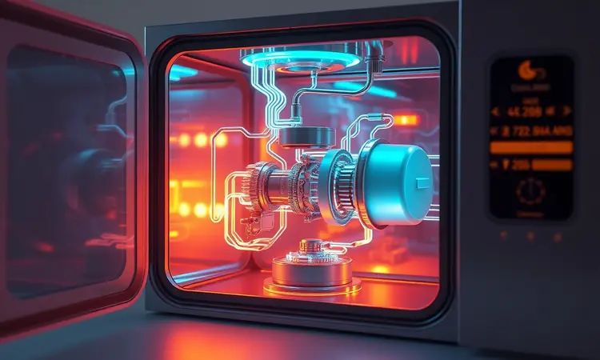
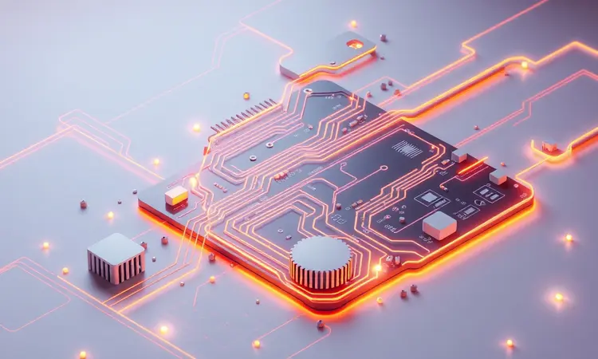
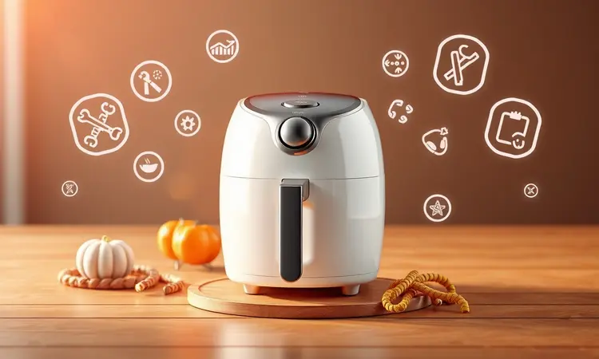

Imagine preparar-se para aquela fritura crocante que todos adoram, mas ao prensar o botão da sua Flash Fryer... silêncio. Essa sensação de frustração é tão comum quanto o alívio de descobrir que, na maioria das vezes, a solução está em suas mãos.

Antes de pensar no pior cenário, vamos explorar juntos desde as verificações mais simples até os componentes internos que podem estar pedindo sua atenção.

Este guia não apenas vai ajudá-lo a diagnosticar o problema, mas também a transformá-lo no mestre da sua cozinha novamente.

<SummaryList products={frontmatter.top_products} />

## Por Que a Sua Elgin Flash Fryer Não Está Ligando? (Principais Causas)

O aparelho que era seu aliado na cozinha agora se recusa a funcionar, e sua mente já começa a calcular o orçamento para consertos. Respire fundo.

Em 90% dos casos, a causa está em algum desses vilões comuns: uma tomada sem energia, um cabo de força danificado, o termostato mal ajustado ou aquela segurança superprotetora que impede o funcionamento quando detecta superaquecimento. A boa notícia?

Você pode eliminar cada uma dessas possibilidades em menos tempo do que levaria para fritar uma porção de batatas.

## Checklist de Verificação Rápida: O que Conferir Primeiro

Antes de abrir ferramentas ou ligar para assistência técnica, siga este fluxo simples. Pense como um detetive começando pelas pistas mais óbvias. A maioria dos 'casos' é resolvida aqui mesmo, sem precisar avançar para investigações mais complexas.

### 1. Teste da Tomada e do Cabo de Força

<ProductBox 
  title={frontmatter.top_products[0].title} 
  image={frontmatter.top_products[0].image} 
  link={frontmatter.top_products[0].link} 
/>

Essa verificação é tão básica quanto essencial, e surpreendentemente negligenciada. Antes de qualquer análise interna, pergunte-se: a energia realmente está chegando ao aparelho?

Conecte outro eletrodoméstico na mesma tomada - se ele funcionar, você já eliminou 50% das possíveis causas. Agora examine o cabo de força da fritadeira com atenção: ele parece intacto, sem cortes, desgastes ou sinais de superaquecimento?

Às vezes, uma simples dobra excessiva pode comprometer os fios internamente. Se encontrar qualquer anormalidade, você não apenas identificou o problema, mas também preveniu um risco de segurança em sua casa.

### 2. O Encaixe da Gaveta: O Detalhe que Muitos Esquecem

Aqui está o truque secreto que faz muitos usuários acharem que sua fritadeira 'morreu' sem motivo aparente. Por segurança, a Flash Fryer possui um mecanismo inteligente que só permite o funcionamento quando a gaveta está perfeitamente encaixada. Parece óbvio, certo?

Mas na correria do dia a dia, é fácil deixar a gaveta um milímetro fora do lugar. Antes de se desesperar, retire e recoloque a gaveta com atenção, sentindo o 'clique' de encaixe seguro.

Essa simples ação de 10 segundos pode economizar horas de frustração e até o custo de uma visita técnica desnecessária.

### 3. Ajuste do Timer e Seletor de Temperatura

Seu aparelho é mais esperto do que parece. Em muitos modelos, ele simplesmente se recusa a ligar se você não definir um tempo de funcionamento ou selecionar uma temperatura adequada.

Parece contra-intuitivo, mas é uma medida de segurança que evita que o aparelho funcione indefinidamente. Gire o timer para alguns minutos e ajuste a temperatura conforme o alimento desejado.

Imagine esses controles como os chefes invisíveis da sua cozinha - só liberam o funcionamento quando todas as condições estiverem devidamente programadas.

## Problemas Técnicos Internos: Quando o Defeito é mais Profundo

Se após todo o checklist básico sua fritadeira ainda permanecer em silêncio, estamos diante de um cenário mais específico. Não se assuste: problemas internos não são necessariamente sinônimo de consertos caríssimos.

Muitas vezes envolvem componentes que você pode identificar e, dependendo da sua confiança, até mesmo substituir.

### Fusível Térmico: A Proteção que Pode Ter 'Armado'

<ProductBox 
  title={frontmatter.top_products[1].title} 
  image={frontmatter.top_products[1].image} 
  link={frontmatter.top_products[1].link} 
/>

Conheça o herói anônimo da sua segurança doméstica: o fusível térmico. Este pequeno componente age como um guardião silencioso que, ao detectar temperaturas perigosamente altas, simplesmente 'se sacrifica' para proteger todo o sistema.

Se sua fritadeira foi usada por longos períodos ou em ambiente mal ventilado, ele pode ter cumprido seu dever preventivamente. A substituição é relativamente simples - você encontra fusíveis compatíveis com as especificações originais em lojas especializadas.

Se optar por fazê-lo você mesmo, lembre-se: desconecte sempre da tomada e siga as instruções com calma. Para aqueles menos familiarizados com eletrônica, um técnico autorizado realizará o serviço em poucos minutos.

### Termostato e Placa de Controle

Pense no termostato como o sensor paladar do seu aparelho, responsável por manter a temperatura perfeita para cada receita. Já a placa de controle é o cérebro que coordena todas as funções.

Quando um desses componentes apresenta falhas, o sintoma mais comum é justamente a recusa em ligar.

Antes de concluir que precisam ser substituídos, verifique se não há simplesmente um cabo solto ou conexão oxidada - problemas que até mesmo iniciantes podem corrigir com orientações adequadas.

Se o diagnóstico apontar para defeitos mais específicos, a assistência técnica especializada garantirá que seu aparelho volte com a precisão de quando saiu da fábrica.

## Passo a Passo para Reiniciar sua Fritadeira com Segurança

Às vezes, a tecnologia precisa apenas de um 'reset' - assim como nós após um dia cansativo.

Se sua fritadeira está teimando em não responder, siga este ritual simples: 1) Desconecte completamente da tomada e aguarde 10 minutos (isso permite que capacitores e circuitos se estabilizem).

2) Durante essa pausa, dê uma boa olhada no manual - muitas respostas estão ali, esquecidas na gaveta. 3) Reconecte com firmeza na tomada. 4) Verifique novamente o encaixe da gaveta e os ajustes de timer/temperatura. 5) Pressione o botão de ligar com confiança.

Se ainda assim o silêncio persistir, você já terá todas as informações necessárias para acionar o suporte técnico de forma eficiente.

## 5 Dicas de Ouro para Aumentar a Vida Útil da sua Elgin

Agora que sua fritadeira voltou a funcionar (ou você sabe exatamente o que fazer), vamos garantir que ela se torne uma companheira duradoura na sua cozinha. Esses hábitos simples fazem toda a diferença: 1.

Após cada uso, deixe esfriar completamente antes da limpeza - o choque térmico é inimigo dos componentes eletrônicos. 2. Use sempre utensílios de silicone ou nylon para não arranhar o revestimento antiaderente. 3.

Jamais submerja a base do aparelho na água - limpe apenas com pano úmido. 4. Respeite a capacidade máxima indicada no manual; sobrecarregar é pedir para o motor sofrer um burnout. 5. Quando não estiver em uso por longos períodos, guarde em local seco e longe de poeira.

Esses minutos extras de cuidado se transformam em anos a mais de serviço fiel.

## Quando Vale a Pena Trocar por uma Nova Fritadeira Elgin?

<ProductBox 
  title={frontmatter.top_products[2].title} 
  image={frontmatter.top_products[2].image} 
  link={frontmatter.top_products[2].link} 
/>

Amor pelos eletrodomésticos tem limite. Se sua Flash Fryer já fez tantas refeições que perdeu a conta, comece a notar os sinais: o tempo de preparo aumentou significativamente? Os alimentos não ficam mais com aquele crocante perfeito?

A conta de energia subiu sem explicação aparente? Esses são indícios de que os componentes internos estão cansados. Avalie também suas necessidades atuais - famílias crescem, hábitos mudam.

Modelos mais recentes oferecem não apenas maior eficiência energética, mas também funções que transformam a experiência na cozinha.

Faça as contas: se o custo dos consertos se aproxima de 60% do valor de um modelo novo, com garantia e tecnologias atualizadas, talvez seja hora de presentear sua cozinha com um upgrade.

## Como Acionar o Suporte e Assistência Técnica da Elgin

Quando o problema ultrapassa suas habilidades de diagnóstico, a Elgin está pronta para ajudar. Visite o site oficial da marca e localize a seção 'Suporte' ou 'Assistência Técnica'.

Antes de entrar em contato, tenha em mãos duas informações essenciais: o número do modelo (geralmente na etiqueta na parte traseira) e a nota fiscal.

Esses dados agilizam imediatamente o atendimento, pois permitem que o técnico identifique exatamente seu equipamento e seu histórico. Você pode optar por telefone, chat online ou agendar uma visita em uma das assistências autorizadas listadas no site.

Aproveite para consultar o FAQ online - muitas respostas estão disponíveis 24 horas por dia.

## Perguntas Frequentes (FAQ) sobre a Fritadeira Flash Fryer

A prática gera dúvidas, e dúvidas merecem respostas claras. Qual o limite de óleo que posso usar? Consulte sempre o manual, mas a regra geral é nunca ultrapassar a marca indicada no interior da cuba. Posso preparar alimentos congelados diretamente?

Sim, mas ajuste o tempo de cozimento em 20-30% a mais para garantir o resultado perfeito. Com que frequência devo trocar o óleo? Depende do uso, mas após 8-10 frituras ou quando apresentar cor escura e odor forte.

Meu aparelho emite um leve ruído durante o funcionamento - é normal? Sim, o mecanismo de aquecimento pode produzir sons suaves, semelhantes a uma chaleira começando a ferver.

## Conclusão

Da frustração inicial ao empoderamento final, essa jornada de diagnóstico revela uma verdade importante: você tem mais controle sobre seus eletrodomésticos do que imagina. A Elgin Flash Fryer foi projetada tanto para durabilidade quanto para manutenção acessível.

Mesmo quando o problema parece complexo, ele geralmente se resume a etapas lógicas que qualquer pessoa pode seguir com segurança e atenção.

Lembre-se: cuidar bem do seu equipamento não é apenas sobre economia, mas sobre garantir que sua cozinha continue sendo um espaço de criatividade e prazer.

Agora que você domina tanto o básico quanto os segredos do funcionamento, cada refeição será preparada com a confiança de quem conhece cada detalhe da sua aliada culinária. Bon appétit!