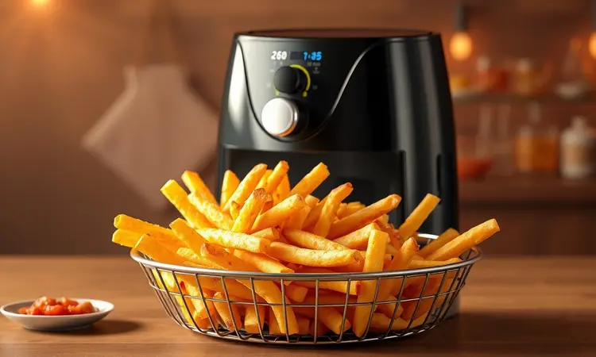
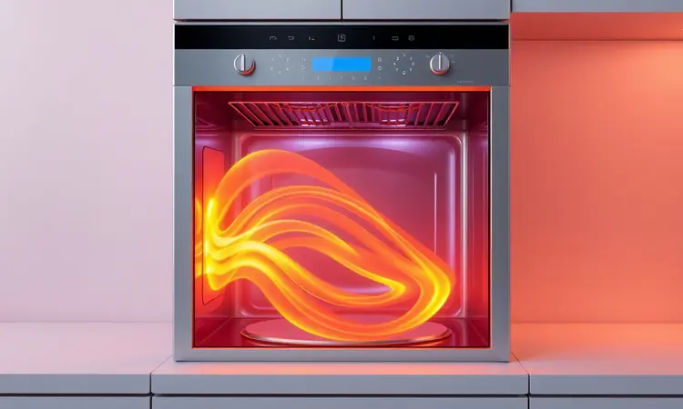
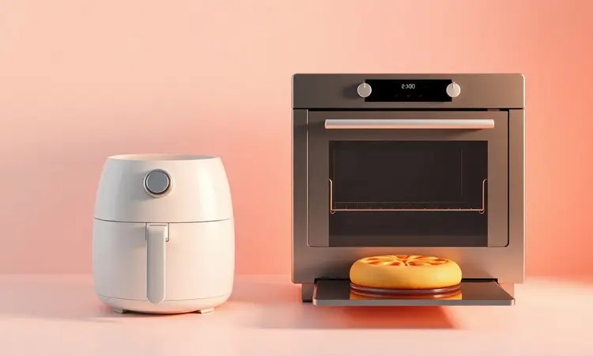

Você já passou pela experiência de querer preparar batatas fritas crocantes e saudáveis para a família, mas desistiu só de pensar na bagunça do óleo e no cheiro que fica na cozinha? Essa é a rotina que a Air Fryer Mondial 4 Litros promete transformar.

Neste guia, vou te mostrar não apenas números técnicos, mas o que realmente significa ter essa fritadeira na sua rotina: desde como ela simplifica seu dia a dia até se o consumo energético realmente faz diferença no final do mês.

Prepare-se para descobrir segredos que vão muito além do manual da AFN-40-FB.

<SummaryList products={frontmatter.top_products} />

## Resenha Air Fryer Mondial 4 Litros: Vale a Pena? Analisamos a AFN-40-FB

A experiência começa quando você tira a Air Fryer Mondial 4 Litros da caixa. Seu design compacto em preto com detalhes em aço inox se encaixa naturalmente na bancada, ocupando menos espaço do que você imagina.

Para famílias pequenas ou médias, esses 4 litros de capacidade são o ponto ideal: dá para preparar batatas fritas suficientes para todos ao mesmo tempo, sem aquela sensação de precisar fazer em lotes.

A promessa de fritar, assar e grelhar com pouco ou nenhum óleo deixa de ser apenas marketing quando você experimenta alimentos crocantes por fora e macios por dentro.

O melhor vem depois que a refeição termina. As partes removíveis são pensadas para quem não tem paciência para longas sessões de limpeza. Mas vamos ser honestos: se existe um ponto onde você precisa ajustar suas expectativas, é no tempo de cozimento.

Com 1500W de potência, ela não é a mais rápida do mercado. Isso significa que suas batatas podem levar alguns minutos a mais do que em modelos premium, mas também significa economia de energia que você sente na conta de luz.

## Conheça a Air Fryer Mondial 4 Litros AFN-40-FB: Ficha Técnica e Design

<ProductBox 
  title={frontmatter.top_products[0].title} 
  image={frontmatter.top_products[0].image} 
  link={frontmatter.top_products[0].link} 
/>

Quando você segura a Air Fryer Mondial AFN-40-FB pela primeira vez, percebe que esses 4,5 kg de peso são na verdade uma vantagem.

Ela tem estabilidade suficiente para não escorregar na bancada durante o uso, mas é leve o bastante para você mover quando precisar limpar atrás dela.

As medidas (29,5 cm de altura × 28,5 cm de largura × 36,5 cm de profundidade) cabem até mesmo em cozinhas compactas, aquelas onde cada centímetro conta.

O que realmente importa acontece dentro desse design. O timer de 60 minutos com sinal sonoro no final é discreto o suficiente para não incomodar, mas perceptível para evitar que você queime o jantar.

O controle de temperatura ajustável até 200°C dá flexibilidade para desde descongelar rapidamente até assar legumes com a crosta perfeita. E o cesto antiaderente Duraflon?

Essa é a peça que transforma a limpeza de um trabalho chato em algo que você faz em dois minutos, literalmente.

### Capacidade de 4 Litros: É suficiente para uma família?

Imagine um típico almoço de domingo: batatas fritas para quatro pessoas, alguns hambúrgueres e legumes assados. É exatamente nesse cenário que os 4 litros da Mondial mostram seu valor. Para famílias de 3 a 4 pessoas, essa capacidade é generosa.

Você consegue preparar porções completas em uma única rodada.

Agora, se sua família é maior ou você adora receber amigos, existe um limite. Frangos inteiros ou grandes quantidades para festas exigirão preparações em lotes. Pense nisso como cozinhar em etapas: primeiro as batatas, depois os hambúrgueres.

Não é inconveniente, mas é uma realidade. Para o dia a dia normal, porém, esses 4 litros são mais do que suficientes para transformar sua rotina culinária.

## Potência e Performance: O que ela entrega na prática?

Aqui está onde teoria encontra prática. Os 1500W da Mondial não são os mais altos do mercado, mas são perfeitamente equilibrados para o que ela promete.

Vamos falar de tempo real: batatas congeladas ficam crocantes em cerca de 15-18 minutos, frango em pedaços leva aproximadamente 20-22 minutos. Não é instantâneo, mas é consistentemente bom.

O que diferencia o desempenho é a uniformidade. Você não encontra aqueles pedaços queimados de um lado e crus do outro. A circulação de ar quente trabalha em conjunto com o design do cesto para garantir que cada centímetro do alimento receba calor igualmente.

Isso significa menos giros e mexidas intermediárias, menos preocupação e mais tempo para você fazer outras coisas.

### Tecnologia de Circulação de Ar Quente: Crocância sem Óleo

Você já colocou batatas no forno convencional e mesmo com óleo elas ficaram moles e sem graça? A tecnologia de circulação de ar quente da Air Fryer Mondial resolve exatamente isso.

Imagine um vento quente constante circulando em torno dos alimentos, criando uma crosta dourada e crocante enquanto mantém o interior úmido e macio.

Essa não é apenas uma questão técnica, é uma experiência sensorial. O resultado são batatas fritas que têm aquele 'croc' satisfatório ao morder, frango com pele dourada que se desfaz na boca, legumes que mantêm suas cores vibrantes e nutrientes.

Tudo isso com apenas uma colher de sopa de óleo, ou às vezes nenhuma. É o tipo de diferença que faz você repensar como cozinha não por obrigação, mas por prazer.

## Consumo de Energia: A Air Fryer Mondial gasta muita luz?

Vamos aos números que realmente importam: sim, ela consome entre 1200 a 1500 watts quando está funcionando. Parece muito se você comparar apenas com o consumo instantâneo.

Mas pense de forma diferente: enquanto um forno tradicional precisa pré-aquecer por 10-15 minutos antes mesmo de começar a cozinhar, a Air Fryer Mondial está pronta em cerca de 3 minutos.

Aqui está a matemática que muda tudo: tempo total de uso. Como ela cozinha mais rápido e não precisa de longo pré-aquecimento, o consumo total de energia para preparar a mesma refeição é menor.

Para uma família que usa frequentemente, essa diferença se soma mês após mês. É como trocar lâmpadas incandescentes por LED: o investimento inicial vale pelo retorno que você colhe a cada conta de luz.

## Diferenciais da Versão: Grade Removível vs. Divisória Interna

<ProductBox 
  title={frontmatter.top_products[1].title} 
  image={frontmatter.top_products[1].image} 
  link={frontmatter.top_products[1].link} 
/>

Algumas funcionalidades parecem detalhes até você experimentá-las no dia a dia. A grade removível da Mondial é uma delas. Você termina de cozinhar, puxa a grade e tem os alimentos prontos separados com facilidade.

Sem lutar para tirar batatas do fundo do cesto, sem se queimar tentando alcançar o último pedaço de frango.

Agora, se existe um superpoder escondido, é a divisória interna ajustável. Imagine preparar frango de um lado e vegetais do outro, simultaneamente, sem que os sabores se misturem. É eficiência pura.

Você reduz o tempo na cozinha pela metade e ainda mantém a qualidade de cada prato. Verifique se seu modelo inclui essa divisória, porque quando você tem, dificilmente voltará a cozinhar sem ela.

## Prós e Contras da Air Fryer Mondial 4L: O Veredito Cru

O equilíbrio entre pontos fortes e limitações define se um produto realmente merece espaço na sua vida. No lado positivo: a simplicidade é cativante. Você não precisa ser um chef para obter resultados excelentes.

O design compacto significa que ela não vira mais um eletrodoméstico esquecido no armário. E o mais importante: você realmente consegue comer mais saudável sem sentir que está fazendo um sacrifício.

As limitações são igualmente claras. Famílias muito grandes precisarão de paciência para cozinhar em etapas. A potência, embora suficiente, não é esportiva. E enquanto o manual é útil, ele não te ensina os truques que transformam boas refeições em memoráveis.

Mas essas são trocas conscientes, não defeitos.

## Acessórios e Limpeza: Como manter sua fritadeira nova por mais tempo

<ProductBox 
  title={frontmatter.top_products[2].title} 
  image={frontmatter.top_products[2].image} 
  link={frontmatter.top_products[2].link} 
/>

A relação entre você e sua Air Fryer melhora quando você entende como cuidar dela. Os acessórios principais - cesto e cuba - são duráveis, mas é bom saber que reposições estão disponíveis se necessário.

O puxador do cesto e componentes do painel também, embora seja improvável que você precise deles.

A limpeza é onde a Mondial brilha. Após o uso, basta retirar as partes removíveis, lavar com água quente e detergente neutro. Não use esponjas abrasivas: o antiaderente Duraflon cuida do resto. Para a base, um pano úmido resolve. O segredo? Não deixe a sujeira secar.

Cinco minutos imediatamente após o uso economizam meia hora de esfregação depois.

## Dicas de Ouro: Truques de Cozinha que não estão no Manual da Mondial

Existe uma arte em extrair o máximo de qualquer ferramenta culinária. Com a Air Fryer Mondial, comece sempre pré-aquecendo por 3 minutos. Essa pequena espera faz toda a diferença na crocância inicial.

Papel toalha é seu aliado secreto. Antes de colocar vegetais como brócolis ou couve-flor, seque-os bem. O excesso de umidade é o inimigo da textura perfeita. E sobre carregar a cesta: lembre-se que o ar precisa circular.

Preencher até 80% da capacidade garante resultados uniformes.

Experimente marinadas diferentes. Um pouco de azeite, ervas e especiarias transformam alimentos simples em experiências. A circulação de ar quente distribui esses sabores de forma que métodos tradicionais não conseguem.

## Comparativo Direto: Air Fryer Mondial vs. Forno Elétrico Tradicional

Essa escolha não é sobre qual é melhor, mas sobre qual se adapta melhor à sua vida. A Air Fryer Mondial vence em três frentes: velocidade (sem pré-aquecimento longo), eficiência energética (menos tempo ligada) e praticidade (limpeza fácil).

O forno tradicional, no entanto, mantém sua coroa na versatilidade absoluta. Grandes assados, múltiplas assadeiras simultâneas, pães que precisam de ambiente fechado.

Se você cozinha regularmente para muitas pessoas ou adora projetos culinários complexos, o forno ainda é essencial.

Mas para o dia a dia da maioria das famílias, a Air Fryer Mondial substitui o forno em 80% das tarefas, com a vantagem de não aquecer toda a cozinha no verão.

## Perguntas Frequentes (FAQ) sobre a Mondial 4 Litros

### Dá para fazer arroz ou alimentos líquidos nela?

Arroz é possível, mas requer o acessório certo. Use uma vasilha refratária pequena e faça furos no alumínio que a cubra para permitir circulação de ar. O resultado é um arroz soltinho, diferente do feito na panela, mas interessante.

Alimentos líquidos como sopas são território arriscado. Qualquer movimento pode causar derramamento. Se tentar, use formas de cerâmica ou silicone próprias para air fryer e nunca encha mais do que 2/3 da capacidade. Monitoramento constante é essencial.

### Posso usar papel alumínio ou fôrmas de silicone?

Papel alumínio é permitido, mas com uma regra de ouro: nunca cubra completamente o fundo da cesta. Deixe espaço para o ar circular por baixo dos alimentos. É excelente para evitar que queijos grudem ou para alimentos delicados que secam rápido.

Fôrmas de silicone são ainda melhores. Flexíveis, antiaderentes e seguras até 230°C, elas são perfeitas para cupcakes, muffins e quiches pequenas. A retirada dos alimentos é tão fácil que parece mágica.

### Ela faz muito barulho durante o funcionamento?

O som é similar ao de um ventilador potente no modo mais baixo. Você ouve, mas não precisa aumentar o volume da TV para acompanhar seu programa. Em cozinhas integradas à sala, é perceptível mas não intrusivo.

A maior parte do ruído vem do movimento do ar, não de motores barulhentos.

## Conclusão

A decisão sobre a Air Fryer Mondial 4 Litros se resume a uma pergunta simples: você está pronto para transformar sua relação com a cozinha?

Se a resposta envolve comer mais saudável sem abrir mão do prazer, ganhar tempo no dia a dia e descobrir que limpeza pode ser fácil, então sim, vale cada investimento.

Essa não é apenas uma fritadeira sem óleo. É uma ferramenta que redefine o que é possível na sua rotina culinária.

Dos 4 litros que atendem perfeitamente uma família pequena ao design pensado para cozinhas reais, ela entrega exatamente o que promete: qualidade consistente.

As batatas mais crocantes que você já comeu estão a cerca de 20 minutos de distância. O frango dourado que parece de restaurante, a menos de meia hora. E o melhor: sem a bagunça do óleo, sem o cheiro que impregna, sem a culpa depois.

A Air Fryer Mondial 4L não é um eletrodoméstico, é um convite para redescobrir o prazer de cozinhar e comer bem. Você aceita?