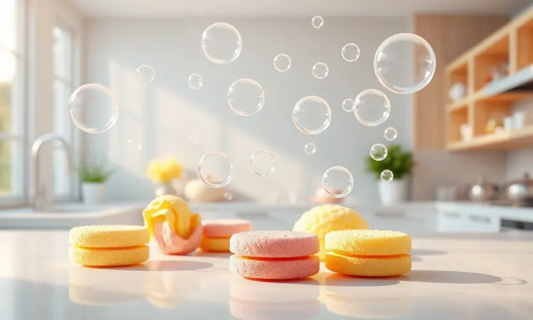
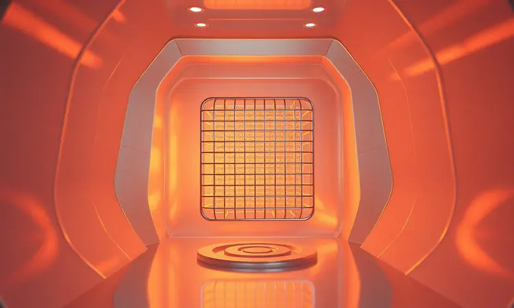

Você já sentiu que, por mais que lave o cesto da sua airfryer, ainda resta um cheiro de gordura queimada no ar? Aquela lembrança persistente do último frango assado que insiste em ficar no aparelho, mesmo depois da limpeza.

Esse é o verdadeiro teste de que você pode estar ignorando as partes mais críticas do equipamento.

Manter sua fritadeira sem óleo limpa vai muito além da higiene: é sobre proteger seu investimento, garantir alimentos com sabor puro e, sim, finalmente acabar com aquele odor que te persegue.

Neste guia, você não vai aprender apenas a limpar, mas sim a dominar a arte da manutenção da sua airfryer, descobrindo inclusive o segredo que poucos conhecem: como limpar o verdadeiro culpado pelo cheiro, a resistência superior.

<SummaryList products={frontmatter.top_products} />

## Por Que a Limpeza Regular da Airfryer é Essencial?

Os resíduos que ficam para trás não são apenas estéticos. Eles se transformam em gordura carbonizada, afetando diretamente o sabor dos alimentos que você prepara. Imagine fazer batatas crocantes apenas para que elas saiam com um gosto residual da última refeição.

Pior ainda, esse acúmulo impede o fluxo de ar quente ideal, criando pontos frios que deixam alguns alimentos crus enquanto outros queimam.

A limpeza regular é o ritual que garante o sabor impecável de cada preparo e, ao mesmo tempo, estende a vida útil do aparelho por anos.

## Materiais Indispensáveis para uma Limpeza Segura

Investir nas ferramentas certas não é frescura, é proteção. Você comprou uma airfryer com revestimento antiaderente de qualidade, e usar qualquer produto ou esponja pode acabar com esse investimento em poucos meses.

Os itens a seguir são mais do que básicos de limpeza: são o seu kit de sobrevivência para manter o aparelho funcionando como novo.

### Detergente Neutro de Alta Eficiência

<ProductBox 
  title={frontmatter.top_products[0].title} 
  image={frontmatter.top_products[0].image} 
  link={frontmatter.top_products[0].link} 
/>

O segredo está na simplicidade. Um detergente neutro potente, sem corantes ou fragrâncias agressivas, é tudo que você precisa para dissolver a gordura sem criar uma guerra química contra o revestimento do seu aparelho.

Misture algumas gotas em água morna e deixe as peças de molho por 10 a 15 minutos antes de esfregar. Esse tempo de molho faz a química trabalhar por você, soltando até os resíduos mais teimosos sem que você precise esfregar com força.

Embora existam produtos específicos no mercado, como o Limppano Detergente Odd, lembre-se que um detergente neutro de boa qualidade já oferece toda a eficácia necessária, com a vantagem de ser mais acessível e fácil de encontrar.

### Esponja Macia Anti-Risco

<ProductBox 
  title={frontmatter.top_products[1].title} 
  image={frontmatter.top_products[1].image} 
  link={frontmatter.top_products[1].link} 
/>

Essa é a proteção física do seu investimento. Esponjas abrasivas são o inimigo silencioso do revestimento antiaderente, criando micro-riscos que evoluem para descascados.

A Esponja Limppano Antiaderente Air Fryer foi desenhada especificamente para isso, com fibras que removem a sujeira incrustada sem atacar a superfície. Alternativas como a Esponja Anti-risco Azul oferecem a mesma maciez para superfícies delicadas.

Algumas esponjas de thermoborracha são ainda mais versáteis, aguentando a água quente sem deformar. Independente da escolha, a regra é clara: desligue o aparelho e aguarde esfriar completamente antes de começar.

Essa paciência inicial evita acidentes e garante uma limpeza perfeita.

### Escova de Cerdas Macias para Pequenos Detalhes

<ProductBox 
  title={frontmatter.top_products[2].title} 
  image={frontmatter.top_products[2].image} 
  link={frontmatter.top_products[2].link} 
/>

Enquanto a esponja cuva das áreas grandes, esta escova é sua aliada para os detalhes que fazem a diferença. As grelhas, as ranhuras das grades, os cantinhos do cesto que parecem inacessíveis.

Uma escova de cerdas macias alcança onde seus dedos e as esponjas não chegam, garantindo que nenhum resíduo fique escondido para criar aquele cheiro desagradável depois.

Escolha modelos com cerdas flexíveis e resistentes, que não soltam fiapos e suportam o contato com sabão neutro. Com essa ferramenta em mãos, a limpeza deixa de ser superficial para se tornar completa.

## Passo a Passo: Como Limpar a Gaveta e o Cesto Sem Riscar

Agora que você tem o arsenal completo, é hora da ação. A gaveta e o cesto são as partes que mais sofrem, então precisam de cuidado especial. Use a água morna com detergente neutro que você já preparou e a esponja macia.

Esqueça qualquer tentação de usar produtos químicos fortes ou lâminas. Se encontrar resíduos mais resistentes, não force a limpeza. Isso nos leva diretamente ao próximo passo.

### A Técnica do Molho: Removendo Gordura Encrustada

Quando a esponja macia não dá conta, é hora de acionar a estratégia dos cozinheiros profissionais: o poder do molho.

Encha o cesto ou gaveta com água quente (cuidado para não queimar!), adicione umas gotas generosas do seu detergente neutro e deixe agir por 15 a 30 minutos.

Essa pausa estratégica permite que a gordura carbonizada se solte, transformando uma tarefa difícil em um simples enxágue. Após o tempo de molho, passe a esponja macia suavemente e veja como os resíduos teimosos simplesmente desaparecem.

Seque completamente cada peça antes de guardar. A umidade é o aliado da ferrugem e dos odores.

## O Segredo Revelado: Como Limpar a Parte de Cima (Resistência) da Airfryer

Aqui está o culpado secreto do cheiro persistente, que quase ninguém lembra de limpar. A resistência superior, onde o calor é gerado, acumula finas camadas de gordura vaporizada que cozinham e recozinham a cada uso.

Para acessá-la, desconecte o aparelho da tomada e aguarde resfriar totalmente. Isso não é apenas uma dica de segurança, mas também permite que a gordura solidifique, facilitando a remoção.

Com um pano úmido (não encharcado) e um pouco do seu detergente neutro, passe suavemente sobre a superfície da resistência, evitando movimentos bruscos.

Você verá um resíduo amarronzado saindo no pano, que é exatamente a gordura acumulada que fica aquecendo e liberando odor. Não adianta fazer força, a chave é a constância.

Após limpar, use outro pano apenas úmido com água para remover qualquer resíduo de sabão e seque completamente com um pano limpo. A parte elétrica precisa estar absolutamente seca antes do próximo uso.

## Como Limpar a Airfryer por Fora e Manter o Brilho

O exterior do aparelho é o cartão de visitas da sua cozinha e também acumula gordura que se espalha pelo ar quente. Com o aparelho desligado e frio, use um pano de microfibra levemente umedecido com a mesma solução de água morna e detergente neutro.

Para manchas mais resistentes ou áreas próximas às saídas de ar, uma mistura de partes iguais de vinagre branco e água funciona como um desengordurante natural e eficaz.

O verdadeiro segredo está no passo final: seque com um pano seco e macio, garantindo que não fique nenhum vestígio de umidade. Esse cuidado evita marcas de água e mantém aquele aspecto de produto novo.

## Pode Colocar Airfryer na Lava-Louças? O que Dizem os Fabricantes

Esta é a dúvida que surge naturalmente na era da praticidade, mas a resposta geral é não. A maioria dos fabricantes desaconselha veementemente a lavagem na máquina, não por capricho, mas pela física envolvida.

O calor intenso, a pressão da água e os químicos dos sabões automáticos podem comprometer componentes eletrônicos sensíveis e até deformar partes plásticas.

Entretanto, há uma nuance importante: peças removíveis, como a cesta e a bandeja coletora, muitas vezes são sim compatíveis com a lava-louças. Mas essa informação é crucial de ser verificada no manual específico do seu modelo. Quando em dúvida, opte pela limpeza manual.

Aquele tempo a mais que você gasta lavando a mão não é perda, é investimento na longevidade do seu aparelho.

## 5 Erros Fatais que Destroem o Antiaderente da sua Fritadeira

Conhecer o caminho certo é importante, mas conhecer os atalhos perigosos é essencial. Esses cinco erros são mais comuns do que você imagina e podem encurtar a vida da sua airfryer pela metade:

1. **Utensílios de metal:** Facas, garfos ou espátulas metálicas são como unhas no quadro-negro do seu revestimento. Cada raspada cria um risco que se transforma em ponto de descascado.

2. **Esponjas abrasivas:** A pressa de limpar não justifica destruir a proteção. As esponjas coloridas duras e palhas de aço são proibidas.

3. **Acúmulo de resíduos:** Deixar a gordura esfriar e grudar força você a limpar com mais vigor depois. Limpe ainda morno, antes que endureça.

4. **Temperatura exagerada:** Usar o aparelho sempre no máximo pode superaquecer o revestimento, fazendo com que ele perca suas propriedades antiaderentes gradualmente.

5. **Ignorar o manual:** Cada modelo tem suas particularidades. As recomendações do fabricante não são sugestões, são instruções de sobrevivência do produto.

## Perguntas Frequentes (FAQ) sobre Manutenção de Airfryers

Essas são as dúvidas que perseguem todo dono de airfryer, especialmente nos primeiros meses de uso. Vamos aos esclarecimentos diretos:

Com que frequência devo limpar? Após cada uso, especialmente se preparou alimentos gordurosos. Uma limpeza rápida da gaveta e cesto leva menos de 3 minutos se feito logo após o uso.

Posso usar produtos de forno ou fogão? Evite. A química mais agressiva desses produtos pode reagir com os materiais da airfryer. Fique com o detergente neutro.

A cesta vai na lava-louças mesmo? Depende exclusivamente do manual do seu modelo. Quando não houver indicação clara, prefira a lavagem manual.

O cheiro de queimado é normal? Nas primeiras utilizações sim, devido ao óleo de fábrica. Persistindo após várias limpezas, pode indicar resíduos na resistência superior.

## Conclusão

Transformar a limpeza da sua airfryer de uma tarefa chata para um ritual de cuidado é a chave para uma relação duradoura com esse eletrodoméstico que revolucionou cozinhas.

Mais do que remover gordura, você está preservando o sabor autêntico de cada refeição, garantindo a segurança alimentar da sua família e protegendo um investimento que foi feito para facilitar seu dia a dia.

As técnicas e produtos certos não exigem mais tempo, apenas mais consciência. E quanto àquele cheiro de gordura queimada que te fez buscar este guia?

Agora você sabe que o culpado estava escondido lá em cima, na resistência, esperando apenas alguns minutos da sua atenção para desaparecer de vez. Sua airfryer limpa não é apenas um aparelho funcionando bem.

É a garantia de que cada refeição será exatamente como você planejou: saborosa, crocante e, acima de tudo, saudável.