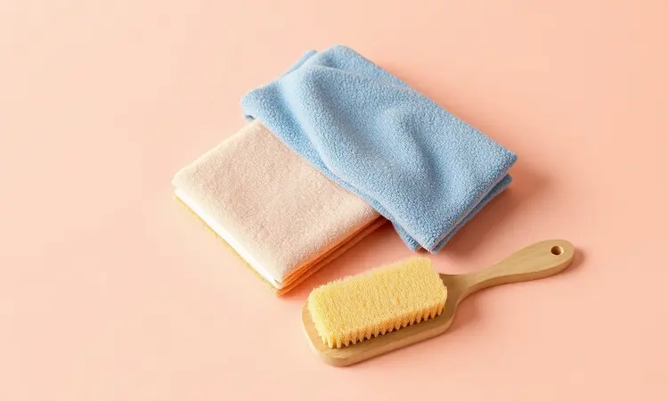

Aquele momento em que você abre a air fryer e lá está ela: a resistência no teto, aquela 'mola' mágica que transforma batatas em fritas douradas, mas agora coberta por uma camada de gordura que parece impossível de remover.

Você já sentiu o cheiro de queimado durante o uso ou viu uma fumaça fina saindo da máquina? Esses são sinais que não podemos ignorar. A boa notícia é que limpar essa parte do aparelho não precisa ser um pesadelo.

Na verdade, existe um método que transforma essa tarefa em algo rápido, seguro e até satisfatório. Vamos te mostrar não apenas o passo a passo, mas o segredo para fazer a gordura mais incrustada se soltar quase sozinha.

<SummaryList products={frontmatter.top_products} />

## Por que a resistência da air fryer fica suja e por que isso é perigoso?

Imagine o que acontece dentro da sua fritadeira elétrica enquanto ela trabalha: altas temperaturas, gordura vaporizada e pequenas partículas de alimento voando para todos os lados. A resistência, sendo a fonte de calor, age como um ímã para esses resíduos.

Com o tempo, essa acumulação cria uma crosta que não apenas prejudica o desempenho como também cria riscos reais. Essa barreira de gordura faz com que o calor não se distribua uniformemente, então você tem algumas batatas queimadas e outras cruas.

Pior ainda, em temperaturas muito altas, essa massa pode pegar fogo ou liberar fumaça que altera o sabor de tudo que você cozinha. Manter essa limpeza em dia é mais do que higiene, é garantir que cada refeição saia perfeita e que sua família fique segura.

## Materiais necessários: O que você pode e o que não pode usar

Pense nisso como montar um kit de primeiros socorros para sua air fryer. Você quer produtos que sejam fortes o suficiente para o trabalho, mas gentis o suficiente para não danificar o revestimento interno que torna seu aparelho tão eficiente. A regra de ouro?

Se você não usaria no seu melhor conjunto de panelas antiaderentes, não use na resistência.

### Esponja anti-risco para superfícies delicadas

<ProductBox 
  title={frontmatter.top_products[0].title} 
  image={frontmatter.top_products[0].image} 
  link={frontmatter.top_products[0].link} 
/>

A escolha da esponja errada pode transformar uma rápida limpeza em um compromisso de longo prazo com arranhões e manchas. A esponja de microfibra é sua aliada perfeita aqui, pois suas fibras microscópicas agarram a gordura sem agredir o revestimento.

Já a famosa 'esponja mágica' de melamina pode ser tentadora para manchas teimosas, mas use com cuidado. Ela funciona quase como uma lixa ultra-fina e, com uso repetido, pode desgastar a superfície protetora.

O segredo está no toque: pressione apenas o suficiente para sentir que está removendo a sujeira, não o revestimento.

### Desengordurante potente para limpeza pesada

<ProductBox 
  title={frontmatter.top_products[1].title} 
  image={frontmatter.top_products[1].image} 
  link={frontmatter.top_products[1].link} 
/>

Quando a gordura se transformou em algo que parece um adesivo industrial, você precisa de ajuda especializada. O Cif Limpador Especialista Derrete Gordura funciona como um derretedor térmico em forma de spray, infiltrando-se nas camadas mais profundas.

Já o Veja Super Desengordurante Power Gel Limão oferece um duplo benefício: além de dissolver a gordura, deixa aquele aroma fresco de limão que tira qualquer cheiro residual de comida.

Importante: sempre verifique o rótulo para garantir que o produto seja seguro para contato com alimentos ou superfícies de cozimento. Aplique, deixe agir por alguns minutos (esse tempo de pausa é crucial) e depois remova.

### Escova de cerdas macias para detalhes e cantos

<ProductBox 
  title={frontmatter.top_products[2].title} 
  image={frontmatter.top_products[2].image} 
  link={frontmatter.top_products[2].link} 
/>

Os lugares que seus dedos não alcançam são exatamente onde a gordura mais gosta de se esconder.

Uma escova com cerdas macias e cabo longo se torna a extensão perfeita dos seus braços, permitindo limpar entre as espirais da resistência e nos cantos mais recônditos do teto. Pense nela como uma ferramenta de precisão, não de força.

Se encontrar resistência, não force. Em vez disso, volte aos desengordurantes e deixe que a química trabalhe primeiro, deixando para a escova apenas o trabalho final de polimento.

## Passo a passo: Como limpar a resistência da air fryer com segurança

Vamos transformar essa tarefa em um ritual simples de cinco momentos. Seguindo essa sequência, você não apenas limpa, mas também reconecta-se com seu eletrodoméstico, entendendo como ele funciona e como mantê-lo em seu melhor estado.

### 1. Desligue e espere esfriar totalmente

Sua segurança vem sempre em primeiro lugar. Antes de fazer qualquer coisa, desconecte o aparelho da tomada. Agora, respire fundo e dê a ele o tempo que precisa.

Isso não é apenas sobre evitar queimaduras, é sobre física básica: metais quentes contraem e expandem, e limpar com o aparelho ainda quente pode causar choques térmicos que danificam componentes internos.

Use esses 30 a 40 minutos de espera para preparar seu espaço de trabalho, organizar os materiais e colocar uma música que torne o processo mais agradável.

### 2. A técnica da limpeza com a air fryer de ponta-cabeça

Aqui está o truque que poucas pessoas conhecem, mas que transforma completamente a experiência. Com o aparelho completamente frio, retire a cesta e vire a unidade principal de cabeça para baixo sobre uma superfície macia (use uma toalha para proteger).

De repente, o que era um teto inacessível se transforma em uma superfície plana diante de você. Agora você pode ver exatamente onde a gordura se acumula e como a resistência está construída.

Use sua escova de cerdas macias para fazer movimentos circulares suaves, começando do centro e indo para as bordas. Você ficará surpreso com quanta sujeira simplesmente cai quando a gravidade está do seu lado.

### 3. Remoção manual da gordura superficial

Com o aparelho ainda na posição invertida, aplique seu desengordurante escolhido diretamente nas áreas mais afetadas. Se preferir uma solução caseira, uma pasta de bicarbonato com água funciona como um esfoliante natural e seguro.

Deixe agir por cinco a dez minutos, tempo suficiente para que os agentes de limpeza quebrem as ligações moleculares da gordura. Agora, com um pano úmido e um pouco de detergente neutro, passe suavemente, quase como se estivesse massageando a superfície.

Não esfregue com força, deixe que a química faça o trabalho pesado. Se encontrar pontos mais resistentes, aplique mais produto e dê mais tempo, nunca mais força.

## O truque do vapor: Como soltar gordura incrustada sem esfregar

Para aquelas situações em que a gordura parece ter se fundido com o metal, existe uma solução tão simples quanto geniosa, que elimina a necessidade de esfregar até cansar.

Encha uma tigela resistente ao calor com água (adicionar algumas fatias de limão não apenas ajuda a soltar gordura, como deixa um cheiro agradável) e leve ao micro-ondas até ferver.

Com cuidado, retire a tigela e posicione-a dentro da air fryer ainda na posição invertida. Cubra levemente com um pano para direcionar o vapor. O que acontece a seguir é mágica prática: o vapor quente penetra na gordura incrustada, amolecendo-a de dentro para fora.

Após 15 minutos, você verá os resíduos começarem a escorrer quase que voluntariamente. Não é sobre força, é sobre inteligência.

## Como limpar o teto e as paredes internas da fritadeira

Enquanto a resistência recebe toda a atenção, o teto e as paredes internas são os coadjuvantes essenciais que também acumulam gordura. Aqui, a chave é a regularidade.

Após cada uso, quando o aparelho já estiver frio, passe rapidamente um pano úmido para remover os resíduos mais recentes. Para limpezas mais profundas, use a mesma técnica de vapor mencionada anteriormente, mas com a air fryer na posição normal.

Uma escova de dentes velha (limpa, claro) se torna a ferramenta perfeita para os cantos onde os panos não alcançam. Lembre-se, o objetivo não é deixar como novo a cada uso, mas evitar que pequenos resíduos se transformem em problemas maiores.

## O que NUNCA fazer: 5 erros que podem queimar sua air fryer na limpeza

1. Água direta na resistência: Componentes elétricos e líquidos nunca se dão bem. Sempre use panos úmidos, nunca jatos ou imersão.

2. Esponjas de aço ou abrasivas: Cada arranhão no revestimento antiaderente é um lugar novo para a gordura se esconder da próxima vez.

3. Produtos químicos agressivos: Limpadores de forno tradicionais podem conter ingredientes que corroem o metal ou deixam resíduos tóxicos.

4. Ignorar pequenos acúmulos: O que hoje é uma fina película amanhã será uma crosta que afeta o sabor e a segurança.

5. Pressa no resfriamento: Tentar acelerar o processo com ventiladores ou água pode causar danos térmicos irreversíveis.

## Posso usar bicarbonato de sódio ou vinagre na resistência?

Esses dois ingredientes da sua despensa são muito mais do que simples temperos. O bicarbonato de sódio age como um abrasivo natural ultra-sutil, perfeito para esfregar sem arranhar.

Misture com um pouco de água até formar uma pasta cremosa, aplique na resistência fria e deixe agir por 20 minutos. Já o vinagre branco tem propriedades ácidas que quebram as moléculas de gordura.

Use um borrifador para aplicar uma solução de partes iguais de vinagre e água. O único cuidado é enxaguar bem após o uso, pois o vinagre residual pode afetar o sabor dos próximos alimentos. Juntos, eles formam uma dupla imbatível para quem prefere soluções naturais.

## Dicas de manutenção: Como evitar que a gordura acumule na resistência

A verdadeira sabedoria não está em limpar bem, mas em precisar limpar menos. Comece pelos alimentos: batatas fritas congeladas muitas vezes têm uma camada extra de óleo, então uma rápida passagem em papel toalha faz milagres.

Carnes mais gordurosas podem se beneficiar de uma grelha dentro da cesta, permitindo que o excesso de gordura escorra para baixo, longe da resistência.

Após cada uso, quando o aparelho ainda está morno (não quente), um pano seco remove facilmente os resíduos mais frescos. E aqui está o segredo que quase ninguém conta: uma vez por mês, faça um ciclo de aquecimento vazio por 10 minutos.

Isso carboniza os resíduos mais leves, transformando-os em cinzas que são facilmente removidas com um pincel.

## Conclusão

Limpar a resistência da sua fritadeira elétrica vai muito além da simples manutenção, é um ato de cuidado que transforma sua relação com o aparelho.

Quando você remove a barreira de gordura acumulada, está restaurando não apenas a eficiência térmica, mas também garantindo que cada refeição tenha o sabor puro que você buscou ao adquirir essa maravilha da cozinha moderna.

Os métodos que compartilhamos aqui não são apenas técnicas, são convites para que você veja a limpeza não como uma tarefa árdua, mas como um ritual de renovação.

Lembre-se de que a regularidade é sua maior aliada, pequenas ações frequentes previnem grandes trabalhos ocasionais.

Sua air fryer, quando bem cuidada, retribui esse cuidado com anos de funcionamento perfeito, economia de energia e, o mais importante, com aquelas batatas crocantes por fora e macias por dentro que fazem todos à mesa sorrirem. Que tal começar hoje mesmo?

O próximo ciclo de limpeza pode ser o momento em que você descobre o prazer de ter um eletrodoméstico que realmente funciona como no primeiro dia.