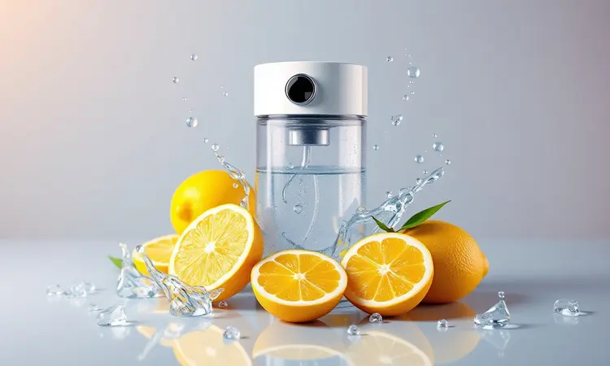

Você ama a praticidade de cozinhar com a air fryer, mas sente que a limpeza da gordura acumulada é um pesadelo sem fim? Você não está sozinho.

Manter seu aparelho higienizado vai muito além da estética: é a garantia de que suas refeições continuarão saudáveis e deliciosas, e que seu investimento durará anos sem perder desempenho.

Neste guia, você vai descobrir o passo a passo exato para limpar sua air fryer por dentro e por fora, técnicas para remover sujeiras que parecem impenetráveis e os truques de mestre que mantêm o revestimento sempre antiaderente.

Prepare-se para transformar essa tarefa em algo rápido e satisfatório, com sua fritadeira brilhando como nova no final.

<SummaryList products={frontmatter.top_products} />

## Por que a limpeza correta da Air Fryer é vital para sua saúde?

Pense na última vez que você retirou batatas fritas crocantes da air fryer. Agora imagine que, por trás daquele dourado perfeito, havia resíduos de gordura acumulados.

Esses resíduos não só podem alterar o sabor dos alimentos, como se tornam um terreno fértil para bactérias. A limpeza adequada é o que separa uma refeição deliciosa e segura de uma experiência com gosto de descuido.

Mais do que higiene, você protege o funcionamento eficiente do aparelho, garantindo que cada receita saia exatamente como esperado.

### O que você vai precisar: Kit básico de limpeza segura

<ProductBox 
  title={frontmatter.top_products[0].title} 
  image={frontmatter.top_products[0].image} 
  link={frontmatter.top_products[0].link} 
/>

Armar seu kit é o primeiro passo para uma rotina sem complicações. Tenha à mão um limpador específico para air fryer, como o Espumagic Limpa Air Fryer ou o WAP Limpa Air Fryer, formulados para dissolver gordura sem agredir o revestimento.

Para a manutenção diária, um detergente neutro simples resolve. Quando encontrar sujeiras mais rebeldes, recorra à clássica mistura de bicarbonato de sódio com água, um aliado natural e eficaz.

Complete seu arsenal com esponjas macias e um pano de microfibra para secar sem deixar fiapos. Com esses poucos itens, você tem tudo para manter seu aparelho impecável.

### Produtos proibidos: O que destrói o antiaderente do seu aparelho

<ProductBox 
  title={frontmatter.top_products[1].title} 
  image={frontmatter.top_products[1].image} 
  link={frontmatter.top_products[1].link} 
/>

Os maiores inimigos do seu revestimento antiaderente são os utensílios de metal, que criam riscos microscópicos onde a gordura se instala para sempre.

Evite também plásticos e papel filme próximo ao calor intenso, que podem derreter e liberar substâncias nos seus alimentos.

E atenção para receitas muito açúcares ou excessivamente gordurosas, elas tendem a caramelizar ou soltar muita gordura, criando uma camada difícil de remover depois.

Proteger essas superfícies é garantir que cada batata, cada frango, cada empanado desgrude com facilidade, fazendo você economizar tempo e aborrecimento.

## Passo a passo: Limpeza de rotina após cada uso

Transformar a limpeza em um hábito rápido é o segredo para nunca mais enfrentar uma sujeira acumulada. A boa notícia são os três minutos que separam você de uma air fryer pronta para o próximo uso, seguindo este ritual simples que preserva seu aparelho.

### 1. Desconexão e resfriamento: Segurança em primeiro lugar

Sua segurança e a do aparelho vêm antes de tudo. Comece desconectando da tomada, eliminando qualquer risco de choque. Aguarde o completo resfriamento, não apenas para proteger suas mãos, mas porque a gordura ainda quente gruda mais firmemente.

Essa paciura de alguns minutos será recompensada com uma limpeza muito mais fácil e eficiente.

### 2. Lavagem da cesta e cuba: O segredo da água morna

Encha uma bacia com água morna e algumas gotas de detergente. Mergulhe a cesta e a cuba por cerca de 15 minutos e observe a mágica acontecer: a gordura se solta praticamente sozinha. Depois, basta uma passada suave com esponja macia, enxágue e secagem completa.

Esse simples hábito mantém o revestimento intacto e seus alimentos com o sabor puro que você merece.

### 3. Limpeza da parte externa para manter o brilho

Um pano levemente umedecido com água e detergente neutro remove qualquer mancha da superfície externa. Evite produtos abrasivos que possam arranhar o acabamento. Após a limpeza, seque bem com um pano seco para não deixar marcas.

Além da estética, você preserva os controles e indicadores funcionais, garantindo que seu aparelho continue tão bonito quanto o dia em que chegou.

## Limpeza Pesada: Como remover gordura encrustada e queimada?

Aquele dia em que o queijo derreteu e grudou, ou a gordura do bacon se transformou em uma película resistente, não precisa significar horas de esfrega. Para essas situações, a estratégia muda um pouco, mas continua simples.

### Como limpar a resistência (bobina de aquecimento) sem estragar?

<ProductBox 
  title={frontmatter.top_products[2].title} 
  image={frontmatter.top_products[2].image} 
  link={frontmatter.top_products[2].link} 
/>

A resistência é o coração do seu aparelho e merece cuidado especial. Com a air fryer completamente fria e desconectada, vire-a cuidadosamente e use uma escova de dentes seca para remover os resíduos soltos.

Para uma limpeza mais profunda, umedeça um pano macio com água morna e detergente neutro, passando suavemente ao redor.

Se encontrar gordura incrustada, coloque um recipiente com água quente e algumas gotas de detergente na gaveta, ligue por três minutos: o vapor vai soltar tudo, facilitando a remoção.

Lembre-se: um leve escurecimento da resistência é normal devido ao calor constante, não significa que está suja.

### O truque do vinagre e bicarbonato para sujeiras impossíveis

Para aquelas manchas que parecem ter se fundido com o metal, a dupla dinâmica entra em cena. Primeiro, aplique uma mistura de partes iguais de vinagre e água e deixe agir por alguns minutos.

Em seguida, polvilhe bicarbonato de sódio sobre a área: a reação efervescente vai soltar até o resíduo mais teimoso. Esfregue suavemente com esponja macia e enxágue bem.

Você elimina a sujeira sem produtos químicos agressivos, usando apenas ingredientes que provavelmente já tem em casa.

## Como tirar o cheiro de peixe ou gordura da Air Fryer?

Nada pior do que servir batatas fritas com aroma de peixe da refeição anterior. Para neutralizar odores persistentes, combine partes iguais de água morna e vinagre e limpe todas as superfícies internas com um pano embebido nessa solução.

Se o cheiro resistir, corte um limão ao meio, coloque na cesta e aqueça a 200°C por cerca de 10 minutos. O vapor cítrico vai renovar completamente o interior, deixando apenas a promessa de suas próximas receitas.

## Prevenção: Como sujar menos a sua fritadeira no dia a dia?

<ProductBox 
  title={frontmatter.top_products[3].title} 
  image={frontmatter.top_products[3].image} 
  link={frontmatter.top_products[3].link} 
/>

A melhor limpeza é aquela que você quase não precisa fazer. Pequenos hábitos no momento do cozimento reduzem drasticamente o trabalho posterior.

Coloque forros próprios para fritadeiras ou papel manteiga (certificando-se de não bloquear a ventilação) para reter a gordura antes que ela se espalhe. Seque bem os alimentos antes de colocá-los na fritadeira, reduzindo os respingos.

E evite a tentação de sobrecarregar a cesta, cozinhando em lotes menores. Essas simples práticas transformam a limpeza pós-uso em uma tarefa de apenas um minuto.

### Uso de forros de silicone e papel antiaderente: Vale a pena?

<ProductBox 
  title={frontmatter.top_products[4].title} 
  image={frontmatter.top_products[4].image} 
  link={frontmatter.top_products[4].link} 
/>

Os forros de silicone reutilizáveis são excelentes aliados, evitando que os alimentos grudem diretamente na cesta. Apenas certifique-se de escolher modelos com furos adequados que permitam a circulação de ar e o escoamento da gordura.

Já o papel antiaderente descartável oferece praticidade máxima, mas exige atenção: alimentos muito leves podem fazer o papel "voar" durante o cozimento, portanto, use com parcimônia e sempre verifique se é compatível com seu modelo específico.

Ambos são válidos, depende do equilíbrio entre praticidade e o resultado final que você busca.

## FAQ: Dúvidas frequentes sobre a manutenção da Air Fryer

Respondemos aqui as perguntas que mais surgem quando o assunto é cuidar da sua air fryer.

### Pode colocar a cesta da Air Fryer na lava-louças?

Sim, na maioria dos modelos, especialmente aqueles com materiais específicos para isso. No entanto, essa informação está sempre no manual do fabricante, sua fonte mais confiável.

Antes de colocar na máquina, remova os resíduos grossos de alimentos para evitar entupimentos e garantir uma limpeza eficiente. Essa conveniência pode economizar minutos preciosos da sua rotina.

### O que fazer se a cuba começar a enferrujar?

Se notar sinais de ferrugem, interrompa o uso imediatamente. Limpe a área com vinagre ou bicarbonato de sódio usando uma esponja fina. Se a oxidação estiver avançada, considere substituir a peça, pois continuar usando pode comprometer a segurança dos alimentos.

Para prevenir, sempre seque bem todas as partes após a lavagem, nunca guardando úmidas.

### Com que frequência devo fazer a limpeza profunda?

A limpeza completa, incluindo resistência e partes fixas, deve ser feita a cada 15 dias com uso regular. Se você cozinha alimentos mais gordurosos com frequência, aumente para semanal. Já a limpeza da cesta e bandeja continua sendo após cada uso.

Essa cadência mantém o aparelho funcionando perfeitamente e seus alimentos sempre com o sabor que você planejou.

## Conclusão

Limpar sua air fryer deixou de ser um pesadelo para se tornar um ritual simples que protege seu investimento, sua saúde e o sabor das suas refeições.

Você descobriu que com os produtos certos, um pouco de organização e técnicas inteligentes, mantê-la impecável requer muito menos esforço do que imaginava.

Cada minuto dedicado à limpeza é um investimento em receitas mais gostosas, em um aparelho que dura anos e na tranquilidade de saber que sua família está consumindo alimentos preparados com segurança e cuidado.

Agora é hora de colocar essas dicas em prática e redescobrir o prazer de cozinhar com uma air fryer que parece sempre nova, pronta para transformar ingredientes simples em refeições memoráveis.