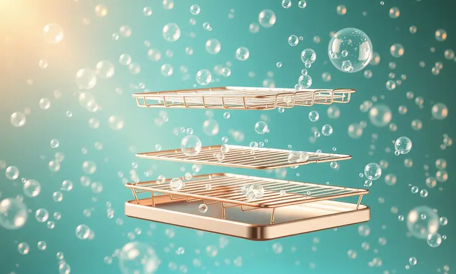
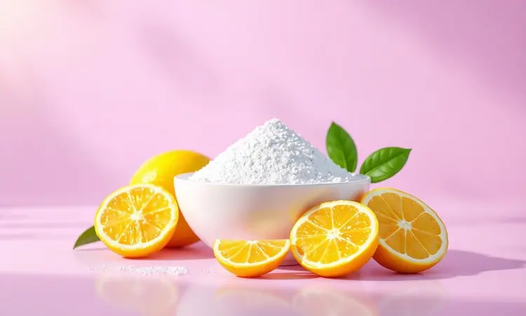
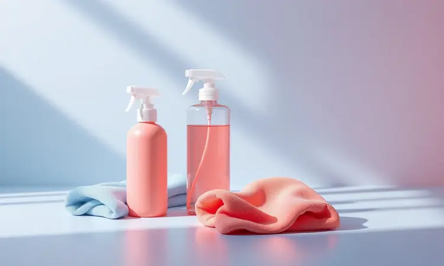

Já aconteceu de você ligar sua air fryer e perceber aquele cheirinho de queimado que parece afetar o sabor da comida? Ou talvez o vidro da porta tenha ficado opaco, escondendo o sucesso das suas receitas favoritas. Esses sinais são mais do que inconvenientes.

São um alerta de que gordura e resíduos estão se acumulando em lugares que seus olhos mal alcançam, especialmente na resistência e naqueles cantinhos que parecem feitos para acumular sujeira.

Este guia vai transformar essa tarefa que parece intimidadora em um processo simples, seguro e até gratificante.

Você aprenderá não apenas a deixar seu aparelho brilhando como novo, mas a fazê-lo de forma a proteger seu investimento e garantir que cada refeição saia perfeita e com o sabor que você merece.

<SummaryList products={frontmatter.top_products} />

## Por Que a Limpeza da Air Fryer Oven Exige Atenção Especial?

Se você já passou por essa experiência frustrante, sabe que não se trata apenas de estética.

Quando o sabor daquele frango crocante parece ter um toque desagradável, ou quando a eficiência do aparelho cai e os alimentos não ficam tão dourados quanto antes, a culpa provavelmente está na acumulação invisível de gordura e resíduos alimentares.

Em temperaturas tão altas, esses restos podem se transformar em substâncias que não apenas alteram o paladar como podem levantar questões sobre a saúde das suas refeições.

Mantê-la limpa é, portanto, a garantia de um eletrodoméstico que funciona como prometido, preservando tanto o desempenho quanto a qualidade de vida na sua cozinha. É cuidar da sua saúde e do seu paladar ao mesmo tempo.

## Segurança em Primeiro Lugar: O que Fazer Antes de Começar

Imagine começar a limpeza com pressa e tocar uma parte ainda quente que queimou seus dedos. Para evitar isso, seu primeiro passo deve ser garantir que o aparelho esteja completamente frio ao toque e, o mais importante, desconectado da tomada.

Essa simples ação elimina qualquer risco elétrico. Retire todas as peças removíveis, como as grades e bandejas, e verifique se não há migalhas ou pedaços de alimento presos.

Ter um kit básico à mão - luvas de borracha para proteger sua pele, um pano macio e um detergente neutro - já prepara o cenário para uma limpeza tranquila.

Esses minutos iniciais de preparação protegem você e seu aparelho, criando um ambiente seguro para o trabalho que vem a seguir.

## Passo a Passo: Como Limpar as Grades e Bandejas da Air Fryer Oven

Com essas precauções em mente, você está pronto para mergulhar no que talvez seja a parte mais tangível da limpeza. Comece removendo cuidadosamente as grades e bandejas e levando-as para a pia.

Uma lavagem em água morna com sabão é suficiente na maioria dos casos, mas é a ferramenta que você escolhe que faz toda a diferença. Lembre-se: essas superfícies são seu contato direto com os alimentos.

### Esponja de Limpeza Anti-Risco (Ideal para Antiaderente)

<ProductBox 
  title={frontmatter.top_products[0].title} 
  image={frontmatter.top_products[0].image} 
  link={frontmatter.top_products[0].link} 
/>

Para proteger justamente essas superfícies delicadas, a escolha da esponja é crucial. Imagine conseguir remover aquele queijo derretido que grudou sem deixar nenhum arranho ou marca de desgaste.

Esponjas especificamente desenvolvidas para superfícies antiaderentes, como a Esponja Antiaderente Limppano, usam uma fibra especial que age como uma esfoliação suave para a sujeira incrustada, mas que se transforma em um toque de seda contra o material do seu aparelho.

Outra opção é a Esponja Mágica da Tekbond, que parece se moldar aos relevos da superfície, alcançando até os resíduos mais teimosos.

Usá-las é como dar um tratamento de beleza para sua air fryer, garantindo que ela não apenas fique limpa, mas mantenha aquele aspecto de nova por muito mais tempo.

## Como Tirar Gordura da Air Fryer Oven: Paredes Internas e Teto

Agora vamos para o interior - a câmara onde a mágica realmente acontece. Após desconectar e deixar o aparelho esfriar, visualize as paredes e o teto. Muitas vezes, é aqui que a gordura se transforma em uma película difícil.

Em vez de atacar com produtos químicos agressivos que podem corroer o revestimento, pense em uma abordagem gentil: um pano macio ou esponja não abrasiva, umedecidos com uma solução morna de água e detergente neutro.

Passe com cuidado, dando atenção extra às áreas onde a gordura parece ter se cristalizado. Para as manchas mais rebeldes, deixe a mistura agir por alguns minutos, como um adesivo de limpeza que vai amolecendo a sujeira.

Ao final, um pano seco garantirá que toda umidade seja removida, deixando o interior preparado e convidativo para sua próxima criação culinária.

## O Segredo para Limpar a Resistência da Air Fryer sem Estragar

Essa é a peça mais crítica de todas. A resistência é o coração do seu aparelho, responsável por todo o calor que transforma seus ingredientes. Limpá-la com as ferramentas erradas pode comprometer seu funcionamento. O processo, no entanto, é surpreendentemente simples.

Com o aparelho frio e desconectado, use uma escova de cerdas macias ou um pano seco e suave para remover o pó e os resíduos soltos. É como escovar delicadamente o cabelo de alguém - com movimentos firmes, mas cuidadosos.

Se encontrar manchas persistentes, um pano levemente umedecido em água morna pode ajudar, mas com o cuidado de não deixar água escorrer para as partes elétricas.

Esse cuidado protege o componente que mais impacto tem no desempenho do seu aparelho, garantindo que ele continue aquecendo perfeitamente por anos.

## Como Limpar o Vidro da Porta e a Parte Externa do Aparelho

Enquanto o interior garante o sabor, o exterior é o cartão de visita da sua air fryer. O vidro da porta, quando limpo, lhe dá o prazer de assistir aos alimentos dourarem.

Para isso, a mesma dupla suave funciona: água morna e detergente neutro, aplicados com um pano macio. Para a carcaça externa, um pano levemente umedecido remove impressões digitais e respingos sem risco.

A chave aqui é evitar qualquer coisa abrasiva que possa riscar ou danificar o acabamento, preservando a beleza do seu eletrodoméstico.

### Panos de Microfibra de Alta Absorção

<ProductBox 
  title={frontmatter.top_products[1].title} 
  image={frontmatter.top_products[1].image} 
  link={frontmatter.top_products[1].link} 
/>

Essa atenção ao cuidado encontra seu melhor aliado nos panos de microfibra. Imagine um tecido tão fino que captura até as partículas de gordura mais minúsculas, deixando superfícies impecáveis sem usar produtos químicos em excesso.

Feitos de poliéster e poliamida, esses panos têm uma capacidade de absorção que parece mágica, removendo líquidos, poeira e sujeira com uma eficiência que panos comuns não alcançam.

Eles são versáteis - você pode usá-los no vidro, na carcaça e até secar as peças removíveis. A única atenção necessária é cuidar deles na lavagem para manter suas propriedades. Quando você os incorpora à sua rotina, percebe que são muito mais do que um pano.

São a garantia de que cada limpeza será rápida, eficiente e, principalmente, segura para todas as superfícies da sua cozinha.

## 3 Truques Caseiros Infalíveis para Eliminar o Mau Cheiro

Às vezes, mesmo com limpeza, um odor persistente parece grudar no aparelho. Em vez de conviver com ele, você pode usar soluções que provavelmente já tem em casa.

O primeiro truque é quase uma alquimia culinária da limpeza: misture partes iguais de água e vinagre em uma tigela, coloque na air fryer fria e aqueça a 180°C por 10 a 15 minutos. O vapor de vinagre neutraliza os odores de maneira impressionante.

Para uma abordagem mais passiva, polvilhe uma camada fina de bicarbonato de sódio no fundo e deixe agir por algumas horas antes de limpar. E quando quiser um toque refrescante? Coloque cascas de limão no aparelho enquanto ele aquece.

O aroma cítrico que se espalha pela cozinha é um bônus delicioso.

## O Que NUNCA Usar na Sua Fritadeira Oven (Evite Danos Irreversíveis)

Enquanto descobrimos o que funciona, é igualmente crucial saber o que deve ficar longe do seu aparelho. As tentações são grandes: quando a gordura está incrustada, nossa vontade é pegar uma esponja de aço ou um produto de limpeza potente.

Essas são exatamente as escolhas que podem causar danos permanentes. Esponjas abrasivas ou utensílios de metal são como lixas contra o delicado revestimento antiaderente, criando arranhões onde a gordura futura vai adorar se alojar.

Produtos químicos agressivos, como alvejantes e detergentes com amônia, podem deixar resíduos tóxicos ou mesmo reagir com o calor, comprometendo o funcionamento. A regra é simples: se parece muito forte, provavelmente é.

Fique com sabão neutro, água morna e as ferramentas macias que já mencionamos. Essa moderação protege seu investimento por muito mais tempo.

## Melhores Produtos para Facilitar a Sua Rotina de Limpeza

Transformar a manutenção da sua air fryer em uma tarefa leve está diretamente ligado às ferramentas certas. Além das esponjas e panos que já discutimos, alguns produtos específicos podem ser verdadeiros aliados, eliminando o atrito da rotina.

### Desengordurante Neutro de Alta Performance

<ProductBox 
  title={frontmatter.top_products[2].title} 
  image={frontmatter.top_products[2].image} 
  link={frontmatter.top_products[2].link} 
/>

Para aqueles momentos em que a gordura parece ter se fundido com o metal, um desengordurante neutro de alta performance é a resposta.

Produtos como o Limpav Neut HLP-NA foram formulados com um equilíbrio inteligente: potência suficiente para dissolver gordura incrustada, mas com uma composição segura que não ataca superfícies ou deixa resíduos preocupantes.

Sua baixa formação de espuma e secagem rápida significam menos tempo esperando e mais tempo usando. Outra opção é o Detergente Clean Neutro, que alia eficiência a uma pegada ecológica. O verdadeiro benefício desses produtos vai além da limpeza visível.

É a tranquilidade de saber que, depois de usá-los, seu aparelho está seguro para preparar alimentos para sua família, sem químicos agressivos em contato com sua comida.

### Escova de Limpeza com Cerdas de Nylon Macias

<ProductBox 
  title={frontmatter.top_products[3].title} 
  image={frontmatter.top_products[3].image} 
  link={frontmatter.top_products[3].link} 
/>

Quando seus dedos não conseguem alcançar aqueles cantos bem no fundo da câmara, é hora de chamar um especialista em alcance. Uma escova com cerdas de nylon macias age como uma extensão cuidadosa da sua mão.

Seu design combina algo mágico: cerdas firmes o suficiente para desalojar sujeira grudenta, mas macias a ponto de passar sobre superfícies delicadas sem deixar um único arranhão.

Muitos modelos vêm com cabos longos que transformam a busca por migalhas em algo simples, sem contorcionismos. Algumas pessoas tentam improvisar com escovas de plástico comum, mas a diferença é notável.

Esta ferramenta específica oferece uma precisão que protege seu aparelho enquanto garante uma limpeza completa, chegando exatamente onde é necessário, nem mais, nem menos.

## Perguntas Frequentes (FAQ) sobre a Limpeza de Air Fryer Oven

Se alguma dúvida ainda persiste no ar, como um último resíduo a ser removido, estas respostas podem esclarecer os detalhes finais.

Posso usar produtos de limpeza comuns? O segredo está na palavra "comum". Evite produtos abrasivos ou com componentes agressivos, como alvejantes. Detergentes neutros específicos para cozinha ou os desengordurantes neutros que mencionamos são suas melhores escolhas.

Sua air fryer agradece.

Com que frequência devo limpar? Pense nisso como cuidar de uma panela favorita. Uma limpeza básica das peças removíveis após cada uso previne o acúmulo e os odores.

Já uma limpeza mais profunda do interior e da resistência pode ser feita a cada 4-6 usos, dependendo da gordura dos alimentos preparados.

Posso colocar as peças na lava-louças? Na maioria dos modelos, sim, as grades e bandejas removíveis são seguras para a lava-louças. No entanto, essa é uma daquelas informações preciosas que vale a pena confirmar no manual do seu fabricante específico.

É um minuto de leitura que protege anos de uso.

## Conclusão

Limpar sua air fryer oven deixou de ser um desafio misterioso para se tornar um ritual de cuidado que você domina.

Você agora sabe que mais do que remover gordura, está preservando o sabor autêntico das suas refeições, protegendo um eletrodoméstico que faz parte do seu dia a dia e garantindo que cada uso seja seguro e eficiente.

Desde os minutos iniciais de segurança até os truques caseiros contra odores, cada passo que aprendeu é um investimento na durabilidade do seu aparelho e na qualidade da sua alimentação.

A próxima vez que ligá-lo e sentir apenas o aroma convidativo da comida aquecendo perfeitamente, você saberá que não foi por acaso. Foi porque você transformou a manutenção em um hábito simples, seguro e recompensador. Sua cozinha e seu paladar agradecem.