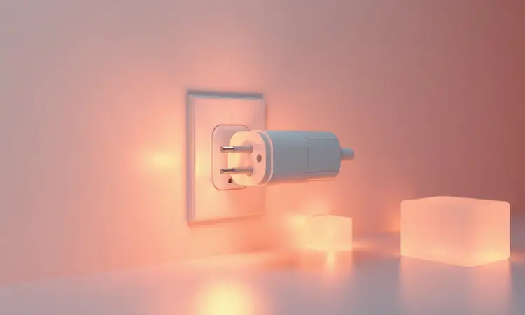
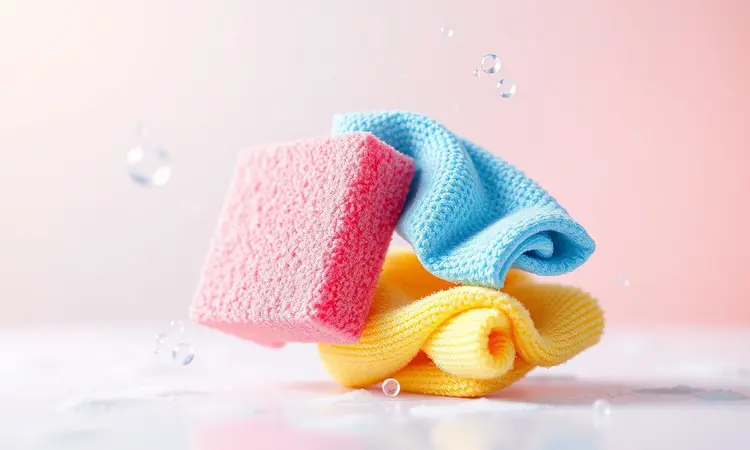

Limpar a airfryer após o uso pode parecer uma tarefa árdua, especialmente quando a gordura parece ter grudado para sempre no cesto. Se você já sentiu medo de estragar o antiaderente ou não sabe como higienizar a resistência superior, este guia foi feito para você.

Prometemos mostrar o passo a passo definitivo para manter seu eletrodoméstico impecável sem esforço excessivo.

Você aprenderá desde a lavagem básica do dia a dia até truques avançados para remover crostas de sujeira, garantindo que seu aparelho dure muito mais e não deixe cheiro nos alimentos.

<SummaryList products={frontmatter.top_products} />

## Por que a limpeza correta da airfryer é fundamental?

Imagine preparar um delicioso bife na sua airfryer e, quando ele sai, você percebe que tem um leve aroma de comida anterior grudado no prato. Isso acontece quando a limpeza não é feita com cuidado.

A gordura acumulada não apenas interfere no funcionamento do aparelho, criando fumaça durante o cozimento, mas também pode alterar o sabor dos alimentos.

Além do aspecto gastronômico, há uma questão de saúde: restos de alimentos são terreno fértil para bactérias, transformando suas refeições em risco potencial.

Mantendo sua airfryer limpa, você não apenas prolonga a vida útil do equipamento, evitando reparos dispendiosos, mas também garante que cada refeição seja saudável e tenha o verdadeiro sabor que você espera.

## Segurança em primeiro lugar: O que fazer antes de limpar

Antes de mergulhar na limpeza, pense em você. A primeira regra é desconectar o aparelho da tomada, eliminando qualquer risco de choque elétrico.

Depois de usar a airfryer, deixe ela esfriar completamente, pois as partes internas podem estar tão quentes que causam queimaduras superficiais. Verifique se todas as peças removíveis, como a cesta e a bandeja, estão desencaixadas corretamente.

Se você vai usar produtos de limpeza, luvas podem proteger suas mãos de irritações. Seguindo estas precauções simples, você transforma uma tarefa potencialmente perigosa em uma atividade segura e tranquila.

## O que usar (e o que jamais usar) na sua fritadeira sem óleo

Com a segurança garantida, agora vem a parte prática: escolher os produtos certos. Esta decisão é crucial para preservar o revestimento antiaderente da sua airfryer, evitando aquela frustração quando os alimentos começam a grudar e você precisa raspar.

### Esponjas macias: O segredo do antiaderente

<ProductBox 
  title={frontmatter.top_products[0].title} 
  image={frontmatter.top_products[0].image} 
  link={frontmatter.top_products[0].link} 
/>

Para manter sua airfryer em ótimo estado, a escolha de esponjas macias é fundamental. Elas são perfeitas para limpar sem arranhar o revestimento antiaderente, preservando a durabilidade do produto.

Existem esponjas projetadas com tecnologia específica, como as da marca Limppano, que removem resíduos de alimentos e gordura com eficiência e segurança.

Embora essas esponjas sejam eficazes, elas não substituem completamente a limpeza com água e detergente neutro, essa combinação clássica que já mencionamos.

Para manchas mais difíceis, você pode usar essas esponjas macias junto com aditivos como bicarbonato de sódio ou vinagre, garantindo que sua airfryer continue limpa e funcional por mais tempo.

### Detergente neutro e desengordurantes leves

<ProductBox 
  title={frontmatter.top_products[1].title} 
  image={frontmatter.top_products[1].image} 
  link={frontmatter.top_products[1].link} 
/>

O detergente neutro é seu grande aliado na limpeza da airfryer. Com pH neutro, ele é seguro para diversas superfícies e eficaz na remoção de resíduos leves, como gorduras do dia a dia.

Muitas fórmulas são biodegradáveis e não causam irritações na pele, tornando-o uma opção prática para quem limpa frequentemente. Para gorduras mais persistentes, os desengordurantes leves oferecem eficácia superior.

Eles são ideais para ambientes como cozinhas, onde os resíduos tendem a se acumular. Embora sejam mais fortes que o detergente neutro, ainda são suaves o suficiente para não danificar a airfryer.

Para sujeiras realmente incrustadas, um desincrustante pode ser necessário, mas a combinação de detergente neutro e desengordurante leve geralmente cumpre bem o papel na manutenção diária do aparelho.

## Passo a passo: Como limpar a gaveta e o cesto da airfryer

Agora que você sabe o que usar, vamos à ação. Limpar a gaveta e o cesto é essencial para garantir a durabilidade do aparelho e preservar o sabor dos alimentos. Comece retirando-os da airfryer e deixe-os esfriar. Use água morna e detergente neutro com uma esponja macia.

Evite produtos abrasivos que podem arranhar as superfícies. Se houver acúmulo de gordura, deixe de molho por 10 a 15 minutos antes de esfregar. Enxágue bem e seque completamente antes de recolocar na airfryer.

Realizar essa limpeza após cada uso evita a formação de resíduos, mantendo seu eletrodoméstico sempre em bom estado.

## Como limpar a resistência da airfryer (a parte interna superior)

A resistência é o coração da sua airfryer, e cuidar dela garante o funcionamento eficiente e prolonga a vida útil do aparelho. Para limpar, comece desconectando a airfryer da tomada e deixando-a esfriar completamente.

Com uma esponja ou pano macio umedecido com água morna e um pouco de detergente neutro, delicadamente limpe a parte interna superior. Evite produtos químicos fortes, pois podem danificar a resistência.

Se houver acúmulo de gordura, uma escova de cerdas macias pode ajudar. Certifique-se de que tudo esteja bem seco antes de usar novamente, assim você mantém sua airfryer sempre pronta para preparar deliciosos pratos.

## Truque Skyscraper: Como remover gordura encrustada e queimada

Remover gordura encrustada e queimada pode parecer uma tarefa desafiadora, mas com algumas dicas práticas isso se torna mais fácil. Primeiro, deixe a airfryer esfriar completamente e retire a cesta.

Uma mistura eficaz é o bicarbonato de sódio com água, aquela solução da avó que transforma uma tarefa difícil em algo simples. Aplique essa pasta nas áreas afetadas e deixe agir por cerca de 15 minutos.

Utilize uma esponja suave para esfregar suavemente, evitando arranhar o revestimento. Para finalizar, enxágue bem e seque com um pano limpo. Com esse truque simples, sua airfryer ficará novamente brilhante e pronta para novas receitas.

## Como limpar a parte externa para manter o brilho

<ProductBox 
  title={frontmatter.top_products[2].title} 
  image={frontmatter.top_products[2].image} 
  link={frontmatter.top_products[2].link} 
/>

Limpar a parte externa da sua Airfryer é essencial para manter seu brilho e aparência. Comece sempre desligando o aparelho e garantindo que ele esteja frio. Para a limpeza, utilize um pano macio levemente umedecido com água e uma gota de detergente neutro.

É importante passar o pano suavemente por toda a superfície externa, incluindo as alças e botões, sem esfregar com força, pois isso pode danificar as marcações impressas.

Depois de limpar, use um pano seco ou papel toalha para secar completamente, e um tecido de microfibra pode ajudar a dar aquele brilho extra. Evite produtos abrasivos, como água sanitária ou palhas de aço, que podem arranhar ou danificar a superfície.

Para um resultado ainda melhor, lembre-se que manter uma rotina de limpeza evitará acumulados difíceis de remover no futuro.

## Posso colocar as peças da airfryer na lava-louças?

Colocar as peças da airfryer na lava-louças pode ser uma tentação pela praticidade, mas nem todas as partes são apropriadas para esse tipo de limpeza.

Embora algumas airfryers tenham componentes que suportam a lava-louças, como cestos e bandejas, é essencial verificar o manual do fabricante para garantir que isso não afete a garantia do aparelho.

Além disso, o calor intenso e os detergentes agressivos podem desgastar os revestimentos antiaderentes ao longo do tempo. Para preservar a durabilidade e o desempenho da sua airfryer, uma lavagem manual suave é geralmente recomendada.

## Manutenção inteligente: Acessórios que facilitam a limpeza

Utilizar acessórios como forros ou revestimentos antiaderentes pode facilitar muito a limpeza da sua airfryer. Esses itens ajudam a evitar que resíduos fiquem grudados, tornando a manutenção muito mais simples e rápida.

### Forros de papel descartáveis e formas de silicone

<ProductBox 
  title={frontmatter.top_products[3].title} 
  image={frontmatter.top_products[3].image} 
  link={frontmatter.top_products[3].link} 
/>

Os forros de papel descartáveis e as formas de silicone são ótimas adições para quem utiliza air fryer, tornando o preparo dos alimentos mais prático e a limpeza bem mais fácil.

Os forros de papel são projetados para caber no cesto, com bordas elevadas que protegem as laterais. Eles suportam temperaturas de até 220°C e ajudam a evitar que a sujeira grude, mas é importante não pré-aquecer a air fryer com o papel dentro para evitar fumaça.

Por outro lado, as formas de silicone são reutilizáveis e têm a vantagem de serem flexíveis. Feitas de silicone alimentar, suportam temperaturas até 200°C e podem ser usadas não só na air fryer, mas também no micro-ondas e forno elétrico.

Uma limitação é que elas podem ocupar mais espaço na sua cozinha devido ao seu formato, mas oferecem uma excelente versatilidade para diferentes receitas. Ambos os acessórios ajudam a manter sua air fryer limpa e facilitam o manuseio dos alimentos.

## Melhores modelos de Airfryer com cesto fácil de limpar

As Airfryers com cestos removíveis e antiaderentes facilitam muito a limpeza. Modelos como a Philips Airfryer e a Mondial Air Fry têm design que permite uma lavagem rápida, tornando a rotina muito mais prática.

### Mondial Family Inox

<ProductBox 
  title={frontmatter.top_products[4].title} 
  image={frontmatter.top_products[4].image} 
  link={frontmatter.top_products[4].link} 
/>

A Mondial Family Inox é uma linha de air fryers projetada para quem busca praticidade e uma alimentação mais saudável.

Um dos modelos populares, a AFN40BI, tem uma capacidade de 4 litros, potência de 1500W e um timer de até 60 minutos, além de um sistema de desligamento automático.

O revestimento antiaderente facilita na hora de limpar, um ponto bem positivo para quem não gosta de sujeira na cozinha.

Entretanto, vale ressaltar que alguns modelos da linha podem exigir tomadas específicas de 20 amperes, o que pode ser uma limitação em casas com fiações mais antigas. Contudo, essa questão pode ser facilmente ajustada com um adaptador adequado.

No geral, a Mondial Family Inox se destaca pelo seu design moderno em aço inox e funcionalidades que realmente ajudam na rotina na cozinha.

### Philips Walita Essential

<ProductBox 
  title={frontmatter.top_products[5].title} 
  image={frontmatter.top_products[5].image} 
  link={frontmatter.top_products[5].link} 
/>

A Philips Walita Essential Airfryer XL é uma excelente opção para quem busca praticidade e eficiência na cozinha. Com uma capacidade total de 6,2 litros, ela é perfeita para famílias maiores, permitindo preparar refeições completas de maneira rápida e saudável.

A tecnologia Rapid Air garante um cozimento uniforme, resultando em alimentos crocantes por fora e suculentos por dentro. Um ponto a considerar é que o material externo da airfryer pode riscar com facilidade, o que requer um pouco mais de cuidado no manuseio.

Porém, isso não diminui a robustez do aparelho, que oferece um design moderno e é fácil de limpar, com peças removíveis e muitas delas compatíveis com a máquina de lavar louças. Com sua potência de 2000W, você pode dizer adieu à espera ao cozinhar.

Se a qualidade e a eficiência são suas prioridades, a Philips Walita Essential é uma escolha que vale a pena.

## Perguntas Frequentes (FAQ)

Limpar a Airfryer pode ser simples, mas surgem muitas dúvidas. Algumas pessoas se perguntam sobre os melhores produtos de limpeza, a frequência ideal para a higienização e se é seguro usar utensílios abrasivos.

É importante seguir as orientações do fabricante para garantir a durabilidade do aparelho.

### O que fazer se a airfryer estiver enferrujada?

Se a sua airfryer apresentar sinais de ferrugem, é fundamental agir rapidamente para evitar que o problema se agrave. Comece limpando a área afetada com uma mistura de vinagre e bicarbonato de sódio, que ajuda a remover a ferrugem suavemente.

Utilize uma esponja macia para não arranhar o revestimento. Se a ferrugem persistir, considere usar uma lixa fina ou uma esponja abrasiva leve.

Após limpar, aplique uma camada de óleo de cozinha nas áreas tratadas para criar uma barreira contra umidade, ajudando a prevenir futuros problemas.

### Com que frequência devo fazer a limpeza pesada?

A limpeza pesada da airfryer deve ser realizada a cada 1 a 3 meses, dependendo da frequência de uso e do tipo de alimentos preparados. Se você costuma cozinhar alimentos mais gordurosos, como frituras, é recomendável fazer essa limpeza com mais frequência.

Isso ajuda a evitar o acúmulo de resíduos e gordura que podem afetar o sabor dos pratos e a eficiência do aparelho. Além disso, manter a airfryer limpa também contribui para sua durabilidade, garantindo que ela funcione corretamente por mais tempo.

## Conclusão

Limpar sua airfryer é um passo crucial para garantir não apenas a longevidade do aparelho, mas também a qualidade das suas refeições.

Ao adotar uma rotina regular de limpeza, você evita o acúmulo de gordura e resíduos que podem afetar o sabor dos alimentos e, consequentemente, a higiene da sua cozinha.

Além disso, uma airfryer limpa funciona de maneira mais eficiente, garantindo resultados mais saborosos e saudáveis.

Lembre-se: dedicar alguns minutos após o uso para higienização pode fazer toda a diferença na experiência de cozinhar e na manutenção do seu eletrodoméstico.