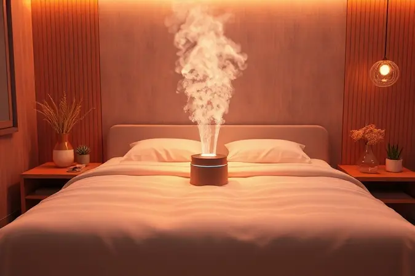

Já acordou espirrando ou com aquela coceira no nariz que te faz questionar a qualidade do ar do seu quarto? O que você não imagina é que a responsável pode estar bem atrás da sua cabeça enquanto dorme: a cabeceira da cama.

Esse refúgio de poeira, ácaros e sujeiras invisíveis impacta diretamente a qualidade do seu sono e a saúde da sua família.

Limpar materiais delicados como suede, veludo ou tecido parece um desafio, mas a verdade é que com as técnicas certas, essa tarefa se torna mais simples que imagina.

Vamos transformar essa limpeza em um ritual que não só higieniza, mas também renova a energia do seu santuário do descanso.

<SummaryList products={frontmatter.top_products} />

## Por que a limpeza da cabeceira é essencial para a sua saúde e sono?

Pense na cabeceira como um ímã silencioso. Enquanto você descansa, ela atrai poeira, células da pele, ácaros e até partículas que você traz do dia a dia.

Para quem sofre com alergias ou problemas respiratórios, esse acúmulo invisível pode transformar suas noites em uma batalha contra espirros e congestão. Mais do que um problema estético, é uma questão de bem-estar.

Um ambiente de sono verdadeiramente limpo e livre desses invasores microbianos não só promove um descanso mais profundo e reparador, como também cria aquele sentimento de refúgio e paz que você merece ao fechar os olhos.

É cuidar do lugar onde você recarrega suas energias para enfrentar um novo dia.

## Preparação: O que você precisa saber antes de começar a limpeza

Antes de mergulhar na limpeza, faça uma pausa para identificar com quem está lidando. O material da sua cabeceira, seja suede, veludo, couro ou tecido, dita todas as regras do jogo.

Essa etapa de reconhecimento é o que separa uma limpeza bem-sucedida de um possível desastre. Vamos reunir o time perfeito de produtos e ferramentas para garantir que seu móvel saia dessa experiência mais bonito e cuidado do que nunca.

### Materiais indispensáveis para uma higienização eficiente

<ProductBox 
  title={frontmatter.top_products[0].title} 
  image={frontmatter.top_products[0].image} 
  link={frontmatter.top_products[0].link} 
/>

Seu kit básico é bem simples, mas poderoso. Comece com um aspirador de pó que tenha um bocal de escova macia, ideal para sugar a poeira superficial sem agredir o tecido.

Na hora da solução de limpeza, aposte no clássico infalível: água morna com algumas gotas de detergente neutro. Para quem prefere uma alternativa natural, vinagre branco diluído em água funciona como um desinfetante suave.

O herói secreto aqui é o pano de microfibra, macio, absorvente e que não solta fiapos. A regra de ouro? Nunca encharcar o pano. Apenas umedeça-o bem e torça o excesso antes de tocar na cabeceira. E antes de qualquer aplicação, faça o teste em um cantinho escondido.

Essa precaução de 60 segundos pode salvar seu estofado de uma mancha permanente e garantir que você durma tranquilo sabendo que fez a escolha certa.

### Como identificar o tipo de tecido e o código de limpeza da etiqueta

<ProductBox 
  title={frontmatter.top_products[1].title} 
  image={frontmatter.top_products[1].image} 
  link={frontmatter.top_products[1].link} 
/>

A etiqueta costurada na parte de trás ou lateral da sua cabeceira é o manual de instruções do fabricante. Ignorá-la é como tentar montar um móvel sem olhar o guia.

Primeiro, localize a composição do tecido: palavras como '100% algodão', 'poliéster' ou 'veludo' te darão a pista principal. Em seguida, decifre os símbolos internacionais de limpeza. Aquele desenho de um balde com água indica se você pode lavar (e a que temperatura).

Um triângulo fala sobre alvejantes, um quadrado sobre secagem, e um ferro sobre passagem. Esses ícones parecem uma linguagem secreta, mas uma rápida pesquisa online com 'símbolos de lavagem de tecidos' resolve o mistério.

Entender essa linguagem é a chave para prolongar a vida útil do seu investimento e evitar tratamentos caros de recuperação no futuro.

## Como limpar cabeceira de cama de acordo com o material

Cada material tem sua personalidade e exige um tipo de carinho específico. É como cuidar de diferentes tipos de cabelo: o que funciona para um, pode não ser ideal para outro.

Vamos desvendar os segredos para cada um, garantindo que sua cabeceira receba exatamente o tratamento que merece.

### 1. Cabeceira de Suede ou Camurça: O segredo para não manchar

<ProductBox 
  title={frontmatter.top_products[2].title} 
  image={frontmatter.top_products[2].image} 
  link={frontmatter.top_products[2].link} 
/>

Se o seu quarto tem aquele toque aveludado e sofisticado da suede, o mantra é gentileza acima de tudo. Para a poeira do dia a dia, uma escova específica para camurça ou um pano de microfibra seco, passados sempre no sentido do pelo, são suficientes.

O aspirador também pode entrar em cena, mas sempre na potência mínima. Manchas apareceram? Respire fundo. Para resíduos secos, use uma espátula de plástico sem ponta para levantar o excesso com cuidado.

Se foi um derramamento líquido, absorva imediatamente com um pano seco, pressione, nunca esfregue. Produtos específicos para camurça são ótimos, mas se não tiver um à mão, um pouco de vinagre branco em um pano úmido pode salvar a situação.

Após a secagem completa, considere aplicar um spray impermeabilizante. Ele cria uma barreira invisível que torna as próximas limpezas muito mais fáceis.

### 2. Cabeceira de Veludo: Luxo e cuidado redobrado

<ProductBox 
  title={frontmatter.top_products[3].title} 
  image={frontmatter.top_products[3].image} 
  link={frontmatter.top_products[3].link} 
/>

O veludo é a estrela do quarto, e toda estrela precisa de um tratamento VIP. Sua rotina de beleza começa com uma aspiração semanal usando o bocal de cerdas macias do seu aspirador, sempre no sentido do pelo para não amassá-lo.

Na hora do banho, a solução é água morna com detergente neutro, aplicada com um pano de microfibra levemente umedecido. O maior inimigo do veludo é o excesso de umidade, então evite vapor ou panos encharcados.

Se uma mancha resistente ou um odor persistente aparecerem, não hesite: essa é a hora de chamar um profissional. O investimento em uma limpeza especializada protege o brilho e a textura aveludada que tornam sua cabeceira tão especial.

### 3. Cabeceira de Couro, Corino ou Material Sintético

<ProductBox 
  title={frontmatter.top_products[4].title} 
  image={frontmatter.top_products[4].image} 
  link={frontmatter.top_products[4].link} 
/>

A beleza desses materiais está na praticidade. Comece com um pano de microfibra umedecido em água morna para remover a sujeira superficial. Para uma limpeza mais profunda, algumas gotas de sabão neutro diluídas em água fazem milagres.

Fuja de produtos com álcool ou solventes agressivos, eles são os vilões que roubam o brilho e ressecam o material. Se a superfície parecer um pouco opaca ou seca, um condicionador específico para couro sintético aplicado com moderação pode devolver o viço.

Sempre teste primeiro em uma área escondida. Manchas rebeldes como tinta podem ceder com um algodão levemente umedecido em álcool 90%, mas com extrema cautela. O segredo final? Secar bem com um pano seco para afastar qualquer fantasma de umidade.

### 4. Cabeceira de Tecido (Algodão e Linho)

Esses tecidos naturais respiram simplicidade no cuidado. O primeiro passo é sempre aspirar para remover a poeira que se esconde entre as fibras. Para a limpeza geral, um pano umedecido em água morna com um pouco de detergente suave é a combinação perfeita.

Aplique com movimentos circulares suaves, tomando cuidado para não encharcar o tecido, o que pode deixar marcas de água.

Se a sujeira for mais profunda ou persistente, verifique as instruções do fabricante, algumas cabeceiras podem ter capas removíveis ou permitir limpeza a seco.

Manter o algodão e o linho limpos não é só sobre estética; é sobre preservar a sensação fresca e acolhedora que eles trazem para o seu sono.

## Passo a passo para uma limpeza profunda e segura em casa

<ProductBox 
  title={frontmatter.top_products[5].title} 
  image={frontmatter.top_products[5].image} 
  link={frontmatter.top_products[5].link} 
/>

Vamos transformar a limpeza em um ritual tranquilo e eficaz. Primeiro, afaste a cama para ter espaço e aspire toda a superfície da cabeceira com o bocal de escova macia, capturando a poeira solta.

Em seguida, prepare sua solução preferida (água com detergente neutro ou água com vinagre) em um borrifador ou balde. Umedeça bem um pano de microfibra na solução, torça para eliminar o excesso e comece a limpar com movimentos suaves, seção por seção.

Para manchas teimosas, deixe o produto agir por alguns minutos. Após limpar toda a área, passe um pano seco para absorver a umidade residual. Deixe a cabeceira secar naturalmente, longe da luz solar direta, que pode desbotar cores delicadas.

Esse cuidado meticuloso pode levar algum tempo, mas o resultado é um móvel que parece novo e um quarto que verdadeiramente convida ao descanso.

## Como remover manchas específicas: Gordura, suor e marcas de mãos

<ProductBox 
  title={frontmatter.top_products[6].title} 
  image={frontmatter.top_products[6].image} 
  link={frontmatter.top_products[6].link} 
/>

Manchas têm personalidade, e cada uma pede uma abordagem diferente. Para aquela marca de protetor solar ou hidratante (gordura), comece aspirando a área.

Misture algumas gotas de detergente neutro em água morna, umedeça um cantinho do pano de microfibra e trabalhe a mancha com toques suaves. Se ela resistir, aplique uma pequena quantidade de detergente puro, deixe agir por cinco minutos e então limpe.

Uma pasta de bicarbonato de sódio e água também pode ser sua aliada nessa missão. Para o suor, que além da mancha pode deixar odor, o vinagre branco diluído em água é perfeito. Aplique, deixe agir por alguns minutos e enxágue com um pano umedecido apenas em água.

Já as marcas de mãos, com seus óleos naturais, geralmente saem com a mistura de água e detergente. Lembre-se: para veludo e outros tecidos muito delicados, quando em dúvida, a escolha mais segura é consultar um especialista.

## 3 Misturinhas caseiras potentes para desinfetar a cabeceira

Quem disse que desinfetar precisa de produtos caros ou cheiros fortes? Sua cozinha tem poderosos aliados. A primeira receita é a mais simples: partes iguais de água e vinagre branco em um borrifador.

O vinagre é um desinfetante natural que elimina bactérias e neutraliza odores sem agredir o tecido. A segunda opção é para manchas: uma pasta feita com bicarbonato de sódio e um pouquinho de água.

Aplique na área, deixe agir por 15 minutos e remova com um pano úmido, o bicarbonato também ajuda a absorver odores.

Para finalizar com um toque de spa, adicione algumas gotas do seu óleo essencial favorito (lavanda para relaxamento, tea tree para suas propriedades antimicrobianas) a um borrifador com água. Uma leve borrifada após a limpeza deixa um aroma suave e convidativo no ar.

Use essas misturas a cada limpeza regular para manter um ambiente não apenas limpo, mas verdadeiramente fresco.

## Erros comuns que podem arruinar o seu estofado permanentemente

Alguns deslizes na limpeza podem ter consequências caras. O primeiro erro é acreditar que 'quanto mais forte, melhor'. Produtos de limpeza agressivos, alvejantes ou sabões muito concentrados podem desbotar cores e destruir as fibras do tecido.

O segundo pecado capital é o excesso de água. Molhar demais não só cria manchas de umidade, como também é o ambiente perfeito para o mofo surgir, especialmente nas camadas internas do estofado.

Esfregar com força excessiva é outro caminho para o desastre, pois distorce as fibras e causa desgaste prematuro, dando à cabeceira um aspecto envelhecido e puído.

Por último, ignorar a etiqueta do fabricante é como dirigir um carro novo sem olhar o manual, você pode até chegar lá, mas arriscando danos desnecessários. Testar sempre em uma área oculta é a pílula da sabedoria que previne arrependimentos.

## Dicas de manutenção: Como manter a cabeceira limpa por muito mais tempo

<ProductBox 
  title={frontmatter.top_products[7].title} 
  image={frontmatter.top_products[7].image} 
  link={frontmatter.top_products[7].link} 
/>

A verdadeira magia não está na limpeza pesada ocasional, mas nos pequenos hábitos diários. Incorpore à sua rotina uma passada rápida com um pano de microfibra seco ou um espanador uma vez por semana.

Isso impede que a poeira se acumule e se transforme em uma camada difícil de remover. Para acidentes pequenos, como respingos, tenha à mão um pano levemente umedecido em água para resolver na hora, antes que a mancha se fixe.

Se a sua cabeceira for de madeira com detalhes em tecido, dedique um momento a cada seis meses para passar uma cera específica para móveis na parte de madeira, ela cria uma película protetora contra arranhões e ressecamento.

Mantenha o ambiente ao redor organizado e evite bater objetos contra o estofado. E lembre-se de posicionar sua cama longe de fontes de umidade excessiva, como janelas com infiltrações.

Esses minutos de cuidado periódico são o seguro que garante anos de beleza e conforto.

## Quando é hora de chamar um serviço profissional de higienização?

Reconhecer os limites da limpeza caseira é um sinal de cuidado inteligente. Se você seguiu todos os passos, testou as misturas e aquela mancha de vinho ou marca de umidade simplesmente se recusa a sair, é um sinal claro.

Materiais de luxo como veludo genuíno ou seda, que tremem ao contato com água, também merecem as mãos especializadas de um profissional.

Para famílias com casos de alergias severas, asma ou crianças pequenas, a limpeza profissional com equipamentos de extração a vapor de alta temperatura oferece uma desinfecção profunda que alcança ácaros e bactérias onde o pano comum não chega.

Eles utilizam produtos específicos para cada tipo de tecido e técnicas que restaurarão a cor e a maciez originais sem riscos. Pense nisso não como uma despesa, mas como um investimento na saúde da sua família e na longevidade do seu móvel.

## FAQ: Perguntas frequentes sobre limpeza de cabeceiras de cama

Com que frequência devo limpar minha cabeceira?
Para manutenção básica, uma aspiração ou passada de pano seco semanal é ideal. Uma limpeza mais profunda com produtos (seja caseiros ou específicos) a cada 3 ou 4 meses mantém o estofado impecável e higienizado.

Posso usar máquina de lavar a vapor? Depende crucialmente do tecido. Para couro sintético, corino e alguns tecidos resistentes, pode ser uma opção se usado com cautela e na temperatura mais baixa. Para suede, veludo, seda e tecidos muito delicados, é melhor evitar.

Sempre consulte a etiqueta primeiro.

E se minha cabeceira não tiver etiqueta? Não entre em pânico. Faça o teste da área discreta com sua solução de limpeza mais suave (água com uma gota de detergente neutro). Observe a reação por 24 horas. Se não houver desbotamento ou dano, pode prosseguir com cuidado.

Na dúvida sobre o material, uma foto para um estofador ou loja especializada pode ajudar na identificação.

O vinagre não deixa cheiro?
O cheiro característico do vinagre evapora completamente em poucas horas à medida que seca, deixando apenas a limpeza para trás. Se preferir, adicione algumas gotas de óleo essencial à mistura para um perfume suave durante o processo.

## Conclusão

Limpar a cabeceira da sua cama vai muito além de remover manchas visíveis. É um ato de cuidado com o próprio santuário do seu descanso, uma decisão que impacta diretamente a qualidade do seu sono e o ar que você respira durante a noite.

Desde a suede sensível até o prático couro sintético, cada material pede um carinho específico, mas a filosofia é a mesma: gentileza, prevenção e os produtos certos.

Ao incorporar as dicas de manutenção e as receitas caseiras à sua rotina, você transforma uma tarefa eventual em um hábito leve que protege seu investimento e seu bem-estar.

Imagine a sensação de deitar a cabeça em um ambiente verdadeiramente fresco, sabendo que tudo ao seu redor contribui para um descanso reparador. Essa paz de espírito é a maior recompensa de um quarto bem cuidado.

Então, respire fundo, reúna seu pano de microfibra e comece essa transformação hoje mesmo. Seu sono, e sua saúde, agradecem.