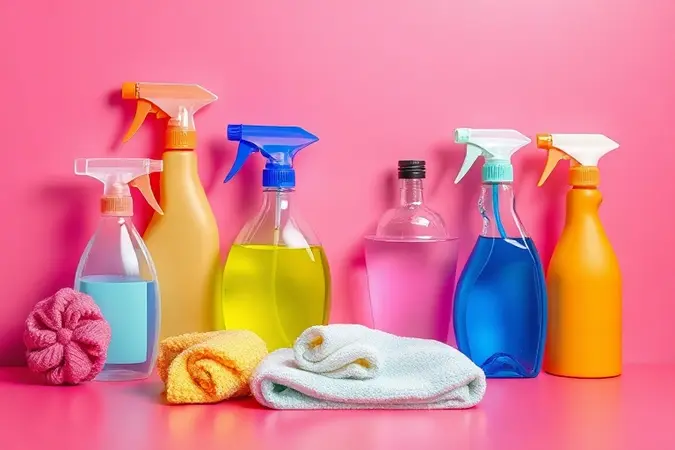
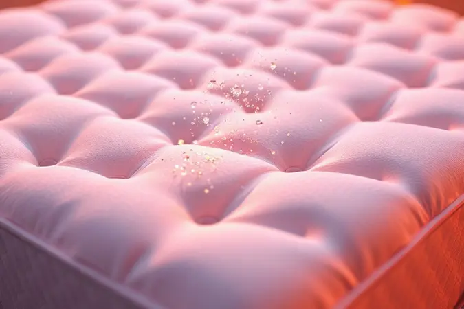

Imagine deitar na sua cama a noite toda e só conseguir pensar na poeira, ácaros e manchas que podem estar escondidos ali, apenas um tecido de distância do seu descanso.

Essa preocupação tem fim quando você descobre o passo a passo completo para higienizar profundamente tanto o colchão quanto a estrutura do box.

Vou guiar você por um processo que não apenas elimina aquelas manchas amareladas ou odores incômodos, mas transforma seu ambiente de sono em um verdadeiro santuário de saúde e conforto.

Prepare-se para descobrir como prolongar a vida da sua cama enquanto conquista noites realmente revigorantes.

<SummaryList products={frontmatter.top_products} />

## Por que a limpeza da cama box é essencial para sua saúde?

Seu colchão é mais do que um lugar para dormir, ele é um ecossistema que você compartilha todas as noites. A cada hora de sono, células de pele, umidade e partículas invisíveis se acumulam, criando o cenário perfeito para ácaros, fungos e bactérias se estabelecerem.

Essa convivência silenciosa pode desencadear aquelas alergias que você não sabe de onde vêm, aquela tosse seca antes de dormir ou aquela sensação de cansaço mesmo após horas na cama.

Quando você higieniza regularmente sua cama box, está fazendo muito mais do que limpar um móvel, está investindo em qualidade de ar, em respiração livre durante o sono e em acordar realmente descansado.

Pense nisso como um ritual de autocuidado que começa antes mesmo de fechar os olhos.

## Materiais e produtos necessários para a higienização ideal

Antes de começar a transformação, reúna sua equipe de limpeza ideal. Você vai precisar dos clássicos: água, detergente neutro, vinagre e bicarbonato de sódio.

Mas o verdadeiro herói dessa história é o aspirador de pó, acompanhado dos panos macios que serão as mãos cuidadosas do processo. Esses itens acessíveis são tudo que você precisa para criar um ambiente digno de descanso profundo.

### Aspirador de pó: Seu maior aliado contra ácaros e poeira

<ProductBox 
  title={frontmatter.top_products[0].title} 
  image={frontmatter.top_products[0].image} 
  link={frontmatter.top_products[0].link} 
/>

Pegue seu aspirador de pó e imagine cada passada não apenas sugando poeira, mas criando espaço para um ar mais limpo em seus pulmões. Modelos com escovas motorizadas trabalham como pequenas massageadoras que despem o tecido de tudo que não deveria estar ali.

Quando escolhe um com luz UV-C, você adiciona uma camada extra de segurança, sabendo que cada centímetro aspirado também recebe um banho de desinfecção invisível.

É verdade que alguns desses modelos podem ser um pouco mais robustos para manusear, mas a sensação ao respirar fundo em uma cama realmente limpa compensa cada segundo do esforço.

### Escovas de cerdas macias para proteger o tecido do box

<ProductBox 
  title={frontmatter.top_products[1].title} 
  image={frontmatter.top_products[1].image} 
  link={frontmatter.top_products[1].link} 
/>

Com a poeira já removida, é hora do toque mais delicado. As escovas de cerdas macias são como carícias que removem sujeiras sem machucar o tecido que você escolheu com tanto cuidado.

Elas entendem que limpeza não precisa ser violenta, que é possível restaurar a beleza original com gentileza. Enquanto escovas mais duras prometem eficiência imediata, elas podem deixar marcas permanentes na textura que você gosta de sentir ao deitar.

Use essa ferramenta para aplicar produtos de limpeza com movimentos circulares suaves, como quem acaricia um animal de estimação. Seu colchão agradecerá mantendo sua aparência e conforto por muito mais tempo.

## Passo a passo: Como limpar a base da cama box (tecido e estrutura)

Comece dando voz ao seu aspirador, deixando que ele percorra cada centímetro do tecido para coletar meses (ou anos) de poeira acumulada. Em seguida, prepare uma solução de água morna com detergente neutro e umedeça levemente um pano macio.

Passe esse pão sobre as manchas com movimentos suaves, como quem pinta um quadro delicado. Não se apresse. Deixe que a mistura aja por alguns minutos antes de enxaguar com outro pano apenas umedecido em água limpa. O segredo final?

Deixar seu colchão respirar ao ar livre, completamente seco, antes de voltar com os lençóis que o aguardam.

### Como limpar cama box com baú: Higienizando a parte interna e ferragens

Se sua cama box vem com o bônus do baú de armazenamento, ela guarda mais do que objetos, guarda memórias que merecem um ambiente limpo. Comece esvaziando cuidadosamente esse espaço, como quem revela um baú do tesouro que não via há tempos.

Use o aspirador para coletar a poeira que se instalou nas laterais e nas dobradiças. Para aquelas ferragens que parecem sempre ter um pouco de resistência, um pano levemente umedecido com água e detergente neutro fará milagres.

Esfregue com suavidade, sentindo como cada movimento libera um pouco mais da fluidez original. O momento mais importante? Secar completamente cada superfície antes de recolocar seus pertences, garantindo que nada de umidade fique escondida ali.

## Como limpar o colchão da cama box com o método a seco

Nem sempre a água é a melhor amiga do seu colchão, especialmente quando você quer uma limpeza que evite qualquer risco de mofo ou umidade. Para esses momentos, o método a seco é seu aliado secreto.

Comece com uma passada completa do aspirador, como uma pré-limpeza que prepara o terreno. Em seguida, espalhe uma camada generosa de bicarbonato de sódio por toda a superfície, como se estivesse polvilando açúcar de confeiteiro sobre um bolo.

Deixe essa camada branca agir por algumas horas, enquanto você faz outras coisas. Quando voltar, aspire novamente e sinta como os odores desapareceram junto com as partículas de sujeira.

### O poder do bicarbonato de sódio para remover umidade e odores

<ProductBox 
  title={frontmatter.top_products[2].title} 
  image={frontmatter.top_products[2].image} 
  link={frontmatter.top_products[2].link} 
/>

Aquele pó branco que parece simples guarda um superpoder invisível. O bicarbonato de sódio não apenas absorve odores como um ímã, mas também suga a umidade que poderia dar vida a mofo e bactérias.

Imagine colocar um pequeno recipiente aberto no fundo do seu armário e, 30 dias depois, perceber que aquele 'cheiro de guardado' simplesmente evaporou.

Nas superfícies do seu colchão, ele trabalha silenciosamente enquanto você vive seu dia, neutralizando odores e absorvendo qualquer vestígio de umidade.

É verdade que problemas sérios de mofo precisam de atenção especializada, mas para manutenção diária e prevenção, ele é o guardião perfeito do ambiente saudável que você merece.

### Higienizador a vapor: Esterilização profunda sem encharcar

<ProductBox 
  title={frontmatter.top_products[3].title} 
  image={frontmatter.top_products[3].image} 
  link={frontmatter.top_products[3].link} 
/>

Se você pudesse dar um abraço quente e purificador no seu colchão, seria assim que o higienizador a vapor trabalha.

Essa ferramenta utiliza o poder do calor para eliminar até 99,9% dos visitantes indesejados, desde vírus até ácaros microscópicos, tudo sem deixar um resíduo químico sequer.

Para famílias com crianças que adoram pular na cama ou animais que consideram seu colchão um território compartilhado, essa esterilização profunda é um respiro de alívio.

Alguns modelos podem exigir um pouco mais de espaço para manuseio, mas os acessórios que acompanham transformam essa limpeza profunda em um ritual que se estende a outras superfícies da casa. É o investimento que diz 'sim' à saúde do seu sono.

## Guia de remoção de manchas: Suor, gordura e aspecto encardido

As manchas são como pequenas histórias que sua cama conta sobre sua vida. O suor das noites quentes, o creme que escapou do rosto, o café que quase derrubou naquele domingo preguiçoso.

Para o suor, uma mistura de água morna e detergente suave age como um banho relaxante que dissolve a marca do cansaço.

Para a gordura que teima em permanecer, o talco ou amido de miljo são esponjas naturais que absorvem o que a água não consegue, bastando polvilhar e esperar algumas horas antes de aspirar.

Já o aspecto encardido que faz seu colchão parecer mais velho do que é responde maravilhosamente a uma solução de vinagre e água, que limpa e desinfeta em um único gesto. Sempre teste primeiro em uma área discreta e sinta a transformação acontecer.

## Como tirar manchas de sangue e urina da cama box com segurança

Acidentes acontecem, e quando envolvem sangue ou urina no colchão, a urgência pode gerar pânico. Respire fundo. Comece absorvendo o excesso com papel toalha, pressionando suavemente sem esfregar, como quem estanca uma pequena ferida.

Misture água morna com detergente neutro e aplique a solução com um pano limpo em movimentos circulares, sentindo como a mancha começa a desaparecer. Se algo persistir, o vinagre entra em cena como neutralizador de odores que também ataca resíduos teimosos.

Enxágue com um pano apenas úmido e, o passo mais importante, deixe secar completamente antes de qualquer cobertura. Essa paciência garantirá que sua cama volte a ser o refúgio que sempre foi.

## 5 Erros fatais na limpeza que podem danificar sua cama box

Enquanto limpa com amor, existem armadilhas que podem transformar boas intenções em danos permanentes. Primeiro, produtos químicos agressivos podem desgastar o tecido como o sol desbota uma foto preciosa.

Segundo, encharcar o colchão é convidar a umidade para uma estadia prolongada que termina em mofo. Terceiro, pular a etapa do aspirador antes do pano úmido é empurrar a sujeira para dentro do tecido, onde se esconde dos seus esforços.

Quarto, a exposição prolongada ao sol pode ressecar e danificar os materiais internos que garantem seu conforto. Quinto, ignorar manchas imediatas é permitir que elas se tornem residentes permanentes da sua cama.

Cada cuidado que você toma hoje preserva o conforto de amanhã.

## Dicas de manutenção diária para prolongar a vida útil do móvel

A verdadeira limpeza da cama box não acontece apenas nos grandes rituais, mas nos pequenos gestos diários. Passe o aspirador regularmente, como quem varre o pó de um altar sagrado.

Resista ao impulso de pular ou sentar na borda, tratando cada centímetro com o respeito que merece. Mantenha o ambiente arejado, permitindo que o ar circule e previna aquela umidade que gera odores.

Esses minutos de atenção regular são o segredo para transformar anos de uso em décadas de conforto.

### Invista em um protetor de colchão impermeável de qualidade

<ProductBox 
  title={frontmatter.top_products[4].title} 
  image={frontmatter.top_products[4].image} 
  link={frontmatter.top_products[4].link} 
/>

Imagine vestir seu colchão com uma segunda pele invisível, uma armadura que protege contra acidentes enquanto mantém a respiração natural dos materiais. É isso que um bom protetor impermeável oferece.

Marcas como Fibrasca e Pikolin entenderam que proteção não precisa significar desconforto, criando produtos com elásticos que não deslizam e tecidos que permitem a circulação de ar.

Sim, o investimento inicial pode parecer mais alto, mas quando você considera que está protegendo o conforto de anos de sono, cada centavo vale a pena.

Escolha o tamanho exato do seu colchão, lave regularmente conforme as instruções e durma sabendo que seu investimento está em boas mãos.

## Quando é hora de contratar uma limpeza profissional especializada?

Há momentos em que mesmo as melhores intenções caseiras encontram seus limites.

Quando as manchas teimam em permanecer como fantasmas no tecido, quando as alergias persistem apesar de todos os seus esforços ou quando a simples ideia de ácaros acumulados afeta sua paz, é sinal de que profissionais podem fazer a diferença.

Eles trazem não apenas produtos especializados, mas uma expertise que entende as particularidades de cada material.

Para famílias que compartilham a cama com crianças cheias de energia ou animais de estimação que consideram o colchão parte do território, essa limpeza profunda periódica é o presente que você dá à saúde de todos.

## Conclusão

Limpar sua cama box é muito mais do que uma tarefa doméstica, é um ritual de renovação que começa em suas mãos e termina em noites de sono realmente reparadoras.

Cada passo que você aprendeu hoje transforma a relação com seu espaço de descanso, seja usando o aspirador como aliado contra partículas invisíveis, aplicando bicarbonato como guardião contra odores ou investindo em um protetor que estende a vida do seu colchão.

As manchas deixam de ser problemas insolúveis e se tornam lembranças que podem ser limpas, as ferramentas deixam de ser objetos e se tornam extensões do seu cuidado. A frequência ideal?

Uma manutenção mensal para manter o equilíbrio e uma limpeza profunda a cada três meses para renovar completamente o ambiente.

Produtos químicos agressivos podem ser substituídos por soluções simples de água, vinagre e detergente neutro que respeitam tanto sua saúde quanto o tecido da sua cama.

Quando dúvidas persistirem, lembre-se que manchas difíceis geralmente cedem à paciência e à técnica certa. Agora, com todas essas informações na palma da sua mão, você não apenas sabe como limpar sua cama box, mas entende por que cada gesto importa.