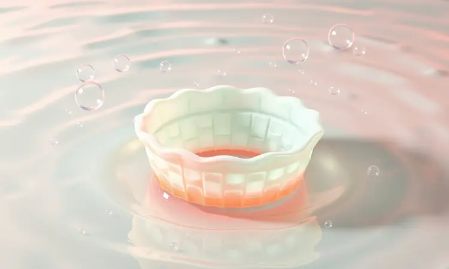
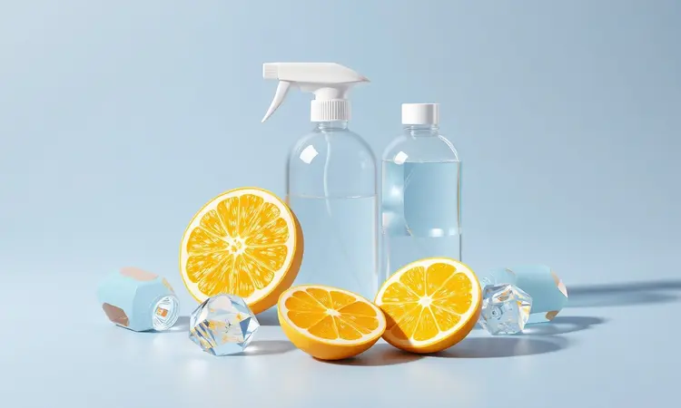
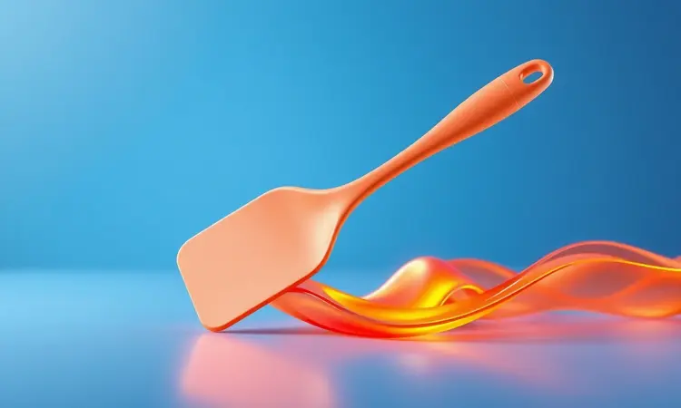

Você já sentiu que, por mais que lave, seus utensílios de silicone continuam com aquele aspecto pegajoso ou com o cheiro do último tempero utilizado?

Se você sofre para tirar a gordura incrustada da forma de silicone da sua airfryer ou quer que suas espátulas durem mais, este artigo é para você.

Prometemos que, ao final deste guia, você conhecerá as técnicas definitivas para deixar seu silicone como novo, utilizando ingredientes simples que você já tem em casa.

Vamos explorar desde a limpeza pesada pós-uso até os cuidados essenciais para preservar a vida útil dos seus acessórios.

<SummaryList products={frontmatter.top_products} />

## Por que o silicone acumula tanta gordura e mau cheiro?

Pense no silicone como uma pele que respira. Sua estrutura microscópica é porosa, cheia de pequeninos espaços que, durante o cozimento, funcionam como minúsculas esponjas.

Eles absorvem não só gordura e partículas de comida, mas também os aromas intensos do alho, cebola ou peixe.

Quando o calor da airfryer ou do forno aquece esse material, ele pode liberar compostos que, misturados aos resíduos, criam aqueles cheiros teimosos que parecem grudar para sempre.

A boa notícia é que entender essa 'personalidade' do material é o primeiro passo para dominá-lo. Uma limpeza adequada não é só estética, é uma conversa com essa textura absorvente, garantindo que ela não guarde memórias indesejadas dos seus pratos.

## Passo a passo: Como limpar forma de silicone da airfryer com facilidade

Agora que você sabe por que a gordura gruda, a solução fica clara. O segredo não está na força, mas na estratégia. Comece retirando os resíduos soltos de comida.

Em seguida, prepare um banho relaxante para sua forma: encha a pia ou uma bacia com água bem quente e algumas gotas de detergente neutro. Deixe o utensílio submerso por cerca de 15 minutos.

Esse tempo de molho é mágico, pois a água quente amolece a gordura incrustada, fazendo com que ela simplesmente se solte. Depois, com uma esponja macia (nada de abrasivos), faça movimentos suaves por toda a superfície.

Enxágue em água corrente até sair totalmente limpa e, o passo final e crucial, deixe secar completamente ao ar antes de guardar. Essa rotina transforma uma tarefa chata em um ritual rápido que mantém sua forma sempre impecável.

## 3 Misturas caseiras imbatíveis contra a gordura pesada

Felizmente, você não precisa de uma prateleira cheia de produtos químicos caros. Sua própria despensa guarda três aliados poderosos contra a sujeira mais resistente.

São combinações simples, ecológicas e surpreendentemente eficazes para devolver o brilho ao seu silicone.

### 1. Bicarbonato de sódio e Vinagre: O combo desengordurante

Essa dupla é a queridinha da limpeza natural por um motivo. Quando o bicarbonato (um alcalino suave) encontra o vinagre (um ácido), acontece uma reação efervescente que não é só divertida de ver, mas functional.

As bolhas criam uma agitação microscópica que penetra nos poros do silicone, levantando e soltando camadas de gordura presas. Para usar, polvilhe uma camada generosa de bicarbonato sobre a superfície suja e borrife ou despeje vinagre branco por cima.

Deixe a festa das bolhas trabalhar por alguns minutos. Depois, com a mesma esponja macia, esfregue levemente e enxágue. O resultado é um silicone desengordurado e sem cheiros, tudo sem agredir o material ou o meio ambiente.

### 2. Água quente e detergente neutro: A técnica do molho

Às vezes, a simplicidade é a maior sofisticação. A combinação de água quente com algumas gotas de detergente neutro cria um poderoso emulsionante que quebra as moléculas de gordura.

O calor da água abre os poros do silicone, permitindo que a solução de sabão penetre e envolva cada partícula de sujeira. Submergir o utensílio nesse banho por 15 a 30 minutos faz o trabalho pesado por você.

A gordura se solta quase que por vontade própria, transformando a esfrega seguinte em uma tarefa leve e rápida. É a prova de que, para a maioria das situações do dia a dia, a solução mais básica é também a mais eficiente e gentil com seus utensílios.

### 3. Limão: O segredo para eliminar cheiros fortes (Peixe, Alho e Cebola)

Já abriu a airfryer e sentiu aquele fantasma do alho assado do dia anterior? O limão é seu exorcista natural. Seu ácido cítrico não mascara odores, ele os neutraliza quimicamente, quebrando as moléculas responsáveis pelo cheiro persistente de peixe, alho ou cebola.

Para uma limpeza de rotina, esprema um pouco de suco de limão em um pano úmido e passe por toda a superfície do utensílio. Para casos mais dramáticos, experimente colocar algumas rodelas de limão na airfryer ainda quente (desligada) e fechar a gaveta por alguns minutos.

O vapor cítrico vai saturar o ambiente e deixar um aroma fresco e limpo. É uma solução barata, natural e que deixa sua cozinha cheirando a limpeza de verdade.

## Como limpar utensílios de silicone pela primeira vez (Cura do Silicone)

Todo relacionamento precisa de um bom começo, e com o silicone não é diferente. Antes do primeiro uso, seus novos utensílios precisam de um ritual de iniciação chamado 'cura'. Lave-os cuidadosamente com água morna e sabão neutro.

Esse primeiro banho remove quaisquer resíduos do processo de fabricação que você não quer misturar à sua comida. Se, mesmo após lavar, você sentir um cheiro característico do material novo, não se preocupe. É normal.

Deixá-los secar completamente ao ar, de preferência por algumas horas, ajuda a estabilizar o material e a dissipar esses odores iniciais.

Esse cuidado simples garante que, desde a primeira utilização, seu silicone esteja não só limpo, mas também 'aclimado' e pronto para oferecer o melhor desempenho com total segurança.

## O que NÃO fazer: Erros comuns que estragam o silicone

Com todas essas técnicas de limpeza na ponta dos dedos, agora é hora de aprender a proteger seu investimento. Alguns deslizes comuns podem encurtar drasticamente a vida dos seus utensílios.

O primeiro e mais grave: nunca use facas, garfos metálicos ou qualquer objeto pontiagudo para raspar alimentos grudados. O silicone é flexível, mas pode ser cortado ou perfurado. Em vez disso, use a técnica do molho que você já aprendeu.

Evite também choques térmicos extremos. Não coloque uma forma recém-saída do freezer diretamente na airfryer pré-aquecida a 200°C, e vice-versa. Mudanças bruscas de temperatura podem fazer o material rachar ou perder o formato. Por fim, não adie a limpeza.

Deixar gordura e restos de comida secando e endurecendo na superfície é o caminho mais rápido para manchas permanentes e odores impossíveis de eliminar. A regra de ouro é simples: limpe enquanto ainda está fácil.

Seguindo esses cuidados, seu silicone se manterá como novo por muito, muito mais tempo.

## Melhores utensílios e acessórios de silicone para sua cozinha

E se você quiser ir além da limpeza e começar com o pé direito, investindo em silicone de alta qualidade desde o início? Os melhores utensílios não só facilitam o trabalho na cozinha, como também são projetados para serem mais fáceis de manter limpos e duráveis.

Conheça alguns que valem cada centavo.

### Forma de Silicone para Airfryer Antiaderente

<ProductBox 
  title={frontmatter.top_products[0].title} 
  image={frontmatter.top_products[0].image} 
  link={frontmatter.top_products[0].link} 
/>

Imagine assar nuggets, batatas ou até um bolo sem aquele momento de tensão na hora de desenformar. A forma de silicone antiaderente para airfryer transforma essa fantasia em realidade.

Sua superfície é projetada para que os alimentos simplesmente deslizem para fora, sem grudar nem deixar pedaços para trás. Mais do que conveniência, isso significa uma limpeza que leva segundos, muitas vezes apenas um rápido enxágue.

Esse tipo de forma é um guerreiro da temperatura, resistindo tranquilamente a uma amplitude que vai do freezer (-40°C) ao calor intenso da airfryer (até 230°C).

Essa versatilidade oferece paz de espírito, sabendo que o material não vai derreter, soltar fumaça ou liberar substâncias indesejadas no seu alimento.

Um detalhe prático: por conduzir calor de forma tão eficiente, ela pode exigir um pequeno ajuste (redução de 5 a 10 minutos) no tempo das suas receitas favoritas. O bônus é que essa mesma eficiência pode deixar seus alimentos ainda mais crocantes por fora.

É um acessório que protege o cesto da sua fritadeira, prolonga a vida do seu eletrodoméstico e simplifica sua rotina na cozinha.

### Kit de Utensílios de Cozinha em Silicone Premium

<ProductBox 
  title={frontmatter.top_products[1].title} 
  image={frontmatter.top_products[1].image} 
  link={frontmatter.top_products[1].link} 
/>

Para quem leva a cozinha a sério, um kit completo é um upgrade que se paga em praticidade. Um bom kit premium reúne espátulas de diferentes formatos, colheres, batedores e até pincéis, todos em silicone de grau alimentício livre de BPA.

Isso se traduz em tranquilidade para preparar refeições para toda a família, sabendo que não há risco de contaminação.

A durabilidade é outro ponto forte. Diferente de utensílios de plástico que mancham com molho de tomate ou de madeira que acumulam umidade, o silicone premium não retém odores, não desbota com o tempo e, principalmente, não risca suas preciosas panelas antiaderentes.

Muitos conjuntos são seguros para lavar na máquina de lavar louça, fechando o ciclo da praticidade.

Embora alguns kits possam ter peças que você usa menos, a qualidade da construção e a segurança que eles oferecem fazem desse conjunto um investimento inteligente para qualquer cozinha que preze por eficiência e saúde.

### Espátula de Silicone Resistente ao Calor

<ProductBox 
  title={frontmatter.top_products[2].title} 
  image={frontmatter.top_products[2].image} 
  link={frontmatter.top_products[2].link} 
/>

A espátula é a extensão da sua mão na panela, e uma feita com silicone resistente ao calor é a parceira perfeita.

Procure por modelos que suportem claramente temperaturas acima de 200°C, para que você possa mexer um refogado no fogo alto ou raspar uma frigideira ainda quente sem medo de derreter a ponta.

O design faz toda a diferença. Uma boa espátula de silicone equilibra flexibilidade para se moldar ao fundo curvo das panelas com firmeza suficiente para virar um bife ou misturar uma massa pesada.

Modelos sem emendas são um tesouro para a limpeza, pois não têm frestas onde comida e bactérias possam se esconder. Marcas consolidadas como Oikos e Rubbermaid são conhecidas por esse equilíbrio entre ergonomia, resistência e facilidade de manutenção.

Ter uma espátula assim na gaveta é garantir que você tenha a ferramenta certa para qualquer tarefa, do mais delicado omelete ao mais encorpado guisado.

## FAQ: Dúvidas frequentes sobre limpeza de silicone

Posso lavar formas de silicone na máquina de lavar louça? Sim, a maioria das formas e utensílios de silicone de qualidade é segura para a lava-louças. Confirme sempre no manual ou na embalagem do produto.

A lavagem na máquina é prática, mas para manchas ou odores muito persistentes, o método manual com as misturas caseiras que sugerimos costuma ser mais eficaz.

O silicone pode ficar manchado para sempre? Manchas de alimentos coloridos como açafrão ou molho de tomate podem ocorrer, mas raramente são permanentes. Um banho com a mistura de bicarbonato e vinagre ou uma esfrega suave com limão geralmente resolvem.

A chave é agir rápido e evitar deixar o alimento corado em contato prolongado.

Que tipo de esponja devo usar? Sempre prefira esponjas macias, do lado não-abrasivo (a parte amarela da esponja comum, por exemplo). Evite absolutamente as partes verdes ásperas, palhas de aço ou qualquer material que possa riscar a superfície.

Um risco pode se tornar um ponto fraco onde sujeira e bactérias se acumulam.

## Conclusão

Chegamos ao fim do caminho que começou com a frustração de um silicone pegajoso e cheiroso. Agora, você não só entende por que seus utensílios se comportam dessa forma, mas domina um arsenal completo para reverter a situação.

Desde o banho estratégico com água quente e detergente até o poder desengordurante do bicarbonato com vinagre e o frescor do limão, você tem soluções caseiras, eficazes e econômicas na ponta dos dedos.

Mais do que técnicas de limpeza, você aprendeu a linguagem do silicone: como iniciá-lo com a cura, como protegê-lo dos erros que o danificam e como escolher produtos premium que nascem para durar.

Essa jornada transforma a limpeza de uma tarefa repetitiva em um ato de cuidado que prolonga a vida dos seus utensílios, garante a segurança da sua comida e traz mais prazer para o ato de cozinhar.

O próximo passo é seu. Escolha uma das formas sujas que mais te incomoda, reúna os ingredientes simples da sua despensa e coloque em prática a primeira limpeza. Sinta a diferença ao segurar um utensílio que parece novo, sem cheiros do passado.

Sua cozinha, e seu paladar, agradecem.