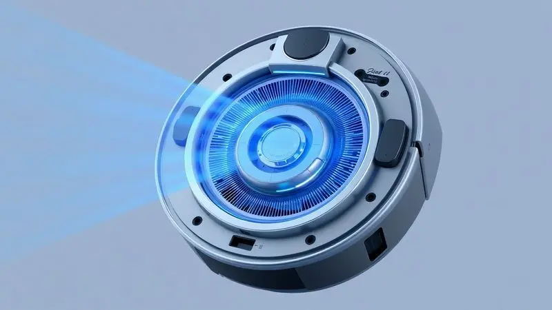
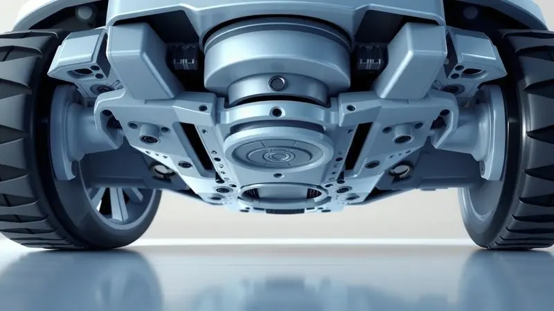
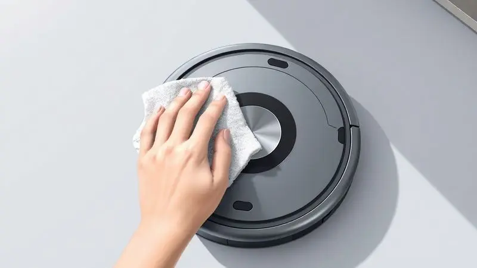

Imagine seu aliado na limpeza começando a apresentar pequenos sinais de desânimo: aquele barulho diferente que aparece em meio à tarefa, ou a percepção que ele não está captando a sujeira como antes.

Se seu WAP está mostrando esses sintomas, a causa provavelmente não é falta de vontade, mas falta de cuidados. A manutenção regular é o ritual que transforma seu robô aspirador de simples aparelho em companheiro duradouro.

Ao dedicar alguns minutos para limpar filtros, escovas e sensores, você está investindo diretamente na eficiência que mantém sua casa limpa sem esforço.

<SummaryList products={frontmatter.top_products} />

## Por que a limpeza regular do seu robô aspirador WAP é fundamental?

A resposta é simples: um robô limpo trabalha melhor, e trabalha por mais tempo. Quando sujeira, pelos e detritos se acumulam nos filtros e escovas, o sistema inteiro responde com menos potência.

O resultado que você sente é um ambiente menos limpo, mas o que acontece internamente é mais sério: o motor pode sobrecarregar, componentes mecânicos podem falhar, e a inteligência do aparelho (seus sensores) pode ficar comprometida.

Dedicar atenção periódica ao seu WAP não é apenas uma tarefa, é uma garantia de que ele continuará sendo aquela solução tranquila que [você escolheu](/qual-melhor-robo-aspirador-wap-ou-multilaser/).

## Guia Passo a Passo: Como limpar o robô aspirador WAP corretamente

O processo é uma sequência natural que começa com o básico e evolui para os detalhes que fazem a diferença. Antes de qualquer ação, sempre desconecte seu robô da base de carregamento, segurança primeiro.

Com ele preparado, você pode seguir uma ordem que preserva tanto o aparelho quanto sua eficiência.

### 1. Limpeza e esvaziamento do recipiente de pó e detritos

Este é o ponto de partida de toda manutenção. Localize o compartimento de coleta, abra com cuidado e despeje o conteúdo em um saco de lixo.

Não se trata apenas de tirar a sujeira visível: um pano úmido ou escova macia nas bordas internas remove os resíduos que podem afetar o desempenho futuro. Quando esse recipiente está livre de acúmulos, o robô respira melhor e trabalha com toda sua capacidade original.

### 2. Como higienizar e quando trocar o Filtro HEPA

<ProductBox 
  title={frontmatter.top_products[0].title} 
  image={frontmatter.top_products[0].image} 
  link={frontmatter.top_products[0].link} 
/>

O filtro HEPA é o guardião da qualidade do ar na sua casa. Para limpar, retire-o consultando seu manual, bata suavemente em uma lixeira para soltar sujeira e lave em água corrente.

Se necessário, um pouco de detergente neutro ajuda, mas o passo crucial é a secagem completa, idealmente em local arejado por até 24 horas. Nunca recoloque um filtro ainda úmido.

A troca não tem prazo fixo, mas acontece quando você nota desgaste visível, acúmulo excessivo ou diminuição clara na força de sucção.

Embora possa durar até 24 meses, seu filtro é um investimento na saúde do ambiente: troque quando ele pede, e seu robô continuará entregando não apenas limpeza, mas também bem-estar.

### 3. Manutenção das escovas laterais e centrais (rotativas)

<ProductBox 
  title={frontmatter.top_products[1].title} 
  image={frontmatter.top_products[1].image} 
  link={frontmatter.top_products[1].link} 
/>

As escovas são os braços do seu WAP, e cuidar deles significa cuidar da eficiência em cada movimento.

Para as laterais (presentes em modelos como W100 e WSmart), remova, limpe regularmente para eliminar cabelos e detritos, e se as cerdas parecem deformadas, um mergulho breve em água morna pode restaurar a forma. Danos irreparáveis exigem substituição.

A escova central, que gira no coração do robô, também acumula sujeira. Remova conforme o manual, limpe periodicamente, e perceba que essa atividade é o cuidado que mantém a performance alta.

Um pouco de atenção aqui garante que cada passada no seu piso seja completa e eficaz.

### 4. Limpeza do MOP e reservatório de água (Modelos WSmart e W100)

<ProductBox 
  title={frontmatter.top_products[2].title} 
  image={frontmatter.top_products[2].image} 
  link={frontmatter.top_products[2].link} 
/>

Para quem possui os modelos com [função de lavagem](/como-passar-pano-com-robo-aspirador-wap/), o MOP de microfibra e o reservatório de água são partes que pedem atenção especial.

Os MOPs são removíveis e laváveis na máquina, facilidade que se transforma em cuidado quando você os seca completamente ao ar livre antes de reutilizar.

O reservatório de água limpa-se com pano umedecido em água e detergente neutro (evite produtos abrasivos). Esvaziar regularmente é essencial, e garantir que tudo seque adequadamente é o detalhe que prolonga a vida desses componentes.

A praticidade do sistema vem acompanhada dessa responsabilidade simples: secar bem para funcionar bem.

## Sensores e rodas: Os detalhes que mantêm o robô inteligente

Depois de cuidar das partes que coletam sujeira, atenção aos componentes que guiam o robô: sensores e rodas. Os sensores são os olhos do seu WAP, detectando obstáculos, desníveis e paredes para navegar com autonomia e segurança (sem quedas de escadas ou colisões).

As rodas, projetadas para diferentes superfícies, carpetes, pisos cerâmicos, garantem que essa inteligência se traduza em movimento fluido.

Limpar esses elementos periodicamente (com pano seco para sensores, verificação de rodas livres) é garantir que a "inteligência" do robô continue plena.

## Dicas específicas por modelo: W90 vs W100 vs WSMART

<ProductBox 
  title={frontmatter.top_products[3].title} 
  image={frontmatter.top_products[3].image} 
  link={frontmatter.top_products[3].link} 
/>

O processo básico de limpeza se adapta conforme seu modelo, aproveitando as [características de cada WAP](/qual-a-diferenca-entre-o-robo-aspirador-w90-e-w100/).

Para o W90 ([custo-benefício equilibrado](/robo-aspirador-wap-w90-e-bom/)), esvaziar o recipiente após cada uso e lavar com água corrente mantém a eficiência. Em casas grandes, sua autonomia pode exigir planejamento, mas o cuidado regular compensa essa limitação.

O W100 brilha com suas [duas escovas laterais](/aspirador-de-po-robo-wap-robot-w100-e-bom/), especialmente eficientes em cantos. Limpe essas escovas frequentemente para evitar obstruções, e aproveite o tempo de carregamento mais rápido como aliado na rotina.

O WSmart (o modelo mais avançado) tem filtro HEPA eficiente, bateria de maior duração e reservatório robusto. Sua manutenção segue os mesmos princípios, mas com atenção à secagem completa do sistema de água e aproveitamento dos recursos extras que oferece.

## 5 Erros comuns na limpeza do WAP que você deve evitar para não perder a garantia

Cuidar do seu WAP também significa evitar ações que podem comprometer seu funcionamento ou a garantia. Nunca use produtos químicos agressivos ou abrasivos, eles danificam acabamentos e componentes internos.

Não subestime a limpeza regular do filtro e escovas: acúmulos prejudicam performance diretamente. Evite expor o robô à umidade excessiva, especialmente em ambientes naturalmente úmidos, e sempre desconecte antes de qualquer limpeza.

Finalmente, o manual de instruções não é apenas formalidade: ele traz diretrizes específicas que protegem a durabilidade do seu aparelho. Seguir essas recomendações é cuidar do investimento que você fez.

## FAQ: Perguntas frequentes sobre a manutenção do WAP

Durante o processo de limpeza, dúvidas naturais aparecem. A mais comum: "Com que frequência devo limpar os filtros?" Recomendamos a cada duas semanas, conforme o uso, mas observe seu robô, ele dá sinais quando precisa.

"Como evitar travamentos?" Mantenha sensores limpos (pano seco) e verifique se objetos não obstruem rodas. A navegação inteligente depende desses detalhes.

"Qual a duração real da bateria?" Em uso contínuo, até 90 minutos, mas isso varia com tipo de superfície e idade do aparelho. Manutenção regular ajuda a preservar essa autonomia.

"Preciso seguir exatamente o manual?" Sim. O manual não é apenas instrução, é o mapa que preserva a garantia e a eficiência do seu WAP.

## Conclusão

Manter seu [robô aspirador WAP](/robo-aspirador-wap-3-em-1-w310-e-bom/) não é sobre tarefas complexas, mas sobre ritual simples que transforma tecnologia em companhia duradoura.

Cada filtro limpo, cada escova livre de obstruções, cada sensor cuidadosamente preservado é um passo para garantir que sua casa continue limpa sem esforço.

O processo que detalhamos aqui é seu guia para essa relação: não apenas limpeza mecânica, mas cuidado que prolonga vida útil, preserva eficiência e mantém a tranquilidade que você buscou quando [escolheu seu WAP](/melhor-robo-aspirador-wap-qual-o-melhor/).

Seguir essas etapas significa investir no aliado que trabalha para você, e garantir que ele trabalhe sempre bem.