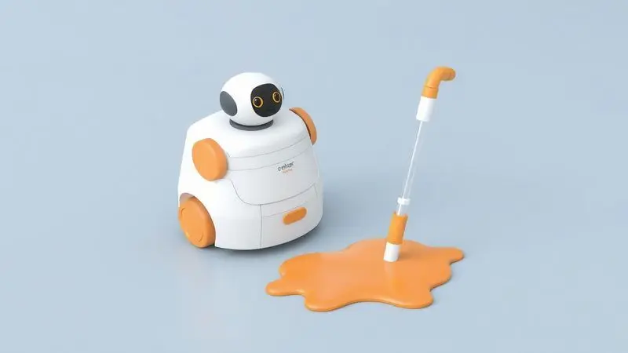
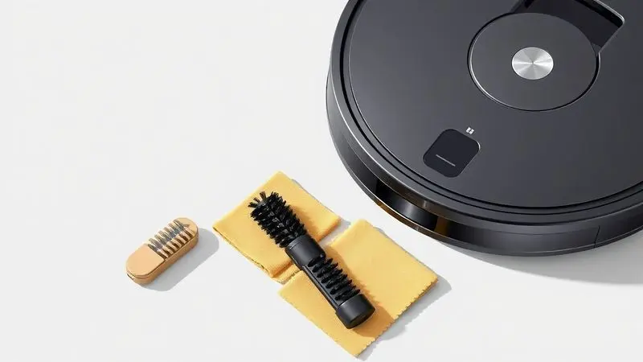

Lembra daquele dia em que você abriu a caixa do seu robô aspirador? A sensação de liberdade, de ganhar horas preciosas da semana. Mas algumas semanas depois, aquele zumbido suave se transformou num barulho irritante, e os cantos da sala continuam cheios de poeira.

Essa frustração silenciosa acontece porque, assim como qualquer aliado de trabalho, seu robô precisa de cuidados regulares.

Pense nisso como um relacionamento: quanto mais você investe em manutenção, mais ele retorna em eficiência e durabilidade. Neste guia, vou mostrar exatamente como transformar aquele robô cansado de volta no parceiro energético que você comprou.

Vamos além da limpeza superficial - vamos à manutenção técnica que garante anos de serviço fiel.

Antes de mergulhar nas ferramentas, imagine a cena: seu robô circula pela casa, aspirando tudo com aquela sucção poderosa de primeiro dia, sem barulhos estranhos, sem deixar rastros de sujeira. Esse é o resultado que você vai alcançar seguindo cada passo comigo.

#<SummaryList products={frontmatter.top_products} />

## Materiais necessários para uma limpeza segura e eficiente

Vamos começar pelo básico certo. Você não precisa de um arsenal profissional, apenas alguns itens que provavelmente já tem em casa. Um pano de microfibra é seu melhor amigo - ele limpa sem riscar, sem deixar fiapos que possam entupir sensores.

Aquela escova de dentes que você ia descartar? Ela se torna a ferramenta perfeita para desenrolar cabelos e fios das escovas.

Se tiver acesso a ar comprimido (aqueles em latinha para limpar teclado), ele será mágico para soprar poeira de cantos impossíveis.

Para o reservatório e filtros laváveis, água corrente e sabão neutro resolvem, mas com um cuidado especial: tudo deve secar completamente antes de voltar ao robô. Nada de umidade residuais que possam criar mofo.

E uma tesoura de ponta fina pode salvar seu robô de fios de cortina que se enrolam nas rodas.

## Passo 1: Higienização do reservatório de pó e Filtro HEPA

<ProductBox 
  title={frontmatter.top_products[1].title} 
  image={frontmatter.top_products[1].image} 
  link={frontmatter.top_products[1].link} 
/>

Vamos começar pelo coração do sistema de sucção. Esvaziar o reservatório após cada uso parece óbvio, mas quantas vezes você realmente faz isso? A poeira acumulada não só reduz a capacidade, mas força o motor a trabalhar mais.

Lave o reservatório com água corrente, usando uma escova macia para os cantos, e deixe secar completamente - de preferência de um dia para o outro.

Agora, o herói invisível: o filtro HEPA. Ele é o responsável por garantir que a poeira que seu robô aspira não volte para o ar da sua casa. Se o [seu modelo](/robo-aspirador-ropo-easy-e-bom/) tem filtro lavável, use apenas água morna, sem detergente, e deixe secar por pelo menos 24 horas.

Filtros não laváveis precisam apenas de uma boa soprada com ar comprimido. A regra é clara: se você tem pets ou usa o robô diariamente, troque o filtro a cada 2 ou 4 meses. É como trocar o filtro de ar do seu carro - mantém tudo respirando bem.

## Passo 2: Como limpar as escovas laterais e o rolo central de sucção

<ProductBox 
  title={frontmatter.top_products[2].title} 
  image={frontmatter.top_products[2].image} 
  link={frontmatter.top_products[2].link} 
/>

Com o sistema de filtragem revitalizado, chegamos às ferramentas de trabalho do seu robô. As escovas laterais são aqueles tentáculos que alcançam os cantos das paredes. Remova-as com cuidado e use os dedos ou uma escovinha para tirar os novelos de cabelo e fios.

Cabelos muito enrolados exigem paciência e uma tesourinha pequena. Uma dica profissional: se as cerdas estiverem tortas, mergulhe as escovas em água morna por alguns minutos - elas voltam ao formato original.

O rolo central é onde a mágica acontece. Retire-o para uma limpeza profunda, desenrolando todos os fios e sujeiras acumuladas. Use uma escova para ajudar, mas evite produtos químicos que possam danificar o material.

Esses componentes têm vida útil - trocá-los periodicamente (geralmente a cada 6-12 meses) não é sinal de defeito, mas de manutenção preventiva inteligente.

## Passo 3: Limpeza e manutenção do MOP (pano de microfibra)

<ProductBox 
  title={frontmatter.top_products[3].title} 
  image={frontmatter.top_products[3].image} 
  link={frontmatter.top_products[3].link} 
/>

Se o seu robô também passa pano, essa parte é crucial. Imagine usar o mesmo pano de chão por semanas - o resultado seria nojento, certo? Com o mop do robô, a lógica é a mesma.

Lave o pano de microfibra após cada uso, principalmente se ele limpou áreas de cozinha ou banheiro.

Retire o mop do suporte, enxágue bem sob água corrente até sair toda a sujeira, e deixe secar completamente antes de recolocá-lo. A maioria dos fabricantes recomenda trocar o pano a cada 2 ou 3 meses, dependendo do uso.

Sim, alguns modelos têm função de auto-limpeza, mas nada substitui uma lavagem manual cuidadosa, especialmente em casas com crianças ou animais.

## Passo 4: Cuidado com os sensores, câmeras e contatos de carregamento

<ProductBox 
  title={frontmatter.top_products[4].title} 
  image={frontmatter.top_products[4].image} 
  link={frontmatter.top_products[4].link} 
/>

Agora vamos aos olhos e nervos do seu robô. Os sensores são delicados e essenciais - sem eles, seu aparelho vira um cego batendo em móveis. Limpe-os regularmente com um pano seco ou levemente umedecido, nunca com produtos abrasivos.

Sensores sujos são a principal causa de navegação errática e batidas.

A lente da câmera (se seu modelo tiver) merece o mesmo cuidado que você dá às lentes dos seus óculos: pano de microfibra, movimentos suaves, zero produtos químicos.

Os contatos de carregamento são outro ponto crítico - sujeira acumulada aqui significa noites frustrantes tentando fazer o robô carregar. Limpe-os periodicamente com um pano seco.

## Checklist de Manutenção: Quando trocar cada peça de reposição?

<ProductBox 
  title={frontmatter.top_products[5].title} 
  image={frontmatter.top_products[5].image} 
  link={frontmatter.top_products[5].link} 
/>

Depois de dominar a limpeza, você precisa de um plano de longo prazo. Este checklist é seu mapa da mina para manter o desempenho sempre no topo:

- **Escovas principais:** Limpeza semanal, troca a cada 6-12 meses

- **Escovas laterais:** Troca a cada 3-6 meses  

- **Filtros:** Lavagem semanal, troca a cada 2-3 meses (especialmente com pets)

- **Sensores e contatos:** Limpeza mensal

- **Rodas:** Troca anual

- **Depósito de pó:** Esvazie após cada uso

- **Bateria:** Vida útil de 1-3 anos, dependendo do uso

Lembre-se: ambientes mais desafiadores (muitos tapetes, animais, crianças) exigem atenção mais frequente.

## Diferenças na limpeza entre marcas (WAP, Xiaomi, Electrolux e Samsung)

<ProductBox 
  title={frontmatter.top_products[6].title} 
  image={frontmatter.top_products[6].image} 
  link={frontmatter.top_products[6].link} 
/>

Cada marca tem sua personalidade, e conhecer essas nuances ajuda nos cuidados. A Xiaomi, com seu excelente custo-benefício, traz tecnologias de [mapeamento a laser](/melhor-robo-aspirador-com-mapeamento/) que exigem sensores sempre impecáveis.

A Electrolux e sua [funcionalidade 3 em 1](/robo-aspirador-3-em-1-qual-o-melhor/) (varrer, aspirar, passar pano) pedem atenção especial ao sistema de mop e à bateria de longa duração.

A WAP foca na praticidade com controles por voz e [funções de autolimpeza](/melhor-robo-aspirador-autolimpante/), mas isso não dispensa sua revisão manual periódica. Já a Samsung, no segmento premium, com integração ao ecossistema SmartThings, tem sensores mais sofisticados que merecem cuidado extra.

Independente da marca, o princípio é o mesmo: manutenção regular prolonga a vida e mantém o desempenho.

## 5 Erros fatais que podem queimar o motor do seu robô aspirador

Vamos falar sobre o que não fazer, porque alguns descuidos podem significar a aposentadoria precoce do seu investimento:

1. **Filtros entupidos:** É como tentar respirar com um travesseiro no rosto. O motor superaquece, trabalha além da capacidade e queima.

2. **Obstruções ignoradas:** Se o robô fica preso em tapetes ou fios repetidamente, o motor se desgasta tentando se libertar.

3. **Pisos molhados:** Umidade e eletrônicos não combinam. Água pode causar curtos-circuitos fatais.

4. **Ciclos de carga errados:** Deixar sempre na base ou usar até descarregar completamente desgasta a bateria rápido.

5. **Fios soltos:** Aqueles fios de carregador ou cortinas que se enrolam podem travar o motor em plena operação.

## Perguntas Frequentes (FAQ) sobre manutenção de robôs aspiradores

Com que frequência devo limpar os filtros?
Idealmente após cada uso pesado, ou pelo menos uma vez por semana. Filtros sujos são o maior inimigo da sucção poderosa.

Meu robô está [batendo nos móveis](/como-resetar-robo-aspirador/), o que fazer?
Limpe imediatamente os sensores. Se o problema persistir, verifique se há arranhões nas lentes ou se o robô precisa de recalibração via aplicativo.

Posso usar produtos de limpeza nas partes plásticas?
Apenas água e sabão neutro. Produtos químicos podem danificar superfícies e deixar resíduos que atraem mais poeira.

A [bateria não dura mais](/como-carregar-aspirador-robo/) como antes, é normal?
Sim, baterias têm ciclo de vida. Se após 2 anos a autonomia caiu significativamente, considere a troca - é mais barato que [comprar um robô novo](/robo-aspirador-clean-robot-e-bom/).

Devo seguir as atualizações do aplicativo?
Absolutamente. Muitas atualizações trazem otimizações de navegação e eficiência energética que prolongam a vida do aparelho.

## Conclusão

Você começou este guia com um robô aspirador que talvez não estivesse rendendo como antes, com aquele barulhinho incômodo que sugere problemas à vista. Agora, tem nas mãos o conhecimento completo para reverter essa situação.

Cada passo que você aprendeu - da limpeza do filtro HEPA aos cuidados com os sensores - é um investimento no prolongamento da vida útil do seu aliado doméstico.

Manter seu robô em perfeito estado não é apenas sobre limpeza técnica. É sobre proteger o investimento que fez para ganhar tempo livre. É sobre acordar sabendo que sua casa estará impecável sem você precisar pegar no aspirador tradicional.

É sobre transformar uma compra utilitária em um relacionamento duradouro com um assistente que realmente facilita sua vida.

Coloque em prática o que aprendeu hoje. Sepure 30 minutos do seu final de semana para fazer aquela manutenção completa. Sinta a diferença na próxima vez que seu robô começar a trabalhar - a sucção mais forte, o silêncio mais tranquilo, a navegação mais precisa.

Esse é o robô que você comprou, e agora você sabe como mantê-lo assim por anos. O tempo que você economiza com uma casa limpa vai muito além dos minutos da limpeza - é tempo para viver melhor.