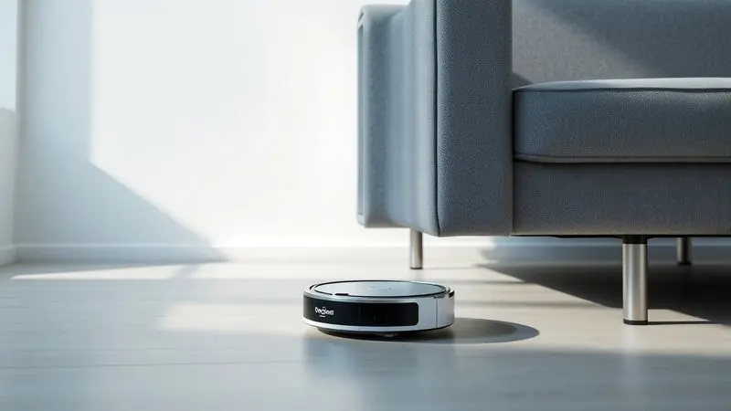
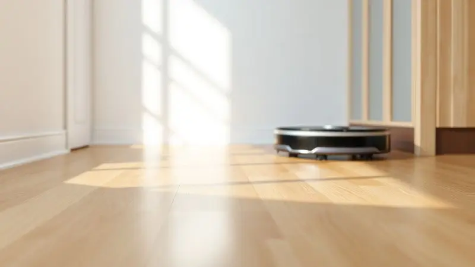
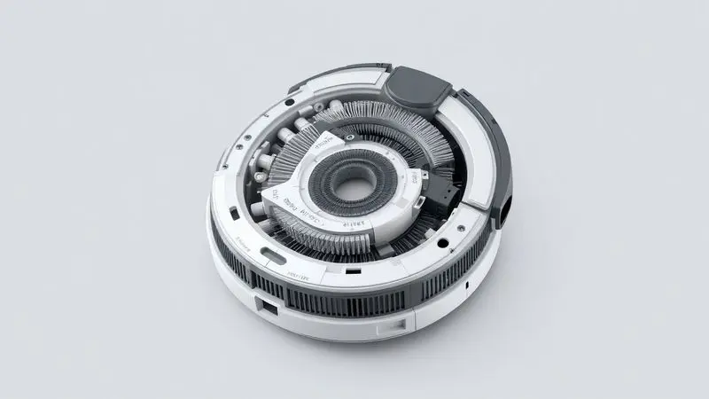

Imagine poder chegar em casa depois de um dia cansativo e encontrar os pisos limpos, sem precisar ter movido um músculo. É essa promessa que o Robô Aspirador Mondial RB-07 traz para sua rotina, oferecendo praticidade a um preço que não exige um empréstimo.

Mas será que essa acessibilidade compensa? Vamos descobrir juntos se ele realmente entrega o que promete, analisando cada detalhe para você tomar a melhor decisão.

<SummaryList products={frontmatter.top_products} />

## O que é o Robô Aspirador Mondial RB-07 Fast Smart Clean?

Pense nele como um pequeno ajudante silencioso que percorre sua casa enquanto você está ocupado com outras coisas. Com design compacto que permite alcançar aqueles cantos impossíveis sob os móveis, ele é a solução para quem quer automatizar a limpeza sem complicações.

Seus sensores funcionam como um sexto sentido, detectando obstáculos e desníveis para evitar quedas, enquanto a potência de 30W cuida da sujeira do dia a dia.

Basicamente, ele é o parceiro ideal para manter sua casa sempre apresentável sem exigir esforço constante de sua parte.

## Ficha Técnica: Potência, Autonomia e Design Slim

Vamos aos números: com 30W de potência, ele captura aqueles fiapos persistentes que se escondem nos cantos. A autonomia varia conforme o tipo de piso, mas é suficiente para limpar um apartamento médio em uma única carga.

O verdadeiro diferencial está no design slim - ele se torna seu melhor aliado para limpar embaixo da cama, sofás e armários sem você precisar se abaixar. Essa combinação de características técnicas se traduz em uma experiência prática que se adapta ao seu espaço.

### Função 3 em 1: Como funciona o sistema de varrer, aspirar e passar pano

Aqui está onde a mágica acontece. Primeiro, as escovas laterais varrem a sujeira para o centro do caminho, como se fossem mãos minuciosas recolhendo cada partícula. Em seguida, o [sistema de aspiração](/robo-aspirador-mondial-pratic-clean-rb-11-e-bom/) entra em ação, sugando tudo para um compartimento interno.

Para finalizar, o reservatório de água umedece o pano anexado, dando aquele toque final que deixa os pisos com aparência realmente limpa. É como ter três ajudantes em um só aparelho, cada um fazendo sua parte em perfeita sincronia.

### Sensores Inteligentes e Sistema Antiqueda

Ele tem olhos nos lados. Os sensores inteligentes não apenas detectam obstáculos, mas aprendem a navegar ao redor deles, evitando colisões desnecessárias com seus móveis favoritos.

O sistema antiqueda é seu guardião pessoal - ele reconhece desníveis e escadas, parando imediatamente antes de qualquer queda. Essa tecnologia transforma um simples eletrodoméstico em um parceiro confiável que respeita seu espaço e seus pertences.

## Review Detalhado: Robô Aspirador Mondial RB-07 em Ação

<ProductBox 
  title={frontmatter.top_products[0].title} 
  image={frontmatter.top_products[0].image} 
  link={frontmatter.top_products[0].link} 
/>

Colocando para trabalhar, o que mais impressiona é como ele se integra naturalmente à sua rotina. Programe os horários de limpeza e esqueça que ele existe até ouvir o zumbido suave indicando que está trabalhando.

Para limpezas diárias de poeira e pelos de animais, ele é um verdadeiro herói, especialmente se você tem [pets que soltam muito pelo](/melhor-robo-aspirador-para-quem-tem-pet/).

No entanto, é honesto reconhecer suas limitações. Em tapetes altos ou com sujeira mais pesada e compactada, ele pode precisar de uma ajudinha extra.

A capacidade do reservatório também exige atenção em casas maiores, onde talvez seja necessário esvaziá-lo mais frequentemente. Mas para quem busca um assistente confiável para a manutenção diária, essas pequenas concessões valem pela conveniência oferecida.

## Principais Vantagens do Robô Aspirador Mondial RB-07

A programação de horários é um divisor de águas. Imagine acordar com a casa já limpa ou chegar do trabalho com os pisos impecáveis, sem ter feito nenhum esforço.

A cobertura inteligente do espaço garante que ele não deixe cantos para trás, enquanto a capacidade de lidar com diferentes tipos de piso, de azulejos a carpetes baixos, mostra sua versatilidade.

Para completar, seu tamanho compacto significa que ele não vai ocupar aquele espaço precioso do armário, encontrando seu canto discreto [para recarregar](/como-carregar-aspirador-robo/).

## Limitações e Pontos de Atenção: O que você precisa saber antes de comprar

Se sua casa tem muitos degraus, móveis baixos ou tapetes felpudos, você precisará supervisionar seu trabalho ocasionalmente. A autonomia, embora adequada para a maioria dos apartamentos, pode exigir recargas intermediárias em casas muito extensas.

E embora ele seja eficiente para a manutenção diária, não espere que substitua completamente a limpeza manual profunda - pense nele como um excelente assistente, não como um substituto total.

## Mondial RB-07 vs. Mondial RB-08: Quais as principais diferenças?

O RB-08 é como o irmão mais velho com experiência extra. Seu [sistema de navegação](/robo-aspirador-mondial-rb-08-e-bom/) é mais sofisticado, criando mapas mentais dos ambientes para uma limpeza mais estratégica. A bateria também tem maior duração, ideal para espaços mais amplos.

Mas essa evolução tem seu preço. O RB-07, por sua vez, mantém o essencial: faz o trabalho básico muito bem, a um custo que não dói no bolso.

A escolha depende do seu orçamento e das suas expectativas - quer o máximo de tecnologia ou o equilíbrio perfeito entre funcionalidade e preço?

## Para quem o Mondial RB-07 é indicado? (E para quem não é)

Ele é feito para o morador de apartamento que tem uma rotina agitada e pouco tempo para limpeza. Para famílias com animais de estimação que soltam pelos constantemente, ele se torna um aliado indispensável.

Também é perfeito para quem quer testar a automação doméstica sem investir fortunas.

Por outro lado, se você mora em uma casa grande com vários cômodos e diferentes níveis, ou se tem tapetes muito altos que desafiam qualquer robô, talvez valha a pena considerar modelos com tecnologia mais avançada.

O mesmo vale para quem busca uma limpeza profunda sem intervenção humana - nesse caso, ele é um excelente complemento, mas não a solução completa.

## Dicas de Manutenção para aumentar a vida útil do seu robô aspirador

Trate-o como um parceiro de longa data. [Limpe os filtros regularmente](/como-resetar-robo-aspirador-mondial/) - isso mantém a sucção potente e evita que ele se esforce além do necessário. Dê uma olhada nas escovas e rodas periodicamente, removendo fios de cabelo ou fiapos que possam se enrolar.

Mantenha o caminho livre de obstáculos pequenos como brinquedos ou cabos soltos, e ele retribuirá com anos de serviço fiel. Esses pequenos cuidados fazem toda a diferença entre um eletrodoméstico que dura uma temporada e um que se torna parte da família.

## Conclusão: O Robô Aspirador Mondial RB-07 ainda vale a pena em 2024?

Absolutamente, se você busca entrada no mundo da automação doméstica sem complicações financeiras. Em um mercado cheio de opções caríssimas com recursos que muitas vezes não usamos, o RB-07 mantém seu charme pela simplicidade eficiente.

Ele cumpre sua promessa básica com maestria: automatizar a limpeza diária para que você tenha mais tempo para o que realmente importa.

Claro, existem modelos mais avançados com [mapeamento a laser](/melhor-robo-aspirador-com-mapeamento/) e baterias que duram dias.

Mas para quem precisa de um ajudante confiável para a rotina, que faz seu trabalho discretamente e sem exigir um PhD em tecnologia para operar, ele continua sendo uma escolha inteligente.

O segredo está em ajustar as expectativas: ele não é um mágico que transforma a casa sozinho, mas sim um parceiro que torna a manutenção muito mais fácil. E nisso, ele entrega exatamente o que promete.

## Perguntas Frequentes sobre o Mondial Smart Clean (FAQ)

Uma das dúvidas mais comuns é sobre sua eficácia em diferentes superfícies. Ele se sai muito bem em pisos frios, laminados e tapetes de baixa altura, recolhendo poeira e pelos com eficiência. Para carpetes mais altos, pode precisar de passadas extras.

Quanto à programação, basta definir os horários no controle remoto e ele cumprirá a agenda religiosamente. Os sensores realmente funcionam para evitar quedas, mas objetos muito baixos ou fios finos podem passar despercebidos.

Finalmente, vale lembrar que, como qualquer [robô aspirador](/aspirador-robo-philco-pas26p-e-bom/), ele complementa mas não substitui completamente a limpeza manual profunda ocasional.

Pense nele como seu auxiliar diário que mantém a casa sempre apresentável, enquanto você se concentra na faxina mais intensa nos finais de semana.