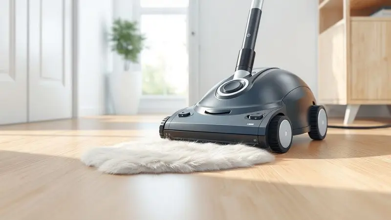
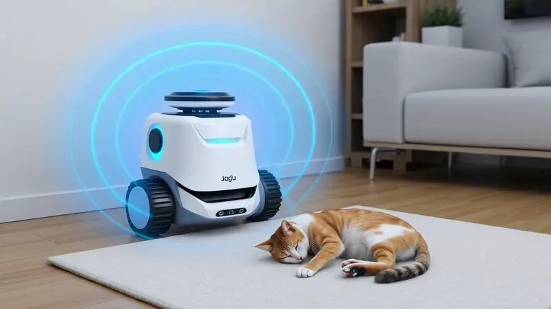
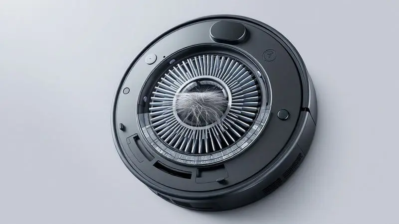

Se você divide sua casa com animais de estimação, sabe que a batalha contra os pelos e a sujeira trazida da rua é constante. Parece impossível manter o chão limpo por mais de algumas horas, certo?

A boa notícia é que a tecnologia evoluiu e os robôs aspiradores modernos são projetados especificamente para enfrentar esse desafio.

Neste guia definitivo, você vai descobrir quais são os modelos que realmente aspiram pelos sem enrolar na escova, como funciona a função 'passa pano' em casas com pets e quais os critérios cruciais para não jogar dinheiro fora.

Prepare-se para automatizar sua limpeza e ganhar mais tempo de qualidade com seu melhor amigo.

<SummaryList products={frontmatter.top_products} />

## Por que quem tem pets precisa de um robô aspirador de alto desempenho?

Imagine acordar e, em vez de ver aquele tapete de pelos que seu companheiro peludo deixou durante a noite, encontrar um chão limpo, pronto para suas patinhas matinais. Isso não é magia. É o que um robô aspirador de alto desempenho faz por você enquanto dorme.

Esses dispositivos vão além da simples varrição. Eles alcançam os cantos onde os pelos adoram se esconder, aqueles espaços embaixo do sofá que seu aspirador manual nunca alcança.

Com sensores inteligentes, eles detectam onde a sujeira se concentra e aumentam a potência justo naquela área. O resultado?

Menos tempo empunhando um aspirador e mais momentos vendo seu gato perseguir a luz que o robô reflete no chão, ou seu cachorro farejando curiosamente o novo 'amigo' que cuida da casa.

## Como escolher o robô ideal: O que observar antes de comprar

[Escolher o robô certo](/melhor-robo-aspirador-para-quem-tem-pet/) é como encontrar o parceiro perfeito para sua rotina com pets. Ele precisa entender suas necessidades, adaptar-se aos seus espaços e, acima de tudo, trabalhar bem sob pressão (ou melhor, sob pelos).

Antes de se apaixonar pelo primeiro modelo com design elegante, há quatro pilares que merecem sua atenção. São eles que transformam um aparelho qualquer no guardião da limpeza da sua casa.

### 1. Potência de Sucção (Pa) e Escovas Anti-emaranhamento

Pense na potência como o apetite do seu robô. Quanto maior (medida em Pascals, ou Pa), mais ele consegue sugar aqueles pelos teimosos que grudam no carpete ou nos cantos do piso.

Mas potência sozinha pode criar um problema: uma escova entupida de pelos que para de girar. É aí que entram as escovas anti-emaranhamento. Elas são projetadas para evitar que os fios se enrolem, mantendo o desempenho constante.

É a combinação perfeita: força para aspirar e inteligência para não se enrolar nos próprios fios. Você quer um robô que trabalhe, não um que precise de resgate a cada semana.

### 2. Filtro HEPA: O aliado contra alergias e odores

Para quem tem alergias ou simplesmente cansa daquele cheiro característico de 'casa com pet', o filtro HEPA é um respiro de ar puro. Literalmente.

Ele captura 99,97% das partículas minúsculas que flutuam no ar, incluindo aqueles pelos microscópicos, a poeira que seu cachorro traz da rua e outros alérgenos. É como ter um purificador de ar embutido no seu aspirador.

Além de limpar o chão, ele limpa o ar que você respira, tornando cada espirro a menos uma vitória na sua qualidade de vida.

E sim, ele também ajuda a neutralizar odores, substituindo aquele cheiro de 'animal molhado' pelo aroma de limpeza que você realmente escolheu para sua casa.

### 3. Sensores de Detecção de Obstáculos (Especial para Pets)

Seu pet deixa brinquedos pelo caminho. Tem potes de água, comedouros e, ocasionalmente, um 'presente' indesejado. Sensores de detecção de obstáculos são os olhos do seu robô.

Eles escaneiam o ambiente, identificando não apenas móveis, mas também objetos menores como bolinhas, ossos de brinquedo e, em modelos mais avançados, até mesmo as necessidades dos animais.

Alguns robôs ajustam automaticamente a potência ao detectar diferentes superfícies, aspirando com mais força no tapete e suavizando no piso liso. É a garantia de que seu investimento não vai colidir com a perna da mesa ou, pior, espalhar um acidente pela casa toda.

### 4. Eficiência do Mop (Função Passa Pano)

Aspirar os pelos é uma coisa. Remover aquelas marcas de patinha no piso da cozinha é outra. A função mop (ou passa pano) é o toque final que transforma um chão aspirado em um chão verdadeiramente limpo. Mas atenção à qualidade.

Um bom sistema tem um reservatório que mantém o pano na umidade ideal, nem encharcado, nem seco.

Alguns modelos distribuem o líquido de forma uniforme, deixando um brilho agradável, enquanto outros podem exigir que você troque o pano com frequência ou deixem o piso úmido por mais tempo.

Pense nisso como o diferencial que decide se você ainda precisará pegar o pano tradicional depois que o robô terminar.

Depois de entender o que buscar, é hora de conhecer os campeões que estão conquistando os lares com pets pelo país.

## 1. Ropo Smart Pet: O especialista em pelos de animais

<ProductBox 
  title={frontmatter.top_products[0].title} 
  image={frontmatter.top_products[0].image} 
  link={frontmatter.top_products[0].link} 
/>

Projetado com uma missão clara, o [Ropo Smart Pet](/robo-aspirador-ropo-pet-e-bom/) fala a língua dos donos de pets. Sua escova em formato V é feita para agarrar pelos sem deixá-los presos, enquanto o sistema de sucção com quatro níveis ajusta-se automaticamente do piso frio ao tapete mais fofo.

A filtragem tripla é sua promessa de um ambiente mais saudável, retendo desde os alérgenos mais persistentes até partículas de poeira que nem você sabia que existiam.

Controlar tudo pelo aplicativo é intuitivo, permitindo que você programe a limpeza para quando estiver no trabalho ou integre ao seu ecossistema de [casa inteligente](/robo-aspirador-positivo-e-bom/).

A funcionalidade 2 em 1 (aspirar e passar pano simultaneamente) é seu grande trunfo, e a estação autolimpante é o tipo de conveniência que faz você se perguntar como viveu tanto tempo sem ela.

## 2. iRobot Roomba j7+: Inteligência para evitar 'acidentes' de pets

<ProductBox 
  title={frontmatter.top_products[1].title} 
  image={frontmatter.top_products[1].image} 
  link={frontmatter.top_products[1].link} 
/>

O Roomba j7+ tem um superpoder que donos de pets adoram: ele enxerga e evita fezes de animais. Seu sistema PrecisionVision não é apenas marketing. É uma tecnologia que reconhece obstáculos em tempo real, focando especificamente nos 'acidentes' caninos e felinos.

A marca oferece até uma garantia de substituição se o robô falhar nessa missão no primeiro ano, um voto de confiança que tranquiliza qualquer tutor.

Suas escovas de borracha são uma obra de engenharia, projetadas para agitar a sujeira sem permitir que os pelos se enrolem.

A conectividade Wi-Fi pode parecer um detalhe, mas é o que permite que você receba fotos dos obstáculos que ele encontra, dando controle total sobre o que acontece em casa quando você não está.

## 3. Xiaomi Vacuum S10: Melhor custo-benefício com mapeamento a laser

<ProductBox 
  title={frontmatter.top_products[2].title} 
  image={frontmatter.top_products[2].image} 
  link={frontmatter.top_products[2].link} 
/>

O S10 prova que tecnologia avançada não precisa custar uma fortuna. Seu [mapeamento a laser](/xiaomi-vacuum-s10-melhor-robo-aspirador/) LDS cria mapas detalhados da sua casa, como se fosse um cartógrafo digital.

Ele sabe exatamente onde já limpou, onde precisa voltar e como evitar a cadeira que seu gato empurrou para o meio da sala. Com 4000Pa de potência, ele não brinca em serviço quando encontra pelos acumulados.

A função mop é bem implementada, oferecendo uma solução completa para quem quer mais do que apenas aspiração.

A autonomia de 140 minutos cobre a maioria dos apartamentos e casas, mas se sua residência for particularmente espaçosa, talvez seja necessário planejar setores ou contar com o retorno automático à base para recarregar.

## 4. Eufy RoboVac G10 Hybrid: Silencioso e potente para casas com gatos

<ProductBox 
  title={frontmatter.top_products[3].title} 
  image={frontmatter.top_products[3].image} 
  link={frontmatter.top_products[3].link} 
/>

Para os tutores de felinos, que sabem como os pelos finos podem ser traiçoeiros, o G10 Hybrid é um aliado silencioso. Com 2000Pa de sucção, ele remove eficientemente sem assustar os animais mais sensíveis.

Sua navegação inteligente mapeia o ambiente e planeja a rota mais eficiente, economizando tempo e bateria.

O design ultrafino é seu passaporte para os lugares que outros robôs não alcançam, especialmente aqueles esconderijos embaixo da cama ou do sofá onde os gatos adoram descansar. A ressalva é clara: se seus pisos são majoritariamente carpetes, este não é o modelo ideal.

Mas para pisos duros e cerâmicos, ele entrega performance surpreendente.

## 5. Electrolux ERB10: A opção compacta e eficiente para espaços pequenos

<ProductBox 
  title={frontmatter.top_products[4].title} 
  image={frontmatter.top_products[4].image} 
  link={frontmatter.top_products[4].link} 
/>

Com apenas 7cm de altura, o [ERB10 é o mestre da infiltração](/robo-aspirador-electrolux-erb10-como-usar/). Ele chega onde outros não chegam, especialmente em apartamentos com móveis baixos. Sua funcionalidade 3 em 1 (varrer, aspirar e passar pano seco) é impressionante para um aparelho tão compacto.

Os sensores antiqueda e anticolisão trabalham em conjunto para proteger tanto o robô quanto seus móveis.

O filtro HEPA Allergy Protect retém 99,9% das impurezas, um alívio para alérgicos. A autonomia de 2h20 é generosa para [limpezas diárias](/aspirador-robo-smartbrush-1200-midea-e-bom/) em espaços menores.

O nível de ruído em torno de 70dB é perceptível, então se você trabalha em casa ou tem um pet muito sensível a sons, pode ser um fator a considerar. Mas para quem prioriza eficiência em pouco espaço, é uma escolha sólida.

## Dicas de Especialista: Como evitar que o robô espalhe sujeira de pet

Um robô aspirador pode ser seu melhor amigo na limpeza, mas sem alguns cuidados, ele pode se tornar um distribuidor de sujeira. A primeira regra é sagrada: limpe os filtros e escovas regularmente.

Pelo acumulado não só reduz a eficiência, como pode fazer com que o robô espalhe o que deveria aspirar.

Programe as sessões de limpeza para horários estratégicos. Enquanto você leva seu cachorro para passear ou durante a noite, quando os pets estão mais calmos.

Utilize barreiras virtuais ou físicas para restringir o acesso a áreas de bagunça intensa, como o local onde seu gato desmonta o arranhador. Essas pequenas estratégias transformam um bom robô em um robô excepcional.

## Quais produtos de limpeza posso usar no robô aspirador?

A tentação de usar um desinfetante potente é grande, especialmente em casas com pets. Mas a regra é simples: siga as recomendações do fabricante. A maioria dos robôs funciona bem com água pura ou detergentes neutros.

[Produtos químicos agressivos](/o-que-colocar-no-robo-aspirador-para-passar-pano/) podem danificar o motor, corroer as peças internas ou deixar resíduos que atraem mais sujeira.

Algumas marcas oferecem soluções específicas compatíveis com seus modelos, muitas vezes formuladas para neutralizar odores de animais. Essas são opções seguras que mantêm seu aparelho funcionando por mais tempo.

Lembre-se: o que é forte demais para suas mãos provavelmente é forte demais para o robô.

## Manutenção essencial: Como prolongar a vida do seu robô em casas com pets

Seu robô trabalha duro para manter a casa limpa. Retribua o favor com uma manutenção simples mas consistente. Além da limpeza regular de filtros e escovas (especialmente importantes em lares com pets), verifique as rodas e sensores.

Um sensor sujo é como vendar os olhos do robô.

A bateria também merece atenção. Evite deixá-la descarregar completamente com frequência e mantenha o robô em um local seco.

Esses cuidados básicos não apenas prolongam a vida útil do aparelho, como garantem que ele continue desempenhando seu papel com a mesma eficiência do primeiro dia.

## Perguntas Frequentes (FAQ)

Algumas dúvidas persistem mesmo depois de muita pesquisa. Vamos responder às que mais tiram o sono dos tutores.

### O robô aspirador assusta os animais?

A reação é tão individual quanto a personalidade do seu pet. Alguns cães latem, alguns gatos observam com curiosidade científica, outros ignoram completamente. A introdução gradual é a chave. Comece com o robô desligado, deixe seu animal cheirá-lo.

Depois, ligue por curtos períodos, associando o momento a algo positivo, como um petisco. A maioria se acostuma rapidamente, especialmente quando percebe que aquele objeto barulhento não é uma ameaça, apenas um novo membro da família que cuida da casa.

### Com que frequência devo limpar o reservatório de pelos?

Pense nisso como a caixa de areia do seu robô: quanto mais cedo você limpar, melhor. Em casas com pets que soltam muitos pelos, esvaziar após cada uso é ideal. Isso previne a perda de sucção e evita que os pelos voltem para o chão.

O filtro também precisa de atenção regular. Uma manutenção rápida depois da limpeza garante que seu aliado esteja sempre pronto para a próxima batalha contra a sujeira.

## Conclusão

Investir em um robô aspirador quando se tem pets vai muito além de adquirir um eletrodoméstico. É sobre reconquistar tempo, reduzir o estresse da limpeza constante e criar um ambiente mais saudável para você e seu companheiro animal.

É sobre trocar a visão de pelos acumulados no canto da sala pela tranquilidade de saber que, mesmo enquanto você trabalha ou descansa, alguém (ou algo) está cuidando da casa.

Os modelos que analisamos mostram que há opções para cada necessidade: desde o especialista em evitar acidentes até o mestre da limpeza completa em apartamentos compactos. Cada um com sua tecnologia, mas todos com um propósito comum: facilitar sua vida.

O custo inicial pode parecer significativo, mas quando você calcula o tempo economizado, a qualidade do ar melhorada e a paz de espírito de chegar em casa e encontrar os pisos limpos, o investimento se transforma.

É comprar horas de qualidade a mais com seu pet, sem a culpa de ter que passar o aspirador antes de sentar no sofá.

Escolha com base nas suas necessidades reais, na personalidade do seu animal e nas características da sua casa.

E prepare-se para uma nova rotina, onde a limpeza deixa de ser uma tarefa e se torna um pano de fundo discreto para o que realmente importa: a convivência com quem faz seu lar ser especial.