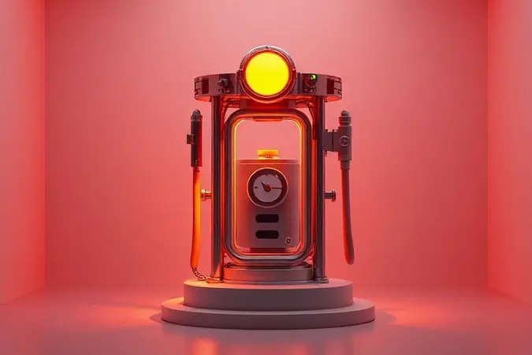

Ao decidir investir em uma cama box baú Ortobom, você escolheu muito mais que um móvel: escolheu organização, espaço extra e a promessa de noites bem dormidas. Mas entre a caixa fechada e o primeiro sono perfeito há um caminho que pode parecer intimidador.

A boa notícia? Com o guia certo e um pouco de atenção, montar sua cama se transforma em uma tarefa gratificante, quase terapêutica.

Aqui, vamos além do manual básico para garantir que cada parafuso, cada haste e cada amortecedor trabalhem em harmonia total, criando uma estrutura que só vai pedir para ser usada.

<SummaryList products={frontmatter.top_products} />

## Preparação Inicial: O Que Você Precisa para Montar sua Cama Ortobom

O segredo de uma montagem tranquila está na preparação. É aquela sensação boa de saber que você tem tudo à mão antes de começar, sem precisar correr até a ferramentaria no meio do processo.

Então, antes de abrir a primeira embalagem, respire fundo e siga esse checklist mental.

### Ferramentas e Espaço Necessário

O que você realmente precisa cabe na palma da sua mão: uma chave de fenda, uma Phillips e, dependendo do modelo, uma chave Allen (que normalmente já vem na embalagem). A beleza está na simplicidade - são ferramentas que a maioria já tem guardada em casa.

Agora, o espaço: imagine ter liberdade para espalhar as peças, girar a estrutura sem bater em nada e trabalhar com conforto.

Um canto do quarto livre, com boa luz natural ou uma luminária forte, faz toda diferença para você enxergar cada furo e encaixe com clareza, evitando aquela frustração de ter que desfazer algo porque não viu direito.

## Passo 1: Fixação das Hastes (Arcos de Contenção)

<ProductBox 
  title={frontmatter.top_products[0].title} 
  image={frontmatter.top_products[0].image} 
  link={frontmatter.top_products[0].link} 
/>

Com seu espaço organizado e ferramentas à mão, é hora de começar pela estrutura que vai segurar tudo no lugar. Os arcos de contenção são os guardiões do seu colchão, impedindo que ele escorregue quando você abre o baú.

Localize os furos preparados na parte superior da tampa do baú - eles estão estrategicamente posicionados para receber as hastes. Encaixe cada haste em seu lugar e use os parafusos fornecidos para fixá-las com segurança.

Aperte bem as porcas, mas sem excesso de força, apenas o suficiente para sentir que não há folga. E atenção especial se sua cama tem pistões a gás: aquelas fitinhas protetoras devem ficar exatamente onde estão até o momento certo.

Elas são sua garantia de que nada ativa antes da hora. Fique tranquilo se essa instrução parecer um pouco técnica - tudo ficará claro conforme avançamos.

## Passo 2: Instalação dos Amortecedores (Pistões a Gás)

<ProductBox 
  title={frontmatter.top_products[1].title} 
  image={frontmatter.top_products[1].image} 
  link={frontmatter.top_products[1].link} 
/>

Agora que os arcos estão no lugar, vem o coração do sistema: os amortecedores. Eles são os responsáveis por transformar o ato de abrir o baú em um gesto suave, quase sem esforço.

Este é um momento em que ter alguém para ajudar faz toda diferença - não pela dificuldade, mas pela praticidade.

Com a cama ainda na posição vertical, retire as proteções plásticas e instale os pés na base. Use as mãos primeiro, reservando as ferramentas apenas para dar o aperto final. Quando colocar a cama na horizontal (agora sim), remova as fitas de segurança dos pistões.

Encontre os pontos de fixação na base e na tampa do baú - eles são projetados para receber exatamente o modelo de amortecedor que vem com sua cama. Encaixe primeiro um lado, depois o outro, e fixe com os parafusos.

O equilíbrio está no toque: aperte o suficiente para segurança, mas sem comprimir demais o mecanismo interno.

### Alerta de Segurança: O Perigo de Testar o Amortecedor sem o Colchão

A curiosidade é natural - você quer ver se funciona, sentir aquele movimento suave. Mas testar os amortecedores sem o colchão no lugar é como pisar no acelerador do carro com ele no neutro.

Sem o peso correto distribuído, o sistema não encontra sua pressão ideal, podendo sofrer danos internos ou, pior, falhar em pleno funcionamento e causar um acidente. O momento certo para sentir a ação dos pistões é depois que tudo está pronto, com o colchão posicionado.

Aí sim, você experimentará a suavidade como foi projetada.

## Passo 3: Colocação dos Acabamentos e Proteções Laterais

Com a estrutura principal firme e os mecanismos instalados, chegamos aos detalhes que transformam a funcionalidade em conforto total.

As laterais e proteções não são apenas estéticas - elas garantem ventilação adequada para o que você armazenar e protegem o interior do baú.

Posicione as laterais, alinhando-as cuidadosamente com a estrutura existente. Use os parafusos apropriados para fixá-las, verificando se não há espaços ou desníveis. Depois, instale as proteções laterais que acompanham seu modelo.

Quando tudo estiver no lugar, passe a mão ao redor da estrutura. Deve sentir uma superfície contínua, firme, sem pontos soltos. É essa atenção aos detalhes que transforma uma montagem qualquer em um trabalho bem feito.

## Passo 4: Instalação dos Pés da Cama Box

<ProductBox 
  title={frontmatter.top_products[2].title} 
  image={frontmatter.top_products[2].image} 
  link={frontmatter.top_products[2].link} 
/>

Você está na reta final. Os pés são a conexão entre sua nova cama e o chão, e precisam oferecer estabilidade absoluta para todos os movimentos, desde dormir até abrir o baú.

Com a cama na vertical novamente (sim, mais uma vez - mas essa é a última), localize os furos pré-determinados na parte inferior da base. Encaixe cada pé em sua posição e rosqueie no sentido horário até sentir que está firme, sem balançar.

Para modelos bipartidos, lembre-se das chapas de união - elas garantem que as duas metades trabalhem como uma só. Pode ser que alguns furos pareçam escondidos, mas uma olhada mais atenta sempre revela onde cada peça se encaixa.

Quando terminar e posicionar a cama definitivamente no chão, retire as últimas fitas de segurança dos pistões. Esse é o momento em que tudo se conecta: a estrutura está pronta para receber sua parte favorita.

## Como Escolher o Colchão Ideal para sua Cama Box Baú Ortobom

<ProductBox 
  title={frontmatter.top_products[3].title} 
  image={frontmatter.top_products[3].image} 
  link={frontmatter.top_products[3].link} 
/>

Depois de tanto trabalho estrutural, vem a recompensa: escolher onde você vai dormir todas as noites. E aqui, a Ortobom oferece opções para cada tipo de sonho.

Pense primeiro no seu corpo. Colchões de molas são maravilhosos para casais porque oferecem independência de movimento - quando um vira, o outro nem sente. Já os de espuma variam em densidade, criando diferentes níveis de firmeza.

Uma orientação prática: pessoas com mais peso geralmente encontram mais conforto em opções mais firmes, enquanto quem dorme de lado tende a preferir uma acolhida mais macia para os ombros e quadril.

Para quem sofre com alergias, os tecidos com tratamento antiácaro fazem uma diferença notável na qualidade do sono. Se possível, visite uma loja e realmente deite em diferentes modelos. É a única maneira de saber, com o corpo, o que realmente combina com você.

## Manutenção Preventiva: Como Prolongar a Vida Útil do seu Baú

Você investiu tempo e cuidado na montagem. Agora, alguns minutos de atenção periódica garantem que essa estrutura continue servindo você por anos.

Limpe a superfície regularmente com um pano macio levemente umedecido, evitando produtos químicos agressivos que podem desbotar o acabamento.

A cada seis meses, dê uma olhada nas dobradiças e mecanismos - uma pequena aplicação de lubrificante específico mantém o movimento suave e silencioso. Respeite o limite de peso indicado pelo fabricante; sobrecarregar é pedir problemas estruturais.

E mantenha o ambiente arejado, porque umidade é o maior inimigo de qualquer móvel. São cuidados simples que se transformam em economia a longo prazo.

## FAQ: Perguntas Frequentes sobre a Montagem da Cama Ortobom

É normal que dúvidas surjam durante o processo. Aqui estão respostas para as perguntas mais comuns que ouvimos de quem está montando sua primeira cama box baú.

### O baú está muito duro para fechar, o que fazer?

Primeiro, faça uma inspeção interna: às vezes acumulamos mais coisas do que percebemos, e o excesso de volume pressiona contra a tampa. Se o conteúdo está dentro do limite, verifique as dobradiças e pistões quanto à sujeira ou obstruções.

Uma limpeza cuidadosa pode resolver. Se a resistência persistir, pode ser o sinal de que alguma peça do mecanismo precisa de ajuste ou substituição.

Nesse caso, contar com a assistência técnica especializada evita danos maiores e garante que você recupere aquela suavidade original.

### Posso trocar os amortecedores por modelos mais potentes?

Sim, é possível, especialmente se você sente que os originais não oferecem a sustentação adequada para seu peso ou para o volume do que armazena.

A chave está na compatibilidade: os novos amortecedores precisam ter as mesmas dimensões de fixação e ser projetados especificamente para camas box baú. Antes de comprar, confira as especificações técnicas e, se possível, consulte o manual ou o suporte da Ortobom.

Uma troca bem-feita pode renovar completamente a experiência de uso do seu baú, mas feita sem os devidos cuidados pode afetar todo o equilíbrio da estrutura.

## Conclusão: Desfrutando de Conforto e Organização

Montar sua própria cama box baú Ortobom é mais do que seguir instruções - é criar, com suas próprias mãos, um espaço que une descanso profundamente revigorante com organização inteligente.

Cada parafuso apertado na medida certa, cada encaixe perfeito, se transforma na segurança de saber que sua estrutura é sólida, estável, preparada para suportar tanto suas noites de sono quanto suas necessidades de armazenamento.

Agora, quando você deitar pela primeira vez, vai sentir muito mais que o conforto do colchão: vai sentir a satisfação de ter construído algo duradouro.

E cada vez que abrir o baú com aquele movimento suave, vai lembrar que a praticidade não surge por acaso - é resultado de atenção aos detalhes.

Seu quarto ganhou não apenas um móvel, mas um aliado na busca por uma vida mais organizada e descansos verdadeiramente reparadores. Boas noites de sono e uma organização sem esforço - é isso que espera por você, todas as noites, a partir de agora.