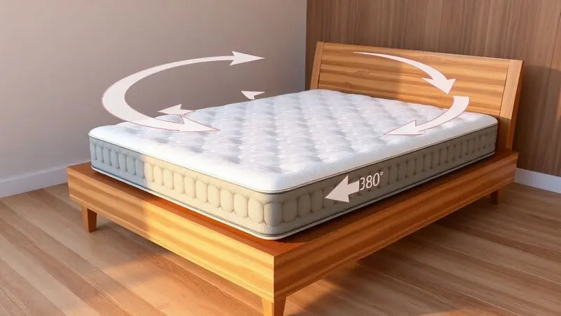

Você finalmente investiu em um sono de qualidade e o seu novo colchão Emma acabou de chegar.

É natural sentir aquela empolgação para testá-lo imediatamente, mas o processo de desembalagem e os cuidados nas primeiras horas são cruciais para a durabilidade e o conforto do produto.

Imagine abrir a caixa e ver seu colchão começando a "acordar", expandindo-se lentamente enquanto você planeja onde colocará essa nova base para suas melhores noites.

Neste guia definitivo, vamos mostrar exatamente como preparar seu novo colchão, desde a retirada da caixa até as melhores práticas de manutenção que garantem anos de suporte perfeito. Prepare-se para transformar suas noites de sono com as orientações corretas.

<SummaryList products={frontmatter.top_products} />

## Passo a Passo Prático: Como Desembalar o Colchão Emma

<ProductBox 
  title={frontmatter.top_products[0].title} 
  image={frontmatter.top_products[0].image} 
  link={frontmatter.top_products[0].link} 
/>

Desembrulhar seu colchão Emma é uma tarefa simples que você pode fazer em poucos minutos, mas com atenção aos detalhes que garantem o melhor resultado.

A sequência abaixo não apenas descreve os passos técnicos, mas transforma cada etapa em uma experiência preparativa para o conforto que você vai conquistar.

### 1. Posicionamento e Retirada da Caixa

Antes mesmo de abrir a caixa, pense no espaço onde seu colchão vai ficar. Escolha uma área espaçosa e limpa no quarto, livre de objetos que possam interferir na expansão.

Ao retirar o colchão da caixa, tenha cuidado com objetos cortantes que podem danificar o produto, e uma dica prática é colocar a caixa em pé e deslizar o colchão para fora com gentileza.

Com o colchão já fora da caixa, ele deve ser desenrolado em sua base correta, tomando cuidado para que ele possa se expandir completamente e atingir sua forma ideal.

### 2. O Corte de Segurança do Plástico a Vácuo

Agora, o momento mais delicado. O corte do plástico a vácuo é crucial, e você deve utilizar uma tesoura ou faca com cuidado para evitar danos ao colchão.

Ao realizar o corte, faça isso nas laterais do plástico e evite cortes profundos que possam atingir o material interno. Depois de cortar, o colchão começará a desinflar rapidamente, voltando à sua forma original.

É o momento em que você literalmente "dá vida" ao produto, liberando-o da compressão que permitiu o transporte.

### 3. O Processo de Expansão Automática

Quando você retira o colchão da embalagem, ele começa a se expandir instantaneamente, como um organismo que finalmente pode respirar livremente.

Geralmente, é recomendável deixá-lo em um ambiente arejado para que o ar possa circular e ajudar na sua expansão total, o que pode levar algumas horas. Durante esse tempo, é normal que o colchão solte um leve odor, mas isso é temporário e desaparece com a ventilação.

Não tenha pressa: seu colchão precisa desse período de 24 a 48 horas para "acordar" completamente e oferecer o máximo conforto. Após a expansão completa, você verá como o colchão toma forma e proporciona um conforto ideal para suas noites de sono.

## Cuidados Vitais nos Primeiros Dias

Nos primeiros dias com seu colchão Emma, é essencial dar-lhe espaço para se adaptar ao novo ambiente. Imagine que ele está se ajustando não apenas físicamente, mas também ao espaço que vai ser seu lar para os próximos anos.

### Por que é essencial arejar o colchão após abrir?

Arejar o colchão após a abertura é mais que um passo técnico, é um ritual de preparação. Durante o processo de fabricação e embalagem, ele pode acumular umidade e odores.

Ao deixá-lo em um local arejado por algumas horas, você permite que qualquer resíduo de umidade evapore e que o ar fresco remova possíveis odores indesejados. Além disso, essa prática ajuda a ativar a espuma do colchão, permitindo que ela recupere sua forma ideal.

Assim, você garante não apenas mais conforto, mas também uma melhor experiência de sono desde o primeiro dia.

### Como lidar com o "cheiro de novo" (Off-gassing)

Você pode sentir um leve aroma quando desembala o colchão, frequentemente descrito como "cheiro de novo".

Esse odor é causado pela liberação de compostos orgânicos voláteis durante o processo de fabricação, e é apenas o último suspiro do processo antes do produto estar totalmente pronto.

Para lidar com isso, areje o colchão em um ambiente bem ventilado por algumas horas ou até dias. Embora possa ser incômodo no início, essa fase geralmente diminui rapidamente e não representa riscos à saúde quando bem ventilado.

É como um perfume que desaparece, deixando apenas o conforto.

## Manutenção e Longevidade: Como cuidar do seu Emma

Para garantir que seu colchão Emma seja um companheiro duradouro para suas noites de sono, alguns cuidados simples fazem toda diferença. Evite pular em cima dele, utilize uma base adequada e aspire regularmente para manter a higiene.

### Precisa virar o colchão Emma? Entenda a regra do giro

Uma das vantagens que simplifica sua vida: você não precisa se preocupar em virar o colchão Emma completamente. A empresa recomenda apenas rotacioná-lo a cada três meses para garantir um desgaste uniforme.

Isso ajuda a manter a performance do material de forma consistente ao longo do tempo. Portanto, você pode relaxar e desfrutar da sua cama sem se preocupar com essa tarefa doméstica adicional.

### Escolhendo a Cama Ideal: Bases e Estruturas Recomendadas

<ProductBox 
  title={frontmatter.top_products[1].title} 
  image={frontmatter.top_products[1].image} 
  link={frontmatter.top_products[1].link} 
/>

Os colchões Emma são projetados para se adequar a diversas bases e estruturas, mas para garantir o melhor desempenho, é fundamental escolher uma que ofereça suporte adequado e ventilação.

As estruturas de cama da Emma, por exemplo, são desenvolvidas especificamente para maximizar a estabilidade e o conforto do colchão, eliminando ruídos e distribuindo o peso de maneira uniforme.

Entre as opções recomendadas estão os estrados de madeira e boxes que proporcionam um bom suporte, além das estruturas de cama Emma, que combinam design moderno e funcionalidade.

Embora sejam ideais para os colchões da marca, muitos consumidores também utilizam estrados elétricos ou fixos com ripas para um toque extra de conforto.

Uma leve ressalva é que nem todas as bases externas se encaixam perfeitamente, então garantir a compatibilidade é essencial para aproveitar ao máximo sua experiência com o colchão Emma.

### A Importância do Protetor de Colchão Emma

<ProductBox 
  title={frontmatter.top_products[2].title} 
  image={frontmatter.top_products[2].image} 
  link={frontmatter.top_products[2].link} 
/>

O Protetor de Colchão Emma não é apenas uma capa, é um guardião invisível que protege seu investimento. Ele oferece uma proteção robusta contra líquidos, sujeira e ácaros, graças à sua tecnologia de impermeabilização e características hipoalergênicas.

Feito em 100% poliéster, seu toque macio proporciona conforto adicional durante o sono, enquanto o sistema AllergyShield ajuda a prevenir alergias, tornando-o ideal para quem tem sensibilidades.

Embora seja um investimento válido para manter seu colchão em condições ideais, vale lembrar que, como qualquer protetor, ele deve ser lavado com frequência para garantir sua eficácia.

Isso pode ser um pouco trabalhoso, mas a durabilidade e o conforto que ele proporciona compensam essa pequena inconveniência. Com uma boa manutenção, o protetor não só aumenta a longevidade do colchão, mas também contribui para um ambiente de sono mais saudável e limpo.

## Perguntas Frequentes sobre o Unboxing e Uso Inicial

Ao desembalar seu colchão Emma, é normal sentir dúvidas sobre o processo. Essas questões são comuns e têm respostas simples que garantem sua tranquilidade.

### Posso dormir no colchão logo após desembalar?

Após desembalar seu colchão Emma, é recomendável dar-lhe um tempo para se adaptar. Geralmente, é sugerido deixar o colchão arejando por pelo menos 4 a 8 horas antes de usar.

Durante esse período, o material também poderá liberar odores, o que é normal e deve desaparecer rapidamente. Assim que estiver totalmente expandido e arejado, você pode aproveitar uma boa noite de sono sem preocupações.

### O que fazer se as pontas do colchão demorarem a subir?

Se você perceber que as pontas do seu colchão Emma estão demorando a subir após o desembalo, não se preocupe, isso pode acontecer.

Primeiramente, deixe o colchão em um ambiente bem ventilado e com temperatura amena, já que o calor ajuda a espuma a expandir mais rapidamente. Além disso, tente massagear suavemente as áreas que estão mais comprimidas.

Se, após algumas horas, ainda houver partes baixas, deixe o colchão descansar por mais tempo; geralmente, ele se ajusta totalmente em até 48 horas.

## Conclusão

Desembalar e preparar seu colchão Emma é mais que um processo técnico: é o início de uma relação duradoura com o seu sono. Cada passo cuidadoso - desde a retirada da caixa até os primeiros dias de adaptação - contribui para anos de conforto e apoio.

A escolha de bases adequadas, o uso do protetor e os simples cuidados de manutenção transformam seu investimento em uma experiência que se renova cada noite.

Ao seguir essas orientações, você não apenas preserva a qualidade do produto, mas também cria o ambiente perfeito para noites verdadeiramente reparadoras. Agora, com seu colchão preparado e ajustado, você está pronto para descobrir o que realmente significa dormir bem.