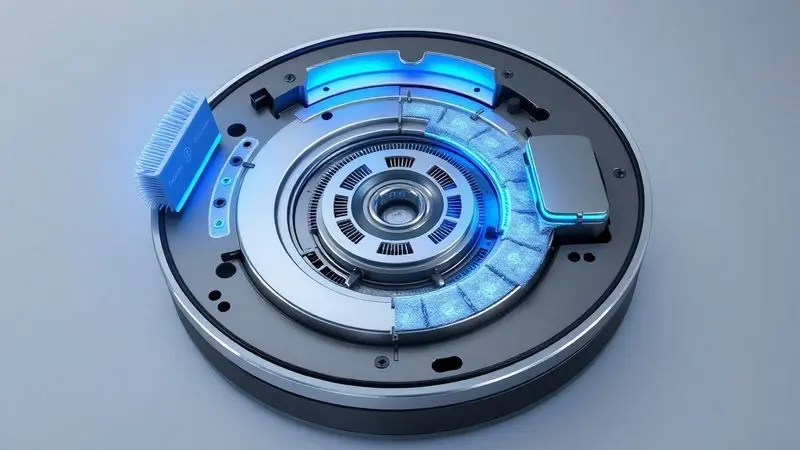
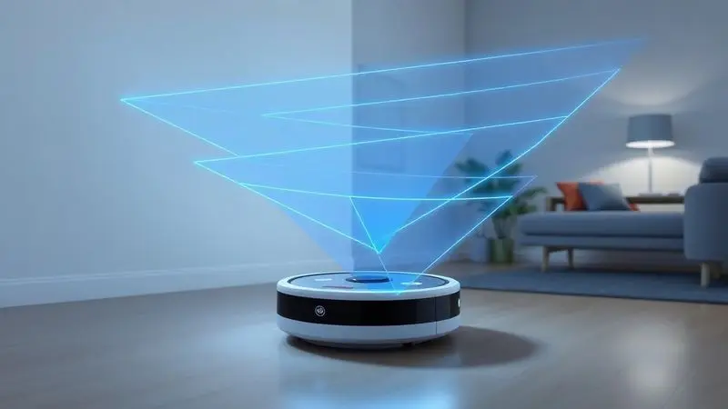
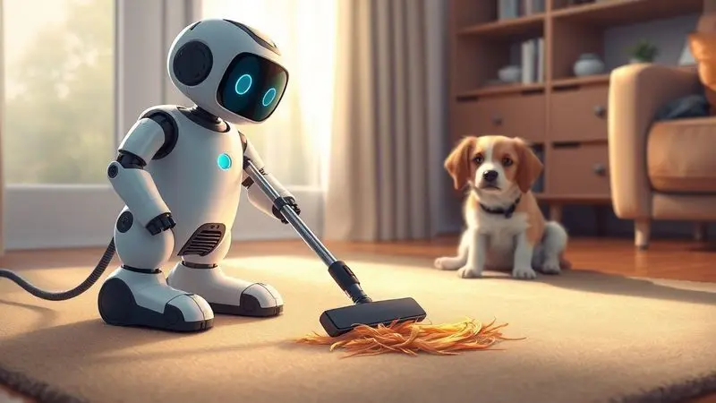
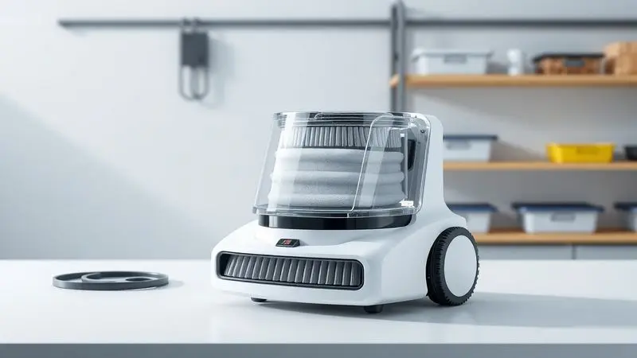

Manter a casa limpa todos os dias parece uma tarefa impossível com a rotina agitada, não é mesmo? Se você busca praticidade e eficiência, o aspirador de pó robô 3 em 1 surge como a solução definitiva para automatizar o serviço doméstico.

Mas será que ele realmente substitui a limpeza manual?

Neste guia completo, você vai entender exatamente como funciona essa tecnologia que varre, aspira e passa pano, conhecer os principais benefícios para sua saúde e descobrir quais são os critérios essenciais para [escolher o modelo ideal](/melhores-robos-aspiradores-2023/) para o seu lar.

Prepare-se para dar adeus à vassoura e ganhar mais tempo para o que realmente importa.

<SummaryList products={frontmatter.top_products} />

## O que é um Aspirador de Pó Robô 3 em 1?

Imagine acordar sabendo que seu piso já está limpo, sem você ter levantado um dedo. Essa é a promessa do [aspirador robô 3 em 1](/robo-aspirador-obabox-e-bom/), um verdadeiro assistente doméstico que combina três tarefas em um só aparelho.

Ele não só aspira, mas também [varre e passa pano](/robo-aspirador-3-em-1-qual-o-melhor/), transformando aquela obrigação diária em uma tarefa automatizada que acontece enquanto você cuida da sua vida.

### Entenda as 3 Funções: Varre, Aspira e Passa Pano (MOP)

A mágica começa com a varredura, onde o robô remove aquelas migalhas do café da manhã e a poeira que insiste em se acumular.

Em seguida, a aspiração entra em cena para capturar as partículas mais finas, aquelas que nem percebemos, mas que comprometem a qualidade do ar que respiramos. E a cereja do bolo?

A [função mop](/aspirador-robo-philco-pas28p-funcao-mop-bivolt-e-bom/), que umedece delicadamente o piso e remove manchas, deixando um brilho que parece recém-limpado. O resultado é uma limpeza completa que você apenas supervisiona, não executa.

## 5 Vantagens de Ter um Robô Aspirador na Sua Rotina

Ter um desses aliados em casa vai além da simples limpeza. É sobre recuperar tempo e paz de espírito. Você programa o horário ideal (enquanto trabalha, dorme ou se exercita) e chega em casa com os pisos impecáveis.

Os sensores inteligentes garantem que ele navegue sozinho, evitando quedas e obstáculos, enquanto alcança aqueles cantos debaixo do sofá que você nunca limpa. E o melhor: muitos modelos se conectam ao seu celular, permitindo controlar tudo à distância.

É como ter um funcionário dedicado à limpeza, disponível 24 horas por dia.

## Como Escolher o Melhor Aspirador de Pó Robô 3 em 1?

A escolha certa transforma um aparelho em um parceiro de casa. Comece entendendo suas necessidades específicas: você tem pets? Piso predominantemente liso ou carpetes? Espaço grande ou apartamento compacto?

Cada detalhe técnico que você vai conhecer a seguir se traduz em benefícios concretos para o seu dia a dia.

### Poder de Vácuo (Sucção) e Nível de Ruído

Pense na potência de sucção como a capacidade do robô de capturar tudo, desde pelos de animais até aquela areia fina que entra da rua. Em carpetes, essa característica é ainda mais crucial. Mas potência não precisa significar barulho.

Modelos mais avançados operam com uma discrição impressionante, permitindo que ele trabalhe enquanto você faz uma videoconferência ou assiste seu filme favorito sem interrupções. O equilíbrio entre eficiência e silêncio é onde mora a excelência.

### Autonomia da Bateria e Carregamento Automático

Nada mais frustrante do que o robô parar no meio da limpeza porque a bateria acabou. Por isso, a autonomia de 60 a 120 minutos dos melhores modelos garante que ele complete o serviço na maioria das casas. E quando a energia está baixa?

Ele simplesmente [retorna sozinho à base](/como-carregar-aspirador-robo/) para recarregar, como um cachorrinho que sabe a hora de voltar para casa. Essa inteligência elimina completamente uma preocupação da sua lista.

### Tecnologia de Sensores e Mapeamento Inteligente (Anti-queda e Colisão)

Essa é a tecnologia que transforma um simples robô em um navegador experiente. Com sensores infravermelhos e câmeras, ele mapeia seu ambiente, reconhece mudanças de nível (como escadas) e desvia de móveis e objetos. O resultado?

Você pode confiar que ele trabalhará sozinho, sem riscos de danos à sua mobília ou a si mesmo. É a segurança que permite a verdadeira automatização.

### Capacidade dos Reservatórios de Pó e Água

O reservatório de pó (geralmente entre 0,3L e 0,6L) determina quantos dias você pode deixar o robô trabalhando sem precisar esvaziá-lo. Já o tanque de água (0,2L a 0,5L) é suficiente para aquela limpeza úmida rápida que mantém o piso sempre apresentável.

Para casas maiores, modelos com capacidades maiores significam menos intervenções sua, mais autonomia real.

## Aspirador Robô para Quem Tem Pets: O Que Observar?

Se você compartilha sua casa com animais de estimação, sabe que pelos são um desafio constante. Procure por potência de sucção extra forte, escovas especiais anti-emaranhamento (que evitam que os pelos enrosquem) e filtros HEPA eficientes.

Esses filtros não só capturam os pelos, mas também as caspas e outros alérgenos, melhorando significativamente a qualidade do ar para toda a família, incluindo quem sofre com alergias.

## Melhores Modelos de Aspirador de Pó Robô 3 em 1 para 2024

O mercado oferece opções para todos os perfis, desde quem busca tecnologia de ponta até quem prioriza o custo-benefício. Conhecer as particularidades de cada modelo ajuda a encontrar aquele que realmente se encaixa no seu estilo de vida.

### WAP ROBOT WCONNECT: Conectividade e Controle por Voz

<ProductBox 
  title={frontmatter.top_products[0].title} 
  image={frontmatter.top_products[0].image} 
  link={frontmatter.top_products[0].link} 
/>

Imagine comandar a limpeza da sua casa apenas com a voz. "Alexa, ligue o robô aspirador". Essa é a realidade do WCONNECT, compatível com os principais assistentes virtuais.

O aplicativo no celular completa a experiência, permitindo agendar limpezas e acompanhar o progresso.

Embora não tenha o mapeamento mais avançado do mercado, sua trajetória ainda é eficiente para a manutenção diária, especialmente se você valoriza a conveniência do controle inteligente.

### WAP ROBOT WSMART: Eficiência com Varredura Central

<ProductBox 
  title={frontmatter.top_products[1].title} 
  image={frontmatter.top_products[1].image} 
  link={frontmatter.top_products[1].link} 
/>

Com três modos de limpeza e função turbo para situações mais desafiadoras, o WSMART é um verdadeiro multifuncional. Seu design slim alcança cantos escondidos, enquanto o filtro HEPA é um aliado precioso para quem tem alergias.

A autonomia de 2 horas é generosa, mas atenção: o tempo de recarga pode chegar a 6 horas. Para [quem tem pets](/melhor-robo-aspirador-para-quem-tem-pet/), sua eficiência na remoção de pelos compensa essa pausa mais longa.

### WAP Robot W90: O Melhor Custo-Benefício de Entrada

<ProductBox 
  title={frontmatter.top_products[2].title} 
  image={frontmatter.top_products[2].image} 
  link={frontmatter.top_products[2].link} 
/>

Para quem está começando no mundo da automação doméstica, o W90 oferece o essencial com qualidade. Suas 1h40 de autonomia são perfeitas para apartamentos menores, e os 8cm de altura garantem acesso sob praticamente qualquer móvel.

O reservatório de 250mL pode exigir esvaziamento mais frequente em casas grandes, mas o filtro HEPA lavável representa uma economia a longo prazo e um ar mais limpo.

### WAP ROBOT W100: Simplicidade e Agilidade no Dia a Dia

<ProductBox 
  title={frontmatter.top_products[3].title} 
  image={frontmatter.top_products[3].image} 
  link={frontmatter.top_products[3].link} 
/>

Com apenas 7,5cm de altura, o W100 é o especialista em lugares apertados. Suas escovas laterais giratórias garantem que nenhum canto fique sem atenção.

A autonomia de 1h40 atende bem espaços compactos, e embora exija carregamento manual (sem base própria), sua agilidade e preço acessível fazem dele um companheiro prático para o dia a dia.

### WAP ROBOT W400: Especialista em Lavar o Piso

<ProductBox 
  title={frontmatter.top_products[4].title} 
  image={frontmatter.top_products[4].image} 
  link={frontmatter.top_products[4].link} 
/>

Se a limpeza úmida é sua prioridade, o W400 se destaca. Com sensores que evitam obstáculos e quedas, ele opera com segurança total. O controle por aplicativo e assistentes de voz traz modernidade, enquanto o filtro HEPA retém 99% das impurezas.

No modo turbo a bateria pode durar menos, mas o retorno automático à base mantém a praticidade intacta.

## Dicas de Manutenção para Aumentar a Vida Útil do Seu Robô

Um pouco de cuidado garante anos de parceria. [Limpe os filtros mensalmente](/como-limpar-o-robo-aspirador-wap/) para manter a sucção potente. Verifique regularmente as escovas e rodas, removendo fios e pelos acumulados. Mantenha os sensores livres de poeira para uma navegação precisa.

E sempre armazene seu robô em local seco, longe da umidade. São minutos de atenção que resultam em anos de serviço fiel.

## Dúvidas Frequentes sobre Robôs Aspiradores 3 em 1

A autonomia de cerca de 90 minutos atende bem a maioria dos ambientes residenciais. A conectividade com aplicativos realmente simplifica a programação.

Em carpetes muito espessos ou com sujeira pesada, alguns modelos podem precisar de passes extras, mas para a manutenção diária em pisos lisos, são imbatíveis. Avalie suas necessidades específicas: quantos metros quadrados? Quantos animais? Tipo predominante de piso?

As respostas guiarão sua escolha perfeita.

## Conclusão: Vale a Pena Investir em um Robô 3 em 1?

Investir em um aspirador robô 3 em 1 é investir em tempo, saúde e qualidade de vida. Ele transforma uma tarefa diária em um processo automático, liberando horas preciosas da sua semana.

Para ambientes com pisos lisos e limpeza de manutenção, ele é praticamente insubstituível. Mesmo em casas com carpetes ou sujeira mais desafiadora, ele reduz drasticamente a frequência da limpeza manual pesada.

O retorno vai além do piso limpo: é a tranquilidade de chegar em casa e encontrar tudo em ordem, a melhora na qualidade do ar, a redução do estresse com tarefas domésticas.

Se você valoriza seu tempo e busca praticidade real no dia a dia, a resposta é um claro e convincente sim. Dê o primeiro passo para automatizar sua limpeza e redescubra o prazer de ter uma casa sempre impecável, sem esforço.