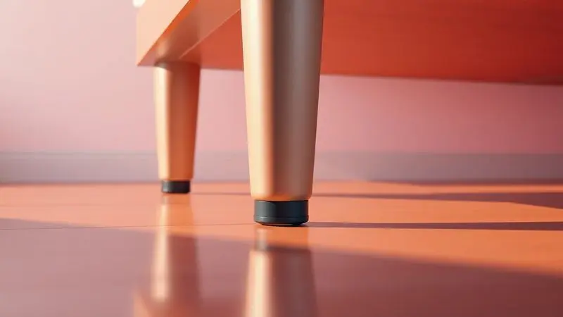

Imagine acordar no meio da noite e sentir sua cama literalmente 'andando' pelo quarto. Ou perceber que o colchão decidiu fazer uma migração silenciosa para o lado enquanto você dorme.

Essa frustração é mais comum que você imagina, especialmente em camas box e quartos com pisos laminados ou frios. Mas você não precisa conviver com essa sensação de instabilidade que rouba seu descanso.

Aqui vamos apresentar soluções definitivas, desde truques simples até métodos mais robustos, para que sua única preocupação à noite seja realmente dormir.

<SummaryList products={frontmatter.top_products} />

## Por que o colchão e a cama box escorregam tanto?

O deslizamento do colchão tem causas que você pode identificar rapidamente. A falta de atrito entre superfícies é a principal culpada: muitas bases box têm acabamentos tão lisos que não oferecem nenhuma 'pegada' ao colchão.

Combine isso com seus movimentos naturais durante o sono, virar, ajustar posição, e você tem um cenário perfeito para a migração. O peso e densidade do colchão também influenciam: modelos mais leves são como folhas à espera de qualquer impulso para se deslocar.

Entender essas causas é o primeiro passo para conquistar a estabilidade que seu sono merece.

## Parte 1: Como evitar que o colchão deslize sobre a base (Cama Box)

Quando o colchão decide fazer sua própria dança sobre a base, você precisa de soluções que criam uma conexão firme. Protetores antiderrapantes, fitas específicas ou almofadas de borracha podem transformar essa relação superficial em um compromisso duradouro.

### 1. Use tiras de velcro adesivas nos cantos

<ProductBox 
  title={frontmatter.top_products[0].title} 
  image={frontmatter.top_products[0].image} 
  link={frontmatter.top_products[0].link} 
/>

Essas tiras são como pequenos guardiões que mantêm tudo em ordem. Aplicadas nos cantos do colchão e da base, elas criam uma conexão quase invisível que resiste aos movimentos mais intensos do sono.

Você tem opções: velcro em rolo que você pode cortar na medida exata ou tiras pré-cortadas que já vem dimensionadas para sua cama.

A força adesiva varia entre modelos, então escolha aquelas descritas como 'extra forte' para garantir que o compromisso não seja rompido.

A aplicação é tão simples que não requer ferramentas, apenas sua atenção para posicionar cada tira como um ponto estratégico de segurança. O resultado? Uma cama que permanece como você planejou, sem surpresas durante a noite.

### 2. Tela ou tapete antiderrapante emborrachado entre o colchão e o box

<ProductBox 
  title={frontmatter.top_products[1].title} 
  image={frontmatter.top_products[1].image} 
  link={frontmatter.top_products[1].link} 
/>

Imagine uma membrana discreta que se coloca entre o colchão e a base, aumentando a aderência como um abraço firme. Tapetes emborrachados com texturas ou ventosas mantêm tudo no lugar, enquanto telas podem ser cortadas para se adaptar perfeita ao seu espaço.

Esses acessórios não apenas impedem o deslizamento; eles também criam uma camada de proteção.

Alguma manutenção é necessária, uma limpeza regular para remover poeira, mas essa pequena atenção é compensada pela tranquilidade de saber que seu colchão não fará movimentos independentes. Durabilidade e praticidade se unem aqui para oferecer estabilidade constante.

### 3. Instalação de travas metálicas laterais (Estabilizadores)

<ProductBox 
  title={frontmatter.top_products[2].title} 
  image={frontmatter.top_products[2].image} 
  link={frontmatter.top_products[2].link} 
/>

Para quem busca uma solução mais permanente, as travas metálicas são estruturas de resistência. Feitas de metal robusto, elas funcionam como barreiras físicas que bloqueiam qualquer movimento lateral do colchão.

Modelos incluem barras retentoras fixadas na estrutura da cama, cantoneiras e chapas de união, especialmente eficazes em camas box bipartidas.

A instalação requer algum esforço inicial, mas esse investimento de tempo se transforma em anos de liberdade: você nunca mais se preocupará com escorregamentos. Com custo relativamente baixo, sua cama ganha uma solidez que transmite segurança física e emocional.

### 4. Capas protetoras com textura aderente

<ProductBox 
  title={frontmatter.top_products[3].title} 
  image={frontmatter.top_products[3].image} 
  link={frontmatter.top_products[3].link} 
/>

Essas capas são aliadas duplas: protegem e fixam. Além da superfície antideslizante que mantém o colchão firme, elas também defendem contra líquidos, sujeira e ácaros, criando um ambiente mais saudável para seu sono.

Materiais como algodão ou tecidos impermeáveis oferecem conforto sem sacrificar funcionalidade.

Elásticos reforçados nas extremidades garantem uma fixação quase militar, enquanto a eficácia da aderência varia entre modelos, escolha aqueles com textura mais pronunciada.

A facilidade de colocação e lavagem torna essas capas especialmente práticas para lares com crianças ou animais, onde proteção e estabilidade são prioridades.

## Parte 2: Como parar a cama box de escorregar no piso liso (Laminado ou Porcelanato)

Quando toda a estrutura, colchão e base, decide se mover sobre pisos lisos, você precisa soluções que ancoram o conjunto. Tapetes antiderrapantes criam essa conexão com o piso, enquanto calços de borracha ou fita específica oferecem pontos de apoio estratégicos.

### 5. Higienização: O segredo está na limpeza dos pés e do chão

A poeira e sujeira acumuladas são sabotadores silenciosos da estabilidade. Elas reduzem a aderência entre materiais, criando uma camada que facilita o deslizamento.

Limpar os pés da cama com um pano úmido e detergente suave, combinado com vassoura ou aspirador no chão, restaura a conexão natural entre superfícies.

Essa prática não apenas conquista estabilidade; também promove um ambiente mais saudável, livre de alérgenos que podem afetar seu sono. Incorporar essa rotina na sua limpeza é um cuidado duplo: para seu móvel e para seu bem-estar.

### 6. Copinhos de silicone ou protetores de borracha para os pés da cama

<ProductBox 
  title={frontmatter.top_products[4].title} 
  image={frontmatter.top_products[4].image} 
  link={frontmatter.top_products[4].link} 
/>

Esses pequenos guardiões são soluções multifuncionais. Além de evitar que sua cama escorregue, eles protegem o piso contra arranhões e marcas, especialmente importantes em superfícies delicadas como madeira e cerâmica.

Eles também atuam como amortecedores, reduzindo ruídos e tornando movimentos mais silenciosos.

Em pisos extremamente escorregadios, sua eficácia pode ser limitada, mas na maioria dos ambientes eles oferecem aderência suficiente para garantir estabilidade.

A instalação é simples, a limpeza facilitada, e o resultado é segurança especialmente valiosa em lares com crianças ou idosos. São acessórios que consolidam não apenas seu móvel, mas também sua tranquilidade.

### 7. Uso de tapetes ou passadeiras sob a base da cama

<ProductBox 
  title={frontmatter.top_products[5].title} 
  image={frontmatter.top_products[5].image} 
  link={frontmatter.top_products[5].link} 
/>

Esta solução alia funcionalidade com estilo. Tapetes sob a base não apenas melhoram a estética do quarto, acrescentando conforto e sofisticação, mas também oferecem isolamento térmico e acústico.

Um tapete de qualidade protege o piso de danos, cria uma superfície mais agradável ao sair da cama e, com base antiderrapante, minimiza riscos de acidentes.

A acumulação de poeira requer limpeza regular para evitar problemas respiratórios, mas esse cuidado é compensado pelo ambiente criado. Se você busca unir segurança e elegância no seu espaço de descanso, um bom tapete pode ser essa ponte entre estabilidade e estilo.

## Dica extra: O que fazer quando o Pillow Top está deslizando?

<ProductBox 
  title={frontmatter.top_products[6].title} 
  image={frontmatter.top_products[6].image} 
  link={frontmatter.top_products[6].link} 
/>

Se seu pillow top também participa da dança de deslocamento, soluções específicas podem trazer ordem. Um tecido antiderrapante entre colchão e pillow top, como material de borracha, cria uma conexão que mantém tudo no lugar.

A medida pode exigir atenção para encontrar o tamanho adequado, mas o resultado é um conjunto que funciona como uma unidade.

Lençóis com elásticos ajustam melhor e evitam deslizamentos, enquanto alguns modelos de pillow top já incluem elásticos laterais para fixação facilitada. Tiras de Velcro oferecem personalização para quem busca solução perfeita para seu caso.

Com essas opções, você conquista não apenas estabilidade física, mas também a tranquilidade mental de saber que cada componente está onde deveria estar.

## Erros comuns: O que você NUNCA deve fazer para travar o colchão

Algumas tentativas podem transformar o problema em situação mais grave. Fita adesiva comum é risco certo: ela pode deixar resíduos permanentes e danificar superfícies do colchão e da cama.

Ignorar a limpeza antes de aplicar soluções é outro erro, sujeira impede que borrachas ou fitas antiderrapantes criem a conexão necessária.

Desconsiderar o peso do colchão ao escolher método de fixação resulta em solução ineficaz que se desfaz com o tempo. Cada decisão deve considerar estabilidade e segurança do seu sono, não apenas como fixação mecânica, mas como garantia de descanso verdadeiro.

## Quando considerar a troca da base box por um modelo com tecido antiderrapante?

Se escorregamentos são frequentes e causam desconforto constante, trocar a base pode ser transformação radical. Modelos com tecido antiderrapante oferecem aderência integrada que evita deslocamentos, resultando em sono mais tranquilo.

Para lares com crianças ou pets, essa segurança extra é benefício que transcende funcionalidade.

A decisão também envolve durabilidade e estilo do seu quarto, uma nova base pode inspirar reavaliação da decoração, criando ambiente mais coerente. Quando soluções temporárias não resolvem, essa mudança permanente pode ser o caminho para estabilidade definitiva.

## Perguntas Frequentes (FAQ) sobre colchões que escorregam

A falta de atrito entre colchão e base é causa principal, especialmente em superfícies lisas. Soluções definitivas existem: tapetes antiderrapantes ou fitas adesivas específicas são eficazes quando aplicadas com atenção.

Mantenha a cama em espaço sem movimentação excessiva e considere escolha do colchão adequado ao seu estilo de vida para minimizar inconvenientes futuros.

## Conclusão

O deslizamento do colchão não é apenas inconveniente físico; é distração que invade seu descanso, transformando o momento de repouso em preocupação constante.

As soluções apresentadas aqui, desde tiras de Velcro discretas até travas metálicas robustas, não são apenas métodos técnicos. São formas de reconquistar a estabilidade emocional do seu sono.

Cada opção oferece caminho diferente: algumas são ajustes simples que você pode fazer hoje, outras requerem investimento mais significativo.

Mas todas convergem no mesmo objetivo: criar ambiente onde você pode descansar verdadeiramente, sem antecipar movimentos surpresa da sua cama.

Seu sono merece essa atenção. Comece identificando qual solução corresponde melhor à sua situação e experiência. A transformação não é apenas sobre fixar um móvel; é sobre fixar sua tranquilidade.