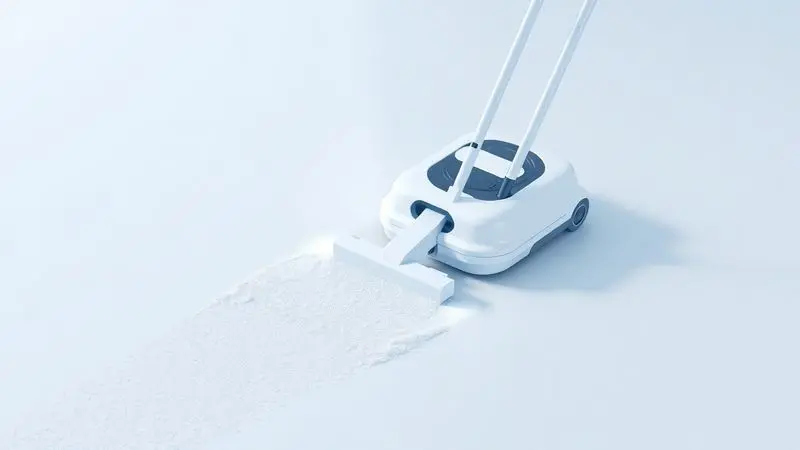
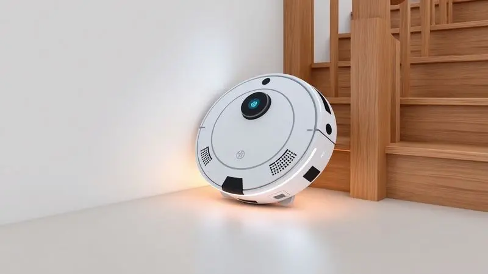
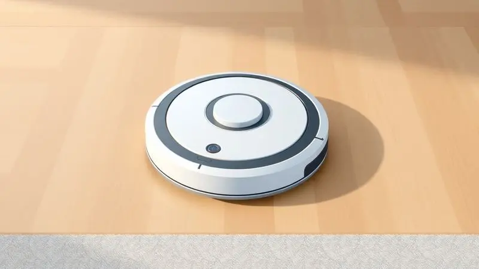

Manter a casa limpa todos os dias parece uma tarefa impossível com a rotina agitada, e você provavelmente já se perguntou se um robô aspirador poderia ser a solução definitiva.

A Oster, marca renomada em eletroportáteis, entrou com força nesse mercado prometendo eficiência e praticidade. Mas será que o aspirador robô Oster é bom de verdade ou apenas mais um acessório encostado no canto da sala?

Neste artigo, vamos analisar tecnicamente os modelos Keep Clean e Ultra Slim, comparar o desempenho real em diferentes tipos de piso e revelar se o investimento [vale a pena](/como-resetar-aspirador-robo-philco/) para o seu perfil de uso.

<SummaryList products={frontmatter.top_products} />

## Análise do Oster Keep Clean: O Modelo Mais Completo

<ProductBox 
  title={frontmatter.top_products[0].title} 
  image={frontmatter.top_products[0].image} 
  link={frontmatter.top_products[0].link} 
/>

Imagine chegar em casa após um dia corrido e encontrar os pisos limpos, sem ter movido um dedo. É essa promessa que o Aspirador Robô Oster Keep Clean tenta cumprir.

Com 20W de potência, ele não é apenas um robô, é um parceiro silencioso que trabalha enquanto você descansa. Seu filtro HEPA captura 99,9% das partículas, transformando a limpeza em uma questão de saúde, especialmente para quem sofre com alergias.

A autonomia de 1 a 2 horas é suficiente para apartamentos médios, e a função de retorno automático à base faz com que ele sempre esteja pronto para o próximo serviço.

O design redondo e moderno esconde uma inteligência prática. Programe horários específicos e ele acorda sozinho para trabalhar.

Quando a bateria fica baixa (autonomia de 1 a 2 horas), ele retorna obedientemente à base, como um cachorro bem treinado voltando para sua casinha.

Sim, o reservatório pode encher rápido com poeira grossa, mas para manutenção diária em pisos cerâmicos, ele é um aliado fiel.

### Potência de Sucção e os 4 Modos de Limpeza

Mas o que realmente impressiona no Keep Clean é sua versatilidade. Ele entende que cada dia tem uma necessidade diferente. No modo automático, ele patrulha sua casa como um guarda noturno, cobrindo cada centímetro. Encontrou uma área com migalhas após o café da manhã?

O modo spot concentra toda sua potência nesse ponto específico.

Já reparou como a poeira adora se acumular nos cantos? O modo bordas foi feito para isso, garantindo que nem mesmo os espaços mais apertados escapem. E a cereja do bolo: a programação.

Você define que ele limpe às 10h, quando já saiu para trabalhar, e volta para casa com o chão impecável. É tecnologia servindo sua rotina, não o contrário.

### Função Mop: O diferencial do reservatório de água

Aqui está o truque que transforma um bom robô em um excepcional. Enquanto aspira, o Keep Clean também pode passar pano. Seu [reservatório de água](/o-que-colocar-no-robo-aspirador-para-passar-pano/) com umedecimento controlado significa que você elimina poeira e sujeira incrustada em uma única passada.

Acabou aquele trabalho duplo de aspirar primeiro e depois passar pano. O tanque é fácil de encher e esvaziar, tornando a operação tão simples quanto trocar um filtro de café.

### Sensores Anti-Queda e Anti-Colisão: Como eles protegem seus móveis

Seu maior medo é ver seu investimento rolando escada abaixo? Os sensores anti-queda do Keep Clean são como um sistema de freios de emergência. Eles detectam desníveis e param instantaneamente, protegendo tanto o robô quanto sua tranquilidade.

Já os sensores anti-colisão funcionam como olhos digitais que enxergam móveis e paredes antes do impacto. Seu sofá não será mais um campo de batalha, mas parte do percurso seguro que seu robô aprende a respeitar.

## Oster Ultra Slim: Compacto e Eficiente para Espaços Apertados

<ProductBox 
  title={frontmatter.top_products[1].title} 
  image={frontmatter.top_products[1].image} 
  link={frontmatter.top_products[1].link} 
/>

Para quem vive em apartamentos pequenos ou tem móveis baixos, altura é mais do que um número, é uma questão de acesso. Com menos de 7 cm de altura, o Oster Ultra Slim é o espião que entra onde outros não conseguem.

Ele desliza sob sua cama, seu sofá, sua estante baixa, caçando a poeira que você nunca vê mas sempre sente nos espirros matinais.

Seu sistema triplo de escovas trabalha em conjunto com um mop integrado, criando um efeito de varrição e limpeza úmida simultânea. O filtro HEPA torna-o um aliado contra ácaros, perfeito para quem tem alergias.

A autonomia de até 2 horas pode parecer limitada, mas para espaços compactos, é mais do que suficiente. E quando a energia acaba, ele retorna automaticamente à base, pronto para a próxima missão.

### Design e Altura: Ele realmente passa sob sofás e camas?

A resposta é um sim sem hesitação. O design do Ultra Slim foi pensado para os cantos esquecidos da sua casa. Aquela poeira que se acumula sob a cama há meses? Ele a alcança. Os restos de biscoito que caíram sob o sofá? Ele os encontra.

Essa capacidade de acesso transforma a limpeza de um exercício de mover móveis pesados em uma operação silenciosa e discreta. Você quase esquece que ele está trabalhando, até ver os resultados.

## Desempenho Prático: Eficácia em Pelos de Pets e Diferentes Pisos

Se você tem animais de estimação, sabe que pelos são uma batalha diária. O Oster enfrenta esse desafio com escovas específicas que capturam pelos antes que eles se espalhem pelo sofá.

Em pisos de madeira, ele é gentil o suficiente para não riscar, mas eficiente o suficiente para remover poeira e sujeira. Em carpetes, ajusta automaticamente a potência para uma sucção mais forte.

Os sensores não apenas evitam quedas, mas também detectam áreas mais sujas, intensificando a limpeza onde você mais precisa. É como ter um limpador que pensa, que adapta sua estratégia ao terreno da sua casa.

## Autonomia da Batoria e Tempo de Recarga: O robô termina o serviço?

Essa é a pergunta que tira o sono de qualquer potencial comprador. A autonomia varia de 60 a 120 minutos, dependendo do modo de limpeza. Para um apartamento de 70m², é tempo suficiente para uma cobertura completa.

Para casas maiores, ele pode precisar de uma pausa para recarregar (4 a 6 horas) antes de continuar.

A beleza está na inteligência: se a bateria acabar no meio do trabalho, ele memoriza onde parou e retoma exatamente dali quando estiver recarregado.

Você não precisa reiniciar o processo, ele simplesmente continua de onde deixou, como um bom funcionário que nunca esquece sua tarefa.

## Comparativo: Oster vs. Concorrentes (Mondial, WAP e Philco)

[Escolher um robô aspirador](/melhores-robo-aspirador-2024/) é como escolher um parceiro de dança: precisa combinar com seu ritmo. A Oster brilha na elegância da operação, com programação intuitiva e modos de limpeza que se adaptam ao seu dia.

A [Mondial e Philco](/aspirador-robo-mondial-e-bom/) podem ser mais acessíveis financeiramente, mas muitas vezes sacrificam durabilidade e funcionalidades avançadas.

[A WAP](/robo-aspirador-wap-e-bom/) compete na força bruta, ideal para ambientes realmente sujos. A Oster, no entanto, entende que limpeza doméstica é sobre consistência, não sobre poder ocasional.

É a diferença entre um lutador de boxe e um dançarino de balé: ambos são atletas, mas um se move com uma graça que preserva seu piso enquanto limpa.

## Vantagens e Pontos Fortes do Aspirador Robô Oster

O maior trunfo da Oster é entender que você não quer apenas um robô, quer um aliado silencioso. Sua navegação inteligente evita o transtorno de ficar preso em cada cadeira.

O baixo nível de ruído significa que ele pode trabalhar enquanto você assiste TV ou conversa ao telefone. A programação transforma a limpeza de uma tarefa em um hábito, como escovar os dentes: acontece automaticamente, sem que você precise pensar.

A capacidade de alcançar lugares difíceis significa que sua casa fica realmente limpa, não apenas superficialmente arrumada. É a diferença entre varrer a sujeira para debaixo do tapete e realmente removê-la do seu ambiente.

## Desvantagens e Limitações: O que você precisa saber antes de comprar

Nenhum produto é perfeito, e honestidade é fundamental. O Oster pode ter dificuldade com tapetes muito altos ou fios soltos que se enrolam em suas escovas. A bateria, embora inteligente, pode não cobrir casas muito grandes em uma única sessão.

Quanto aos pelos de animais, ele é eficiente, mas se você tem cinco gatos de pelo longo, ainda precisará de passes manuais ocasionais.

O maior entendimento necessário é que ele é um mestre da manutenção diária, não um substituto para aquela faxina profunda semestral onde você move todos os móveis.

## Manutenção e Peças de Reposição: É fácil encontrar filtros e escovas?

A beleza de escolher uma marca estabelecida como a Oster é a paz de saber que, quando precisar, as peças estarão disponíveis. Filtros e escovas são fáceis de encontrar tanto em lojas físicas quanto online, geralmente a preços acessíveis.

A manutenção é simples: [limpar o reservatório](/como-limpar-o-robo-aspirador-wap/) regularmente, verificar as escovas por fios enrolados e trocar o filtro conforme indicado. São cuidados que levam minutos por semana, mas garantem anos de serviço fiel.

É como cuidar de uma planta: atenção mínima, retorno máximo.

## Perguntas Frequentes (FAQ)

### O robô aspirador Oster volta sozinho para a base?

Sim, e ver isso acontecer pela primeira vez é quase mágico. Quando a bateria atinge um nível crítico ou ele completa sua programação, ele encontra o caminho de volta sozinho. Você olha e ele está lá, quietinho na base, recarregando para a próxima missão.

É a autossuficiência que transforma um eletrodoméstico em um companheiro.

### Ele funciona bem em tapetes e carpetes?

Funciona, mas com uma ressalva inteligente. Em carpetes baixos e médios, ele ajusta automaticamente a sucção para maior potência. Em tapetes muito altos ou felpudos, pode ter dificuldade. A boa notícia?

Seus sensores geralmente detectam quando uma área é problemática e tentam estratégias diferentes, ou simplesmente a contornam para não ficar preso.

### Qual a diferença real entre o Keep Clean e o Ultra Slim?

Pense neles como irmãos com personalidades diferentes. O Keep Clean é o irmão mais robusto, com potência extra (20W) e uma abordagem mais abrangente. É para quem quer o pacote completo: aspiração forte, função mop e cobertura ampla.

O Ultra Slim é o especialista em penetração. Com sua altura mínima, ele vai onde o Keep Clean não consegue. É a escolha perfeita para apartamentos com móveis baixos ou para quem prioriza acesso completo sobre potência máxima.

Ambos são excelentes, mas servem necessidades ligeiramente diferentes.

## Conclusão

O aspirador robô Oster não é um milagre, mas é o mais próximo que a tecnologia doméstica chegou de um. Ele não substitui completamente a limpeza manual profunda, mas transforma a manutenção diária de uma tarefa cansativa em um processo automático e quase invisível.

Para quem tem uma rotina agitada, animais de estimação, ou simplesmente valoriza seu tempo livre, ele é um investimento que se paga em horas recuperadas. Para donos de casas muito grandes ou com muitos obstáculos complexos, pode exigir ajustes de expectativas.

No final, a pergunta não é se você precisa de um [robô aspirador](/robo-aspirador-midea-e-bom/), mas quanto você valoriza acordar com os pisos limpos sem ter se levantado do sofá.

A Oster, com seus modelos Keep Clean e Ultra Slim, oferece essa possibilidade com a confiabilidade de uma marca que entende que o melhor eletrodoméstico é aquele que você quase esquece que existe, até perceber o trabalho impecável que realizou enquanto você vivia sua vida.