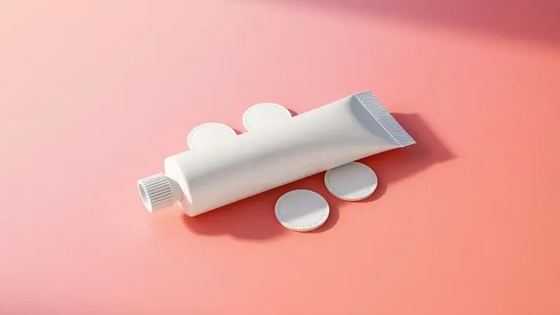
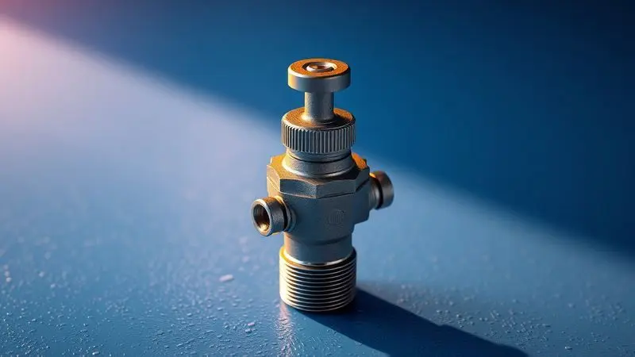

Acordar no meio da noite com as costas no chão porque o colchão inflável esvaziou é uma experiência frustrante que quase todo mundo já passou. A boa notícia é que, na maioria das vezes, o problema tem solução e você mesmo pode resolver em casa sem gastar quase nada.

Neste guia definitivo, você vai aprender não apenas como remendar seu colchão passo a passo, mas também os segredos para identificar furos invisíveis e quais materiais garantem que o conserto não solte na primeira noite de uso.

Prepare-se para recuperar seu conforto e prolongar a vida útil do seu equipamento.

<SummaryList products={frontmatter.top_products} />

## 1. Como Localizar o Vazamento: 3 Métodos Infalíveis

Imagine a cena: você inflou o colchão, deitou confortável e, algumas horas depois, está praticamente no chão de novo. O inimigo é invisível, mas não invencível. Antes de qualquer coisa, precisamos encontrar exatamente de onde o ar está escapando.

São três métodos que funcionam como detetives do ar, cada um com sua especialidade.

### O Método Clássico da Água com Sabão

Esse é o truque que nossos avós usavam para encontrar vazamentos em pneus de bicicleta, e funciona perfeitamente para colchões infláveis. Misture água com um pouco de detergente ou sabão líquido em um recipiente.

Com o colchão cheio, pegue uma esponja ou pano e passe essa solução generosamente sobre toda a superfície, dando atenção especial às costuras e áreas onde suspeita do furo.

A magia acontece quando você vê bolhas se formando, como pequenas sereias indicando onde o ar está tentando escapar. É simples, barato e surpreendentemente preciso.

### O Método da Audição e Tato (Silêncio é Fundamental)

Às vezes, o furo é tão pequeno que quase não forma bolhas. Nessas horas, seus sentidos viram ferramentas. Escolha um momento de silêncio na casa, inflando bem o colchão.

Aproxime sua orelha lentamente da superfície, escutando atentamente aquele sussurro quase imperceptível de ar escapando. Se o ouvido não captar, passe a mão aberta a poucos centímetros do colchão, sentindo por qualquer fluxo de ar fresco.

Você se surpreenderá como sua sensibilidade natural consegue detectar o que os olhos não veem.

### O Método da Imersão para Furos Milimétricos

Para os furos mais traiçoeiros, aqueles que parecem não existir, a imersão completa é a solução final. É mais trabalhoso, mas infalível. Em uma banheira, piscina infantil ou até mesmo em uma lona no jardim com água, submerja o colchão inflado por seções.

Como um mergulhador procurando tesouros perdidos, observe cada centímetro quadrado até que as bolhas delatem o esconderijo do ar. Esta é a opção nuclear, que não deixa dúvidas. Sim, você vai se molhar, mas a satisfação de encontrar o culpado vale cada gota.

Agora que você descobriu o ponto exato do vazamento, é hora de reunir seu arsenal de reparo. Pense nisso não como um trabalho chato, mas como aquele momento em que você se transforma em médico de emergência do seu próprio conforto.

## 2. Materiais Necessários para o Reparo Profissional

Você não faria uma cirurgia com uma faca de cozinha, certo? Para consertar seu colchão com qualidade de profissional, alguns materiais específicos fazem toda a diferença entre um remendo que dura anos e outro que falha na primeira semana.

### Kit de Reparo para Colchões Infláveis (Solução Prática)

<ProductBox 
  title={frontmatter.top_products[0].title} 
  image={frontmatter.top_products[0].image} 
  link={frontmatter.top_products[0].link} 
/>

Esses kits são os heróis anônimos da gaveta de ferramentas. Imagine ter tudo o que precisa em um pacotinho: remendos pré-cortados de PVC ou vinil, cola especializada e, às vezes, até uma pequena lixa.

Marcas como Nautika oferecem conjuntos completos que eliminam o trabalho de procurar cada item separadamente. A beleza está na praticidade, como ter um médico de plantão sempre disponível para emergências noturnas.

Verifique sempre a validade da cola, pois ela é a alma do conserto.

### Cola Vinil Específica para PVC Flexível

<ProductBox 
  title={frontmatter.top_products[1].title} 
  image={frontmatter.top_products[1].image} 
  link={frontmatter.top_products[1].link} 
/>

Aqui está o segredo que separa os remendos amadores dos profissionais. Colas como a Una PVC Flexível ou Tangit PVC-FLEX foram desenvolvidas pensando exatamente no movimento constante dos materiais infláveis.

Elas secam rápido, mantêm flexibilidade após a secagem e resistem à umidade. É como dar ao seu colchão um 'segundo sistema imunológico' na área reparada. Evite qualquer cola que endureça demais, ela acabará criando um ponto rígido que rachará com o tempo.

### Retalhos de Vinil ou PVC (Remendos Extras)

<ProductBox 
  title={frontmatter.top_products[2].title} 
  image={frontmatter.top_products[2].image} 
  link={frontmatter.top_products[2].link} 
/>

Os remendos são a pele nova para a ferida do seu colchão. Quando você compra um kit, eles geralmente vêm em formatos redondos ou ovais, e essa não é apenas uma questão estética.

Bordas arredondadas distribuem a tensão de maneira uniforme, evitando que as pontas se levantem. Se precisar improvisar, cortar um pedaço de um colchão velho (da mesma cor e material) pode funcionar como um transplante perfeito.

A compatibilidade de material é crucial, pense nisso como fazer um enxerto na pele.

Com seus materiais organizados sobre a mesa, você já está com 70% do trabalho resolvido. Agora vem a parte mais satisfatória: colocar a mão na massa e assistir seu colchão renascer.

## 3. Passo a Passo: Como Consertar o Colchão Inflável em 7 Etapas

Esta é a coreografia perfeita para o reparo. Seguir cada passo na ordem certa é como seguir uma receita de bolo: pular etapas pode significar o desmoronamento do projeto.

### Passo 1: Esvazie Totalmente o Colchão

Parece óbvio, mas é aqui que muitos erram. Não basta deixar sair um pouco de ar, precisa ser uma evacuação total. Abra a válvula e massageie suavemente o colchão, ajudando o último suspiro de ar a escapar.

Um colchão completamente vazio é uma tela em branco, pronta para receber sua arte de reparo sem interferências.

### Passo 2: Limpeza e Desengorduramento da Área

Sua pele tem óleos naturais, e suas mãos transferem isso para o colchão. Pegue um pano limpo com água e sabão neutro, e faça uma limpeza cirúrgica na área ao redor do furo.

Esse ritual remove não apenas sujeira visível, mas também aquela camada invisível de gordura que impede a cola de aderir como deveria. Deixe secar completamente, a paciência aqui é sua aliada.

### Passo 3: Lixamento Leve para Melhor Aderência

Com uma lixa fina (aquelas de unha funcionam perfeitamente), faça pequenos movimentos circulares ao redor do furo. Não é para criar um buraco maior, mas sim para dar uma textura áspera microscópica.

Pense nisso como preparar uma parede para receber tinta, removendo o brilho liso que repele a adesão.

### Passo 4: Corte do Remendo (Evite Pontas Quadradas)

Seu remendo precisa ser maior que o furo, cobrindo pelo menos 2 centímetros ao redor. Use uma tesoura e faça bordas arredondadas, nunca quadradas. Os cantos afiados são pontos de tensão onde o remendo começa a se descolar.

Um formato oval ou redondo distribui a pressão igualmente por toda a superfície.

### Passo 5: Aplicação da Cola e Tempo de Cura Inicial

Aplique uma camada fina e uniforme de cola tanto no remendo quanto na área ao redor do furo. Não economize, mas também não exagere. Coloque o remendo com cuidado, pressionando do centro para as bordas para expulsar qualquer bolha de ar.

Agora vem a parte que testa sua paciência: deixe descansar por 24 horas. Essa espera não é um castigo, é a garantia de que você não terá que repetir todo o processo amanhã.

### Passo 6: Pressão e Retirada de Bolhas de Ar

Após as 24 horas, inflando ligeiramente o colchão, percorra os dedos ao redor das bordas do remendo. Se sentir qualquer bolha de ar presa, pressione suavemente em direção ao centro, como se estivesse expulsando um intruso.

Esse cuidado extra transforma um bom remendo em um excelente.

### Passo 7: O Teste de Resistência Final

Encha o colchão completamente e deixe-o por algumas horas. Volte e coloque a mão sobre ele, sentindo se há alguma perda significativa de pressão.

Se tudo estiver firme, você conquistou mais do que um colchão consertado, conquistou a paz de espírito de saber que sua cama improvisada não vai traí-lo no meio da noite.

Mas e quando o furo está em um lugar realmente complicado, onde nem mesmo as ferramentas querem chegar?

## 4. Como Consertar Furos em Locais Difíceis (Costuras e Válvulas)

As costuras e válvulas são os pontos fracos naturais de qualquer colchão inflável. O ar gosta de escapar por onde as peças se encontram, mas com técnica especializada, você pode dominar até esses desafios.

Para costuras, o segredo está na preparação extra. Limpe profundamente o sulco onde os materiais se unem, usando um cotonete com álcool se necessário.

Aplique cola tanto no remendo quanto na costura, e ao pressionar, use algo cilíndrico (como uma caneta) para garantir que o remendo entre no vale da costura, não apenas flutue sobre ele.

Válvulas com vazamento são casos mais complexos. Muitas vezes não é a válvula em si, mas o selo ao seu redor que falhou. Aqui, kits de reparo específicos para válvulas são essenciais, pois vêm com anéis de vedação e colas formuladas para áreas de alta pressão.

Se a válvula está danificada internamente, a substituição completa pode ser mais econômica do que tentar consertos intermináveis.

Enquanto você lida com esses reparos especializados, cuidado com os atalhos tentadores que parecem boas ideias, mas são armadilhas disfarçadas.

## 5. Mitos e Erros Comuns: Por que não usar Super Bonder?

Você já deve ter ouvido alguém dizer: 'É só um furinho, passa um Super Bonder que resolve'. Parece lógico, mas é um caminho direto para a frustração. As colas instantâneas como Super Bonder criam uma camada rígida, quase de vidro, sobre materiais flexíveis.

Enquanto seu colchão respira, expandindo e contraindo com mudanças de temperatura e pressão, essa camada dura não acompanha o movimento, rachando em poucos dias.

É como colar uma placa de metal em um balão. A primeira vez que o balão se expande, a placa racha ou arranca. Os kits específicos usam colas que mantêm elasticidade, dançando junto com o material original. Outro erro comum é usar fita isolante como remendo permanente.

Funciona por algumas horas, mas o adesivo dessas fitas não foi feito para suportar flexão contínua, descolando ao primeiro movimento mais brusco.

Evitar esses erros já é meio caminho andado para um conserto duradouro, mas algumas dicas extra podem transformar um bom trabalho em algo quase permanente.

## 6. Dicas de Ouro para o Furo Nunca Mais Abrir

Além do processo básico, alguns detalhes fazem a diferença entre um remendo que dura meses e um que dura anos. Primeiro, considere aplicar o remendo por dentro do colchão se possível (para furos na parte inferior).

A pressão do ar trabalha a seu favor, pressionando o remendo contra o furo em vez de tentando arrancá-lo.

Para áreas de alto estresse, como onde você senta com frequência, faça um remendo 'sanduíche': um pedaço por dentro e outro maior por fora. Quando armazenar o colchão, dobre-o com o remendo para fora, evitando que ele fique comprimido e tensionado.

E uma camada extra de selante específico para PVC sobre as bordas do remendo cria uma barreira de segurança adicional, como um escudo protetor.

Com todas essas técnicas na ponta dos dedos, ainda restam aquelas dúvidas que surgem quando você está com as mãos sujas de cola e o relógio avançando.

## Perguntas Frequentes (FAQ) sobre Reparos em Colchões

### Quanto tempo devo esperar antes de encher o colchão novamente?

Essa é a pergunta que mais testa nossa ansiedade. A resposta mágica é 24 horas, mesmo que a cola pareça seca antes. Por quê? Porque a cura completa leva tempo. Nas primeiras horas, a cola endurece na superfície, mas profundamente ela ainda está se reorganizando.

Apressar esse processo é como tirar um bolo do forno antes de crescer, ele parece pronto mas desaba depois. Coloque um lembrete no celular e resista à tentação. Sua recompensa será dormir tranquilo sabendo que não precisará repetir o trabalho.

### Posso usar fita isolante ou fita silver tape como remendo?

Para emergências momentâneas, sim. Imagine que você está acampando e o colchão começa a murchar à meia-noite. Uma fita silver tape pode ser o herói da noite, dando algumas horas de sono até a manhã. Mas pense nela como um curativo temporário, não como uma cirurgia.

Para reparos definitivos, os materiais específicos têm flexibilidade e aderência projetadas para o movimento constante de um colchão. A fita isolante é o band-aid, o kit de reparo é o tratamento completo.

### O que fazer se eu perder a tampa da válvula?

Primeiro, não entre em pânico. A tampa da válvula não é essencial para a vedação (a válvula em si é), mas ela protege contra poeira e pequenos objetos que podem emperrar o mecanismo.

Enquanto não consegue uma reposição (lojas de camping têm várias), corte um pequeno círculo de plástico rígido (como de uma embalagem) e cole sobre a válvula com fita adesiva forte. Funciona como uma tampa improvisada enquanto você busca a peça oficial.

## Conclusão

Ao final dessa jornada de reparo, você não apenas aprendeu a consertar um colchão inflável, mas conquistou uma autonomia valiosa.

Aquele sentimento de impotência ao ver seu conforto murchar lentamente foi substituído pela confiança de saber que você tem as ferramentas e o conhecimento para resolver o problema.

Quando vale a pena consertar? Quando os danos são poucos e localizados, quando o colchão ainda mantém sua estrutura geral intacta, e quando você vê valor em prolongar a vida de algo que já lhe serviu bem.

O conserto não é apenas econômico, é sustentável, evitando que um produto inteiro vá para o lixo por um pequeno defeito.

Quando pensar em trocar? Quando os remendos começam a superar a área original, quando o material está ficando quebradiço com o tempo, ou quando o colchão simplesmente não mantém mais o conforto mesmo sem vazamentos.

Às vezes, a troca é um investimento em qualidade de sono que se paga todas as noites.

Seja qual for sua escolha, você agora tem o poder de decidir com conhecimento, não com desespero. Seu próximo passo?

Guarde essas técnicas na memória, mantenha um kit básico na gaveta, e durma tranquilo sabendo que, se o ar decidir escapar novamente, você está mais do que preparado para dar o troco.