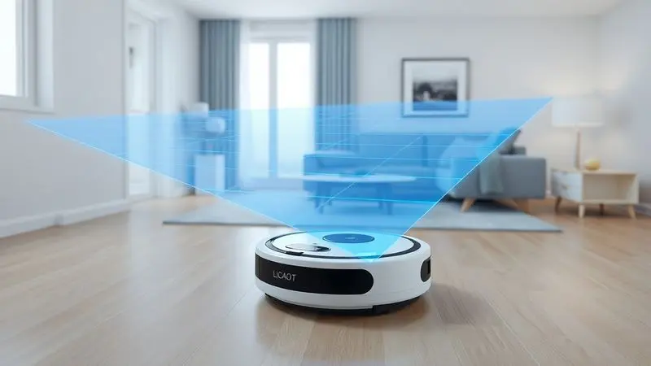
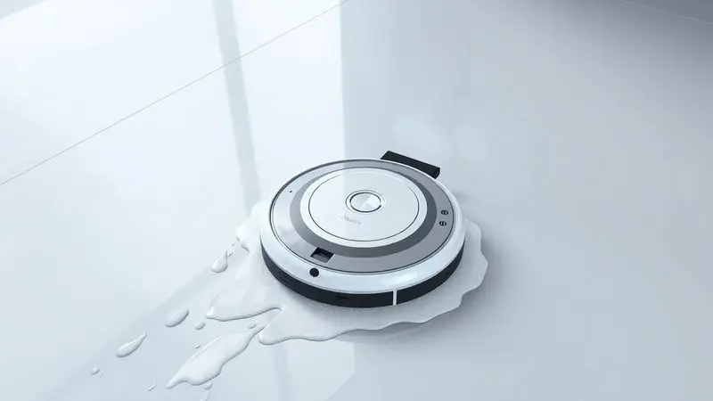
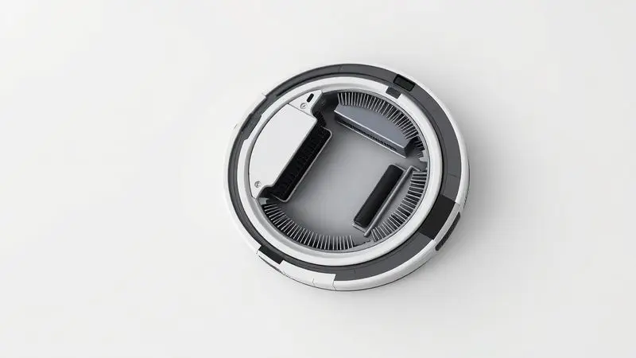

Manter a casa limpa diariamente parece uma batalha perdida contra o pó, fios de cabelo e pelos de animais. Mas e se você pudesse ter um aliado silencioso trabalhando enquanto você se dedica ao que realmente importa?

A tecnologia dos robôs aspiradores evoluiu ao ponto de oferecer exatamente isso, transformando tarefas tediosas em automação inteligente.

Neste guia completo, você vai descobrir não apenas como funcionam esses incríveis assistentes digitais, mas também aprender a escolher o modelo ideal para o seu estilo de vida, garantindo que cada investimento se transforme em tempo livre e qualidade de vida.

<SummaryList products={frontmatter.top_products} />

## O que é um Robô Aspirador e por que ele se tornou essencial?

Imagine um pequeno ajudante que nunca reclama, não cansa e trabalha até quando você está dormindo. É exatamente isso que um robô aspirador oferece, um dispositivo autônomo que revolucionou nossa relação com a limpeza doméstica.

Mais do que simples máquinas, eles se tornaram parceiros indispensáveis para quem valoriza tempo e bem-estar.

Enquanto você se concentra no trabalho, no descanso ou na família, esses pequenos gênios da tecnologia percorrem cada canto da casa, garantindo que o pó não se acumule e que a sensação de limpeza seja constante.

A verdadeira magia está na liberdade que eles proporcionam, transformando horas semanais de vassoura e espanador em momentos que você pode dedicar ao que realmente ama.

## Como o Robô Aspirador Funciona? Tecnologia de Mapeamento e Sensores

Mas como exatamente ele consegue essa autonomia quase mágica? A resposta está em uma combinação inteligente de sensores e software que transformam sua casa em um mapa digital.

Pense em um explorador minúsculo equipado com lasers ou câmeras que constantemente escaneiam o ambiente, identificando cada móvel, cada parede e cada obstáculo.

Esta tecnologia não apenas evita que ele caia de escadas (graças a [sensores de queda](/como-funciona-o-robo-aspirador/) que funcionam como um sexto sentido), mas também permite que ele crie rotas eficientes, evitando áreas já limpas e focando onde a sujeira realmente se acumula. O resultado?

Cada sessão de limpeza é como ter um profissional meticuloso que conhece cada detalhe do seu espaço.

## Principais Benefícios de Ter um Robô na Limpeza Diária

Os benefícios vão muito além da simples conveniência. Ter um robô aspirador significa acordar com pisos limpos todos os dias, sem precisar levantar um dedo.

Significa chegar do trabalho e encontrar a casa impecável, como se tivesse uma equipe de limpeza particular trabalhando em silêncio. Para famílias com crianças pequenas ou pets, representa a tranquilidade de saber que os alérgenos são constantemente removidos.

Aquele espaço embaixo do sofá onde sempre acumula poeira? Agora é acessado regularmente. O tapete que antes exigia esforço? Agora é mantido limpo diariamente.

É como ter um superpoder de organização que opera em segundo plano, liberando você para viver mais e limpar menos.

## O que Considerar Antes da Compra: Potência, Bateria e Filtros

Diante de tantos benefícios, como escolher o parceiro perfeito para sua casa? Três elementos são fundamentais na sua decisão, cada um representando um aspecto diferente da experiência que você terá.

### Função MOP: O Diferencial de Aspirar e Passar Pano ao Mesmo Tempo

Imagine sair do banho e pisar em um chão que não apenas está sem poeira, mas verdadeiramente limpo e brilhante. A [função MOP](/robo-aspirador-3-em-1-qual-o-melhor/) transforma essa imagem em realidade, combinando a aspiração tradicional com a limpeza úmida em uma única operação.

É perfeito para quem tem crianças que derramam suco, pets que trazem terra do quintal ou simplesmente deseja a sensação de pisos impecáveis sem precisar se agachar com balde e pano.

Enquanto você assiste a um filme, o robô não apenas remove a poeira superficial como também trata manchas e sujeiras aderentes, entregando um resultado que antes exigia duas etapas separadas de trabalho.

### Filtro HEPA: Por que é Crucial para Alérgicos e Donos de Pets

Para cerca de 30% da população brasileira que sofre com alergias respiratórias, ou para famílias que compartilham a casa com animais de estimação, o filtro HEPA representa muito mais que um componente técnico.

Ele é o guardião da qualidade do ar dentro da sua casa, capaz de reter 99,97% das partículas microscópicas que desencadeiam espirros, coceiras e desconfortos.

Pense nele como um sistema de defesa invisível que captura não apenas a poeira visível, mas também os ácaros, pólens e pelos que flutuam no ambiente.

O resultado é respirar mais fácil, dormir melhor e abraçar seu pet sem medo de reações alérgicas, transformando sua casa em um verdadeiro santuário de bem-estar.

## Análise dos Melhores Modelos de Robô Aspirador em 2024

Com tantas opções disponíveis, selecionamos os [modelos que realmente fazem diferença](/melhores-robo-aspirador-2024/) na rotina das famílias brasileiras. Cada um tem sua personalidade e conjunto de habilidades, prontos para atender necessidades específicas.

### Aspirador Robô Philco PAS26P 3 em 1 com MOP Antiqueda

<ProductBox 
  title={frontmatter.top_products[0].title} 
  image={frontmatter.top_products[0].image} 
  link={frontmatter.top_products[0].link} 
/>

Este é o multitarefas perfeito para quem busca uma solução completa sem complicações. Com seus 110 minutos de autonomia, ele percorre apartamentos inteiros em uma única carga, enquanto os sensores antiqueda garantem que escadas não sejam um problema.

A combinação [3 em 1](/aspirador-robo-philco-pas09c-mop-e-bom/) significa que você programa uma limpeza e ele cuida de aspirar, varrer e passar pano simultaneamente. O filtro HEPA trabalha silenciosamente para manter o ar limpo, especialmente valioso para quem tem alergias.

Embora seu funcionamento não seja o mais silencioso do mercado, a eficiência com que entrega pisos verdadeiramente limpos compensa amplamente qualquer ruído, especialmente quando programado para operar durante o dia enquanto você está fora.

### Aspirador Robô Philco PAS22P MOP Filtro HEPA Bivolt

<ProductBox 
  title={frontmatter.top_products[1].title} 
  image={frontmatter.top_products[1].image} 
  link={frontmatter.top_products[1].link} 
/>

Para quem valoriza simplicidade inteligente, este modelo oferece o essencial com excelência. Sua capacidade bivolt elimina preocupações com voltagem, perfeito para quem muda frequentemente de residência ou viaja.

Os 100 minutos de bateria são mais que suficientes para limpezas diárias em ambientes de tamanho médio, enquanto os sensores anticolisão e antiqueda operam como um piloto automático confiável.

A ausência de controle remoto é compensada pela operação intuitiva direto no aparelho, ideal para quem prefere tecnologia descomplicada.

O filtro HEPA com 99,9% de eficiência trabalha constantemente para melhorar a qualidade do ar, fazendo dele um investimento tanto em limpeza quanto em saúde.

### Aspirador Robô WAP Robot W100: O Favorito do Custo-Benefício

<ProductBox 
  title={frontmatter.top_products[2].title} 
  image={frontmatter.top_products[2].image} 
  link={frontmatter.top_products[2].link} 
/>

Quando orçamento é uma consideração importante sem abrir mão da qualidade, este modelo se destaca como uma joia escondida. Com apenas 7,5 cm de altura, ele desliza sob móveis baixos onde outros não alcançam, enquanto suas [escovas giratórias](/como-limpar-o-robo-aspirador-wap/) atacam cantos com precisão.

A bateria de 1h40 garante limpezas completas, e o reservatório lavável de 250 ml é prático especialmente para famílias com pets.

A ausência de mapeamento avançado ou aplicativo é compensada pela simplicidade robusta: ligue e ele funciona, sem complicações ou necessidade de configurações complexas.

É a escolha perfeita para quem busca eficiência sem firulas, provando que tecnologia útil não precisa ser complicada nem cara.

### Robô Aspirador Xiaomi Mi Robot Vacuum-Mop: Inteligência Avançada

<ProductBox 
  title={frontmatter.top_products[3].title} 
  image={frontmatter.top_products[3].image} 
  link={frontmatter.top_products[3].link} 
/>

Para os entusiastas de tecnologia que desejam o estado da arte em limpeza autônoma, este modelo representa a fronteira do que é possível hoje.

Com sucção de 35.000 Pa (o equivalente a um pequeno furacão controlado), ele remove até as sujeiras mais incrustadas, enquanto o sistema LiDAR mapeia sua casa com precisão milimétrica, criando rotas perfeitas como um estrategista.

O esfregamento rotativo trata manchas com eficiência profissional, e o corpo fino acessa espaços que pareciam esquecidos.

Embora sua operação não seja completamente silenciosa, a eficiência é tamanha que muitos usuários o programam para horários em que não estão em casa, retornando a um ambiente que parece ter sido limpo por uma equipe especializada.

É investir não apenas em limpeza, mas em uma experiência de smart home completa.

## Dicas Práticas de Manutenção para seu Robô Aspirador Durar Mais

Como qualquer bom parceiro, seu robô aspirador merece cuidados que garantam anos de serviço fiel. Comece criando o hábito de cuidar dele por dois minutos após cada limpeza.

Remover cabelos e fios das escovas evita que o motor trabalhe sob esforço, enquanto esvaziar o compartimento de sujeira mantém a sucção sempre potente.

Uma vez por semana, limpe gentilmente os sensores com um pano seco, garantindo que ele continue enxergando o mundo com clareza. As rodas merecem atenção especial, pois são elas que carregam seu ajudante por toda a casa.

Com esses cuidados simples, você não apenas prolonga a vida útil do aparelho, mas garante que ele continue desempenhando seu papel com a excelência do primeiro dia.

## Erros Comuns ao Usar um Robô Aspirador (E Como Evitá-los)

O maior erro é tratar seu robô como mágica infalível. Como qualquer ferramenta inteligente, ele funciona melhor com uma pequena preparação.

Antes de iniciar a limpeza, caminhe rapidamente pela casa recolhendo fios soltos, brinquedos pequenos e outros itens que poderiam embaraçar nas escovas. Programe lembretes no seu calendário para a limpeza dos filtros a cada 15 dias, mantendo a eficiência da sucção.

Não ignore os alertas do aplicativo quando ele indicar que algum componente precisa de atenção. E o mais importante, entenda os limites do seu modelo: pisos muito irregulares ou desníveis acentuados podem exigir ajustes na frequência ou configurações específicas.

Seguindo estas orientações, você transforma um dispositivo bom em um parceiro excepcional.

## Conclusão

Escolher o [robô aspirador](/robo-aspirador-midea-vra81b-e-bom/) ideal é como encontrar o parceiro perfeito para sua rotina doméstica. Não existe um modelo universalmente melhor, mas sim a combinação certa de características para o seu estilo de vida específico.

Se você convive com alergias ou pets, a presença do filtro HEPA se torna não negociável. Para apartamentos com pisos frios que acumulam manchas, a função MOP transforma a experiência diária.

Famílias com agendas lotadas se beneficiam enormemente da programação automática e da conectividade via aplicativo.

O verdadeiro valor desses dispositivos vai muito além da limpeza em si. Eles representam horas recuperadas, estresse reduzido e a tranquila certeza de chegar em casa e encontrar um ambiente que convida ao descanso.

Seja optando pela simplicidade eficiente do [WAP Robot W100](/aspirador-de-po-robo-wap-robot-w100-e-bom/), pela solução completa do Philco PAS26P ou pela tecnologia de ponta do Xiaomi Mi Robot, você está investindo em algo raro nos dias de hoje: tempo livre de qualidade.

Comece avaliando qual dor da sua rotina você mais deseja eliminar, e deixe que o robô certo transforme essa aspiração em realidade, um piso limpo de cada vez.

## Perguntas Frequentes sobre Robôs Aspiradores (FAQ)

Ainda com dúvidas sobre como esses assistentes digitais podem se encaixar na sua vida? As questões mais comuns revelam exatamente os pontos onde a tecnologia mais impressiona.

Quanto à eficácia, os modelos atuais não apenas igualam, mas frequentemente superam a limpeza manual em pisos regulares, especialmente na consistência diária.

A autonomia varia de 60 a 120 minutos, suficiente para a maioria dos apartamentos e casas médias em uma única carga.

A conectividade com aplicativos transforma a experiência, permitindo que você inicie limpezas remotamente, crie zonas proibidas ou receba notificações quando o trabalho estiver completo.

Quanto aos obstáculos, os sensores modernos são surpreendentemente adeptos em navegar por ambientes mobiliados, exigindo apenas que objetos muito pequenos ou fios sejam recolhidos previamente.

A verdadeira revelação para a maioria dos usuários é descobrir que, mais do que substituir a limpeza tradicional, esses dispositivos a complementam perfeitamente, lidando com a manutenção diária enquanto você reserva energia para aquela limpeza mais profunda ocasional.