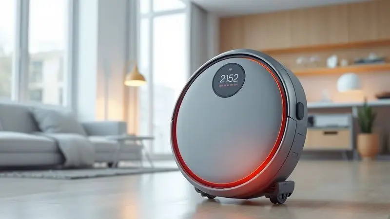
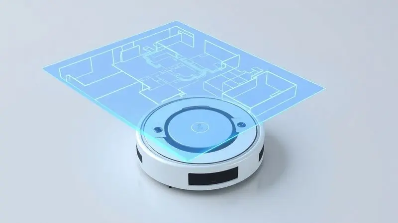
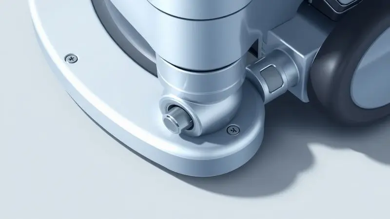

Imagine acordar com a casa limpa, sem se preocupar com poeira, e descobrir que seu robô aspirador está parado no meio da sala, ignorando seus comandos. A frustração é imediata, a rotina interrompida.

Mas respire fundo, porque a maioria desses dramas tecnológicos tem uma solução mais simples do que você imagina. Neste guia, você não vai aprender apenas procedimentos técnicos.

Vai descobrir como dar um verdadeiro reinício na parceria com seus ajudantes automáticos, focando nos modelos Kabum Smart 700 e Tapo. Preparado para devolver a eficiência à sua rotina?

<SummaryList products={frontmatter.top_products} />

## Por que e quando fazer o reset no seu robô aspirador?

Pense no reset não como um último recurso, mas como um refresco para a mente do seu robô. Ele se perde no mapa depois que você reorganizou a sala, para de responder ao aplicativo ou simplesmente age de forma errática.

São sinais claros de que ele precisa esquecer alguns hábitos antigos e aprender tudo de novo.

### Sinais de que o aparelho precisa de uma reinicialização imediata

Você conhece seu robô. Sabe quando ele está "estranho". Se ele ignora seus comandos no app, fica preso em cantos que antes evitava, ou se a luz do painel pisca como um SOS, está na hora de intervir.

Comportamentos erráticos, dificuldade em encontrar a base de carregamento e travamentos frequentes não são apenas aborrecimentos. São pedidos de ajuda. Uma reinicialização rápida pode ser o equivalente a uma boa noite de sono para um cérebro sobrecarregado.

### Benefícios do reset: Melhora no desempenho e correção de bugs de software

Quando você faz um reset, está limpando a memória de trabalho do dispositivo. É como fechar todos os aplicativos abertos no seu celular que estão travando o sistema. O resultado é um desempenho visivelmente mais ágil.

Bugs de software que surgiram após atualizações são corrigidos, a navegação se torna mais precisa, e aqueles paradas misteriosas no meio da limpeza desaparecem.

O robô retorna às suas configurações originais, mas com a experiência acumulada, pronto para trabalhar com máxima eficiência.

## Tipos de Reset: Entenda a diferença entre cada procedimento

Nem todo problema requer uma solução radical. Antes de apagar tudo, entenda qual reinício seu assistente realmente precisa. Existe um espectro de soluções, desde um simples refresco até um retorno completo às origens.

### Soft Reset (Reinicialização Simples para travamentos leves)

Para aqueles dias em que o robó parece um pouco "lento". Pressione o botão de ligar por alguns segundos até ouvir um bip ou ver as luzes piscarem. É rápido, não apaga suas configurações pessoais, e resolve a maioria dos pequenos engasgos.

Funciona como um alongamento matinal antes do trabalho pesado.

### Reset de Wi-Fi: Resolvendo problemas de conexão com o App

A comunicação quebrou. Seu aplicativo não encontra o robô, ou os comandos demoram uma eternidade para chegar. O problema, muitas vezes, está na conversa entre o dispositivo e sua rede Wi-Fi.

Pressionando o botão específico para [reset de rede](/como-conectar-robo-aspirador-xiaomi-no-wifi/) por alguns segundos, você força os dois a se reapresentarem. Depois, é só reconectar como se fosse a primeira vez, garantindo que escolha uma rede estável para essa nova amizade.

### Reset de Mapeamento: Quando o robô se perde ou muda os móveis de lugar

Você mudou o sofá de lugar ou trouxe uma nova planta para a sala. Para o robô, é como se alguém tivesse reposicionado montanhas em seu mundo conhecido.

Um reset de mapeamento apaga o mapa antigo e o obriga a explorar novamente, recalculando rotas e identificando novos obstáculos. Geralmente feito pelo aplicativo, é essencial depois de qualquer mudança significativa no layout da casa.

### Reset de Fábrica (Hard Reset): A solução definitiva para erros graves

Quando nada mais funciona, o hard reset é o botão de pânico. Ele restaura todas as configurações originais de fábrica, como se você tivesse acabado de tirar o robô da caixa. Perfeito para erros persistentes, vendas do aparelho ou quando ele parece completamente perdido.

A desvantagem é clara, você precisará reconfigurar tudo do zero. Mas às vezes, um novo começo é a única saída.

## Guia Passo a Passo: Como Resetar Robô Aspirador Kabum Smart 700

Para o [Kabum Smart 700](/robo-aspirador-kabum-smart-700-e-bom/), a solução está na combinação certa de botões. Pressione e segure o botão de ligar por cerca de 5 segundos até o sinal sonoro. Pronto, as configurações de fábrica estão restauradas.

### Preparação: O que verificar antes de iniciar o reset total

Antes de qualquer procedimento mais intenso, faça uma checagem rápida. O robô está com bateria suficiente? Um reset com energia baixa pode corromper o processo. Os sensores e escovas estão limpos? Sujeira acumulada pode mascarar o verdadeiro problema.

E tenha o manual por perto, [cada modelo](/melhores-robos-aspiradores-2023/) tem suas particularidades.

### Sequência de botões para o Hard Reset no Kabum Smart 700

Com o robô ligado, a mágica acontece segurando o botão "Limpeza" e o botão "Home" ao mesmo tempo. Conte entre 5 e 10 segundos. O sinal sonoro é seu aviso de que o processo terminou. Agora ele é uma lousa em branco, esperando suas novas instruções.

### Como reconectar e configurar o App Kabum! Smart após o reset

Após o reset, a reconciliação acontece pelo aplicativo. Baixe o Kabum! Smart, crie sua conta e siga o passo a passo intuitivo para adicionar o dispositivo. Mantenha o robô próximo ao roteador durante esse reencontro.

Uma vez conectado, você reassume o controle, agendando limpezas e escolhendo modos como se estivesse conhecendo um velho amigo com novos hábitos.

## Como Reiniciar ou Resetar Robô Aspirador Tapo (TP-Link)

Para os modelos Tapo, o botão de reset geralmente fica escondido na parte inferior ou lateral. Um pressionamento prolongado até que as luzes confirmem, e o trabalho está feito.

### Procedimento de Soft Reset nos modelos Tapo

Encontre o pequeno botão de reset no corpo do aparelho. Segure por 5 a 10 segundos e observe as luzes começarem a piscar em um padrão específico. É um reinício suave, que corrige pequenos desvios sem apagar sua personalidade configurada.

### Como realizar o Factory Reset (Reset de Fábrica) no robô Tapo

Quando precisa voltar completamente ao zero, até para preparar o robô para um novo dono, o factory reset é a solução. Com o dispositivo desligado, pressione o botão de ligar por 10 segundos sólidos.

O sinal sonoro marca o fim da memória antiga e o início de uma nova vida. Configure tudo novamente a partir daí.

## O Reset não funcionou? Confira estas soluções de Troubleshooting

Às vezes, o reset é só o primeiro passo. Se o problema persistir, é hora de investigar camadas mais profundas.

### Verificação de bateria e contatos da base de carregamento

Sua tentativa de reset falhou? Olhe para a fonte de vida dele. A bateria está realmente carregada, ou apenas fingindo? E os contatos dourados na base, estão limpos e brilhantes, ou cobertos por uma fina camada de poeira que impede a comunicação perfeita?

Muitas vezes, a solução está na energia, não no software.

### Erros comuns de firmware e como atualizar seu robô aspirador

[Seu robô](/robo-aspirador-wap-w1000-e-bom/) pode estar tentando falar uma linguagem antiga. Firmware desatualizado é uma causa comum de travamentos e perda de conexão. Abra o aplicativo do seu modelo, navegue até as configurações e busque por "atualizações".

Manter o software atualizado não é apenas uma correção, é um upgrade constante de habilidades.

## Acessórios essenciais para manter o desempenho após o reset

<ProductBox 
  title={frontmatter.top_products[0].title} 
  image={frontmatter.top_products[0].image} 
  link={frontmatter.top_products[0].link} 
/>

Depois que o software está renovado, é hora de cuidar do corpo. Kits de reposição com escovas laterais, filtros HEPA e panos de microfibra não são apenas consumíveis.

São o seguro que garante que seu robô continuará eficiente, limpando profundamente e protegendo sua família de alérgenos. Sempre confira a compatibilidade com seu [modelo específico](/robo-aspirador-kabum-smart-900-e-bom/) para um encaixe perfeito.

### Filtros e Escovas: Quando a troca física substitui o reset de software

<ProductBox 
  title={frontmatter.top_products[1].title} 
  image={frontmatter.top_products[1].image} 
  link={frontmatter.top_products[1].link} 
/>

Há um limite para o que o software pode corrigir. Se o filtro está entupido ou as escovas gastas, nenhum reset trará de volta a força de sucção original. [Limpe os filtros semanalmente](/como-limpar-o-robo-aspirador-wap/), desembaraçando os cabelos das escovas a cada quinzena.

A troca periódica dessas peças é tão crucial quanto qualquer atualização digital. Um reset resolve problemas de navegação, mas a manutenção física garante o poder de limpeza.

## Perguntas Frequentes (FAQ) sobre o Reset de Robôs Aspiradores

Após todo esse processo, algumas dúvidas sempre permanecem. Vamos esclarecer as mais comuns.

### Vou perder meus agendamentos de limpeza ao resetar?

Na maioria dos casos, sim. O reset de fábrica é um recomeço total. Seus agendamentos antigos serão apagados junto com todas as outras configurações.

A boa notícia é que reconfigurá-los no aplicativo renovado é rápido, e você pode aproveitar para otimizar sua rotina com o conhecimento adquirido de como seu robô realmente funciona.

### Com que frequência é recomendado apagar o mapa do robô?

Pense nisso como uma limpeza de primavera para a memória do seu robô. A cada 3 a 6 meses, ou sempre que você fizer uma mudança significativa na decoração, apagar o mapa antigo força uma reexploração precisa.

É o segredo para evitar que ele fique preso tentando passar por onde agora existe uma poltrona nova.

## Conclusão

Manter seu robô aspirador funcionando perfeitamente é uma dança entre cuidado físico e atenção digital. O reset não é um fracasso da tecnologia, mas uma ferramenta poderosa de renovação.

Quando usado no momento certo, desde o soft reset para pequenos ajustes até o hard reset para recomeços radicais, ele devolve a eficiência e a paz à sua rotina automática.

Combinado com a manutenção regular dos filtros e escovas, e a atenção aos sinais do aparelho, você transforma um dispositivo em um parceiro confiável. Lembre-se de consultar sempre o manual do seu [modelo específico](/como-resetar-robo-aspirador-samsung/), pois pequenos detalhes podem fazer grande diferença.

Agora que você domina a arte do reset, pode enfrentar qualquer problema técnico com confiança, sabendo que a solução está, literalmente, ao alcance dos seus dedos. Sua casa limpa e automatizada agradece.