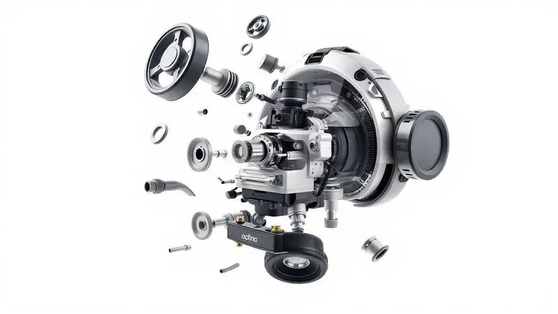
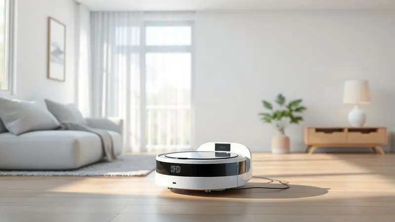
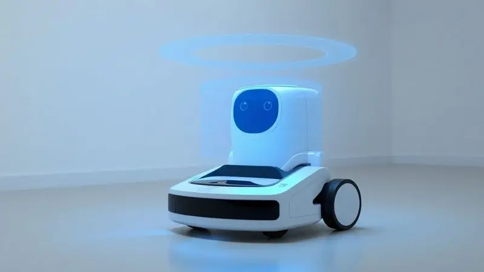
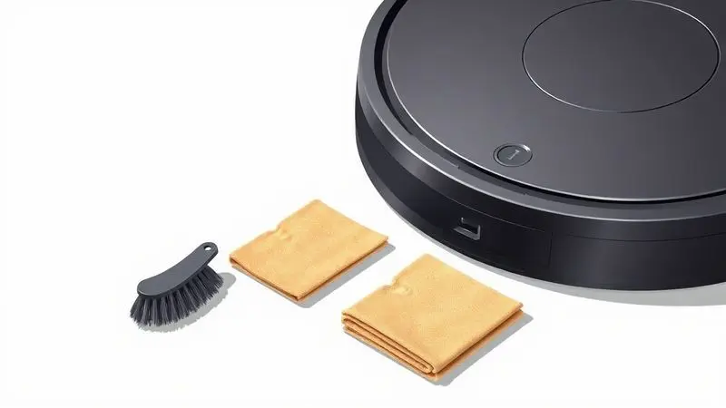

É frustrante quando você conta com a praticidade da tecnologia e, de repente, seu robô aspirador para de funcionar ou apresenta falhas na limpeza.

Muitos usuários acreditam que o aparelho estragou permanentemente, mas a verdade é que a maioria dos problemas pode ser resolvida com ajustes simples e manutenção caseira.

Neste guia completo, você aprenderá a diagnosticar erros comuns, recuperar a potência de sucção e descobrirá exatamente quando é hora de trocar uma peça ou procurar assistência técnica.

<SummaryList products={frontmatter.top_products} />

## Por que meu robô aspirador parou? Entenda os principais motivos

Se o seu robô aspirador parou de funcionar, pode haver várias razões para isso. Uma das causas mais comuns é a obstrução nos escovinhas ou rodas, que pode impedir o movimento adequado. Além disso, os sensores sujos podem dificultar a navegação do aparelho.

Outro motivo frequente é a bateria descarregada ou danificada, que pode afetar a duração da limpeza. Por fim, problemas no software interno, como falhas de atualização, também podem levar à interrupção do funcionamento.

Manter uma rotina de limpeza e checagem pode evitar muitos desses problemas e prolongar a vida útil do seu robô aspirador.

## Passo 1: Diagnóstico Inicial e Códigos de Erro

Antes de qualquer conserto, é fundamental identificar o problema. Consulte o manual do usuário para decifrar os códigos de erro exibidos pelo [robô aspirador](/robo-aspirador-mondial-rb-03-e-bom/), pois eles indicam falhas específicas que precisam ser tratadas.

### Interpretando luzes piscando e sinais sonoros (Bips)

Pense nas luzes piscantes e nos bipes como seu robô tentando conversar com você. Uma luz vermelha intermitente geralmente sinaliza bateria baixa, enquanto bipes curtos e rápidos indicam que algo está bloqueando seu caminho.

Um som contínuo pode revelar um problema mais sério. [Cada modelo](/aspirador-robo-mondial-e-bom/) tem sua própria linguagem, então mantenha o manual por perto para traduzir essas mensagens corretamente.

### Como fazer o Reset de fábrica no seu robô aspirador

Localize o [botão de reset](/como-resetar-robo-aspirador-kabum-700/) na parte inferior ou lateral do dispositivo. Mantenha pressionado por aproximadamente 10 segundos até ouvir um sinal sonoro ou ver uma luz indicando que o processo começou. Após alguns instantes, seu robô reiniciará.

Lembre que este procedimento apaga todas as configurações personalizadas, retornando o aparelho ao estado original de fábrica.

## Passo 2: Problemas de Energia e Carregamento

Com o diagnóstico inicial concluído, vamos verificar a fonte de vida do seu robô. Comece confirmando se o dispositivo está corretamente conectado à tomada e limpe os pontos de contato da bateria para garantir uma conexão perfeita.

### O robô não volta para a base ou não carrega?

Verifique primeiro se a base está firmemente conectada à tomada e com as luzes indicadoras acesas. Examine os contatos de carregamento no robô e na base, removendo qualquer sujeira que possa estar interrompendo a conexão.

Se tudo parecer em ordem, um simples reinício pode resolver problemas temporários que confundem o sistema.

### Quando substituir a bateria do robô aspirador

<ProductBox 
  title={frontmatter.top_products[0].title} 
  image={frontmatter.top_products[0].image} 
  link={frontmatter.top_products[0].link} 
/>

A bateria geralmente dura de 2 a 5 anos, [dependendo do modelo](/robo-aspirador-mondial-rb-08-e-bom/) e intensidade de uso.

Você saberá que chegou a hora quando o tempo de funcionamento cair drasticamente, como passar de 90 minutos para apenas 30, ou quando o robô começar a parar inesperadamente durante a limpeza.

As baterias de lítio íon costumam ser mais duráveis, mas fatores como ambiente e frequência de uso aceleram o desgaste natural.

## Passo 3: Recuperando o Poder de Sucção e Movimentação

Agora que a energia está resolvida, vamos restaurar a performance de limpeza. A eficiência do seu robô depende diretamente da condição dos filtros e escovas, então comece por aí.

### Limpeza e troca de Filtros HEPA: O segredo da sucção forte

<ProductBox 
  title={frontmatter.top_products[1].title} 
  image={frontmatter.top_products[1].image} 
  link={frontmatter.top_products[1].link} 
/>

Os filtros HEPA são o segredo para aquela sucção poderosa e o ar purificado em sua casa. Limpe semanalmente usando ar comprimido ou um secador no modo frio para remover a poeira acumulada.

A troca deve acontecer a cada 2 a 6 meses, mas se você tem pets ou usa o robô diariamente, considere reduzir esse intervalo. Alguns filtros não são laváveis, mas muitos modelos oferecem versões reutilizáveis que facilitam a manutenção regular.

### Desobstrução de escovas laterais e centrais

<ProductBox 
  title={frontmatter.top_products[2].title} 
  image={frontmatter.top_products[2].image} 
  link={frontmatter.top_products[2].link} 
/>

Comece removendo as escovas laterais e liberando os cabelos ou detritos enrolados. Uma escovinha fina torna esse processo mais fácil.

Se as cerdas estiverem amassadas, mergulhe-as em água quente por alguns minutos para recuperarem o formato, sempre secando completamente antes de reinstalar. Para a escova central, desligue o robô antes da manutenção.

Após limpezas repetidas, se notar desgaste significativo, considere substituí-la a cada 6 a 12 meses para manter a eficácia.

### Rodas travadas ou barulhos anormais: Como resolver

Barulhos estranhos ou movimento limitado geralmente indicam problemas nas rodas. Verifique se há objetos, pelos ou sujeira obstruindo o giro. Após limpar qualquer resíduo, confirme que as rodas giram livremente.

Se o problema persistir, pode ser necessário inspecionar os componentes do motor, o que às vezes exige atenção profissional.

## Passo 4: Sensores e Navegação (O robô está 'cego'?)

Sensores sujos transformam seu robô inteligente em um aparelho desorientado. Mantê-los limpos é essencial para navegação precisa e prevenção de quedas.

### Como limpar os sensores de queda e anticolisão corretamente

Desligue o robô para segurança, localize os sensores na parte inferior e use um pano seco ou escova de cerdas macias para remover poeira acumulada. Evite produtos químicos que possam danificar os componentes sensíveis.

Esta limpeza regular mantém seu robô alerta e funcional por muito mais tempo.

### O robô gira em círculos? Causas e soluções rápidas

Quando seu robô começa a girar em círculos, geralmente está confuso por sujeira nos sensores de orientação ou obstruções nas rodas. Comece com uma limpeza completa dessas áreas. Se o comportamento continuar, consulte o manual para instruções de recalibração.

Caso nada resolva, pode ser hora de contatar o suporte técnico especializado.

## Manutenção Preventiva: Como fazer seu robô durar 2x mais

Transforme a manutenção em um ritual de cuidado que prolonga a vida do seu companheiro de limpeza. Sensores limpos, escovas livres de obstruções e filtros renovados mantêm o desempenho no auge.

### Cuidados com o reservatório de água e panos Mop

<ProductBox 
  title={frontmatter.top_products[3].title} 
  image={frontmatter.top_products[3].image} 
  link={frontmatter.top_products[3].link} 
/>

Para o reservatório, use água morna e sabão neutro para limpezas regulares, evitando máquinas de lavar louça que podem causar danos. Ao reabastecer, prefira água limpa e produtos recomendados pelo fabricante.

Troque os panos Mop após cada uso ou quando visivelmente sujos, seguindo as instruções de lavagem específicas. Esta atenção garante limpeza eficaz e previne odores desagradáveis.

## Quando desistir do conserto caseiro e procurar a Assistência Técnica?

Se você já tentou todas as soluções básicas, como limpar filtros, verificar sensores e reiniciar o dispositivo sem sucesso, pode ser um indicativo de problema técnico mais profundo.

Ruídos incomuns, fumaça durante a operação ou danos estruturais visíveis são sinais claros para buscar ajuda profissional.

Problemas persistentes com a bateria que não respondem a intervenções simples também justificam uma consulta especializada, garantindo segurança e durabilidade do equipamento.

## FAQ: Perguntas Frequentes sobre Robôs Aspiradores que Pararam

Quando um [robô aspirador](/robo-aspirador-de-po-e-bom/) para de funcionar, é normal ter algumas dúvidas. Uma das perguntas mais comuns é: "Por que meu robô não está carregando?" Isso pode ser causado por uma base de carregamento obstruída ou uma bateria desgastada.

Outro questionamento frequente é: "Como posso limpar o meu robô aspirador?" A manutenção é simples; basta [remover os filtros e escovas](/como-limpar-robo-aspirador-mondial/) regularmente para evitar entupimentos.

Por fim, muitos se perguntam sobre a durabilidade deles; embora variem [entre modelos](/melhores-robo-aspirador-2024/), a vida útil média é de 3 a 5 anos, dependendo do uso e da manutenção adequada.

## Conclusão

Lembre que aquele momento de frustração quando seu robô para pode se transformar em uma oportunidade de aprendizado e empoderamento. A maioria dos problemas que parecem complexos na verdade se resolvem com ajustes simples que você mesmo pode fazer.

Desde interpretar os sinais que o aparelho envia até manter uma rotina básica de limpeza, cada passo que você dominar transforma você de um usuário frustrado em um especialista doméstico.

A verdadeira magia acontece quando você percebe que seu robô não é apenas uma máquina, mas um parceiro de limpeza que merece cuidados regulares.

Aqueles minutos semanais dedicados à manutenção se traduzem em anos de serviço fiel, limpando sua casa enquanto você se concentra no que realmente importa.

Quando algo escapar do seu controle técnico, lembre que assistências especializadas existem justamente para esses momentos, garantindo que seu investimento continue valendo a pena por muito tempo.

Comece hoje mesmo aplicando um dos passos que aprendeu aqui e sinta a satisfação de ver seu robô recuperando a performance. Sua casa mais limpa e sua tranquilidade renovada são a melhor recompensa pelo cuidado dedicado.